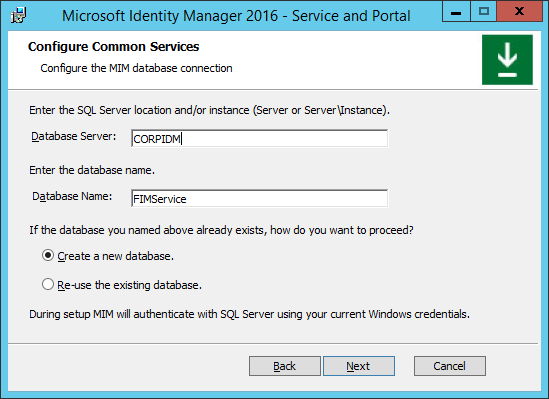

# Installing MIM 2016: MIM Service and Portal

>[!div class="step-by-step"]
[Previous](https://docsmsftstage.azurewebsites.net/MIM/DeployUse/install-mim-sync.html)
**Installing MIM 2016: MIM Synchronization Service**

> [!NOTE]
> In all the examples below, **mimservername** represents the name of your domain controller, **contoso** represents your domain name, and **Pass@word1** represents an example password.

If you didn't set up the MIM installation package in the last step, follow these steps to install Microsoft Identity Manager 2016 components:

1. Sign in as *contoso\Administrator* to the CORPIDM server you are using for identity management.

2. Unpack the MIM installation package or mount the MIM image DVD.

## Configure MIM Service and Portal for installation

1.  Run the **MIM Service and Portal installer** from the unpacked **Service and Portal** sub-folder.

2.  In the welcome screen, click **Next**.

3.  Read the End-User License Agreement, and if you accept the license terms, click **Next**.

4.  In the **MIM Customer Experience Improvement Program** screen, click **Next**.

5.  When selecting component features for this deployment, make sure to include the MIM Service (except for MIM Reporting) and MIM Portal features. You can also select the MIM Password Reset Portal and MIM Password Change Notification Service.

6.  On the **Configure the MIM database connection** page, specify **Create a new database**.

    

7.  On the **Configure mail server connection**, enter the name of your Exchange server as **Mail Server**. If you do not have a mail server configured, specify localhost as the mail server name and uncheck the top two checkboxes. Click **Next**.

    

8.  Specify that you want to generate a new self-signed certificate, or select the relevant certificate.

9. Specify the Service Account name to use, for example *MIMService*, and the Service Account password, for example *Pass@word1*, your Service Account domain, for example *contoso* and the Service Email Account, for example *contoso*.

    

10. Note that a warning may appear that the Service Account is not secure in its current configuration.

11. Accept the defaults for the Synchronization Server location, and specify the MIM Management Agent account as *contoso\MIMsync*.

    

12. Specify *CORPIDM* (this computer's name) as MIM Service server address for the MIM Portal.

13. Specify *http://CorpIDM.contoso.local:82* as the SharePoint site collection URL.

14. Specify *http://CorpIDM.contoso.local:8080* as the Password Registration URL.

15. Specify *http://CorpIDM.contoso.local:8088* as the Password Reset URL.

16. Select the checkbox to open ports 5725 and 5726 in the firewall, and the checkbox to grant all authenticated users access to MIM Portal.

## MIM Password Registration Portal configuration screen

1.  Set the service account name for SSPR Registration to *contoso\MIMSSPR* and its password to *Pass@word1*.

2.  Specify  *CORPIDM* as the Host Name for MIM Password Registration, and set the port to **8080**. Enable the **Open port in firewall** option.

    

3.  A warning will appear – read it and click **Next**.

4. In the next MIM Password Registration Portal configuration screen, specify  *http://CorpIDM.contoso.local* as the MIM Service Server Address for the Password Registration Portal.

## MIM Password Reset Portal configuration screen

1.  Set the service account name for SSPR Registration to *Contoso\MIMSSPRService* and its password to *Pass@word1*.

2.  Specify  *CORPIDM* as the Host Name for MIM Password Registration, and set the port to **8080**. Enable the **Open port in firewall** option.

    

3.  A warning will appear – read it and click **Next**.

4. In the next MIM Password Registration Portal configuration screen, specify *CorpIDname  http://CorpIDname.domain.local* as the MIM Service Server Address for the Password Reset Portal.

## Install MIM Service and Portal

When all pre-installation definitions are ready, click **Install** to begin installing the selected **Service and Portal** components.

After installation completes, verify that the MIM Portal is active.

1. Launch Internet Explorer and connect to the MIM Portal on  *http://corpidm.contoso.local:82/identitymanagement*. Note that there may be a short delay on the first visit to this page.

    - If necessary, authenticate as *contoso\Administrator* to Internet Explorer.

2. In Internet Explorer, open the **Internet Options**, change to the **security** tab, and add the site to the **Local intranet** zone if it is not already there.  Close the **Internet Options** dialog.

3. Enable users to view their own entry in MIM.

    1.  Using Internet Explorer, in **MIM Portal**, click on **Management Policy Rules**.

    2.  Search for the management policy rule, **User management: Users can read attributes of their own**.

    3.  Select this management policy rule, uncheck **Policy is disabled**.

    4.  Click **OK** and then click **Submit**.

4.  Verify that the firewall allows incoming connections to TCP port 5725 and 5726.

    1.  Launch **Administrative Tools » Windows Firewall** with **Advanced Security**.

    2.  Click on **Inbound Rules**.

    3.  Verify that the two following rules are listed:

        -   Forefront Identity Manager Service (STS).

        -   Forefront Identity Manager Service (Webservice).

    4.  Complete the wizard and close the **Windows Firewall** application.

    5.  Launch **Control Panel » Network and Internet » View network status and tasks**.

    6.  Verify that there is an active Network listed as contoso.local as a Domain network.

    7.  Close **Control Panel**.

> [!NOTE]
> Optional: At this point you can install MIM add-ins and extensions.

>[!div class="step-by-step"]  
[Next](https://docsmsftstage.azurewebsites.net/MIM/DeployUse/mim-install-sync-ad-service.html)
**Installing MIM 2016: Synchronize Active Directory and MIM Service**
