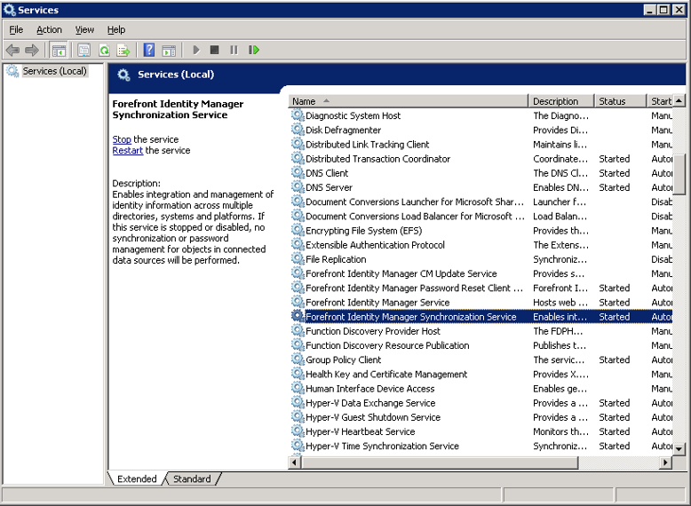
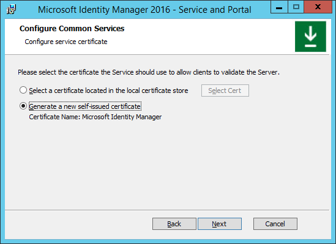

---
# required metadata

title: Upgrade from FIM 2010 R2 | Microsoft Identity Manager
description: Learn how to upgrade your FIM 2010 R2 components, and then install the components that are new in MIM 2016.
keywords:
author: kgremban
ms.author: kgremban
manager: femila
ms.date: 07/21/2016
ms.topic: article
ms.service: microsoft-identity-manager
ms.technology: security
ms.assetid: 9471ccc1-bafe-46ee-b169-1464262380e1

# optional metadata

#ROBOTS:
#audience:
#ms.devlang:
ms.reviewer: mwahl
ms.suite: ems
#ms.tgt_pltfrm:
#ms.custom:

---

# Upgrade from Forefront Identity Manager 2010 R2

If you have a Forefront Identity Manager (FIM) 2010 R2 environment and want to try out Microsoft Identity Manager (MIM) 2016, use this article as your guide. There are three phases in this upgrade:

1.  Install MIM Synchronization Service (Sync) on a server that is domain-joined to your Active Directory (AD) domain. This replaces the FIM 2010 R2 instance of Sync.

2.  Install MIM Service and Portal. At this point, you can also choose to install the self-service password reset (SSPR) registration portal and service portal. and excluding the Privileged Access Management feature set, will then be installed.

3.  Deploy the MIM add-ins and extensions a separate client computer. This includes the SSPR Windows Login integrated client.

This guide assumes that you have the following already set up:
- FIM 2010 R2 deployed in a test environment
- Servers running on Windows Server 2012, Windows Server 2012 R2 or Windows Server 2008 R2
- Local and environmental pre-requisites (SQL Server, Exchange Server, SharePoint Services, etc.) that are configured for FIM 2010 R2.

## Preparation

1.  Back up your FIM Service database, FIM Sync database, FIM Sync and service configuration and software.

2.  On each server where FIM 2010 R2 components are installed – e.g. *CORPIDM* – log in as Contoso\Administrator. In this  deployment example, Administrative rights are needed to upgrade FIM 2010 R2 to **MIM**.

3.  Download or unpack the MIM software.

## Upgrade the Synchronization Service

1.  Login as an administrator to a server where FIM 2010 R2 Synchronization Service (“Sync”) is deployed.

2.  Make sure to back up your database before you begin this procedure.

3.  Open the **Services** console, locate **Forefront Identity Manager Synchronization Service**, and stop it.

    

4.  Run the **MIM Synchronization Service installer**. The installer will detect the existing Sync version and suggest an upgrade. Click on the **Update** button to proceed.

5.  If you accept the license terms, click **Next** to proceed.

6.  Enter the password for the service account that Sync is using, and click **Next**.

    

7.  Validate the security group names are correct and click **Next**.

    

8.  Leave unchanged the checkbox for  firewall rules for inbound RPC communications.

9. The installer is ready to upgrade Sync from FIM 2010 R2 to MIM . Click on **Upgrade** to start the upgrade process.

10. The upgrade is now in progress. Do not exit the installer or restart the computer while the upgrade is in progress.

    

11. During the upgrade, a warning regarding the upgrade of the Sync database is shown. It is recommended that the DB is backed up prior to this beginning.

12. When the upgrade completes successfully, click **Finish**.

    

13. Note that the **Synchronization Service** has restarted.

## Upgrade the Service and Portal

1.  Login as an administrator to a server where the  FIM 2010 R2 Service and Portal are deployed.

2.  Open the **Services** console, locate **Forefront Identity Manager Service**, and stop it.

    

3.  Run the MIM Service and Portal installer. Click on the **Install** button to proceed.

    

4.  If you accept the license terms, click **Next** to proceed.

5.  On the MIM Customer Experience Improvement Program screen, click **Next** to proceed.

6.  Select the MIM features and components you would like to install, then click **Next** when you're done.

    

    1.  **MIM Service:** this feature is mandatory on at least one server, and requires a SQL Server database server either co-located or on another server.

    2.  **MIM Portal:** this feature is mandatory on at least one server, and requires SharePoint 2013 Foundation.

    3.  **MIM Password Registration Portal:** this feature is needed for self-service password reset.

    4.  **MIM Password Reset Portal:** this feature is needed for password reset.

7.  Provide details of the SQL Server that is being used for the FIM Service database. Select the option to re-use the existing database and preserve the data. Click **Next** to proceed.

8. If the re-use the existing database option was selected, a reminder to back up the database appears.

9. Enter the details of the mail server. If the mail server is located on the current server, enter “localhost” as the mail server location. Click **Next** to proceed.

    

10. Select a certificate for the Service to use in order to validate clients. You should use the existing certificate from the local certificate store that was previously used by FIM Service.

    

    1.  If the local certificate store option is selected, click on the **Select Cert** button and select a certificate from the list in the popup window. Click **OK** and then **Next**.

        

11. Configure Service Account credentials for MIM Service. Note that the service account cannot be the same service account used by the Synchronization service. This should be the same account as was used by the FIM Service.

    

12. Configure the details of the MIM Sync Server according to the deployment of MIM Service you configured in a previous step.

    

13. When installing the MIM Portal, provide the address of the MIM Service server. Click **Next**.

14. When installing the MIM Portal, provide the URL of the SharePoint site collection in which the FIM Portal is currently hosted. Click **Next**.

## Install the MIM Password Registration Portal

1. If you are installing the MIM Password Registration Portal, provide the requested URL for the Password Registration Portal. Click **Next**.

2. Configure the ability for clients and end users to use the Service and Portal.

    1.  Check   whether you want to **Open ports 5725 and 5726 in firewall**.

    2.  Check whether you want to **Grant authenticated users access to the MIM Portal site**.

    3.  Click **Next**.

3. Provide access details and credentials for MIM Password Registration.

    

    1.  Provide the service account name (including domain) and password for MIM Password Registration.

    2.  Provide the details of the host – name and port (such as 8080) – of the Password Registration Portal.

    3.  Check the **open port in firewall** option.

    4.  Click **Next**.

4. In the next MIM Password Registration configuration screen:

    1.  Tell the MIM Password Registration where MIM Service is installed, typically the same system.

    2.  Determine whether this portal can be accessed by extranet and intranet users, or only intranet users, as was previously configured for FIM password reset.

## Install the MIM Password Reset Portal

1. If you are installing the MIM Password Reset Portal, provide access details and credentials for MIM Password Reset.

    

    1.  Provide the service account name (including domain) and password for MIM Password Reset.

    2.  Provide the details of the host – name and port (such as 8088) – of the Password Reset Portal.

    3.  Check the **open port in firewall** option.

    4.  Click **Next**.

2. In the next MIM Password Reset configuration screen:

    1.  Tell the MIM Password Reset where MIM Service is installed.

    2.  Specify whether this portal can be accessed by extranet and intranet users, or only intranet users.

## Finish installation and upgrade

1. Once all the configuration definitions are completed successfully, an installation page will appear. Click **Install** to begin the installation and upgrade of MIM Service and Portal.

2. The installation and upgrade of MIM Service and Portal is now in progress. Do not cancel the installer or restart the computer during the installation.

3. Once the installation (upgrade) of MIM Service and Portal is completed successfully, a confirmation screen appears. Click **Finish** to complete the installation and exit the installer.

4. Note that the **Forefront Identity Manager Service** has restarted.

Note: If the FIM Add-ins and Extensions are currently deployed on user’s computers for SSPR, do not configure the new MFA phone gates for password reset until after all FIM Add-ins and Extensions have been upgraded to MIM 2016.  As the FIM 2010 and FIM 2010 R2 Add-ins and Extensions do not recognize the new gates, they will give an error and a user will not be able to complete password reset.
