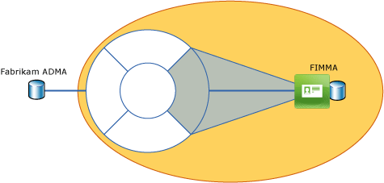
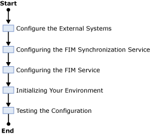
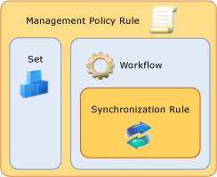
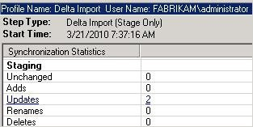
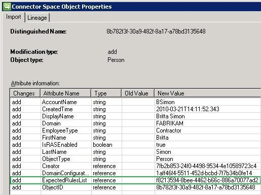
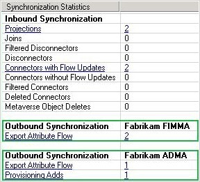
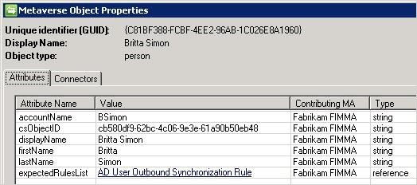

---
# required metadata

title: Microsoft Identity Manager 2016 | Microsoft Docs
description: Go over the process of creating users in ADDS using Microsoft Identity Manager 2016
keywords:
author: barclayn
ms.author: barclayn
manager: mbaldwin
ms.date: 05/11/2017
ms.topic: article
ms.service: microsoft-identity-manager
ms.technology: security
ms.assetid:

---

# How Do I Provision Users to AD DS

Applies To: Microsoft Identity Manager 2016 SP1 (MIM)

One basic requirement for an identity management system is the ability to
provision resources to an external system.

This guide walks you through the main building blocks that are involved in the
process of provisioning users from Microsoft® Identity Manager (MIM)
2016 to Active Directory® Domain Services (AD DS), outlines how you can verify
whether your scenario works as expected, provides suggestions for managing
Active Directory users by using MIM 2016, and lists additional sources for
information.

## Before You Begin

In this section, you will find information about the scope of this document. In
general, "How Do I" guides are targeted at readers who already have basic
experience with the process of synchronizing objects with MIM as covered in the
related [Getting Started Guides](http://go.microsoft.com/FWLink/p/?LinkId=190486).

### Audience

This guide is intended for information technology (IT) professionals who already
have a basic understanding of how the MIM synchronization process works and are
interested in getting hands-on experience and more conceptual information about
specific scenarios.

### Prerequisite knowledge

This document assumes that you have access to a running instance of MIM and that
you have experience in configuring simple synchronization scenarios as outlined
in the following documents:

-   [Introduction to Inbound Synchronization](http://go.microsoft.com/FWLink/p/?LinkId=189652)

-   [Introduction to Outbound Synchronization](http://go.microsoft.com/FWLink/p/?LinkId=189653)

The content in this document is scoped to function as an extension to these
introductory documents.

### Scope

The scenario outlined in this document has been simplified to address the
requirements of a basic lab environment. The focus is to give you an
understanding of the concepts and technologies discussed.

This document helps you develop a solution that involves managing groups in AD
DS by using MIM.

### Time requirements

The procedures in this document require 90 to 120 minutes to complete.

These time estimates assume that the testing environment is already configured
and does not include the time required to set up the test environment.

### Getting support

If you have questions regarding the content of this document or if you have
general feedback you would like to discuss, feel free to post a message to the
[Forefront Identity Manager 2010 forum](http://go.microsoft.com/FWLink/p/?LinkId=189654).

## Scenario Description

Fabrikam, a fictitious company, is planning to use MIM to manage the user
accounts in the corporation’s AD DS by using MIM. As part of this process,
Fabrikam needs to provision users to AD DS. To start the initial testing,
Fabrikam has installed a basic lab environment that consists of MIM and AD DS.
In this lab environment, Fabrikam is testing a scenario that consists of a user
that was manually created in the MIM Portal. The objective of this scenario is
to provision the user as an enabled user with a predefined password to AD DS.

## Scenario Design

To use this guide, you need three architectural components:

-   Active Directory domain controller

-   Computer running FIM Synchronization Service
-   Computer running FIM Portal

The following illustration outlines the required environment.

You can run all components on one computer.

>[!NOTE]
For more information about setting up MIM, see the [FIM Installation Guide](http://go.microsoft.com/FWLink/p/?LinkId=165845).

## Scenario Components List

The following table lists the components that are a part of the scenario in this
guide.

|    | Organizational unit                | MIM objects – Organizational unit (OU) that is used as a target for the provisioned users.                                                       |
|----------------------------------------|------------------------------------|--------------------------------------------------------------------------------------------------------------------------------------------------|
|    | User accounts                      | &#183; **ADMA** – Active Directory user account with sufficient rights to connect to AD DS.  &#183; **FIMMA** - Active Directory user account with sufficient rights to connect to MIM.
                                                                 |
|   | Management agents and run profiles | &#183; **Fabrikam ADMA** – Management agent that exchanges data with AD DS.   &#183; Fabrikam FIMMA - Management agent that exchanges data with MIM.                                                                                 |
|   | Synchronization rules              | Fabrikam Group Outbound Synchronization Rule – Outbound synchronization rule that provisions users to AD DS.                                     |
|    | Sets                               | All Contractors – Set with dynamic membership for all objects with an EmployeeType attribute value of Contractor.                                |
|   | Workflows                          | AD Provisioning Workflow - Workflow to bring the MIM user into the scope of the AD Outbound Synchronization Rule.                                |
|    | Management policy rules            | AD Provisioning Management Policy Rule - Management policy rule (MPR) that triggers when a resource becomes a member of the All Contractors set. |
|  | MIM users                          | Britta Simon - MIM user that you provision to AD DS.                                                                                             |

## Scenario Steps

The scenario outlined in this guide consists of the building blocks shown in the
following figure.

## Configuring the External Systems

In this section, you will find instructions for the resources that you need to
create that are outside of your MIM environment.

### Step 1: Create the OU

You need the OU as a container for the provisioned sample user. For more
information about creating OUs, see [Create a New Organizational Unit](http://go.microsoft.com/FWLink/p/?LinkId=189655).

Create an OU called MIMObjects in your AD DS.

### Step 2: Create the Active Directory user accounts

For the scenario in this guide, you need two Active Directory user accounts:

- **ADMA** - Used by the Active Directory management agent.

- **FIMMA** – Used by the FIM Service management agent.

In both cases, it is sufficient to create regular user accounts. More
information about the specific requirements of both accounts is found later in
this document. For more information about creating users, see [Create a New User Account](http://go.microsoft.com/FWLink/p/?LinkId=189656).

## Configuring the FIM Synchronization Service

For the configuration steps in this section, you need to start the FIM
Synchronization Service Manager.

### Creating the management agents

For the scenario in this guide, you need to create two management agents:

-   **Fabrikam ADMA** – management agent for AD DS.

-   **Fabrikam FIMMA** – management agent for FIM Service management agent.

### Step 3: Create the Fabrikam ADMA management agent

When you configure a management agent for AD DS, you need to specify an account
that is used by the management agent in the data exchange with AD DS. You should
use a regular user account. However, to import data from AD DS, the account must
have the right to poll changes from the DirSync control. If you want your
management agent to export data to AD DS, you need to grant the account
sufficient rights on the target OUs. For more information about this topic, see
[Configuring the ADMA Account](http://go.microsoft.com/FWLink/p/?LinkId=189657).

To create a user in AD DS, you are required to flow out the object's DN. In
addition to this, it is a good practice to flow the first name, last name, and
display name to ensure that your objects are discoverable.

In AD DS, it is still common for users to use the sAMAccountName attribute to
log on to the directory service. If you do not specify a value for this
attribute, the directory service generates a random value for it. However, these
random values are not user friendly, which is why a user-friendly version of
this attribute is typically part of an export to AD DS. To enable a user to log
on to AD DS, you also need to include a password created by using the unicodePwd
attribute in your export logic.

>[!Note]                                
Ensure that the value you specify as unicodePwd complies with the password policies of your target AD DS.

When you set a password for AD DS accounts, you also need to create an account
as an enabled account. You accomplish this by setting the userAccountControl
attribute. For more information about the userAccountControl attribute, see
[Using FIM to Enable or Disable Accounts in Active Directory](http://go.microsoft.com/FWLink/p/?LinkId=189658).

The following table lists the most important scenario-specific settings that you
need to configure.

| Management agent designer page                          | Configuration                                                  |
|---------------------------------------------------------|----------------------------------------------------------------|
| Create management agent                                 | 1. **Management agent for:** AD DS    2.  **Name:** Fabrikam ADMA |
| Connect to Active Directory forest                      | 1. **Select directory partitions:** “DC=Fabrikam,DC=com”       2. Click **Containers** to open the **Select Containers** dialog box and ensure that **MIMObjects** is the only OU that is selected.        |
| Select Object types                                     | In addition to the already selected Object types, select **user.** |
| Select attributes                                       | 1. Click **Show All.**     2. Select the following attributes:   &nbsp;&nbsp;&nbsp;&#176; **displayName**   &nbsp;&nbsp;&nbsp;&#176; **givenName**   &nbsp;&nbsp;&nbsp;&#176;  **sn**   &nbsp;&nbsp;&nbsp;&#176;  **SamAccountName**   &nbsp;&nbsp;&nbsp;&#176;  **unicodePwd**   &nbsp;&nbsp;&nbsp;&#176;  **userAccountControl**     

For more information, see the following topics in Help:
- Create a Management Agent
- Connect to an Active Directory Forest
- Using the Management Agent for Active Directory
- Configure Directory Partitions

>[!Note]
Ensure that you have an import attribute flow rule configured for the ExpectedRulesList attribute.

### Step 4: Create the Fabrikam FIMMA management agent

When you configure a FIM Service management agent, you need to specify an
account that is used by the management agent in the data exchange with the FIM
Service.

You should use a regular user account. The account must be the same account as
the one you specified during the installation of MIM. For a script that you can
use to determine the name of the FIMMA account that you specified during setup
and to test whether this account is still valid, see Using Windows PowerShell to
Do a [FIM MA Account Configuration Quick Test](http://go.microsoft.com/FWLink/p/?LinkId=189659).

The following table lists the most important scenario-specific settings you need
to configure. Create the management agent based on the information provided in the table below.  

| Management agent designer page | Configuration |
|------------|------------------------------------|
| Create management agent | 1. **Management agent for:** FIM Service Management Agent   2. **Name** Fabrikam FIMMA |
| Connect to database     | Use the following settings:   &#183; **Server:** localhost   &#183; **Database:** FIMService   &#183; **FIM Service base address:** http://localhost:5725     Provide the information about the account you created for this management agent |
| Select Object types                                     | In addition to the already selected Object types, select **Person.**   |
| Configure Object type mappings                          | In addition to the already existing object type mappings, add a mapping for the **Data Source Object Type** Person to the **Metaverse** Object Type person. |
| Configure attribute flow                                | In addition to the already existing attribute flow mappings, add the following attribute flow mappings:     |

For more information, see the following topics in the help:
-   Create a Management Agent

-   Connect to an Active Directory Database

-   Using the Management Agent for Active Directory

-   Configure Directory Partitions

>[!NOTE]
 Ensure that you have an import attribute flow rule configured for the ExpectedRulesList attribute.

### Step 5: Create the run profiles

The following table lists the run profiles you need to create for the scenario
in this guide.

| Management agent  | Run profile     |
|-------------------|--------------------------------------|
| Fabrikam ADMA     | 1. Full import    2. Full synchronization   3. Delta import   4. Delta synchronization   5. Export                                                                    |
| Fabrikam FIMMA   | 1. Full import   2. Full synchronization   3. Delta Import   4. Delta synchronization   5. Export|                                                                                                                                                                                   

Create run profiles for each management agent according to the previous table.

>[!Note]
For more information, see the Create a Management Agent Run Profile in MIM Help.                                                                                                                  

>[!Important]
 Verify that provisioning is enabled in your environment. You can do this by running the script, Using Windows PowerShell to Enable Provisioning (http://go.microsoft.com/FWLink/p/?LinkId=189660).

## Configuring the FIM Service

For the scenario in this guide, you need to configure a provisioning policy as
shown in the following figure.

The objective of this provisioning policy is to bring groups into the scope of
the AD User Outbound Synchronization Rule. By bringing your resource into the
scope of the synchronization rule, you enable the synchronization engine to
provision your resource to AD DS according to your configuration.

To configure the FIM Service, navigate in Windows Internet Explorer® to
http://localhost/identitymanagement. On the MIM Portal page, to create the
provisioning policy, go to the related pages from the Administration section. To
verify your configuration, you should run the script in [Using Windows PowerShell to document your provisioning policy configuration](http://go.microsoft.com/FWLink/p/?LinkId=189661).

### Step 6: Create the synchronization rule

The following tables show the configuration of the required Fabrikam
Provisioning synchronization rule. Create the synchronization rule according to the data in the following tables.

| Synchronization rule configuration                                                                         |                                                                             |                                                           
|------------------------------------------------------------------------------------------------------------|-----------------------------------------------------------------------------|-----------------------------------------------------------|
| Name                                                                                                       | Active Directory User Outbound Synchronization Rule                         |                                                          
| Description                                                                                               |                                                                             |                                                           
| Precedence                                                                                                | 2                                                                           |                                                           
| Data Flow Direction   | Outbound             |       
| Dependency       |         |                                         

| Scope |                                                                             |                                                           
|--------|-------|
| Metaverse Resource Type | person |                                                         
| External System                   |Fabrikam ADMA                                                               |                                                       
| External System Resource Type                                                                              | user      

| Relationship ||
|------------|---------|
| Create Resource In External System                                                                         | True                                                                        |                                                           
| Enable Deprovisioning                                                                                      | False                                                                       |                                                           

| Relationship criteria                                                                                      | |
|------------|----------|
| ILM Attribute     | Data Source Attribute                                                       |
| Data Source Attribute         | sAMAccountName    |

| Initial outbound attribute flows        | |                                                             |
|-------------------|---------------------- |---------------|
| Allow nulls                 | Destination                                                                 | Source                                                    |
| false                       | dn                                                                          | \+("CN=",displayName,",OU=MIMObjects,DC=fabrikam,DC=com") |
| false                       | userAccountControl                                                          | **Constant:** 512                                         |
| false                                                                     | unicodePwd                    | Constant: P\@\$\$W0rd                                    |

| Persistent outbound attribute flows  |                                                                     |                                                           |
|--------------------------------------|---------------------------------------------------------------------|-----------------------------------------------------------|
| Allow nulls                                                                                                | Destination                                                                 | Source                                                    |
| false                                                                                                      | sAMAccountName                                                              | accountName                                               |
| false                                                                                                      | displayName                                                                 | displayName                                               |
| false                                                                                                      | givenName                                                                   | firstName                                                 |
| false                                                                                                      | sn                                                                          | lastName                                                  |

 >[!NOTE]
 Important Verify that you have selected Initial Flow Only for the attribute flow that has the DN as the destination.                                                                          

### Step 7: Create the workflow

The objective of the AD Provisioning Workflow is to add the Fabrikam Provisioning synchronization rule to a resource. The following tables show the
configuration.  Create a workflow according to the data in the tables below.

| Workflow configuration               |                                                                 |
|--------------------------------------|-----------------------------------------------------------------|
| Name                                 | Active Directory User Provisioning Workflow                     |
| Description                          |                                                                 |
| Workflow Type                        | Action                                                          |
| Run On Policy Update                 | False                                                           |

| Synchronization rule                 |                                                                 |
|--------------------------------------|-----------------------------------------------------------------|
| Name                                 | Active Directory User Outbound Synchronization Rule             |
| Action                               | Add                                                             |

### Step 8: Create the MPR

The required MPR is of type Set Transition and triggers when a resource becomes
a member of the All Contractors set. The following tables show the
configuration.  Create an MPR according to the data in the tables below.

| MPR configuration                    |                                                             |
|--------------------------------------|-------------------------------------------------------------|
| Name                                 | AD User Provisioning Management Policy Rule                 |
| Description                          |                                                             |
| Type                                 | Set Transition                                              |
| Grants Permissions                   | False                                                       |
| Disabled                             | False                                                       |

| Transition definition                |                                                             |
|--------------------------------------|-------------------------------------------------------------|
| Transition Type                      | Transition In                                               |
| Transition Set                       | All Contractors                                             |

| Policy workflows                     |                                                             |
|--------------------------------------|-------------------------------------------------------------|
| Type                                 | Action                                                      |
| Display Name                         | Active Directory User Provisioning Workflow                 |

## Initializing your Environment

The objectives of the initialization phase are as follows:

-   Bring your synchronization rule into the metaverse.

-   Bring your Active Directory structure into the Active Directory connector
    space.

### Step 9: Run the run profiles

The following table lists the run profiles that are part of the initialization
phase.  Run the run profiles according to the table below.

| Run                                                                                                           | Management agent                                      | Run profile          |
|---------------------------------------------------------------------------------------------------------------|-------------------------------------------------------|----------------------|
| 1                                                                                                             | Fabrikam FIMMA                                        | Full import          |
| 2                                                                                                             |                                                       | Full synchronization |
| 3                                                                                                             |                                                       | Export               |
| 4                                                                                                             |                                                       | Delta import         |
|                                                                                                               |                                                       |                      |
| 5                                                                                                             | Fabrikam ADMA                                         | Full import          |
| 6                                                                                                             |                                                       | Full synchronization |

>[!NOTE]
You should verify that your outbound synchronization rule has been successfully projected into the metaverse.

## Testing the Configuration

The objective of this section is to test your actual configuration. To test the
configuration, you:

1.  Create a sample user in the FIM Portal.

2.  Verify the provisioning requisites of the sample user.

3.  Provision the sample user to AD DS.

4.  Verify that the user exists in AD DS.

### Step 10: Create a sample user in MIM

The following table lists the properties of the sample user. Create a sample user according the data in the table below.

| Attribute                              | Value                                                          |
|----------------------------------------|----------------------------------------------------------------|
| First Name                             | Britta                                                         |
| Last Name                              | Simon                                                          |
| Display Name                           | Britta Simon                                                   |
| Account Name                           | BSimon                                                         |
| Domain                                 | Fabrikam                                                       |
| Employee Type                          | Contractor                                                     |

### Verify the provisioning requisites of the sample user

To provision the sample user to AD DS, two prerequisites must be satisfied:

1.  The user must be a member of the All Contractors set.

2.  Set user must be in the scope of the outbound synchronization rule.

### Step 11: Verify the user is a member of All Contractors

To verify whether the user is a member of the All Contractors set, you open the
set, and then click View Members.

### Step 12: Verify the user is in the scope of the outbound synchronization rule

To verify whether the user is in the scope of the synchronization rule, open the
user’s property page and review the Expected Rules List attribute in the
Provisioning tab. The Expected Rules List attribute should list the AD User

Outbound Synchronization Rule. The following screen shot shows an example of the
Expected Rules List attribute.

At this point in the process, the Synchronization Rule Status is Pending. This
means, the synchronization rule has not yet been applied to the user.

### Step 13: Synchronize the sample group

Before you start the first synchronization cycle for a test object, you should
track the expected state of your object after each run profile that you run in a
test plan. Your test plan should include next to the general state of your
object (created, updated, or deleted) also the attribute values that you expect.
Use your test plan to verify your test plan expectations. If a step does not
return the expected results, do not proceed with to the next step until you have
resolved the discrepancy between your expected result and the actual result.

To verify your expectations, you can use the synchronization statistics as a
first indicator. For example, if you expect new objects to be staged in a
connector space, but the import statistics returns no “Adds,” there is obviously
something in your environment that does not work as expected.

While the synchronization statistics can give you a first indication of whether
your scenario works as expected, you should use the Search Connector Space and
the Metaverse Search feature of the Synchronization Service Manager to verify
the expected attribute values.

To synchronize the user to AD DS:

1.  Import the user into the FIM MA connector space.

2.  Project the user into the metaverse.

3.  Provision the user to the Active Directory connector space.

4.  Export status information to FIM.

5.  Export the user to AD DS.

6.  Confirm the creation of the user.

To accomplish these tasks, you run the following run profiles.

| Management agent | Run profile  |
|------------------|--------------|
| Fabrikam FIMMA   | 1. Delta import   2. Delta Synchronization   3. Export   4. Delta import |
| Fabrikam FIMMA   | 1. Export   2. Delta Import       |

After the import from the FIM Service database, Britta Simon and the
ExpectedRuleEntry object that links Britta to the

AD User Outbound Synchronization Rule are staged in the Fabrikam FIMMA connector
space. When you review

Britta’s properties in the connector space, next to the attribute values that
you have configured in the FIM Portal, you also find a valid reference to the
Expected Rule Entry object. The following screen shot shows an example of this.

The objective of the delta synchronization run on your Fabrikam FIMMA is to
perform several operations:

-   Projection – The new user object and the related Expected Rule Entry object
    are projected into the metaverse.

-   Provisioning – The newly projected Britta Simon object is provisioned into
    the connector space of the Fabrikam ADMA.

-   Export Attribute Flows – Export attribute flows occur on both management
    agents. On the Fabrikam ADMA, the newly provisioned Britta Simon object is
    populated with new attribute values. On the Fabrikam FIMMA, the existing
    Britta Simon object and the related ExpectedRuleEntry object are updated
    with attribute values that are a result of the projection.

As already indicated by the synchronization statistics, a provisioning activity
has taken place on the connector space of the Fabrikam ADMA. When you review the
metaverse object properties of Britta Simon, you find that this activity is a
result of the ExpectedRulesList attribute that has been populated with a valid
reference.

During the following export on the Fabrikam FIMMA, the synchronization rule
status of Britta Simon is updated from Pending to Applied, which indicates that
your outbound synchronization rule is now active on the object in the metaverse.

Because a new object has been provisioned to the ADMA connector space, you
should have one Add pending export on this management agent. By using a script
made for this purpose, you can see one reported Add pending export for the
Fabrikam ADMA. To use the script, see [Using Windows PowerShell to Display the Export State of a Management Agent](http://go.microsoft.com/FWLink/p/?LinkId=189664).

In FIM, each export run requires a following delta import to complete the export
operation. The delta import that you run after a previous export run is known as
a confirming import. Confirming imports are required to enable the FIM
Synchronization Service to make appropriate update requirements during
successive synchronization runs.

Run the run profiles according to the instructions in this section.

>[!IMPORTANT]
Each run profile run must succeed without an error.

### Step 14: Verify the provisioned user in AD DS

To verify that your sample user has been provisioned to AD DS, you open the
FIMObjects OU. Britta Simon should be located in the FIMObjects OU.

Summary
=======

The objective of this document is to introduce you to the main building blocks
for synchronizing a user in MIM with AD DS. In your initial testing, you should
first start with the minimum of attributes that are required to complete a task
and add more attributes to your scenario when the general steps work as
expected. Keeping the complexity to a minimal level simplifies the process of
troubleshooting.

When you test your configuration, it is very likely that you delete and recreate
new test objects. For objects with a

populated ExpectedRulesList attribute, this can result in orphaned ERE objects.
For a description of how you can remove these objects from your test
environment, see [A Method to Remove Orphaned ExpectedRuleEntry Objects from Your Environment](http://go.microsoft.com/FWLink/p/?LinkId=189667).

In a typical synchronization scenario that includes AD DS as a synchronization
target, MIM is not authoritative for all attributes of an object. For example,
when you manage user objects in AD DS by using FIM, at a minimum, the domain and
the objectSID attributes need to be contributed by the AD DS management agent.
The account name, domain, and objectSID attributes are required if you want to
enable a user to log on to the FIM Portal. To populate these attributes from AD
DS, an additional inbound synchronization rule is required for your AD DS
connector space. When you manage objects with multiple sources for attribute
values, you need to ensure that you configure your attribute flow precedence
correctly. If the attribute flow precedence is not correctly configured, the
synchronization engine blocks attribute values from being populated. You can
find more information about attribute flow precedence in the article [About Attribute Flow Precedence](http://go.microsoft.com/FWLink/p/?LinkId=189675).

See Also
=========

Other Resources
---------------

[Using FIM to Enable or Disable Accounts in Active Directory](http://go.microsoft.com/FWLink/p/?LinkId=189670)

[About Reference Attributes](http://go.microsoft.com/FWLink/p/?LinkId=189671)

[How Can I Manage My FIM MA Account](http://go.microsoft.com/FWLink/p/?LinkId=189672)

[Detecting Nonauthoritative Accounts – Part 1: Envisioning](http://go.microsoft.com/FWLink/p/?LinkId=189673)

[The Poor Man’s Version of a Connector Detection Mechanism](http://go.microsoft.com/FWLink/p/?LinkId=189674)

[Configuring the ADMA Account](http://go.microsoft.com/FWLink/p/?LinkId=189657)

[A Method to Remove Orphaned ExpectedRuleEntry Objects from Your Environment](http://go.microsoft.com/FWLink/p/?LinkId=189667)

[About Attribute Flow Precedence](http://go.microsoft.com/FWLink/p/?LinkId=189675)

[About Exports](http://go.microsoft.com/FWLink/p/?LinkId=189676)
