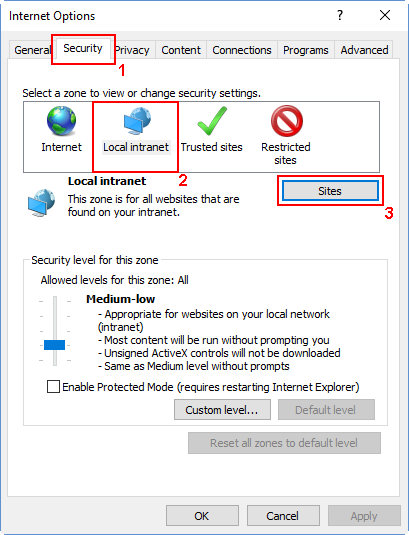

# Preparing an identity management server: SharePoint

>[!div class="step-by-step"]
[Previous](https://docsmsftstage.azurewebsites.net/MIM/DeployUse/prepare-server-sql2014.html)
**Preparing an identity management server: SQL Server 2014**

> [!NOTE]
> In all the examples below, **mimservername** represents the name of your domain controller, **contoso** represents your domain name, and **Pass@word1** represents an example password.


## Install **SharePoint Foundation 2013 with SP1**

> [!NOTE]
> It will require Internet connectivity for the installer to download its prerequisites.

The server will restart at the end of the installation.

1.  Launch **PowerShell** as a domain administrator.

    -   Change to the directory where SharePoint was unpacked.

    -   Type the following command.

        ```
        .\prerequisiteinstaller.exe
        ```

2.  After **SharePoint** prerequisites are installed, install **SharePoint Foundation 2013 with SP1** by typing the following command:

    ```
    .\setup.exe
    ```

3.  Select the complete server type.

4.  After the install completes, run the wizard.

## Run the wizard to configure SharePoint

Follow the steps lined out in the **SharePoint Products Configuration Wizard** to configure SharePoint to work with MIM.

1. On the **Connect to a server farm** tab, change to create a new server farm.

2. Specify this server as the database server for the configuration database, and *Contoso\SharePoint* as the database access account for SharePoint to use.

3. Specify a password as the farm security passphrase (it will not be used later in this lab environment).

4. When the configuration wizard completes configuration task 10 of 10, click Finish and a web browser will open.

5. In the Internet Explorer popup, authenticate as *Contoso\Administrator* (or the equivalent domain administrator account) to proceed.

6. Start the wizard (within the web app) to configure the SharePoint farm.

7. Select the option to use the existing managed account (*Contoso\SharePoint*), and click **Next**.

8. On the **Creating a Site Collection** window, click **Skip**.  Then click **Finish**.

## Prepare SharePoint to host the MIM Portal

1. Create a **SharePoint Foundation 2013 Web Application**.

    > [!NOTE]
    > Initially, SSL will not be configured. Be sure to configure SSL or equivalent before enabling access to this portal.

    1. Launch  **SharePoint 2013 Management Shell** and run the following PowerShell script:

        ```
        $dbManagedAccount = Get-SPManagedAccount -Identity contoso\SharePoint
        New-SpWebApplication -Name "MIM Portal" -ApplicationPool "MIMAppPool"
        -ApplicationPoolAccount $dbManagedAccount -AuthenticationMethod "Kerberos" -Port 82 -URL http://corpidm.contoso.local
        ```

        2. Note that a warning message will appear that Windows Classic authentication method is being used, and it may take several minutes for the final command to return.  When completed, the output will indicate the URL of the new portal.  Keep the **SharePoint 2013 Management Shell** window open as it will be needed in a subsequent task.

2. Create a **SharePoint Site Collection** associated with that web application.

    1. Launch  SharePoint 2013 Management Shell and run the following PowerShell script:

        ```
        $t = Get-SPWebTemplate -compatibilityLevel 14 -Identity "STS#1"
        $w = Get-SPWebApplication http://corpidm.contoso.local:82
        New-SPSite -Url $w.Url -Template $t -OwnerAlias contoso\Administrator
        -CompatibilityLevel 14 -Name "MIM Portal" -SecondaryOwnerAlias contoso\BackupAdmin
        $s = SpSite($w.Url)
        $s.AllowSelfServiceUpgrade = $false
        $s.CompatibilityLevel
        ```

        2. Verify that the result of the *CompatibilityLevel* variable is “14”.  ([See Installing FIM 2010 R2 on SharePoint Foundation 2013](http://technet.microsoft.com/library/jj863242.aspx) for more information). If the result is “15”, then the site collection was not created for the 2010 experience version; delete the site collection and recreate it.

3. Disable **SharePoint Server-Side Viewstate** and the SharePoint task "Health Analysis Job (Hourly, Microsoft SharePoint Foundation Timer, All Servers)" by running the following PowerShell commands in the **SharePoint 2013 Management Shell**:

    ```
    $contentService = [Microsoft.SharePoint.Administration.SPWebService]::ContentService;
    $contentService.ViewStateOnServer = $false;
    $contentService.Update();
    Get-SPTimerJob hourly-all-sptimerservice-health-analysis-job | disable-SPTimerJob
    ```

4. On your identity management server, open a new web browser tab, navigate to http://localhost:82/ and login as *contoso\Administrator*.  An empty SharePoint site named *MIM Portal* will be shown.

    

5. Copy the URL, then in Internet Explorer, open **Internet Options**, change to the **Security tab**, select **Local intranet**, and click **Sites**.

    

6. In the **Local intranet** window, click on **Advanced** and paste the copied URL in the **Add this website to the zone** text box. Click **Add** then close the windows.

7. Open the **Administrative Tools** program, navigate to **Services**, locate the SharePoint Administration service, and start it if it is not already running.

>[!div class="step-by-step"]  
[Next](https://docsmsftstage.azurewebsites.net/MIM/DeployUse/prepare-server-exchange.html)
**Preparing an identity management server: Exchange (optional)**
