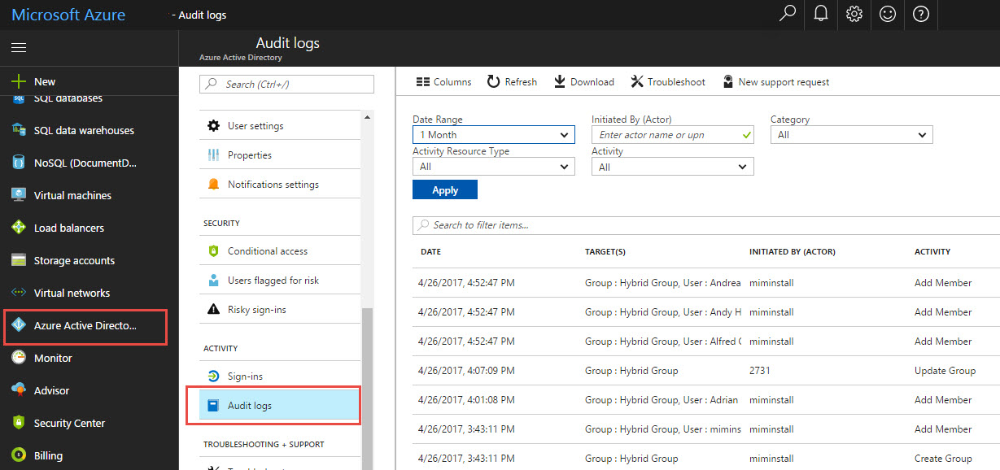

---
# required metadata

title: Working with Hybrid reporting in Azure using MIM 2016  | Microsoft Docs
description: Learn how to combine on-premises and cloud data into hybrid reports in Azure, and how to manage and view these reports.
keywords:
author: fimguy
ms.author: kgremban
manager: femila
ms.date: 01/27/2017
ms.topic: article
ms.service: microsoft-identity-manager
ms.technology: security
ms.assetid: 68df2817-2040-407d-b6d2-f46b9a9a3dbb

# optional metadata

#ROBOTS:
#audience:
#ms.devlang:
ms.reviewer: mwahl
ms.suite: ems
#ms.tgt_pltfrm:
#ms.custom:

---

# Working with Identity Manager Hybrid Reporting

## Available hybrid reports
The first three Microsoft Identity Manager (MIM) reports available in Azure AD are **Password reset activity**, **Password reset registration** and **Self-service groups activity**.

-   Password reset activity displays each instance when a user performed password reset using the SSPR and provides the gates or **Methods** used for authentication.

    

-   Password reset registration displays each time a user registers for the SSPR and the **Methods** used to authenticate, for example a mobile phone number or questions and answers.
    Note that for Password reset registration, no differentiation is made between SMS gate and MFA gate – both are considered **Mobile Phone**.

-   Self-service groups activity displays each attempt made by someone to add themselves to or delete themselves from a group and group creation.

> [!NOTE]
> The reports currently present data for up to one month back.
>
> If you want to uninstall hybrid reports, uninstall the MIMreportingAgent.msi agent.

## Prerequisites

1.  Install Microsoft Identity Manager 2016 RTM /or SP1 MIM service.

2.  Make sure you have an Azure AD Premium tenant with a licensed administrator in your directory.

3.  Make sure you have outgoing Internet connectivity from the Microsoft Identity Manager server to Azure.

## Requirements
The following table is a list of requirements for using Microsoft Identity Manager Hybrid Reporting.

| Requirement | Description |
| --- | --- |
| Azure AD Premium |Azure AD Connect Health is an Azure AD Premium feature and requires Azure AD Premium.   For more information, see [Getting started with Azure AD Premium](../active-directory-get-started-premium.md)  To start a free 30-day trial, see [Start a trial.](https://azure.microsoft.com/trial/get-started-active-directory/) |
| You must be a global administrator of your Azure AD to get started with Azure AD Connect Health |By default, only the global administrators can install and configure the health agents to get started, access the portal, and perform any operations within Azure AD Connect Health. For more information, see [Administering your Azure AD directory](https://docs.microsoft.com/en-us/azure/active-directory/active-directory-administer).    Using Role Based Access Control you can allow access to Azure AD Connect Health to other users in your organization. For more information, see [Role Based Access Control for Azure AD Connect Health.](https://docs.microsoft.com/en-us/azure/active-directory/connect-health/active-directory-aadconnect-health-operations#manage-access-with-role-based-access-control)   **Important:** The account used when installing the agents must be a work or school account. It cannot be a Microsoft account. For more information, see [Sign up for Azure as an organization](https://docs.microsoft.com/en-us/azure/active-directory/sign-up-organization) |
| Azure AD Connect Health Agent is installed on each targeted server | Azure AD Connect Health requires the Health Agents to be installed and configured on targeted servers to receive the data and provide the Monitoring and Analytics capabilities   For example, to get data from your AD FS infrastructure, the agent must be installed on the AD FS and Web Application Proxy servers. Similarly, to get data on your on-premises AD DS infrastructure, the agent must be installed on the domain controllers.    |
| Outbound connectivity to the Azure service endpoints | During installation and runtime, the agent requires connectivity to Azure AD Connect Health service endpoints. If outbound connectivity is blocked using Firewalls, ensure that the following endpoints are added to the allowed list:   <li>&#42;.blob.core.windows.net </li><li>&#42;.servicebus.windows.net - Port: 5671 </li><li>&#42;.adhybridhealth.azure.com/</li><li>https://management.azure.com </li><li>https://policykeyservice.dc.ad.msft.net/</li><li>https://login.windows.net</li><li>https://login.microsoftonline.com</li><li>https://secure.aadcdn.microsoftonline-p.com</li> |
|Outbound connectivity based on IP Addresses | For IP address based filtering on firewalls, refer to the [Azure IP Ranges](https://www.microsoft.com/en-us/download/details.aspx?id=41653).|
| SSL Inspection for outbound traffic is filtered or disabled | The agent registration step or data upload operations may fail if there is SSL inspection or termination for outbound traffic at the network layer. |
| Firewall ports on the server running the agent. |The agent requires the following firewall ports to be open in order for the agent to communicate with the Azure AD Health service endpoints.  <li>TCP port 443</li><li>TCP port 5671</li> |
| Allow the following websites if IE Enhanced Security is enabled |If IE Enhanced Security is enabled, then the following websites must be allowed on the server that is going to have the agent installed.  <li>https://login.microsoftonline.com</li><li>https://secure.aadcdn.microsoftonline-p.com</li><li>https://login.windows.net</li><li>The federation server for your organization trusted by Azure Active Directory. For example: https://sts.contoso.com</li> |
 

## Install Microsoft Identity Manager Reporting Agent in Azure AD
After the reporting agent is installed, the data from Microsoft Identity Manager activity is exported from MIM to windows event log. The MIM reporting agent processes the events, and uploads to Azure. In Azure, the events are parsed, decrypted, and filtered for the required reports.

1.  Install Microsoft Identity Manager 2016.

2.  Download the Microsoft Identity Manager reporting agents:

    1.  Log into the Azure AD management portal and click on the Active Directory icon.

    2.  Double click on the directory for which you are a Global Administrator and you have an Azure AD Premium subscription.

    3.  Click **Configuration** and download the reporting agent.

3.  Install the Microsoft Identity Manager reporting agent:

    1.  Download the [MIMHReportingAgentSetup.exe](http://download.microsoft.com/download/7/3/1/731D81E1-8C1D-4382-B8EB-E7E7367C0BF2/MIMHReportingAgentSetup.exe) to Microsoft Identity Manager Service server.
    2.  Run `MIMHReportingAgentSetup.exe` 
    3.  Run the agent installer.

    4.  Make sure that the MIM reporting agent service is running

    5.  Restart the MIM Service.

4.  Validate that Microsoft Identity Manager Reporting is working in Azure.

    You can create report data by using the Microsoft Identity Manager Self Service Password Reset Portal to reset a user’s password. Make sure that the password reset completed successfully and then check that the data is displayed in the Azure AD management portal.

## View hybrid reports in the Azure classic portal

1.  Log into the [Azure portal](https://portal.azure.com/) with your global admin account for the tenant.

2.  Click the **Azure Active Directory** icon.

3.  Select the tenant directory from the list of available directories for your subscription.

4.  Click **Audit Logs**.

5.  Make sure you select **MIM Service** in the Category drop down menu.

> [!WARNING]
> It can take some time for Microsoft Identity Manager audit data to appear in Azure AD Portal.

## Stop creating hybrid reports
If you want to stop uploading reporting audit data from Microsoft Identity Manager to Azure Active Directory, uninstall the hybrid reporting agent. Use the Windows **Add or Remove Programs** tool to uninstall Microsoft Identity Manager Hybrid Reporting.

## Windows events used for hybrid reporting
Events generated by Microsoft Identity Manager are logged in the Windows Event Log, and are visible in the Event Viewer under: Application and Services logs-&gt; **Identity Manager Request Log**. Each MIM request is exported as an event in the Windows Event Log in JSON structure. This can be exported to your SIEM.

|Event type|ID|Event details|
|--------------|------|-----------------|
|Information|4121|MIM event data that includes all the request data.|
|Information|4137|MIM event 4121 extension, in the case there is too much data for a single event. The header in this event is in the following form: `"Request: <GUID> , message <xxx> out of <xxx>`|
