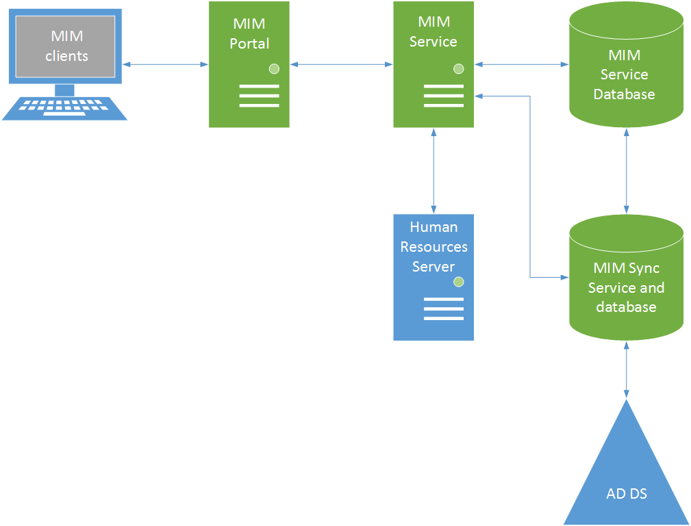
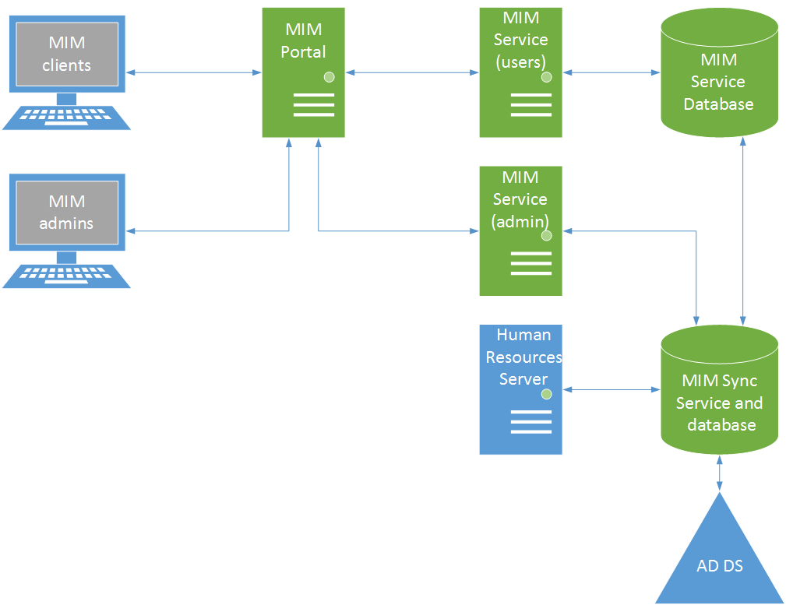

# Topology considerations
You can deploy Microsoft Identity Manager (MIM) components on the same server or among multiple servers in multiple configurations. The topology that you select for your deployment affects the performance that you can achieve from MIM. This article introduces multiple deployment topologies that you may consider implementing.

## Components
When designing your deployment topology, it's important to know what each component does and how they all interact. You can host all the components on the same computer, or distribute them among multiple computers and servers.

| Component | Same computer | Separate server | Network Load Balancing cluster | Server cluster |
| --- | --- | --- | --- | --- |
| MIM Portal | Yes | Yes | Yes | |
| MIM Service | Yes | Yes | Yes | |
| MIM Synchronization Service | Yes | Yes | | |
| Microsoft SQL Server | Yes | Yes | | Yes |

## Multitier topology
The multitier topology is the most commonly used topology. It offers the greatest flexibility. The MIM Portal, MIM Service, and databases are separated into tiers and deployed on multiple computers. This topology adds flexibility in scaling the different MIM components. For example, you can scale the MIM Portal horizontally by adding additional servers in a Network Load Balancing (NLB) cluster. Similarly, you can scale the MIM service by using an NLB cluster and by increasing the number of computers (nodes) in the cluster as needed.

In the multitier topology, a dedicated computer to host each SQL database (one for the MIM Service and another for the MIM Synchronization Service) is allocated. The scalability of the performance of the computers that host the SQL databases can be increased by adding or upgrading hardware, for example, by upgrading the CPUs, adding additional CPUs, increasing random access memory (RAM) or upgrading the RAM, or upgrading the hard drive configurations to increase read and write access and decrease latency.

In this configuration, the MIM Synchronization Service and its database are hosted on the same computer. However, you should be able to achieve similar performance if there is a one-gigabit dedicated network connection between the MIM Synchronization Service and its database when they are hosted on separate computers.

## Multitier topology with multiple MIM services
Synchronization of data with external systems can add a considerable load to the system and run over an extended period of time. If the synchronization configuration results in triggering policies with workflows, these policies contend for resources with end-user workflows. Such issues can be pronounced with authentication workflows, such as password resets, which are done in real time with an end user waiting for the process to complete. By providing one instance of the MIM Service for end user operations and a separate portal for administrative data synchronization, you can provide better responsiveness for end-user operations.

As with the standard multitier topology, you can increase MIM Portal performance by using an NLB cluster and by increasing the number of nodes in the cluster as needed.

The performance computers running SQL Server that host the MIM Synchronization Service and the MIM Service database will dramatically influence the overall performance of your MIM deployment. Therefore, follow the recommendations in SQL Server documentation for optimizing database performance. See the following documents for more information:

- [Storage Top 10 Best Practices](http://go.microsoft.com/fwlink/?LinkID=183663)

- [Optimizing tempdb Performance](http://go.microsoft.com/fwlink/?LinkID=188267)

- [SQL Server Best Practices Article](http://go.microsoft.com/fwlink/?LinkID=188268)

## See also
- The downloadable [Forefront Identity Manager (FIM) 2010 Capactity Planning Guide](http://go.microsoft.com/fwlink/?LinkId=200180) goes into more detail about a test build and performance testing results.
