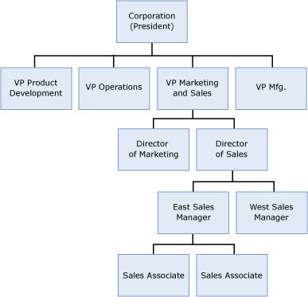
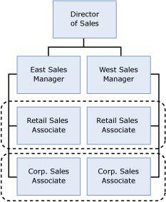
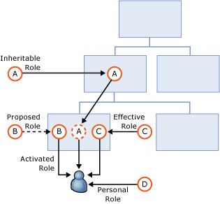
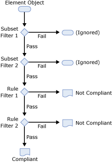

---
# required metadata

title: Microsoft BHOLD Suite Concepts Guide | Microsoft Docs
description: Get started with the MIM 2016 components by installing and configuring the Synchronization Service.
keywords:
author: billmath
ms.author: billmath
manager: mtillman
ms.date: 09/14/2017

ms.assetid: 
ms.prod: microsoft-identity-manager

# optional metadata

#ROBOTS:
#audience:
#ms.devlang:
#ms.tgt_pltfrm:
#ms.custom:

---
# Microsoft BHOLD Suite Concepts Guide

Microsoft Identity Manager 2016 (MIM) enables organizations to manage the entire lifecycle of user identities and their associated credentials. It can be configured to synchronize identities, centrally manage certificates and passwords, and provision users across heterogeneous systems. With MIM, IT organizations can define and automate the processes used to manage identities from creation to retirement.

Microsoft BHOLD Suite extends these capabilities of MIM by adding role-based access control. BHOLD enables organizations to define user roles and to control access to sensitive data and applications. The access is based what is appropriate for those roles. BHOLD Suite includes services and tools that simplify the modeling of the role relationships within the organization. BHOLD maps those roles to rights, and to verify that the role definitions and associated rights are correctly applied to users. These capabilities are fully integrated with MIM, providing a seamless experience for end users and IT staff alike.

This guide helps you understand how BHOLD Suite works with MIM and covers the following topics:

- Role-based access control
- Attestation
- Analytics
- Reporting
- Access Management Connector
- MIM Integration

## Role-based access control

The most common method for controlling user access to data and applications is through discretionary access control (DAC). In most common implementations, every significant object has an identified owner. The owner has the ability to grant or deny access to the object to others based on individual identity or group membership. In practice, DAC typically results in a plethora of security groups, some that reflect organizational structure, others that represent functional groupings (such as job types or project assignments), and others that consist of makeshift collections of users and devices that are linked for more temporary purposes. As organizations grow, membership in these groups becomes increasingly difficult to manage. For example, if an employee is transferred from one project to another, the groups that are used to control access to the projects assets must be updated manually. In such cases, it is not uncommon for mistakes to occur, mistakes that can impede project security or productivity.

MIM includes features that help mitigate this problem by providing automated control over group and distribution list membership. However, this does not address the intrinsic complexity of proliferating groups that are not necessarily related to each other in a structured way.

One way to significantly reduce this proliferation is by deploying role-based access control (RBAC). RBAC does not displace DAC.  RBAC builds on DAC by providing a framework for classifying users and IT resources. This allows you to make explicit their relationship and the access rights that are appropriate according to that classification. For example, by assigning to a user attributes that specify the users job title and project assignments, the user can be granted access to tools needed for the user's job and data that the user needs to contribute to a particular project. When the user assumes a different job and different project assignments, changing the attributes that specify the user's job title and projects automatically blocks access to the resources only required for the users previous position.

Because roles can be contained within roles in a hierarchical fashion, (for example, the roles of sales manager and sales representative can be contained in the more general role of sales), it is easy to assign appropriate rights to specific roles and yet still provide appropriate rights to everyone who shares the more inclusive role as well. For example, in a hospital, all medical personnel could be given the right to view a patients records, but only physicians (a subrole of the medical role) could be given the right to enter prescriptions for the patient. Similarly, users belonging to the clerical role could be denied access to patient records except for billing clerks (a subrole of the clerical role), who could be granted access to those portions of a patients records that are required to bill the patient for services provided by the hospital.

An additional benefit of RBAC is the ability to define and enforce separation of duties (SoD). This allows an organization to define combinations of roles that grant permissions that should not be held by the same user, so that a particular user cannot be assigned roles that allow the user to initiate a payment and to authorize a payment, for example. RBAC provides the ability to enforce such a policy automatically rather than having to evaluate the effective implementation of the policy on a per-user basis.

### BHOLD role model objects

With BHOLD Suite, you can specify and organize roles within your organization, map users to roles, and map appropriate permissions to roles. This structure is called a role model, and it contains and connects five types of objects: 

- Organizational units
- Users
- Roles
- Permissions
- Applications

#### Organizational units

Organizational units (OrgUnits) are the principal means by which users are organized in the BHOLD role model. Every user must belong to at least one OrgUnit. (In fact, when a user is removed from the last organizational unit in BHOLD, the user's data record is deleted from the BHOLD database.)

> [!Important]
> Organizational units in the BHOLD role model should not be confused with organizational units in Active Directory Domain Services (AD DS). Typically, the organizational unit structure in BHOLD is based on the organization and policies of your business, not the requirements of your network infrastructure.

Although it is not required, in most cases organizational units are structured in BHOLD to represent the hierarchical structure of the actual organization, similar to the one below:

In this sample, the role model would organizationalganizatinal unit for the corporation as a whole (represented by the president, because the president is not part of a mororganizationalganizatinal unit), or the BHOLD root organizational unit (which always exists) could be used for that purpose. OrgUnits representing the corporate divisions headed by the vice presidents would be placed in the corporate organizational unit. Next, organizational units corresponding to the marketing and sales directors would be added to the marketing and sales organizational units, and organizational units representing the regional sales managers would be placed in the organizational unit for the east region sales manager. Sales associates, who do not manage other users, would be made members of the organizational unit of the east region sales manager. Note that users can be members of an organizational unit at any level. For example, an administrative assistant, who is not a manager and reports directly to a vice president, would be a member of the vice president's organizational unit.

In addition to representing organizational structure, organizational units can also be used to group users and other organizational units according to functional criteria, such as for projects or specialization. The following diagram shows how organizational units would be used to group sales associates according to customer type:

In this example, each sales associate would belong to two organizational units: one representing the associate's place in the organization's management structure, and one representing the associate's customer base (retail or corporate). Each organizational unit can be assigned different roles which, in turn, can be assigned different permissions for accessing the organization's IT resources. In addition, roles can be inherited from parent organizational units, simplifying the process of propagating roles to users. On the other hand, specific roles can be prevented from being inherited, ensuring that a specific role is associated only with the appropriate organizational units.

OrgUnits can be created in BHOLD Suite by using the BHOLD Core web portal or by using the BHOLD Model Generator.

#### Users

As noted above, every user must belong to at least one organizational unit (OrgUnit). Because organizational units are the principal mechanism for associating a user with roles, in the majority of organizations a given user belongs to multiple OrgUnits to make it easier to associate roles with that user. In some cases, however, it may be necessary to associate a role with a user apart from any OrgUnits that the user belongs to. Consequently, a user can be assigned directly to a role as well as obtaining roles from the OrgUnits that the user belongs to.

When a user is not active within the organization (while away for medical leave, for example), the user can be suspended, which revokes all the user's permissions without removing the user from the role model. Upon returning to duty, the user can be reactivated, which restores all the permissions granted by the user's roles.

Objects for users can be created individually in BHOLD through the BHOLD Core web portal, or they can be imported in bulk by using BHOLD Model Generator, or by using the Access Management Connector with the FIM Synchronization Service to import user information from such sources as Active Directory Domain Services or human resources applications.

Users can be created directly in BHOLD without using the FIM Synchronization Service. This can be useful when modeling roles in a preproduction or test environment. You can also allow external users (such as employees of a subcontractor) to be assigned roles and thus given access to IT resources without being added to the employee database; however, these users will not be able
to use the BHOLD self-service features.

#### Roles

As previously noted, under the role-based access control (RBAC) model, permissions are associated with roles rather than individual users. This makes it possible to give each user the permissions required to perform the user's duties by changing the user's roles rather than separately granting or denying the user permissions. As a consequence, the assignment of permissions no longer requires IT department participation, but instead can be performed as part of managing the business. A role can aggregate permissions for accessing different systems, either directly or through the use of subroles, further reducing the need for IT involvement in managing user permissions.

It is important to note that roles are a feature of the RBAC model itself; typically roles are not provisioned to target applications. This enables RBAC to be used alongside existing applications which are not designed to use roles or to change the role definitions be meet the needs of changing business models without having to modify the applications themselves. If a target application is designed to use roles, then you can associated roles in the BHOLD role model with corresponding application roles by treating the application-specific roles as permissions.

In BHOLD, you can assign a role to a user primarily through two mechanisms:

- By assigning a role to an organizational unit (organizational unit) of which the user is a member
- By assigning a role directly to a user

A role assigned to a parent organizational unit optionally can be inherited by its member organizational units. When a role is assigned to or inherited by an organizational unit, it can be designated as an effective or proposed role. If it is an effective role, all users in the organizational unit are assigned the role. If it is a proposed role, it must be activated for each user or member organizational unit to become effective for that user or organizational unit's members. This makes it possible to assign users a subset of the roles associated with an organizational unit, rather than automatically assigning all of the organizational unit's roles to all members. In addition, roles can be given start and end dates, and limits can be placed on the percentage of users within an organizational unit for which a role can be effective.

The following diagram illustrates how an individual user can be assigned a role in BHOLD:

In this diagram, role A is assigned to an organizational unit as an inheritable role, and so is inherited by its member organizational units and all users within those organizational units. Role B is assigned as a proposed role for an organizational unit. It must be activated before a user in the organizational unit can be authorized with the role's permissions. Role C is an effective role, so its permissions apply immediately to all users in the organizational unit. Role D is linked directly to the user and so its permissions apply immediately to that user.

In addition, a role can be activated for a user based on a user's attributes. For more information, see Attribute-based authorization.

#### Permissions

A permission in BHOLD corresponds to an authorization imported from a target application. That is, when BHOLD is configured to work with an application, it receives a list of authorizations that BHOLD can link to roles. For example, when Active Directory Domain Services (AD DS) is added to BHOLD as an application, it receives a list of security groups that, as BHOLD permissions, can be linked to roles in BHOLD.

Permissions are specific to applications. BHOLD provides a single, unified view of permissions so permissions can be associated with roles without requiring role managers to understand the implementation details of the permissions. In practice, different systems might enforce a permission differently. The application-specific connector from the FIM Synchronization Service to the
application determines how permission changes for a user are provided to that application. 

#### Applications

BHOLD implements a method for applying role-based access control (RBAC) to external applications. That is, when BHOLD is provisioned with users and permissions from an application, BHOLD can associate those permissions with users by assigning roles to the users and then linking the permissions to the roles. The application's background process can then map the correct permissions to its users based on the role/permission mapping in BHOLD.

### Developing the BHOLD Suite role model

To help you develop your role model, BHOLD Suite provides Model Generator, a tool that is both easy to use and comprehensive.

Before you use Model Generator, you must create a series of files that define the objects that Model Generator uses to construct the role model. For information about how to create these files, see Microsoft BHOLD Suite Technical Reference.

The first step in using the BHOLD Model Generator is to import these files to load the basic building blocks into Model Generator. When the files have been successfully loaded, you can then specify criteria that Model Generator uses to create several classes of roles:

- Membership roles that are assigned to a user based on the OrgUnits (organizational units) that the user belongs to
- Attribute roles that are assigned to a user based on the user's attributes in the BHOLD database
- Proposed roles that are linked to an organizational unit but must be activated for specific users
- Ownership roles that grant a user control over organizational units and roles for which an owner is not specified in the imported files

> [!Important]
> When uploading files, select the **Retain Existing Model** check box only in test environments. In production environments, you must use Model Generator to create the initial role model. You cannot use it to modify an existing role model in the BHOLD database.

After Model Generator creates these roles in the role model, you can then export the role model to the BHOLD database in the form of an XML file.

### Advanced BHOLD features

Previous sections described the basic features of role-based access control (RBAC) in BHOLD. This section outlines additional features in BHOLD that can provide enhanced security and flexibility to your organization's implementation of RBAC. This section provides overviews of the following BHOLD features:

- Cardinality
- Separation of duties
- Context-adaptable permissions
- Attribute-based authorization
- Flexible attribute types

#### Cardinality

*Cardinality* refers to the implementation of business rules that are designed to limit the number of times two entities can be related to each other. In the case of BHOLD, cardinality rules can be established for roles, permissions, and users.

You can configure a role to limit the following:

- The maximum number of users for which a proposed role can be activated
- The maximum number of subroles that can be linked to the role
- The maximum number of permissions that can be linked to the role

You can configure a permission to limit the following:

- The maximum number of roles that can be linked to the permission
- The maximum number of users that can be granted the permission

You can configure a user to limit the following:

- The maximum number of roles that can be linked to the user
- The maximum number of permissions that can be assigned to the user through role assignments

#### Separation of duties

Separation of duties (SoD) is a business principle that seeks to prevent individuals from gaining the capability to perform actions that should not be available to a single person. For example, an employee should not able to request a payment and to authorize the payment. The principle of SoD enables organizations to implement a system of checks and balances to minimize their exposure to risk from employee error or misconduct.

BHOLD implements SoD by letting you define incompatible permissions. When these permissions are defined, BHOLD enforces SoD by preventing the creation of roles that are linked to incompatible permissions, whether they are linked directly or through inheritance, and by preventing users from being assigned multiple roles that, when combined, would grant incompatible permissions, again by direct assignment or through inheritance. Optionally, conflicts can be overridden.

#### Context-adaptable permissions

By creating permissions that can be automatically modified based on an object attribute, you can reduce the total number of permissions you have to manage. Context-adaptable permissions (CAPs) let you define a formula as a permission attribute that modifies how the permission is applied by the application associated with the permission. For example, you can create a formula that changes the access permission to a file folder (through a security group associated with the folder's access control list) based on whether a user belongs to an organizational unit (organizational unit) containing full-time or contract employees. If the user is moved from one organizational unit to another, the new permission is automatically applied and the old permission is deactivated. 

The CAP formula can query the values of attributes that have been applied to applications, permissions, organizational units, and users.

#### Attribute-based authorization

One way to control whether a role that is linked to an organizational unit (organizational unit) is activated for a particular user in the organizational unit is to use attribute-based authorization (ABA). By using ABA, you can automatically activate a role only when certain rules based on a user's attributes are met. For example, you can link a role to an organizational unit that becomes active for a user only if the user's job title matches the job title in the ABA rule. This eliminates the need to manually activate a proposed role for a user. Instead, a role can be activated for all users in an organizational unit who have an attribute value that satisfies the role's ABA rule. Rules can be combined, so that a role is activated only when a user's attributes satisfy all the ABA rules specified for the role.

It is important to note that the results of ABA rule tests are limited by cardinality settings. For example, if the cardinality setting of a rule specifies that no more than two users can be assigned a role, and if an ABA rule would otherwise activate a role for four users, the role will be activated only for the first two users that pass the ABA test.

#### Flexible attribute types

The system of attributes in BHOLD is highly extensible. You can define new attribute types for such objects as users, organizational units (organizational units), and roles. Attributes can be defined to have values that are integers, Boolean (yes/no), alphanumeric, date, time, and email addresses. Attributes can be specified as single values or a value list.

## Attestation

The BHOLD Suite provides tools that you can use to verify that individual users have been given appropriate permissions to accomplish their business tasks. The administrator can use the portal provided by the BHOLD Attestation module to design an manage the attestation process.

The attestation process is conducted by means of campaigns in which campaign stewards are given the opportunity and means to verify that the users for which they are responsible have appropriate access to BHOLD-managed applications and correct permissions within those applications. A campaign owner is designated to oversee the campaign and to ensure that the campaign is being carried out properly. A campaign can be created to occur once or on a recurring basis.

Typically, the steward for a campaign will be a manager who will attest the access rights of users belonging to one or more organizational units for which the manager is responsible. Stewards can be automatically selected for the users being attested in a campaign based on user attributes, or the stewards for a campaign can be defined by listing them in a file that maps every user being attested in the campaign to a steward.

When a campaign begins, BHOLD sends an email notification message to the campaign stewards and owner and then sends periodic reminders to help them maintain progress in the campaign. Stewards are directed to a campaign portal where they can see a list of the users for which they are responsible and the roles that are assigned to those users. The stewards can then confirm whether they are responsible for each of the listed users and approve or deny the access rights of each of the listed
users.

Campaign owners also use the portal to monitor the progress of the campaign, and campaign activities are logged so campaign owners can analyze the actions that were taken in the course of the campaign.

## Analytics

One of the important considerations when implementing a comprehensive rights-based access control (RBAC) system is the balance between maintaining strict access control and avoiding unnecessary (or, worse, unexpected) barriers to access. The effort to maintain this balance often results in an access-control structure that is so complex that unexpected interactions between policies are nearly unavoidable.

For that reason, it is important to be able to analyze the effects of access-control policies before they are actually put in place. The Analytics module of BHOLD Suite gives you the ability to perform this analysis by letting you develop rules that represent your policies and then showing the users whose permissions conform or conflict with the rule. Based on this analysis, you can adjust the policy or modify roles and permissions to eliminate any conflicts with the policy.

The BHOLD Analytics portal gives you the ability to construct rulesets that consist of one or more rules that you create to test a particular policy or group of policies. A rule consists of the following major parts:

- A title and description that let you identify and describe the rule
- A status that indicates whether the rule is ready for review, being reviewed, or approved
- An element set (such as users or permissions) that the rule is designed to test
- Optional subset filters that are expressions that you can use to select an appropriate subgroup of the element to be examined
- One or more rule filters that are expressions that represent the policy being tested.

A rule can test any one of the following element sets:

- Users
- Organizational Units
- Roles
- Permissions
- Applications
- Accounts

The following diagram illustrates a simple rule consisting of two subset rules and two filter rules:

Note the difference in the effect of failing a subset filter and of failing a rule filter: Failing a subset filter removes an element object from testing by subsequent filters, while failing a rule filter causes the object to be reported as not compliant. Only those objects that pass all the subset filters and all the rule filters are reported as compliant.

Each filter consists of a type, an operator (which is type dependent), a key (one of the elements) and a value against which the key is tested by the operator. For example, the following filter would test whether the number of users in an element subset exceeds 10:

|   |   |   |   |   |
|---|---|---|---|---|
|**Type:**   | Number of   |
| **Key:**  | Users  |
| **Operator**  | >  |
| **Value:** | 10 |

The rules filters can be of three types, and use operators specific to their type, as indicated:

- Attribute
  - < and >
  - = and !=
  - **Contains**
  - **Does not contain**
- Number of
  - < and >
  - = and !=
- Restrictive
  - **Must have any and Must have all**
  - **Cannot have any and Cannot have all**
  - **Can only have any and Can only have all**
  - **Exclusively have any and Exclusively have all**

> [!Note]
> Restrictive filters can use the indicated operators to test a key against a set of multiple values.

For example, if you wanted to test the implementation of a segregation of duties (SoD) policy that states that no user who has Request Payment permission is also to have Approve Payment permission, you could construct a rule like the following:

|   |  |
|---|--|
|Name:| Payment SoD Test|
|Element:| Users|
|Subset filter:| Having any permission Request Payment|
|Rule filter: | Cannot have any permission Approve Payment|

When you run this rule, the BHOLD Analytics module displays the number of users in the selected subset (the number of users with the Request Payment permission), the number of users that comply with the rule, and the number of users that do not comply with the rule. You can then display the noncompliant users so you can correct the inconsistency.

In addition to displaying the results, you can also save the report as a comma-separated value (CSV) or XML file to allow you to analyze the results later. You can also customize the resulting report to show additional information that can help you better understand the impact. For example, if you are testing users, you can display (or report) the accounts of the compliant or noncompliant users so you can see which applications are involved.

Because a rule can contain multiple filters, you can connect filters to test whether a particular combination of conditions exist. By default, the result is the product of an AND Boolean test of all filters, but you can specify that an OR test of the filter combination be performed.

For example, if your business policy requires managers to have either the Modify Payment permission or the Approve Payment permission, then you could test compliance with the policy by constructing a rule like the following:

|  |  |
|--|--|
|Name: | Modify Payment SoD Test|
|Element: | Users |
|Subset filter: | Having any role Manager|
| Rule filters: |Must have any permission Modify Payment   Must have any permission Approve Payment|

By default, any user who is a manager who has both the Modify Payment and the Request Payment permission will be reported as compliant. However, the policy requires that a manager have either permission, not necessarily both. To test actual compliance with the policy, you must use the OR Boolean operator with the rule to determine if there are any managers who do not have either the Modify Payment permission or Approve Payment permission.

Unlike other operators, the **Exclusively have any** and the **Exclusively have all** operators indicate compliance for objects that would otherwise be excluded by a subset filter. For example to test a policy that all managers (and only managers) have the Approve Reviews permission, you could construct a rule as follows:

|  |  |
|--|--|
|Name: | Review Approval Test|
|Element: | Users|
| Subset filter: | Having any role Manager
|Rule filter: | Exclusively have any permission Approve Reviews|

This rule will report as compliant users who are managers and have the Approve Reviews permission and users who are not managers and who do not have the Approve Reviews permission. Conversely, managers who do not have that permission and users who are not managers but have that permission are reported as not compliant.

As noted previously, you can combine rules into a ruleset, making it easier for you to categorize and manage rules to meet your business requirements.

You can also define a set of global filters that, when enabled, apply to any rule that is tested. If you frequently need to exclude a particular subset of records when testing rules in different rulesets, you can specify global filters that you can enable or disable as needed.

## Reporting

The BHOLD Reporting module gives you the ability to view information in the role model through a variety of reports. The BHOLD Reporting module provides an extensive set of built-in reports, plus it includes a wizard that you can use to create both basic and advanced custom reports. When you run a report, you can immediately display the results or save the results in a Microsoft Excel (.xlsx) file. To view this file by using Microsoft Excel 2000, Microsoft Excel 2002, or Microsoft Excel 2003, you can download and install the Microsoft Office Compatibility Pack for Word, Excel, and PowerPoint File Formats.

You use the BHOLD Reporting module mostly to produce reports that are based on current role information. To generated reports for auditing changes to identity information, Forefront Identity Manager 2010 R2 has a reporting capability for the FIM Service which is implemented in the System Center Service Manager Data Warehouse. For more information about FIM reporting, see the Forefront Identity Manager 2010 and Forefront Identity Manager 2010 R2 documentation in the Forefront Identity Management Technical Library.

Categories covered by the built-in reports include the following:

- Administration
- Attestation
- Controls
- Inward Access Control
- Logging
- Model
- Statistics
- Workflow

You can create reports and add them to these categories, or you can define your own categories in which you can place custom and built-in reports.

As you build a report, the wizard steps you through supplying the following parameters:

- Identifying information, including name, description, category, usage, and audience
- Fields to be displayed in the report
- Queries that specify which items are to be analyzed
- Order in which rows are to be sorted
- Fields used to break the report into sections
- Filters to refine the elements that are returned in the report

At each stage of the wizard, you can preview the report as you have defined it so far and save it if you do not need to specify additional parameters. You can also move back to previous steps to change parameters that you specified earlier in the wizard.

## Access Management Connector

The BHOLD Suite Access Management Connector module supports both initial and ongoing synchronization of data into BHOLD. The Access Management Connector works with the FIM Synchronization Service to move data among the BHOLD Core database, the MIM metaverse, and target applications and identity stores.

Previous versions of BHOLD required multiple MAs to control data flow between MIM and intermediate BHOLD database tables. In BHOLD Suite SP1, the Access Management Connector lets you define management agents (MAs) in MIM that provide data transfer directly between BHOLD and MIM.

## MIM Integration

An important and powerful feature of Forefront Identity Manager 2010 and Forefront Identity Manager 2010 R2 is the self-service portal that allows end users to view and manage their identity and membership information. MIM Integration extends the MIM Portal with self-service role management. For example, by using the BHOLD features in the MIM Portal, a user can request role assignment and can view active roles and pending requests. Additional capabilities can be granted to delegated administrators, such as the ability to request role assignments for other users.

It is important to note that the BHOLD extensions to the MIM Portal support self-service role and workflow management, and reporting. Other BHOLD administration functions, as well as attestation, are provided by the web portals of the BHOLD modules, which are hosted separately from the MIM Portal.

## Next steps

- [BHOLD installation guide](bhold-installation-guide.md)
- [BHOLD developer reference](../reference/mim2016-bhold-developer-reference.md)
- [BHOLD version history](../reference/version-bhold-history.md)
