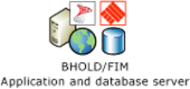
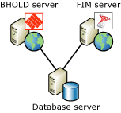
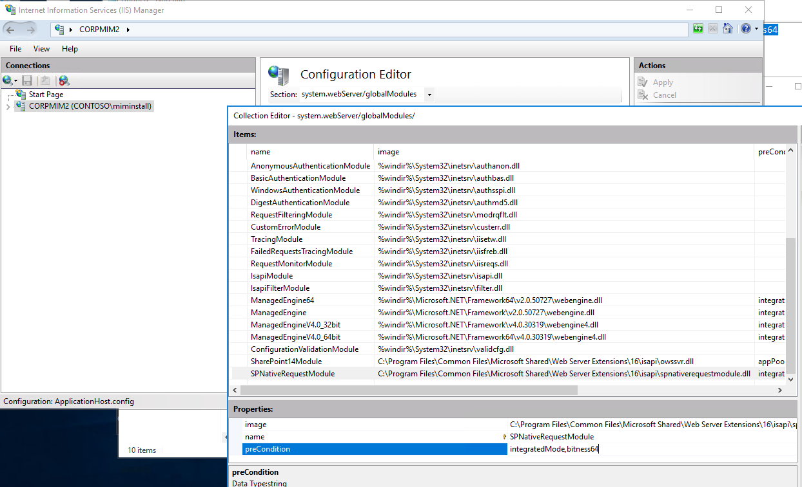

---
# required metadata

title: BHOLD SP1 Installation | Microsoft Docs
description: BHOLD SP1 installation documentation
keywords:
author: billmath
ms.author: billmath
manager: daveba
ms.date: 01/27/2023
ms.topic: article
ms.prod: microsoft-identity-manager

ms.assetid:


---
# Microsoft BHOLD Suite Installation Guide

Microsoft® BHOLD Suite  is a collection of applications that, when used with Microsoft Identity Manager 2016 SP2 (MIM), adds effective role management and attestation to MIM. Microsoft BHOLD Suite SP1 consists of the following modules:

- BHOLD Core
- Access Management Connector
- BHOLD Reporting
- BHOLD Attestation


> [!NOTE]
> **Applies To**: Microsoft Identity Manager 2016 SP2 or later.  The BHOLD Model Generator, BHOLD Analytics and BHOLD FIM Integration modules will be removed from BHOLD, as these modules have a dependency on Microsoft Silverlight, which will reach the [end of support](https://support.microsoft.com/windows/silverlight-end-of-support-0a3be3c7-bead-e203-2dfd-74f0a64f1788) on October 12, 2021.

BHOLD is not recommended for new deployments.  Azure AD now provides [access reviews](/azure/active-directory/governance/access-reviews-overview), which replaces the BHOLD attestation campaign features, and entitlement management, which replaces the access assignment features.

## What this document covers

This document explains how to plan your BHOLD deployment to meet your business needs and install each BHOLD module. For each module, relevant hardware, infrastructure, and software requirements, preinstallation network configuration, information required during setup, and postinstallation steps, if any, are detailed.

## Pre-requisite knowledge

This document assumes that you have a basic understanding of how to install software on server computers. It also assumes that you have basic knowledge of Active Directory® Domain Services, Forefront or Microsoft Identity Manager (FIM), and Microsoft SQL Server 2012 database software. A description of how to set up and configure dependent technologies such as AD DS and FIM is out of the scope of this documentation. For information about the functions that the Microsoft BHOLD modules perform, see [the Microsoft BHOLD suite concepts guide](https://technet.microsoft.com/library/jj134102(v=ws.10).aspx).

## Audience

This document is intended for IT planners, systems architects, technology decision-makers, consultants, infrastructure planners, and IT personnel who plan to deploy Microsoft BHOLD Suite.

## BHOLD infrastructure considerations

Most often, the BHOLD and FIM are used in a large infrastructure environment. You can tailor your BHOLD and FIM architecture to meet your particular business needs. The following sections provide some possible architectural solutions. This overview is not a comprehensive list of all possible options, but suggests ways you can deploy BHOLD in your network.
 
This section covers the following topics:

- Single-server architecture
- Dual-server architecture
- Two-tier architecture
- SQL Server recommendations

### Single-server architecture

For deployment in small organizations or for development purposes, you can install BHOLD and FIM on the same server as SQL Server and AD DS, as shown in the following figure.
 


When BHOLD Suite SP1 and the FIM Portal are installed together on a single server, you must create different host aliases (CNAME or A records) in DNS for BHOLD and for FIM. This allows separate service principal names (SPNs) to be created for the BHOLD and FIM services. For more information, see [BHOLD Core Installation](https://technet.microsoft.com/library/jj134095(v=ws.10).aspx).
For guidance on installing FIM in a single-server configuration, see [Common Configuration for Getting Started Guides](https://technet.microsoft.com/library/ff575965.aspx) in the Microsoft TechNet Library.

### Dual-server architecture

Installing BHOLD Core and FIM on separate servers provides greater performance and flexibility for medium-size organizations that do not require a more complex deployment, such as that provided by multitier architectures. The following figure shows BHOLD and FIM installed on their own servers; the FIM server is also running SQL Server to provide database services to BHOLD and FIM. The FIM Synchronization Service running on the FIM server synchronizes changes between the FIM and BHOLD databases.

### Two-tier architecture

In most environments, especially those where performance is important, you should run the BHOLD Suite SP1, FIM, and SQL Server on separate servers (two-tier architecture). With a two-tier architecture, memory and CPU resources are dedicated for each tier. The following illustration shows one possible way to configure a two-tier architecture. The FIM Synchronization Service running on the FIM server synchronizes changes between the FIM and BHOLD databases.



### SQL Server recommendations

If you are deploying BHOLD in a large organization, it is highly recommended that you follow these guidelines for setting up the Microsoft SQL Server database:

- Deploy SQL Server on a server separate from any FIM or BHOLD services.
- Isolate the log file from the data file at the physical disk level.
- If you are using RAID to provide storage redundancy, use RAID level 10 (1+0). Do not use RAID level 5.
- Be sure to configure the correct settings when using more than 2 GB of physical memory for the server running SQL Server.

For more information about SQL Server best practices, see [Storage Top 10 Best Practices](/previous-versions/sql/sql-server-2005/administrator/cc966534(v=technet.10)?redirectedfrom=MSDN) in the Microsoft TechNet Library.

### Trusted certificates list update

Windows can be configured to validate certificate chains prior to starting a service. On such systems, a service cannot start if the executable code of the service was signed with a certificate that is not in the trusted certificates list (TCL) of the server. The Microsoft BHOLD Suite SP1 software is code signed using a code signing certificate chain that originates with the Microsoft Root Certificate Authority 2010 certificate.
Windows can be configured to retrieve root certificates from Microsoft over an Internet connection. On a disconnected system, however, Windows Server includes only those certificates that were present in the root program at a time before Windows was released. In releases of Windows Server prior to Windows Server 2010, these certificates will not include the root certificate needed for validating the BHOLD Suite SP1 code signing certificate chain. If you intend to install one or more Microsoft BHOLD Suite SP1 modules on a system that might not have an up-to-date TCL, you must download and install the root-update package, or use Group Policy to install the root-update package, before installing a BHOLD Suite SP1 module. For more information, see [Windows root certificate program members](https://support.microsoft.com/kb/931125).

### Installing BHOLD Suite SP1 on Windows Server 2012/2016 Required Step 



If you install BHOLD Suite SP1 on Windows Server 2012 or 2016, the BHOLD web pages will not be available until you modify the applicationHost.config file located in ```C:\Windows\System32\inetsrv\config```. In the ```<globalModules>``` section, add ```preCondition="bitness64``` to the entry that begins ```<add name="SPNativeRequestModule"``` so that it reads as follows:

```<add name="SPNativeRequestModule" image="C:\Program Files\Common Files\Microsoft Shared\Web Server Extensions\15\isapi\spnativerequestmodule.dll" preCondition="bitness64"/>```

After editing and saving the file, run the iisreset command to reset the IIS server.


## Upgrading BHOLD Suite

You cannot upgrade an existing BHOLD Suite installation. Instead, you must uninstall an existing BHOLD Suite installation before you can update BHOLD modules. If you have an existing BHOLD role model, you can upgrade the BHOLD database and use it when you install the updated BHOLD Core module. For more information, see [Replacing BHOLD Suite with BHOLD Suite SP1](https://technet.microsoft.com/library/jj874043(v=ws.10).aspx).


## Next steps

- [BHOLD developer reference](../reference/mim2016-bhold-developer-reference.md)
- [BHOLD version history](../reference/version-bhold-history.md)
