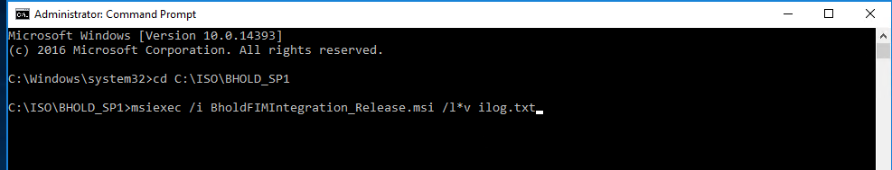
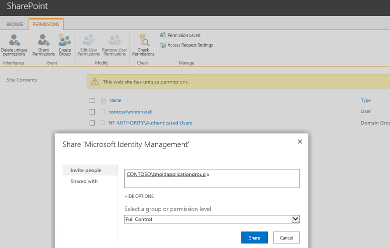

---
# required metadata

title: BHOLD FIM/MIM integration installation | Microsoft Docs
description: BHOLD integration module add self-service role management to MIM and FIM
keywords:
author: billmath
ms.author: billmath
manager: daveba
ms.date: 09/12/2017
ms.topic: article
ms.prod: microsoft-identity-manager

ms.assetid:


---
# BHOLD FIM/MIM Integration Installation

The BHOLD FIM Integration module adds self-service role management to Microsof Identity Manager, making it possible for users to request additional roles and enforcing who can take on those roles. The BHOLD FIM Integration module extends the FIM Portal to make it easy to manage users’ roles as part of overall FIM administration. This topic describes how you must configure your network infrastructure to enable you to install and use the BHOLD FIM Integration module. It also covers how to install the BHOLD FIM Integration module and configuration that is required after you install the BHOLD FIM Integration module.

## BHOLD FIM Integration installation requirements

The BHOLD FIM Integration module extends the FIM Portal and FIM Service to allow users to manage their roles within the FIM Portal. For this reason, it is essential that the BHOLD Core module and the necessary FIM features be installed and configured before installing the BHOLD FIM Integration module.
The following are the software components that must be present on the computer before you can install the BHOLD FIM Integration module:

- Microsoft Identity Manager 2016 Portal and Service
- Microsoft Silverlight 3 or later
- Internet information Services and ASP.NET
- Microsoft Silverlight Tools

In addition, the BHOLD Core and Access Management Connector modules must already be deployed on a server in the environment, and FIM must be configured with one or more BHOLD management agents. For information about installing and configuring the BHOLD Core module, see [BHOLD Core Installation](https://technet.microsoft.com/library/jj134095(v=ws.10).aspx). For information about installing and using the Access Management Connector module, see [Access Management Connector Installation](https://technet.microsoft.com/library/jj874042(v=ws.10).aspx) and [Test Lab Guide: BHOLD Access Management Connector](https://technet.microsoft.com/library/jj853085(v=ws.10).aspx).

> [!IMPORTANT]
> The name of the FIM service database must be FIMService. BHOLD FIM Integration setup will fail if FIM was not installed with the default FIM service database name.

## Before you begin

Before you begin to install the BHOLD FIM Integration module, you must create a BHOLD directory in the root directory of the C: disk drive (C:\BHOLD).

In addition, you need to be prepared to provide the information that the BHOLD FIM Integration Setup wizard requires to complete the installation. The following worksheet will help you record that information so you will be ready to supply it when it is needed.

### BHOLDFim Account settings

| **Item**                            | **Description**                                                                                                                                                                                                               | **Value**                                                                                                                                                                                                                                                                                                            |
|-------------------------------------|-------------------------------------------------------------------------------------------------------------------------------------------------------------------------------------------------------------------------------|----------------------------------------------------------------------------------------------------------------------------------------------------------------------------------------------------------------------------------------------------------------------------------------------------------------------|
| **Use Security Provider on Domain** | When selected, specifies that Active Directory Domain Services security will control access to BHOLD Core.                                                                                                                    | Select the check box. **Important:** The installation will fail if this check box is not selected.                                                                                                                                                                                                                   |
| **Domain**                          | Specifies the domain containing the **service account** that you created when installing BHOLD Core. For more information, see [BHOLD Core Installation](https://technet.microsoft.com/library/jj134095(v=ws.10).aspx). | The domain name is supplied automatically by the wizard. Change the name only if it is incorrect. **Important:** Specify the domain name by using the NetBIOS (short) name, not the fully qualified domain name (FQDN). For example, if the FQDN of the domain is fabrikam.com, specify the domain name as FABRIKAM. |
| **Username**                        | Specifies the logon name of the BHOLD Core service user account.                                                                                                                                                              | Write the user account name here:                                                                                                                                                                                                                                                                                    |
| **Password**                        | Specifies the password of the service user account.                                                                                                                                                                           | Write the password here: **Important:** Be sure to keep this password in a hidden, secure location.                                                                                                                                                                                                                  |

### FIM Service settings

| **Item**            | **Description**                                                                                                                                                                                                                               | **Value**                                                                                           |
|---------------------|-----------------------------------------------------------------------------------------------------------------------------------------------------------------------------------------------------------------------------------------------|-----------------------------------------------------------------------------------------------------|
| **User**            | Specifies the logon name of an account with administrator privileges for FIM. Microsoft strongly recommends that you do not use the account associated with the root user in BHOLD Core (by default, the account used to install BHOLD Core). | Write the user account name here:                                                                   |
| **Password**        | Specifies the password of the FIM administrator user account.                                                                                                                                                                                 | Write the password here: **Important:** Be sure to keep this password in a hidden, secure location. |
| **FIM Database**    | Specifies the name of the FIM Service database.                                                                                                                                                                                               | FIMService                                                                                          |
| **Website IP/Port** | Specifies the name or IP address of the FIM Portal server and the website port.                                                                                                                                                               | Write the server name or address and port here:                                                     |

### BHOLD Core connection

| **Item**               | **Description**                                                                                                                                                                                                                                                                                                                                                                               | **Value**                                                                                           |
|------------------------|-----------------------------------------------------------------------------------------------------------------------------------------------------------------------------------------------------------------------------------------------------------------------------------------------------------------------------------------------------------------------------------------------|-----------------------------------------------------------------------------------------------------|
| **Domain**             | Specifies the name of the domain of the account specified in **User**, below. Specify the domain in NetBIOS (short) format.                                                                                                                                                                                                                                                                   | Write the user account domain name here?                                                            |
| **User**               | Specifies the logon name of the account of **a BHOLD user that is a supervisor** of all users and roles and has permission to link and unlink user roles. Microsoft strongly recommends that you do not use the account associated with the root user in BHOLD Core (by default, the account used to install BHOLD Core). This account can be the same account that you use to connect to FIM | Write the user account name here:                                                                   |
| **Password**           | Specifies the password of the user account specified in **User**.                                                                                                                                                                                                                                                                                                                             | Write the password here: **Important:** Be sure to keep this password in a hidden, secure location. |
| **IP/Machine Address** | Specifies the IP address of the BHOLD Core website server. Do not use the server name.                                                                                                                                                                                                                                                                                                        | Write the IP address here:                                                                          |
| **Port number**        | Specifies the port number of the BHOLD Core website.                                                                                                                                                                                                                                                                                                                                          | Write the port number here:                                                                         |

## BHOLD FIM Integration setup

To install the BHOLD FIM Integration module, log on as a member of the Domain Admins group, download the following file and run it as administrator on the server that you intend to install the BHOLD FIM Integration module on:

- BholdFIMIntegration<em>\<Version\></em>\_Release.msi

Replace *\<Version\>* with the version number of the BHOLD FIM Integration release that you are installing.

To run the program file as an administrator, right-click the file and then click **Run as administrator**.



## Post installation tasks

After installing BHOLD FIM Integration, you must configure Microsoft SharePoint to give the BHOLD service account site-owner permissions. Also, if the FIM Portal is configured to use Secure Sockets Layer (SSL) security, you must modify files that contain references to the addresses of BHOLD pages added to the FIM Portal.

### Configuring SharePoint

To function properly, BHOLD FIM Integration requires the BHOLD service account to have site-member permissions in Microsoft SharePoint.

### To grant site-member permissions to the BHOLD service account

1.  Log on to the server running BHOLD FIM Integration with administrator privileges.

2.  Click **Start**, and then click **Internet Exporer**.

3.  In the address bar, type <https://localhost> if SharePoint is configured to use SSL security, otherwise type <http://localhost>.

4.  On the left side of the **Team Site** page, click **People and Groups**.

5.  Under **Groups** click **Team Site Members**, and in the center-pane toolbar, click **New**, and then click **Add Users**.

6.  On the **Add Users: Team Site** page, in **Users/Groups**, type BHOLDApplicationGroup, and then click the Check Names button under the **Users/Groups** box. The group name should resolve to include the domain name.

7.  Click **Give users permissions directly**, select **Full Control – Has full control**, and then click **OK**.

8.  Verify that BHOLDApplicationGroup is listed in **Permissions: Team Site**, and then close Internet Explorer.



### Configuring BHOLD to support SSL

If the FIM Portal is configured to use SSL security, you must modify files on the FIM server so that links to BHOLD pages will open. The files are located in the following folder: ```C:\Program Files\Common Files\Microsoft Shared\Web Server Extensions\12\TEMPLATE\LAYOUTS\BHOLD```.

The following table lists the files and the original and changed versions of the
strings to be edited.

| **File**                  | **Original string**                                                                                                                   | **Changed String**                                                                                                                                |
|---------------------------|---------------------------------------------------------------------------------------------------------------------------------------|---------------------------------------------------------------------------------------------------------------------------------------------------|
| Analytics.aspx            |   http://<BHOLD_Server>/bhold/Analytics/index_fim.html | https://<BHOLD_Server_FQDN>/bhold/Analytics/index_fim.html       |
| AttestationCampaigns.aspx |    http://<BHOLD_Server>/bhold/Attestation/Campaigns.aspx?hideMenu=1 | https://<BHOLD_Server_FQDN>/bhold/Attestation/Campaigns.aspx?hideMenu=1 | 
| AttestationMain.aspx      |  http://<BHOLD_Server>/bhold/Attestation/Dashboard.aspx?hideMenu=1        | https://<BHOLD_Server_FQDN>/bhold/Attestation/Dashboard.aspx?hideMenu=1 |
| Reporting.aspx            | http://<BHOLD_Server>/bhold/Reporting/index_fim.html |  https://<BHOLD_Server_FQDN>/bhold/Reporting/index_fim.html |
| Selfservice.aspx          | RoleExchangePoint=http://\<*FIM_Server*\>: \<*FIM_Port*\>/BHOLD/RoleExchangePoint/ BHOLDRoleExchangePoint.svc,TransportMode=Transport | RoleExchangePoint=https://\<*FIM_Server_FQDN*\>: \<*FIM_SSL_Port\>*\>/BHOLD/RoleExchangePoint/ BHOLDRoleExchangePoint.svc,TransportMode=Transport |

Where:

-   *\<BHOLD_Server\>* specifies the name of the BHOLD server as found in the original version of the file

-   *\<MIM_Server\>* specifies the name of the FIM server as found in the original version of the file

-   *\<BHOLD_Server_FQDN\>* specifies the fully qualified domain name (FQDN) of the BHOLD server

-   *\<MIM_Port\>* specifies the port number of the FIM server as found in the original version of the file

-   *\<MIM_Server_FQDN\>* specifies the FQDN of the FIM server

-   *\<MIM_SSL_Port\>* specifies a different port for use with SSL on the FIM server

### Enable approval workflows in BHOLD Core

When FIM and BHOLD are integrated for self-service, the workflows for approvals are run in the FIM Service. This is similar to the workflow model for requests that originate in the FIM Portal, such as when a user submits a request to join a distribution list. There are key differences between BHOLD role workflows and other workflows hosted in the FIM Service, however. In the case of BHOLD, workflow parameters that specify which users must approve a role request originate in BHOLD, rather than being stored in the workflow definitions in the FIM Service database. These parameters are provided to the FIM Service by BHOLD when the first request is made, and an action workflow communicates the results back to BHOLD Core.

BHOLD selects an approver for a self-service request in one of three ways:

-   **Line manager as approver: role-based selection for an organizational unit (OrgUnit)** If a role has an attribute named roletype that is set to Approver or Escalator, and if that role is linked to one or more users in the context of an OrgUnit, requests from users within that OrgUnit must be approved by one  of the users that is linked to the role with the Approver or Escalator roletype.

-   **Line manager as approver: attribute-based selection for an OrgUnit**
    Each OrgUnit can have one or more attributes that specify the aliases of users who can approve role assignments for other users in the OrgUnit. These attributes are named approver1, approver2, and so on. When a user in the OrgUnit requests a role assignment, BHOLD routes the request (through FIM) to the users specified by the OrgUnit approver attributes. If an OrgUnit does not have any of these attributes set, BHOLD checks parent OrgUnits up to the root OrgUnit.

-   **Role manager as approver: attribute-based selection for a role** A role can have one or more attributes (also named approver1, and so on) that specify the aliases of users who can approve the assignment of the role. When a user requests to be assigned a role that has these approver attributes set, BHOLD routes the request to the users specified by the attributes.

If an approver for a self-service role request is not specified by one of these methods, by default BHOLD automatically assigns the role without requiring approval. For this reason, immediately after installing BHOLD FIM Integration, you should configure the root OrgUnit with the alias of an approver, such as the root account. This will prevent a user from unintentionally being granted a role before a more comprehensive approval policy can be implemented.

#### To configure an approver for the root OrgUnit

1.  Log on to the BHOLD Core server as an administrator.

2.  Click **Start**, and then click **Internet Explorer**.

3.  In the Internet Explorer address bar, type
    <http://localhost:5151/bhold/core>, and then press the Enter key.

4.  On the BHOLD Core home page, under **Attribute def**, click **Attribute types**.

5.  On the **Attribute type** page, click **Add**.

6.  On the **Add attribute type page**, in **Identity**, type approver1, in the **Data type** list, click **AlphaNumeric**, in **Maximum length**, type 255, in **List of values**, click **No**, in **English**, type Approver 1, click **OK**, and then click **Done**.

7.  In the left pane, under **Attribute def** click **Attribute type sets**.

8.  On the **Attribute type sets** page, click **Add**.

9.  On the **Add attribute type set** page, in **Description**, type OrgUnit Attributes, and then click **OK**.

10. On the **OrgUnit Attributes** page, expand **Attribute types**, and then click **Modify**.

11. In the **Attribute type** list, click **approver1**, click **Add**, and then click **Done**.

12. In the left pane, click **Object types**.

13. On the **Object types** page, click **OrgUnit**.

14. On the **Object type/OrgUnit** page, expand **Attribute type sets**, and then click **Modify**.

15. On the **Link attribute type set/OrgUnit** page, in **Order**, type 10, in the **Attribute type set** list, click **OrgUnit Attributes**, click **Add**, and then click **Done**.

16. In the left pane, under **Model**, click **Organizational units**.

17. On the **Organizational units** page, click **root**.

18. On the **Organizational unit/root** page, click **Modify**.

19. On the **Modify organizational unit attributes/root** page, in **Approver**, type the domain and user name of the user who will approve role-assignment     requests, in the format *\<domain\>*\\*\<user\>*, where *\<domain\>* is the NetBIOS (short) domain name and *\<user\>* is the user’s logon name.
20. Click **OK**.

> [!IMPORTANT]
> The domain and user name must match the default alias of a user in the BHOLD Core database.

As an alternative to specifying an approver for organizational units, you can specify an approver for proposed roles in the BHOLD Core database. To do so, create the approver1 attribute, add it to an attribute typeset associated with the Role object type, and then modify each proposed role to specify the approver.

To provide better workflow security, in addition to approvers, you should designate additional approval modes and users by creating and populating the following attributes for OrgUnits and roles:

- escalator<em>\<n\></em>

- owner<em>\<n\></em>

- securityOfficer<em>\<n\></em>

- notification<em>\<n\></em>

where *\<n\>* indicates an optional numerical suffix to provide multiple attributes of the same type.

### Verify approval workflows configured in the FIM Service

BHOLD FIM Integration installation creates sets, workflow definitions, and Management Policy Rules (MPRs) to the FIM Service. If you had customized your FIM deployment to change the sets of administrators or the sets of users who can make requests, you should ensure that the MPRs reference the correct user sets.

> [!NOTE]
> Before users of the FIM Portal can use the self-service features provided by BHOLD, the users’ accounts must be synchronized into the BHOLD database from the FIM Synchronization Service. In particular, there must be a user record in the BHOLD Core database and in the FIM Service database for each user who can make a self-service request or is specified as an approver or escalator for self-service requests.

## Next steps

- For information about installing FIM Portal and other FIM features, see [Planning and Architecture](https://technet.microsoft.com/library/ee808044.aspx) in the Microsoft Forefront Technical Library.
- [BHOLD installation guide](bhold-installation-guide.md)
- [BHOLD developer reference](../reference/mim2016-bhold-developer-reference.md)
- [BHOLD version history](../reference/version-bhold-history.md)
