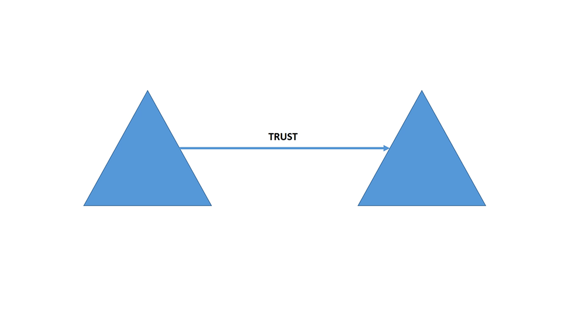

---
# required metadata

title: FIM Updates | Microsoft Identity Manager
description:
keywords:
author: kgremban
manager: stevenpo
ms.date: 04/28/2016
ms.topic: article
ms.prod: windows-server-2012
ms.service: microsoft-identity-manager
ms.technology: active-directory-domain-services
ms.assetid: 50d639ef-d3c1-4ccc-b088-dcb5590fdcab

# optional metadata

#ROBOTS:
#audience:
#ms.devlang:
ms.reviewer: mwahl
ms.suite: ems
#ms.tgt_pltfrm:
#ms.custom:

---

# FIM Updates
## Forefront Identity Manager (FIM) Updates
### Update List
[Update 10/23/2015: Description title](#update-10/23/2015--description-title)
[Update 10/24/2015: Description title](#update-10/24/2015--description-title)
[Update 10/25/2015: Description title](#update-10/25/2015--description-title)
[Update 10/26/2015: Description title](#update-10/26/2015--description-title)

### Update 10/23/2015: Description title
This is where the description of the update and directives to the reader go.
### Update 10/24/2015: Description title
This is where the description of the update and directives to the reader go.
### Update 10/25/2015: Description title
This is where the description of the update and directives to the reader go.
### Update 10/26/2015: Description title
This is where the description of the update and directives to the reader go.
### Here is a test aninmation

