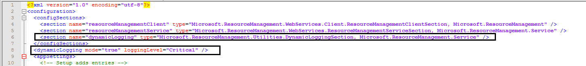
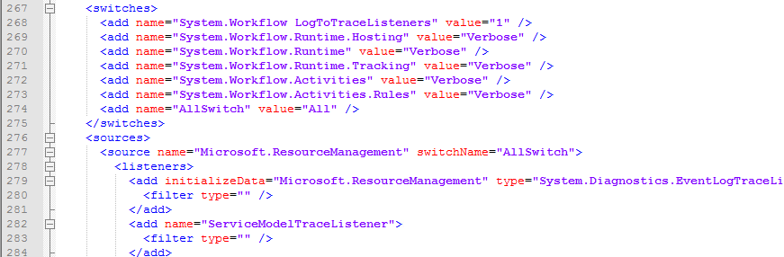
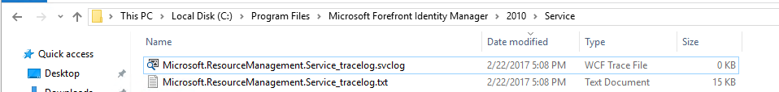
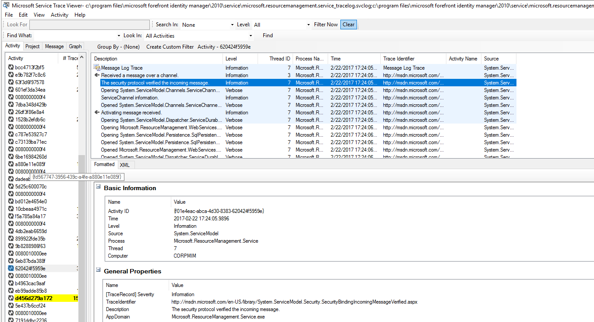

---

title: MIM Service Dynamic Logging | Microsoft Docs
description: Enable MIM service dynamic logging without having to restart the management service
author: billmath
ms.author: billmath
ms.date: 04/08/2025
ms.topic: article
ms.service: microsoft-identity-manager
---

# MIM 2016 SP1 (4.4.1436.0)  Service Dynamic Logging

In 4.4.1436.0 We have introduced a new logging capability. This enable administrator and support engineers to turn on logging without having to restart the management service.

Once installed you will see the following new line in the Microsoft.ResourceManagement.Service.exe.config  called

*	Line 6: ``<section name="dynamicLogging" type="Microsoft.ResourceManagement.Utilities.DynamicLoggingSection, Microsoft.ResourceManagement.Service" />``
*	Line 8:  ``<dynamicLogging mode="true" loggingLevel="Verbose" />``
*	Line 266 ``</system.diagnostics> ``

Logging levels of the dynamic can be found [here](https://msdn.microsoft.com/library/ms733025(v=vs.110).aspx#Anchor_3)

- Critical = default level service will write only critical events
- Update Line 8 (dynamicLogging mode="true" loggingLevel="Critical") with preferred logging value

Dynamic logging config located at line 266: Microsoft.ResourceManagement.Service.exe.config

By default the logging location will be at the **C:\Program Files\Microsoft Forefront Identity Manager\2010\Service, The FIM Service account will need write permission to this location to generate the dynamic log.

> [!NOTE]
>  In case of unexpected errors (syntax errors in config file Microsoft.ResourceManagement.Service.exe.config or other mistakes) corresponding error message will be written into file Microsoft.ResourceManagement.Service.exe_Emergency.log under following path %TMP% or %TEMP% or %USERPROFILE% (first that exists).  
> 1. "%TMP%\Microsoft.ResourceManagement.Service.exe_Emergency.log"
> 2. "%TEMP%\Microsoft.ResourceManagement.Service.exe_Emergency.log"
> 3. "% USERPROFILE %\Microsoft.ResourceManagement.Service.exe_Emergency.log"

To view the trace, you can use the [Service Trace viewer tool](https://msdn.microsoft.com//library/aa751795(v=vs.110).aspx)

 

## Updates: Build 4.5.x.x or greater

In build 4.5.x.x We have revised the logging feature to specify the default logging level is **“Warning”**. The service writes messages in two files (“00” and “01” indexes are added before extension). The files are located in “C:\Program Files\Microsoft Forefront Identity Manager\2010\Service” directory. When file exceeds max size the service starts write in another file. If another file exists, it will be overwritten. Default max size of the file is 1 GB. To change default max size, it is necessary to add **“maxOutputFileSizeKB”** parameter with value of max file size in KB into listener (see example below) and restart MIM Service. When the service is started, it appends logs in more recent file (if limit of space is exceeded it overwrite the oldest file). 

> [!NOTE] 
> As the service check file size before the message is written, the size of file could be greater than max size for size of one message. by default the size of the logs can be approximately 6 GB (three >listeners with two file for one GB size).

> [!NOTE] 
> The service account should have permissions to write in >“C:\Program Files\Microsoft Forefront Identity Manager\2010\Service” >directory. In case the service account doesn’t have such rights, the >files will not be created.

Example how to set max file size to 200 MB (200 * 1024 KB) for svclog files and 100 MB *(100 * 1024 KB) for txt files

`<add initializeData="Microsoft.ResourceManagement.Service_tracelog.svclog" type="Microsoft.IdentityManagement.CircularTraceListener.CircularXmlTraceListener, Microsoft.IdentityManagement.CircularTraceListener, PublicKeyToken=31bf3856ad364e35" name="ServiceModelTraceListener" traceOutputOptions="LogicalOperationStack, DateTime, Timestamp, ProcessId, ThreadId, Callstack" maxOutputFileSizeKB="204800">`
