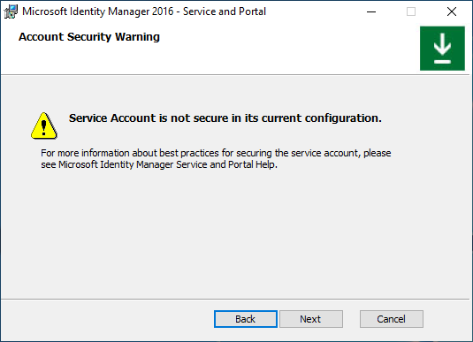

---
# required metadata

title: Install Microsoft Identity Manager Service and Portal for Microsoft Entra ID P1 or P2 customers
description: Get the steps to configure and install MIM Service and Portal for Microsoft Identity Manager 2016 SP2 in organizations licensed for Microsoft Entra ID P1 or P2
services: active-directory
documentationcenter: ''
keywords: MIM
author: billmath
ms.author: billmath
ms.date: 03/18/2021
ms.topic: article
ms.service: microsoft-identity-manager
ms.tgt_pltfrm: na
ms.workload: identity

ms.assetid: b0b39631-66df-4c5f-90c9-a1774346f816

ms.reviewer: mwahl
ms.suite: ems
ms.custom:
  - sfi-ga-nochange
  - sfi-image-nochange

---
# Install MIM 2016 with SP2: MIM Service and Portal for Microsoft Entra ID P1 or P2 customers

> [!div class="step-by-step"]
> [« MIM Synchronization Service](install-mim-sync.md)
> [Synchronize databases »](install-mim-sync-ad-service.md)
 
> [!NOTE]
> This walkthrough uses sample names and values from a company called Contoso. Replace these with your own. For example:
> - MIM Service and Portal server name - **mim.contoso.com**
> - SQL server name - **contosoagl.contoso.com**
> - Service account name - **svcMIMService**
> - Domain name - **contoso**
> - Password - <strong>Pass@word1</strong>

## Before you begin

- This guide is intended for installing MIM Service in organizations licensed for Microsoft Entra ID P1 or P2. If your organization does not have Microsoft Entra ID P1 or P2 or is not using Microsoft Entra ID, then you will need to instead follow [installation guide for Volume License edition of MIM](install-mim-service-portal.md).
- Ensure you have Microsoft Entra user credentials with enough permissions to validate that your tenant subscription includes Microsoft Entra ID P1 or P2 and can create app registrations.
- If you plan to use Office 365 application context authentication, you will need to run a script to register the MIM Service application in Microsoft Entra ID and grant the MIM Service permissions to access a MIM Service mailbox in Office 365. Save the script output as you will need the resulting application ID and secret later during the installation.

## Deployment options

Choices in deployment depend on two criteria:

- Whether the MIM Service will be running as a regular Windows service account or as a group-managed service account (gMSA)
- Whether the MIM Service will be sending email through an Exchange Server, Office 365, or an SMTP server

Available deployment options:

- Option A: Regular service account + Exchange Server
- Option B: Regular service account + Office 365 basic authentication
- Option C: Regular service account + Office 365 application context authentication
- Option D: Regular service account + SMTP
- Option E: Regular service account + no mail server
- Option F: Group-managed service account + Exchange Server
- Option G: Group-managed service account + Office 365 basic authentication
- Option H: Group-managed service account + Office 365 application context authentication
- Option I: Group-managed service account + no mail server

> [!NOTE]
> The SMTP server option only works with regular service accounts and Integrated Windows Authentication, and does not permit use of the Outlook add-in for approvals.

## Preparing for Office 365 Application context authentication

Starting from build 4.6.421.0, in addition to basic authentication, the MIM Service supports application context authentication to Office 365 mailboxes. End of support for basic authentication was announced on 20 September 2019, therefore it is recommended to use application context authentication for sending notifications and collecting approval responses.

Application context authentication scenario requires you to register an application in Microsoft Entra ID, create a client secret to be used instead of a password and grant this application permission to access the MIM Service mailbox. The MIM Service will be using this application ID and this secret to access its mailbox in Office 365. You can register your application in Microsoft Entra ID either using a script (recommended) or manually.

<a name='registering-application-using-azure-ad-portal'></a>

### Registering application using Microsoft Entra admin center

1. Sign in to [Microsoft Entra admin center](https://portal.azure.com) with Global Administrator role.
1. Navigate to Microsoft Entra blade and copy your Tenant ID from *Overview* section and save it.
1. Navigate to *App registrations* section and click **New Registration** button.
1. Give your application a name, for example, *MIM Service mailbox client access*, and click **Register**.
1. After your application is registered, copy the *Application (client) ID* value and save it.
1. Navigate to *API Permissions* section and revoke *User.Read* permission by clicking on three dots right to permission name and choosing **Remove Permission**. Confirm that you want to remove this permission.
1. Click on **Add a permission** button. Switch to *APIs my organization uses* and type *Office*. Select *Office 365 Exchange Online* and *Application permissions* type. Type *full* and select **full_access_as app**. Click **Add Permissions** button.
1. You will see permission added and that admin consent is not granted. Click on **Grant admin consent** button next to *Add a permission* button.
1. Navigate to *Certificates and secrets* and choose to add **New client secret**. If you select an expiration time for the secret, you will have to reconfigure MIM Service closer to its expiration date to use another secret. If you do not plan to rotate application secrets, select *Never*. Give your secret a name, for example, *MIM Service* and click **Add** button. You will see the secret value displayed in the portal. Copy this value (not secret ID) and save it.
1. Now that you have Tenant ID, Application ID and application secret needed by installer you can continue with MIM Service and Portal installation. In addition, you may want to restrict access of your newly registered application to MIM Service mailbox only (*full_access_as_app* grants access to all mailboxes in your organization). To do so, you need to create an [application access policy](https://developer.microsoft.com/microsoft-365/blogs/application-access-policy-support-added-to-exchange-web-services/). Follow [this guide](/powershell/module/exchange/new-applicationaccesspolicy?view=exchange-ps&preserve-view=true) to restrict access of your application to the MIM Service mailbox only. You will need to create a distribution or mail-enabled security group and add your MIM Service mailbox into that group. Then run a PowerShell command and provide your Exchange Online administrator credentials:

    ```PowerShell
    New-ApplicationAccessPolicy `
    -AccessRight RestrictAccess `
    -AppId "<your application ID from step 5>" `
    -PolicyScopeGroupId <your group email> `
    -Description "Restrict MIM Service app to members of this group"
    ```

### Registering application using a PowerShell script

*Create-MIMMailboxApp.ps1* script could be found either in *Scripts.zip/Scripts/Service and Portal* or in *Service and Portal.zip\Service and Portal\Program Files\Microsoft Forefront Identity Manager\2010\Service\Scripts*.

Unless your MIM Service mailbox is hosted in a national or government cloud, the only parameter you need to pass to the script is MIM Service email, for example, MIMService@contoso.onmicrosoft.com.

From a PowerShell window start Create-MIMMailboxApp.ps1 with -MailboxAccountEmail \<email\> parameter and provide MIM Service email.

```PowerShell
./Create-MIMMailboxApp.ps1 -MailboxAccountEmail <MIM Service email>
```

When asked for credentials, provide your Microsoft Entra Global Administrator credentials to register an application in Azure.

Once the application is registered, another popup will ask for Exchange Online Administrator credentials to create an application access policy.

After successful application registration your script output should look like this:


There is a 30-second delay after the application is registered and a browser window is opened to avoid replication issues. Provide your Microsoft Entra tenant administrator credentials and accept a request to grant your application access to the MIM Service mailbox. The popup window should look like this:


After you click Accept button, you will be redirected to Microsoft 365 admin center. You can close the browser window and check the script output.

Copy ApplicationId, TenantId, and ClientSecret values as they will be needed by the MIM Service and Portal installer.

## Deploying MIM Service and Portal

### Common deployment steps

1. Create a temporary directory to keep installer logs in, for example, c:\miminstall.

1. Start elevated command prompt, navigate to MIM Service installer binaries folder and run:

   ```cmd
   msiexec /i "Service and Portal.msi" /lvxi* c:\miminstall\log.txt
   ```

   In the welcome screen, click **Next**.

   

1. Review the End-User License Agreement and click **Next** if you accept the license terms.

   

1. National clouds are isolated instances of Azure. Select which Azure Cloud instance your tenant is hosted in and click **Next**.

   

   Organizations which are not using a national or government cloud should select the global instance, Microsoft Entra ID.

   

1. After selecting the appropriate cloud, the installer will ask you to authenticate to that tenant. In the popup window, provide Microsoft Entra user credentials of a user in that tenant to validate your tenant subscription level. Type your Microsoft Entra username and click **Next**.

   

   Type your password and click **Sign In**.

   

   If the installer is unable to locate a subscription to Microsoft Entra ID P1 or another subscription, which includes Microsoft Entra ID P1 or P2, you will see a popup error. Check that the username is for the correct tenant and look at the installer log file for more information.

1. Once the license check is complete, select MIM Service and Portal components to install and click **Next**.

   

1. Provide the SQL server and database name. Choose to reuse the existing database if upgrading from previous MIM versions. If installing using SQL failover cluster or Always-On Availability Groups Listener, provide a cluster or a listener name. Click **Next**.

    

1. If installing MIM using an existing database, a warning appears. Click **Next**.

    

1. Choose a combination of mail server type and authentication method (options A-I, see below)

   
   

   If installing MIM Service using Group-Managed Service Account, then select the corresponding checkbox, otherwise leave this checkbox unchecked. Click **Next**.

   

   If you select incompatible combination of mail server type and authentication method, after you click Next, a popup error appears.

   

### Option A. Regular service account + Exchange Server

1. On the **Configure common services** page select **Exchange Server 2013 or later** and **Integrated Windows Authentication**. Type your Exchange server hostname. Leave **Use Group Managed Service Account** checkbox **unchecked**. Click **Next**.

   

1. If installing MIM Reporting component, type System Center Service Manager management server name and click **Next**.

   

1. If installing MIM Reporting component in TLS 1.2 only environment with System Center Service Manager 2019, choose a certificate trusted by SCSM Server with MIM server hostname in certificate’s subject, otherwise choose to generate a new self-signed certificate. Click **Next**.

   

1. Type MIM Service account name and password, domain name and MIM Service mailbox SMTP address. Click **Next**.

    

### Option B. Regular service account + Office 365 basic authentication

1. On the **Configure common services** page select **Office 365** mail service and **Basic Authentication**. Leave **Use Group Managed Service Account** checkbox **unchecked**. Click **Next**.

   

1. If installing MIM Reporting component, type System Center Service Manager management server name and click **Next**.

   

1. If installing MIM Reporting component in TLS 1.2 only environment with System Center Service Manager 2019, choose a certificate trusted by SCSM Server with MIM server hostname in certificate’s subject, otherwise choose to generate a new self-signed certificate. Click **Next**.

   

1. Type MIM Service account name and password, domain name, MIM Service’s Office 365 mailbox SMTP address and MIM Service mailbox Microsoft Entra password. Click **Next**.

    

### Option C. Regular service account + Office 365 application context authentication

1. On the **Configure common services** page select **Office 365** mail service and **Application Context Authentication**. Leave **Use Group Managed Service Account** checkbox **unchecked**. Click **Next**.

   

1. If installing MIM Reporting component, type System Center Service Manager management server name and click **Next**.

   

1. Provide the Microsoft Entra Application ID, Tenant ID and Client Secret, that were generated by a script earlier. Click **Next**.

   

   If installer fails to validate the Application ID or Tenant ID, an error appears:

   

   If installer fails to access MIM Service mailbox, another error appears:

   

1. If installing MIM Reporting component in TLS 1.2 only environment with System Center Service Manager 2019, choose a certificate trusted by SCSM Server with MIM server hostname in certificate’s subject, otherwise choose to generate a new self-signed certificate. Click **Next**.

   

1. Type MIM Service account name and password, domain name and MIM Service’s Office 365 mailbox SMTP address. Click **Next**.

    

### Option D. Regular service account + SMTP server

1. On the **Configure common services** page select **SMTP**  and **Integrated Windows Authentication**. Type SMTP server hostname. Leave **Use Group Managed Service Account** checkbox **unchecked**. Click **Next**.

   

1. If installing MIM Reporting component, type System Center Service Manager management server name and click **Next**.

   

1. If installing MIM Reporting component in TLS 1.2 only environment with System Center Service Manager 2019, choose a certificate trusted by SCSM Server with MIM server hostname in certificate’s subject, otherwise choose to generate a new self-signed certificate. Click **Next**.

   

1. Type MIM Service account name and password, domain name and MIM Service SMTP address. Click **Next**.

    

### Option E. Regular service account + no mail server

1. On the **Configure common services** page select **None** server type. Leave **Use Group Managed Service Account** checkbox **unchecked**. Click **Next**.

   

1. If installing MIM Reporting component, type System Center Service Manager management server name and click **Next**.

   

1. If installing MIM Reporting component in TLS 1.2 only environment with System Center Service Manager 2019, choose a certificate trusted by SCSM Server with MIM server hostname in certificate’s subject, otherwise choose to generate a new self-signed certificate. Click **Next**.

   

1. Type MIM Service account name and password, domain name. Click **Next**.

    

### Option F. Group-managed service account + Exchange Server

1. On the **Configure common services** page select **Exchange Server 2013 or later** and **Integrated Windows Authentication**. Type your Exchange server hostname. Enable **Use Group Managed Service Account** option. Click **Next**.

   

1. If installing MIM Reporting component, type System Center Service Manager management server name and click **Next**.

   

1. If installing MIM Reporting component in TLS 1.2 only environment with System Center Service Manager 2019, choose a certificate trusted by SCSM Server with MIM server hostname in certificate’s subject, otherwise choose to generate a new self-signed certificate. Click **Next**.

   

1. Type MIM Service group-managed service account name, domain name, MIM Service mailbox SMTP address and password. Click **Next**.

    

### Option G. Group-managed service account + Office 365 basic authentication

1. On the **Configure common services** page select **Office 365** mail service and **Basic Authentication**. Enable **Use Group Managed Service Account** option. Click **Next**.

   

1. If installing MIM Reporting component, type System Center Service Manager management server name and click **Next**.

   

1. If installing MIM Reporting component in TLS 1.2 only environment with System Center Service Manager 2019, choose a certificate trusted by SCSM Server with MIM server hostname in certificate’s subject, otherwise choose to generate a new self-signed certificate. Click **Next**.

   

1. Type MIM Service group-managed service account name, domain name, MIM Service’s Office 365 mailbox SMTP address and the MIM Service account’s Microsoft Entra password. Click **Next**.

    

### Option H. Group-managed service account + Office 365 application context authentication

1. On the **Configure common services** page select **Office 365** mail service and **Application Context Authentication**. Enable **Use Group Managed Service Account** option. Click **Next**.

   

1. If installing MIM Reporting component, type System Center Service Manager management server name and click **Next**.

   

1. Provide the Microsoft Entra Application ID, Tenant ID and Client Secret, that were generated by a script earlier. Click **Next**.

   

   If installer fails to validate the Application ID or Tenant ID, an error appears:

   

   If installer fails to access MIM Service mailbox, another error appears:

   

1. If installing MIM Reporting component in TLS 1.2 only environment with System Center Service Manager 2019, choose a certificate trusted by SCSM Server with MIM server hostname in certificate’s subject, otherwise choose to generate a new self-signed certificate. Click **Next**.

   

1. Type MIM Service group-managed service account name, domain name and MIM Service Office 365 mailbox SMTP address. Click **Next**.

    

### Option I. Group-managed service account + no mail server

1. On the **Configure common services** page select **None** server type. Enable **Use Group Managed Service Account** option. Click **Next**.

   

1. If installing MIM Reporting component, type System Center Service Manager management server name and click **Next**.

   

1. If installing MIM Reporting component in TLS 1.2 only environment with System Center Service Manager 2019, choose a certificate trusted by SCSM Server with MIM server hostname in certificate’s subject, otherwise choose to generate a new self-signed certificate. Click **Next**.

   

1. Type MIM Service group-managed service account name, domain name. Click **Next**.

    

### Common deployment steps. Continuation

1. If MIM Service account was not restricted to deny local logons a warning message appears. Click **Next**.

   

1. Type MIM Synchronization Server hostname. Type MIM Management Agent account name. If you are installing MIM Synchronization Service using Group-Managed Service Account, then add the dollar sign to the account name, for example, *contoso\MIMSyncGMSAsvc$*. Click **Next**.

    

1. Type MIM Service Server hostname. In a case a load-balancer is used to balance MIM Service payload, provide the name of the cluster. Click **Next**.

    

1. Provide SharePoint site collection name. Make sure to replace http://localhost with a proper value. Click **Next**.

    

   A warning appears. Click **Next**.

    

1. If installing Self-Service Password Registration website (not needed if you are using Microsoft Entra ID for password reset), specify a URL MIM clients will be redirected to after logon. Click **Next**.

    

1. Select the checkbox to open ports 5725 and 5726 in the firewall, and the checkbox to grant all authenticated users access to MIM Portal. Click **Next**.

   

1. If installing Self-Service Password Registration website (not needed if you are using Microsoft Entra ID for password reset), set the application pool account name and its password, the host name and the port for the website. Enable the *Open port in firewall* option if needed. Click **Next**.

   

   A warning will appear – read it and click **Next**.

   

1. In the next MIM Password Registration Portal configuration screen, type the MIM Service Server Address for the Password Registration Portal and select whether this website will be accessible by intranet users. Click **Next**.

   

1. If installing Self-Service Password Reset website, set the application pool account name and its password, the host name and the port for the website. Enable the *Open port in firewall* option if needed. Click **Next**.

   

   A warning will appear – read it and click **Next**.

   

1. In the next MIM Password Reset Portal configuration screen, type the MIM Service Server Address for the Password Reset Portal and select whether this website will be accessible by intranet users. Click **Next**.

   

1. When all pre-installation definitions are ready, click **Install** to begin installing the selected **Service and Portal** components.
   

## Post-installation tasks

After installation completes, verify that the MIM Portal is active.

1. Launch Internet Explorer and connect to the MIM Portal on `http://mim.contoso.com/identitymanagement`. Note, that there may be a short delay on the first visit to this page.
    - If necessary, authenticate as a user, that installed MIM Service and Portal, to Internet Explorer.

1. In Internet Explorer, open the **Internet Options**, change to the **Security** tab, and add the site to the **Local intranet** zone if it is not already there. Close the **Internet Options** dialog.

1. In Internet Explorer, open the **Settings**, change to the **Compatibility view settings** tab, and uncheck **Display Intranet Sites in Compatibility view** checkbox. Close **Compatibility View** dialog.

1. Enable non-administrators to access MIM Portal.

   1. Using Internet Explorer, in **MIM Portal**, click on **Management Policy Rules**.
   1. Search for the management policy rule, **User management: Users can read attributes of their own**.
   1. Select this management policy rule, uncheck **Policy is disabled**.
   1. Click **OK** and then click **Submit**.

> [!NOTE]
> Optional: At this point you can install MIM add-ins and extensions and language packs.
 
> [!div class="step-by-step"]  
> [« MIM Synchronization Service](install-mim-sync.md)
> [Synchronize databases »](install-mim-sync-ad-service.md)
