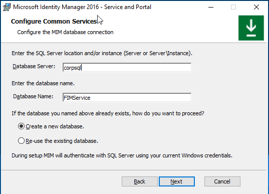
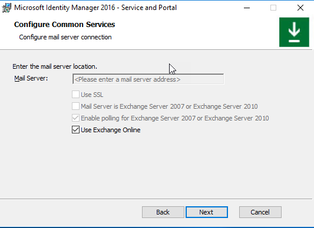
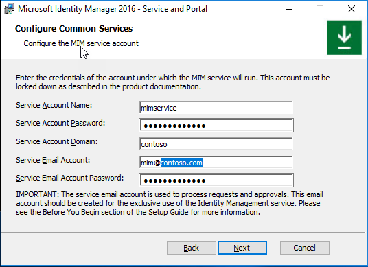
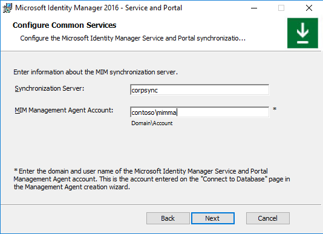
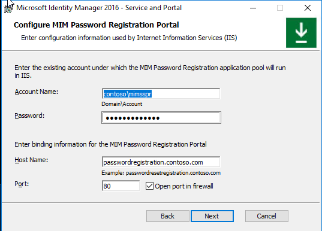
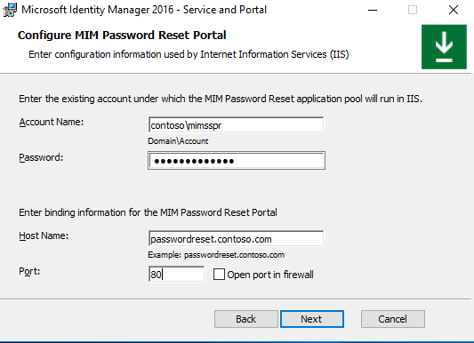
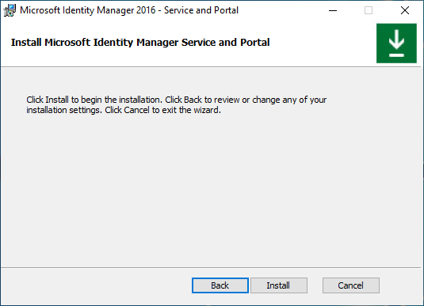

---
# required metadata

title: Install Microsoft Identity Manager Service and Portal
description: Get the steps to configure and install MIM Service and Portal for Microsoft Identity Manager 2016
services: active-directory
documentationcenter: ''
keywords: MIM
author: henrymbuguakiarie
ms.author: henrymbuguakiarie
ms.date: 03/18/2021
ms.topic: article
ms.service: microsoft-identity-manager
ms.tgt_pltfrm: na
ms.workload: identity

ms.assetid: b0b39631-66df-4c5f-80c9-a1774346f816

ms.reviewer: mwahl
ms.suite: ems
ms.custom: sfi-image-nochange

---
# Install MIM 2016: MIM Service and Portal

> [!div class="step-by-step"]
> [« MIM Synchronization Service](install-mim-sync.md)
> [Synchronize databases »](install-mim-sync-ad-service.md)
 
> [!NOTE]
> This walkthrough uses sample names and values from a company called Contoso. Replace these with your own. For example:
> - Domain controller name - **mimservername**
> - Domain name - **contoso**
> - Password - <strong>Pass@word1</strong>
> - Service account name - **MIMService**

## Before you begin

- This guide is intended for installing Volume License edition of MIM. If your organization has Microsoft Entra ID P1 or P2 subscription or is using Microsoft Entra ID, then you will need to instead follow [the guide for MIM Service in organizations licensed for Microsoft Entra ID P1 or P2](install-mim-service-portal-azure-ad-premium.md).

## Configure MIM Service and Portal for installation

1. Run the **MIM Service and Portal installer** from the unpacked **Service and Portal** sub-folder.

2. In the welcome screen, click **Next**.

3. Read the End-User License Agreement and click **Next** if you accept the license terms.

4. In the **MIM Customer Experience Improvement Program** screen, click **Next**.

5. When selecting component features for this deployment, make sure to include the MIM Service (except for MIM Reporting) and MIM Portal features. You can also select the MIM Password Reset Portal and MIM Password Change Notification Service.

6. On the **Configure the MIM database connection** page, choose **Create a new database**.

    

7. On the **Configure mail server connection**, enter the name of your Exchange server as **Mail Server** or you can use **O365 Mailbox**. If you do not have a mail server configured, use **localhost** as the mail server name and uncheck the top two checkboxes. Click **Next**.
    >[!NOTE]
    >MIM 2016 SP2 and later: if you are using Group Managed Service Accounts, you must check **Use different user for Exchange** checkbox even if you do not plan to use Exchange.
    
    >[!NOTE]
    >When **Use Exchange Online** option is selected, in order to enable MIM Service to process approval responses from the MIM Outlook Add-On, you need to set the registry key HKLM\SYSTEM\CurrentControlSet\Services\FIMService value of PollExchangeEnabled to 1 after installation.

    

8. Specify that you want to generate a new self-signed certificate, or select the relevant certificate.

9. Specify the Service Account name to use, for example *MIMService*, and the Service Account password, for example <em>Pass@word1</em>, your Service Account domain, for example *contoso* and the Service Email Account, for example *contoso*.
    >[!NOTE]
    >MIM 2016 SP2 and later: if you are using Group Managed Service Accounts, you will need to ensure the  the **$** character is at the end of the Service Account Name, e.g. MIMService$, and leave the Service Account Password field empty.

    

10. Note that a warning may appear that the Service Account is not secure in its current configuration.

11. Accept the defaults for the Synchronization Server location, and specify the MIM Management Agent account as *contoso\MIMMA*.
    >[!NOTE]
    >MIM 2016 SP2 and later: if you plan to use MIM Synchronization Service Group Managed Service Account in MIM Sync, and enable 'Use MIM Sync account' feature, then enter MIM Synchronization Service gMSA name as the MIM MA account, e.g. *contoso\MIMSync$*.

    

12. Specify *CORPIDM* (this computer's name) as MIM Service server address for the MIM Portal.

13. Specify `http://mim.contoso.com` as the SharePoint site collection URL.

14. If not using Microsoft Entra ID for password reset, specify `http://passwordregistration.contoso.com` as the Password Registration  URL port 80, recommend updating later with SSL cert on 443.

15. If not using Microsoft Entra ID for password reset, specify `http://passwordreset.contoso.com` as the Password Reset URL port 80, recommend updating later with SSL cert on 443.

16. Select the checkbox to open ports 5725 and 5726 in the firewall, and the checkbox to grant all authenticated users access to MIM Portal.

## Configure MIM Password Registration Portal (optional, if not using Microsoft Entra ID for SSPR)

1. Set the service account name for SSPR Registration to *contoso\MIMSSPR* and its password to <em>Pass@word1</em>.

2. Specify *passwordregistration.contoso.com* as the Host Name for MIM Password Registration, and set the port to **80**. Enable the **Open port in firewall** option.

   

3. A warning will appear – read it and click **Next**.

4. In the next MIM Password Registration Portal configuration screen, specify  *mim.contoso.com* as the MIM Service Server Address for the Password Registration Portal.

## Configure MIM Password Reset Portal (optional)

1. Set the service account name for SSPR Registration to *Contoso\MIMSSPR* and its password to <em>Pass@word1</em>.

2. Specify  *passwordreset.contoso.com* as the Host Name for MIM Password Reset Portal, and set the port to **80**. Enable the **Open port in firewall** option.

   

3. A warning will appear – read it and click **Next**.

4. In the next MIM Password Registration Portal configuration screen, specify *mim.contoso.com* as the MIM Service Server Address for the Password Reset Portal.

## Install MIM Service and Portal

When all pre-installation definitions are ready, click **Install** to begin installing the selected **Service and Portal** components.
   

## Post-installation tasks

After installation completes, verify that the MIM Portal is active.

1. Launch Internet Explorer and connect to the MIM Portal on `http://mim.contoso.com/identitymanagement`. Note, that there may be a short delay on the first visit to this page.
    - If necessary, authenticate as a user, that installed MIM Service and Portal, to Internet Explorer.

1. In Internet Explorer, open the **Internet Options**, change to the **Security** tab, and add the site to the **Local intranet** zone if it is not already there. Close the **Internet Options** dialog.

1. In Internet Explorer, open the **Settings**, change to the **Compatibility view settings** tab, and uncheck **Display Intranet Sites in Compatibility view** checkbox. Close **Compatibility View** dialog.

1. Enable non-administrators to access MIM Portal.

   1. Using Internet Explorer, in **MIM Portal**, click on **Management Policy Rules**.
   1. Search for the management policy rule, **User management: Users can read attributes of their own**.
   1. Select this management policy rule, uncheck **Policy is disabled**.
   1. Click **OK** and then click **Submit**.

> [!NOTE]
> Optional: At this point you can install MIM add-ins and extensions and language packs.

> [!div class="step-by-step"]  
> [« MIM Synchronization Service](install-mim-sync.md)
> [Synchronize databases »](install-mim-sync-ad-service.md)
