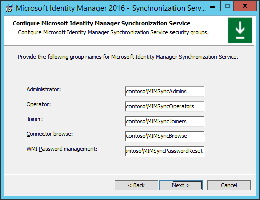

---
# required metadata

title: Install the Microsoft Identity Manager Sync Service | Microsoft Docs
description: Get started with the MIM 2016 components by installing and configuring the Synchronization Service.
keywords:
author: billmath
ms.author: barclayn
manager: mbaldwin
ms.date: 04/26/2018
ms.topic: get-started-article
ms.service: microsoft-identity-manager
ms.technology: security
ms.assetid: 2585e9c5-ce34-46c7-bdcf-8c08773901dc

# optional metadata

#ROBOTS:
#audience:
#ms.devlang:
ms.reviewer: mwahl
ms.suite: ems
#ms.tgt_pltfrm:
#ms.custom:

---

# Install MIM 2016: MIM Synchronization Service

>[!div class="step-by-step"]
[« Exchange Server](prepare-server-exchange.md)
[MIM Service and Portal »](install-mim-service-portal.md)

> [!NOTE]
> This walkthrough uses sample names and values from a company called Contoso. Replace these with your own. For example:
> - Domain controller name - **corpdc**
> - Domain name - **contoso**
> - MIM Service Server name - **corpservice**
> - MIM Sync Server name - **corpsync**
> - SQL Server name - **corpsql**
> - Password - **Pass@word1**

To install Microsoft Identity Manager 2016 components, first set up the installation package.

1. Sign in as *contoso\miminstall* to the server you are using for identity management syncronization server **corpsync**.

2. Unpack the MIM installation package or mount the MIM image DVD.

## Install MIM 2016 SP1 Synchronization Service

1. In the unpacked MIM installation folder, navigate to the **Synchronization Service** folder.

2. Run the **MIM Synchronization Service installer**. Follow the guidelines of the installer and complete the installation.

3. In the welcome screen – click **Next**.

    

4. Review the license terms and click **Next** to accept them.

5. On the **Custom Setup** screen click **Next**.

    

6.  In the Sync Service database configuration screen, select:

    1.  The SQL Server is located on: **This computer**.

    2.  The SQL Server instance is: **The default instance**.

    

7.  Configure the Sync Service Account according to the account you created earlier:

    1.  Service account: *MIMSync*

    2.  Password: *Pass@word1*

    3.  Service Account Domain or local computer name: *contoso*

    

8.  Provide MIM Sync Service installer with the relevant security groups:

    1. Administrator = *contoso\MIMSyncAdmins*

    2. Operator= *contoso\MIMSyncOperators*

    3. Joiner = *contoso\MIMSyncJoiners*

    4. Connector Browse = *contoso\MIMSyncBrowse*

    5. WMI Password Management= *contoso\MIMSyncPasswordReset*

    

9. In the security settings screen, check **Enable firewall rules for inbound RPC communications**, and click **Next**.

10. Click **Install** to begin the installation of MIM Sync Service.

    1. A warning concerning the MIM Sync service account may appear – click **OK**.

    2. MIM Sync Service will install.

    3. A notice on creating a backup for the encryption key appears – click **OK**, then select a folder to store the encryption key backup.

        

    4. When the installer successfully completes the installation, click **Finish**.

    5. You need to sign out and sign in for the group membership changes to take effect. Click **Yes** to sign out.

>[!div class="step-by-step"]  
[« Exchange Server](prepare-server-exchange.md)
[MIM Service and Portal »](install-mim-service-portal.md)
