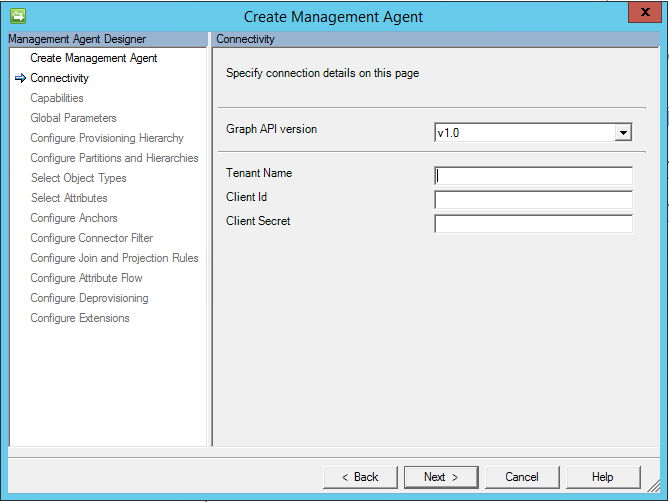

The Microsoft Identity Manager management agent for Microsoft Graph (Public Preview)
---
Summary 
=======

The [Microsoft Identity Manager management agent for Microsoft Graph (preview)](http://go.microsoft.com/fwlink/?LinkId=717495)
enables additional integration scenarios for Azure AD Premium customers.

[Azure AD Connect](https://www.microsoft.com/en-us/download/details.aspx?id=47594) integrates on-premises directories with Azure AD and ensures users have a common identity and consistent authentication across AD DS, Office 365, Azure, and SaaS applications integrated with Azure AD, by synchronizing users and groups from on-premises directories to Azure AD.   This management agent can be deployed for specialized identity and access management operations beyond user and group synchronization to Azure AD.  This management agent surfaces in the MIM sync metaverse additional objects obtained from the [Microsoft Graph API](https://developer.microsoft.com/en-us/graph/) v1 and beta. 

Scenarios Covered
=================

B2B account lifecycle management
--------------------------------

The initial scenario in preview for the Microsoft Identity Manager management agent for Microsoft Graph (preview) is external user AD account lifecycle
management. In this scenario, an organization has invited guests into their Azure AD directory, and wishes to give those guests access to on-premises Windows
Integrated Authentication or Kerberos-based applications, via the [Azure AD application](https://docs.microsoft.com/en-us/azure/active-directory/active-directory-application-proxy-publish)
proxy or other gateway mechanisms. The Azure AD application proxy requires each user to have their own AD DS account, for identification and delegation purposes

Additional scenarios may be added in the future and [Documented here](./microsoft-identity-manager-2016-graph-b2b-scenario.md)

Determining your deployment topology
====================================

Preparing to use the Management Agent(MA) for Microsoft Graph
=============================================================

Authorizing the MA to manage your Azure AD directory
----------------------------------------------------

1.  Graph management agent requires Web app / API application to be created in AzureAD.

Picture 1. New application registration

2.  Open the created application and use Application ID like Client Id on the MA’s connectivity page:

Picture 2. Application ID

2.  Generate new Client Secret by opening All settings -\> Keys. Set some Key description and select needful Duration. Save changes. A secret
    value will not be available after leaving the page.

Picture 3. New Client Secret

3.  Add “Microsoft Graph API” to the application by opening “Required permissions.”

Picture 4. Add new API

The following permission should be added to “Microsoft Graph API”:

| Operation with object | Permission required                                                                  | Permission type |
|-----------------------|--------------------------------------------------------------------------------------|-----------------|
| Import Group          | Group.Read.All or Group.ReadWrite.All                                                | Application     |
| Import User           | User.Read.All or User.ReadWrite.All or Directory.Read.All or Directory.ReadWrite.All | Application     |

More details about required permissions could be found [here](https://developer.microsoft.com/en-us/graph/docs/concepts/permissions_reference)

1.  Create connector with the Application ID and generated Client Secret.Each management agent should have its own application in AzureAD to avoid running import in parallel for the same application. Graph connector supports the following list of object types:

-   User

    -   Full/Delta Import

    -   Export (Add, Update, Delete)

-   Group

    -   Full/Delta Import

    -   Export (Add, Update, Delete)

The list of attribute types that are supported:

-   Edm.Boolean

-   Edm.String

-   Edm.DateTimeOffset (string in connector space)

-   microsoft.graph.directoryObject (reference in connector space to any of the
    supported objects)

-   microsoft.graph.contact

Multivalued attributes (Collection) are also supported for any of a type form the list earlier.

Graph connector uses ‘id’ attribute for anchor and DN for all objects.

Rename is not supported at this time, because GraphAPI does not allow to object change to ‘id’ attribute for existed object.

Access token lifetime
=====================

A Graph application requires an access token for accessing the GraphAPI. A connector
will request a new access token for each import iteration (import iteration depends on
page size). For example:

-   AzureAD contains 10000 objects

-   Page size configured in connector is 5000

In this case there will be two iterations during the import, each of them will return 5 000 objects to Sync. So, a new access token will be request twice.

Note that during the export a new access token will be requested for each object that must be added/updated/deleted.

Installing the connector
========================

Before you use the Connector, make sure you have the following on the
synchronization server: Microsoft .NET 4.5.2 Framework or later Microsoft
Identity Manager 2016 SP1 Must use hotfix 4.4.3671.0 or later KB3092178.

For MIM2016 and FIM2010R2, the Connector is available as a download from the
Microsoft Download Center.

Connector configuration
=======================

Connectivity page:

Picture 5. Connectivity page

The connectivity page (Picture 1) contains the Graph API version that is used
and tenant name. The Client Id and Client Secret represent the Application ID and
Key value of the WebAPI application that must be created in AzureAD.

Global Parameters page:

Picture 6. Global Parameters page

Global parameters page contains the following settings:

DateTime format – format that is used for any attribute with Edm.DateTimeOffset type. All dates are converted to string by using that format during the import. Set format is applied for any attribute, which
saves date.

HTTP timeout (seconds) – timeout in seconds that will be used during each HTTP call to WebAPI application.

Force change password for created user at next sign – this option is used for new user that will be created during the export. If option is enabled, then [forceChangePasswordNextSignIn](https://developer.microsoft.com/en-us/graph/docs/api-reference/v1.0/resources/passwordprofile) property will be set to true, otherwise it will be false.

Troubleshooting
===============

**Enable logs**

If there are any issues in Graph, then logs could be used to localize the problem. The Graph connector uses the same source as in all Generic connectors. So, traces could be enabled in [the same way like for Generic connectors](https://microsoft.sharepoint.com/teams/adiamteam/_layouts/15/doc.aspx?sourcedoc=%7B5057233e-00ac-4a7a-a77c-74a7f46404ff%7D&action=edit&uid=%7B5057233E-00AC-4A7A-A77C-74A7F46404FF%7D&ListItemId=146&ListId=%7BA828DF40-8EB4-4FC2-95BD-9E5421DD2CE7%7D&env=prodbubble). Or just by adding the following to miiserver.exe.config (inside system.diagnostics/sources section):

\<source name="ConnectorsLog" switchValue="Verbose"\>

\<listeners\>

>   \<add initializeData="ConnectorsLog"
>   type="System.Diagnostics.EventLogTraceListener, System, Version=4.0.0.0,
>   Culture=neutral, PublicKeyToken=b77a5c561934e089"
>   name="ConnectorsLogListener" traceOutputOptions="LogicalOperationStack,
>   DateTime, Timestamp, Call stack" /\>

\<remove name="Default" /\>

\</listeners\>

\</source\>

Please note: if ‘Run this management agent in a separate process’ enabled then
dllhost.exe.config should be used instead of miiserver.exe.config.

**Access token expired error**

Connector might return HTTP error 401 Unauthorized, message “Access token has
expired.”:

Picture 7. “Access token has expired.” Error

The cause of this issue might be configuration of access token lifetime from the
Azure side. By default, the access token expires after 1 hour. To increase expiration time, please see [this article](https://docs.microsoft.com/en-us/azure/active-directory/active-directory-configurable-token-lifetimes).

Example of this using [Azure AD PowerShell Module Public Preview release](https://www.powershellgallery.com/packages/AzureADPreview)

New-AzureADPolicy -Definition \@('{"TokenLifetimePolicy":{"Version":1,
**"AccessTokenLifetime":"5:00:00"**}}') -DisplayName
"OrganizationDefaultPolicyScenario" -IsOrganizationDefault \$true -Type
"TokenLifetimePolicy"

Next Steps
----------

- [Versioning, support, and breaking change policies for Microsoft Graph](https://developer.microsoft.com/en-us/graph/docs/concepts/versioning_and_support)
- [Download Microsoft Identity Manager management agent for Microsoft Graph (preview)](http://go.microsoft.com/fwlink/?LinkId=717495)

Scenario Specific Supported Guides
----------------------------------
[MIM B2B End to End Deployment]( ~/microsoft-identity-manager-2016-graph-b2b-scenario.md)
