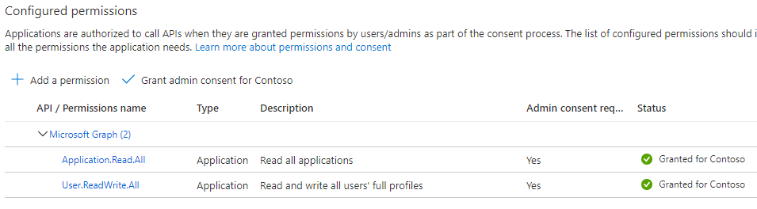
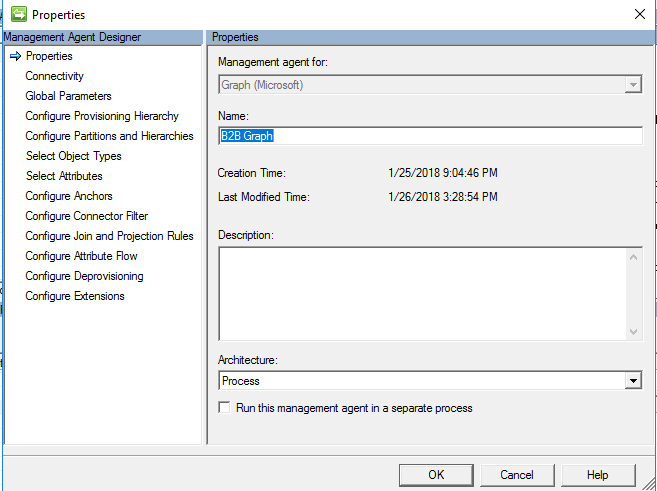
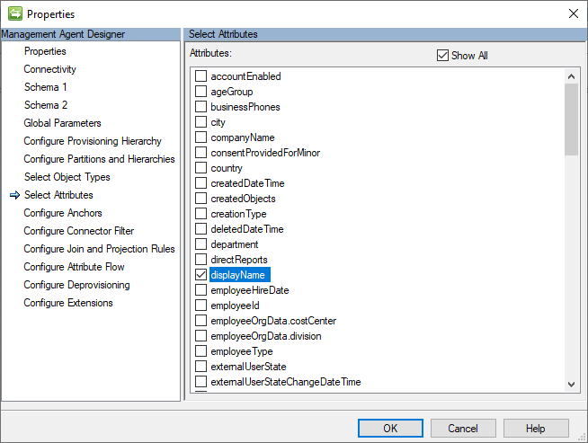

# Microsoft Identity Manager connector for Microsoft Graph


## Summary 


The [Microsoft Identity Manager connector for Microsoft Graph](https://go.microsoft.com/fwlink/?LinkId=717495)
 enables additional integration scenarios for Microsoft Entra ID P1 or P2 customers.  It surfaces in the MIM sync metaverse additional objects obtained from the [Microsoft Graph API](https://developer.microsoft.com/en-us/graph/) v1 and beta.

## Scenarios covered


### B2B account lifecycle management


The initial scenario for the Microsoft Identity Manager connector for Microsoft Graph is as a connector to help automate AD DS account lifecycle
management for external users. In this scenario, an organization is synchronizing employees to Microsoft Entra ID from AD DS using Microsoft Entra Connect, and has also invited guests into their Microsoft Entra directory. Inviting a guest results in an external user object being in that organization's Microsoft Entra directory, which isn't in that organization's AD DS. Then the organization wishes to give those guests access to on-premises Windows Integrated Authentication or Kerberos-based applications, via the [Microsoft Entra application proxy](/azure/active-directory/app-proxy/application-proxy-add-on-premises-application)
or other gateway mechanisms. The Microsoft Entra application proxy requires each user to have their own AD DS account, for identification and delegation purposes.  

To learn how to configure MIM sync to automatically create and maintain AD DS accounts for guests, after reading the instructions in this article, continue reading in the article [Microsoft Entra business-to-business (B2B) collaboration with MIM 2016 and the Microsoft Entra application proxy](~/microsoft-identity-manager-2016-graph-b2b-scenario.md).  That article illustrates the sync rules needed for the connector.

### Other identity management scenarios


The connector can be used for other specific identity management scenarios involving create, read, update and delete of user, group and contact objects in Microsoft Entra ID, beyond user and group synchronization to Microsoft Entra ID. When evaluating potential scenarios, please keep in mind: this connector can't be operated in a scenario, which would result in a data flow overlap, actual or potential synchronization conflict with a Microsoft Entra Connect deployment.  [Microsoft Entra Connect](https://www.microsoft.com/en-us/download/details.aspx?id=47594) is the recommended approach to integrate on-premises directories with Microsoft Entra ID, by synchronizing users and groups from on-premises directories to Microsoft Entra ID.  Microsoft Entra Connect has many more synchronization features and enables scenarios such as password and device writeback, which aren't possible for objects created by MIM. If data is being brought into AD DS, for example, ensure that it's excluded from Microsoft Entra Connect attempting to match those objects back to the Microsoft Entra directory.  Nor can this connector be used to make changes to Microsoft Entra objects, which were created by Microsoft Entra Connect.


## Preparing to use the Connector for Microsoft Graph

<a name='authorizing-the-connector-to-retrieve-or-manage-objects-in-your-azure-ad-directory'></a>

### Authorizing the connector to retrieve or manage objects in your Microsoft Entra directory


1.  The connector requires a Web app / API application to be created in Microsoft Entra ID, so that it can be authorized with appropriate permissions to operate on Microsoft Entra objects through Microsoft Graph.

    
    

    Picture 1. New application registration

2.  In the Azure portal, open the created application, and save the Application ID, as a Client ID to use later on the MA’s connectivity page:

3.  Generate new Client Secret by opening *Certificates & secrets*. Set some Key description and select the maximum duration. Save changes and retrieve the client secret. The client secret value won't be available to view again after leaving the page.

    

    Picture 2. New Client Secret

4.  Grant proper 'Microsoft Graph' permissions to the application by opening "API Permissions"

    
    Picture 3. Add new API

    Select 'Microsoft Graph' Application permissions.
    

    Revoke all unneeded permissions.

    

    The following permission should be added to the application to allow it to use the “Microsoft Graph API”, depending on the scenario:

    | Operation with object | Permission required                                                                  | Permission type |
    |-----------------------|--------------------------------------------------------------------------------------|-----------------|
    | *Schema detection*      | *`Application.Read.All`*                                                               | Application     |
    | Import Group          | `Group.Read.All` or `Group.ReadWrite.All`                                                | Application     |
    | Import User           | `User.Read.All`, `User.ReadWrite.All`, `Directory.Read.All` or `Directory.ReadWrite.All` | Application     |

    More details about required permissions could be found in the [permissions reference](/graph/permissions-reference).

>[!NOTE]
>**Application.Read.All** permission is mandatory for schema detection and must be granted regardless of the object type connector will be working with.

5. Grant admin consent for selected permissions.
    


## Installing the connector


6.  Before you install the Connector, make sure you have the following on the synchronization server: 

 - Microsoft .NET 4.6.2 Framework or later
 - Microsoft Identity Manager 2016 SP2, and must use hotfix 4.4.1642.0 [KB4021562](https://www.microsoft.com/en-us/download/details.aspx?id=55794) or later.

7. The connector for Microsoft Graph, in addition to other connectors for Microsoft Identity Manager 2016 SP2, is available as a download from the
[Microsoft Download Center](https://www.microsoft.com/en-us/download/details.aspx?id=51495).

8.  Restart MIM Synchronization Service.
 
## Connector configuration


9.  In the Synchronization Service Manager UI, select **Connectors** and **Create**.
Select **Graph (Microsoft)**, create a connector and give it a descriptive name.




10. In the MIM synchronization service UI, specify  the Application ID and generated Client Secret. Each management agent configured in MIM Sync should have its own application in Microsoft Entra ID to avoid running import in parallel for the same application.

Picture 4. Connectivity page

The connectivity page (Picture 4) contains the Graph API version that is used
and tenant name. The Client ID and Client Secret represent the Application ID and
Key value of the application that was previously created in Microsoft Entra ID.

The connector defaults to the v1.0 and the login and graph endpoints of the Microsoft Graph global service. If your tenant is in a national cloud, then you'll need to change your configuration to use the [endpoints for the national cloud](/graph/deployments#microsoft-graph-and-graph-explorer-service-root-endpoints).  Note that certain features of Graph that are in the global service might not be available in all of the national clouds.

11. Make any necessary changes on the Global Parameters page:


Picture 5. Global Parameters page

Global parameters page contains the following settings:

- DateTime format – format that is used for any attribute with Edm.DateTimeOffset type. All dates are converted to string by using that format during the import. Set format is applied for any attribute, which
saves date.

 - HTTP timeout (seconds) – timeout in seconds that will be used during each HTTP call to Graph.

 - Force change password for created user at next sign – this option is used for new user that will be created during the export. If option is enabled, then [forceChangePasswordNextSignIn](https://developer.microsoft.com/en-us/graph/docs/api-reference/v1.0/resources/passwordprofile) property will be set to true, otherwise it will be false.

## Configuring the connector schema and operations


12.   Configure the schema.  The connector supports the following list of object types when used with the Graph v1.0 endpoint:

-   User

    -   Full/Delta Import

    -   Export (Add, Update, Delete)

-   Group

    -   Full/Delta Import

    -   Export (Add, Update, Delete)

Additional object types may be visible when you configure the connector to use the Graph beta endpoint.

The list of attribute types that are supported:

-   `Edm.Boolean`

-   `Edm.String`

-   `Edm.DateTimeOffset` (string in connector space)

-   `microsoft.graph.directoryObject` (reference in connector space to any of the
    supported objects)

-   `microsoft.graph.contact`

Multivalued attributes (Collection) are also supported for any of a type from the list above.

The connector uses the ‘`id`’ attribute for anchor and DN for all objects.  Therefore, rename isn't needed, because Graph API doesn't allow an object to change its `id` attribute.


## Access token lifetime


A Graph application requires an access token for accessing the Graph API. A connector
will request a new access token for each import iteration (import iteration depends on
page size). For example:

-   Microsoft Entra ID contains 10000 objects

-   Page size configured in connector is 5000

In this case there will be two iterations during the import, each of them will return 5000 objects to Sync. So, a new access token will be request twice.

During the export a new access token will be requested for each object that must be added/updated/deleted.

## Query filters

Graph API endpoints offer an ability to limit amount of objects returned by GET queries by introducing *$filter* parameter. 

In order to enable the use of query filters to improve full import performance cycle, on the *Schema 1* page of connector properties, enable **Add objects filter** checkbox.


After that, on *Schema 2* page type an expression to be used to filter users, groups, contacts or service principals.


On the screenshot above, the filter *startsWith(displayName,'J')* is set to read only users whose displayName attribute value starts with 'J'.

Make sure that the attribute used in filter expression is selected in connector properties.




For more information about *$filter* query parameter usage, see this article: [Use query parameters to customize responses](/graph/query-parameters#filter-parameter).

>[!NOTE]
>Delta query endpoint currently doesn't offer filtering capabilities, therefore usage of filters is limited to full import only. you'll get an error trying to start delta import run with query filters enabled.

## Troubleshooting


**Enable logs**

If there are any issues in Graph, then logs could be used to localize the problem. So, traces could be enabled in [the same way like for Generic connectors](/archive/technet-wiki/21086.fim-2010-r2-troubleshooting-how-to-enable-etw-tracing-for-connectors). Or just by adding the following to `miiserver.exe.config` (inside `system.diagnostics/sources` section):

```XML
<source name="ConnectorsLog" switchValue="Verbose">
<listeners>
<add initializeData="ConnectorsLog"
type="System.Diagnostics.EventLogTraceListener, System, Version=4.0.0.0,
Culture=neutral, PublicKeyToken=b77a5c561934e089"
name="ConnectorsLogListener" traceOutputOptions="LogicalOperationStack,
DateTime, Timestamp, Callstack" />
<remove name="Default" />
</listeners>
</source>
```
>[!NOTE]
>If ‘Run this management agent in a separate process’ is enabled, then
`dllhost.exe.config` should be used instead of `miiserver.exe.config`.

**Access token expired error**

Connector might return HTTP error 401 Unauthorized, message “Access token has
expired.”:


Picture 6. “Access token has expired.” Error

The cause of this issue might be configuration of access token lifetime from the
Azure side. By default, the access token expires after 1 hour. To increase expiration time, see [this article](/azure/active-directory/develop/active-directory-configurable-token-lifetimes).

Example of this using [Azure AD PowerShell Module Public Preview release](https://www.powershellgallery.com/packages/AzureADPreview)


New-AzureADPolicy -Definition \@('{"TokenLifetimePolicy":{"Version":1,
**"AccessTokenLifetime":"5:00:00"**}}') -DisplayName
"OrganizationDefaultPolicyScenario" -IsOrganizationDefault \$true -Type
"TokenLifetimePolicy"

## Next steps

- [Graph Explorer, great for troubleshooting HTTP call issues]( https://developer.microsoft.com/en-us/graph/graph-explorer)
- [Versioning, support, and breaking change policies for Microsoft Graph](/graph/versioning-and-support)
- [National cloud deployments of Microsoft Graph](/graph/deployments)
- [Download Microsoft Identity Manager connector for Microsoft Graph](https://go.microsoft.com/fwlink/?LinkId=717495)
[MIM B2B End to End Deployment]( ~/microsoft-identity-manager-2016-graph-b2b-scenario.md)
