# Convert Microsoft Identity Manager-specific services to use group Managed Service Accounts

This article is a guide for configuring supported Microsoft Identity Manager services to use group Managed Service Accounts (gMSA). After you've preconfigured your environment, the process of converting to gMSA is easy.

## Prerequisites

- Download and install the following required hotfix: [Microsoft Identity Manager 4.5.26.0 or later](https://docs.microsoft.com/microsoft-identity-manager/reference/version-history).

    Supported services:

    -   Microsoft Identity Manager Synchronization Service (FIMSynchronizationService)
    -   Microsoft Identity Manager Service (FIMService)
    -   Microsoft Identity Manager Password Registration
    -   Microsoft Identity Manager Password Reset
    -   Privileged Access Management (PAM) Monitoring Service (PamMonitoringService)
    -   PAM Component Service (PrivilegeManagementComponentService)

    Unsupported services:

    -   The Microsoft Identity Manager portal is not supported. It is part of the SharePoint environment, and you would need to deploy it in farm mode and [Configure automatic password change in SharePoint Server](https://docs.microsoft.com/sharepoint/administration/configure-automatic-password-change).
    -   All management agents except the Microsoft Identity Manager Service management agent
    -   Microsoft Certificate Management
    -   BHOLD

- For background and general reference information about setting up your environment, see: 

    -   [Group Managed Service Accounts overview](https://docs.microsoft.com/windows-server/security/group-managed-service-accounts/group-managed-service-accounts-overview)  
    -   [New-ADServiceAccount](https://docs.microsoft.com/powershell/module/addsadministration/new-adserviceaccount?view=win10-ps)  

- Before you begin, [create the Key Distribution Services root key](https://technet.microsoft.com/library/jj128430(v=ws.11).aspx) on your Windows domain controller. Keep in mind the following information:  

    - Root keys are used by the Key Distribution Services (KDS) service to generate passwords and other information on domain controllers.
    - Create a root key only once per domain, if it's needed.  
    - Include `Add-KDSRootKey –EffectiveImmediately`. "–EffectiveImmediately" means that it might take up to 10 hours to replicate the root key to all domain controllers. It can take about 1 hour to replicate to two domain controllers. 
    

## Actions to run on the Active Directory Domain controller

1.  Create a group called *MIMSync_Servers*, and add all synchronization servers to it.

    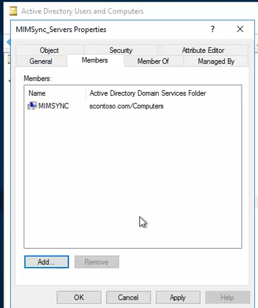

1.  Sign in to Windows PowerShell as a *Domain Admin* with an account that's already joined to the domain, and then run the following command: 

    `New-ADServiceAccount -Name MIMSyncGMSAsvc -DNSHostName MIMSyncGMSAsvc.contoso.com -PrincipalsAllowedToRetrieveManagedPassword "MIMSync_Servers"`

    

    - View details of the gMSA for sync:  
     

    - If you're running Password Change Notification Service (PCNS), update the delegation by running the following command:

        `Set-ADServiceAccount -Identity MIMSyncGMSAsvc -ServicePrincipalNames
        @{Add="PCNSCLNT/mimsync.contoso.com"}`

## Actions to run on the Microsoft Identity Manager Synchronization server

1. In Synchronization Service Manager, back up the encryption key. It will be requested with the change mode installation. Do the following:

    a. On the server that Synchronization Service Manager is installed on, look for the Synchronization Service Key Management tool. The **Export key set** is already selected by default.

    b. Select **Next**. 
    
    c. At the prompt, enter and verify the Microsoft Identity Manager or Forefront Identity Manager (FIM) Synchronization Service account information:

    -   **Account Name**: The name of the Synchronization Service account that's used during the initial installation.  
    -   **Password**: The password of the Synchronization Service account.  
    -   **Domain**: The domain that the Synchronization Service account is a part of.

    d. Select **Next**.

    If you've entered the account information successfully, you have the option to change the destination, or export file location, of the backup encryption key. By default, the export file location is *C:\Windows\system32\miiskeys-1.bin*.

1. Install Microsoft Identity Manager 2016 SP1 or later hotfix, which you can find at the Volume Licensing Service Center or the MSDN Downloads site. After you've completed the installation, save the keyset *miiskeys.bin*.

   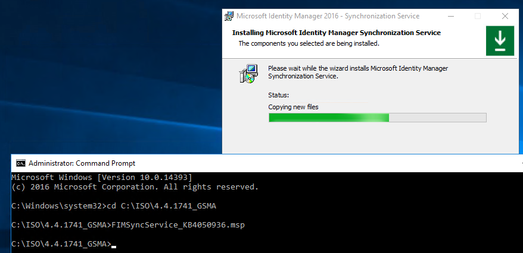

1. Install [hotfix 4.5.2.6.0](https://docs.microsoft.com/microsoft-identity-manager/reference/version-history) or later.

1. After the patch is installed, stop FIM Synchronization Service by doing the following:

   a. In Control Panel, select **Programs and Features** > **Microsoft Identity Manager**.  
   b. On the **Synchronization Service** page, select **Change** > **Next**.  
   c. In the **Maintenance Options** window, select **Configure**.

   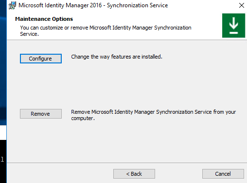

   d. In the **Configure Microsoft Identity Manager Synchronization Service** window, clear the default value in the **Service account** box, and then enter **MIMSyncGMSA$**. Be sure to include the dollar sign ($) symbol, as shown in the following image. Leave the **Password** box empty.

   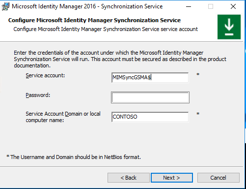

   e. Select **Next** > **Next** > **Install**.  
   f. Restore the keyset from the *miiskeys.bin* file that you saved earlier.

   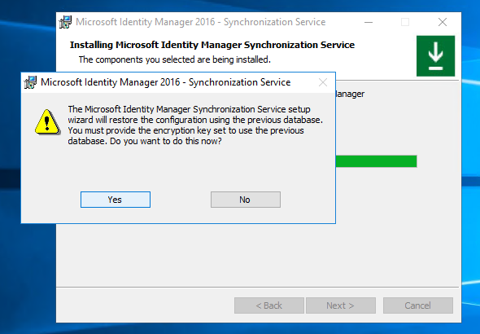

   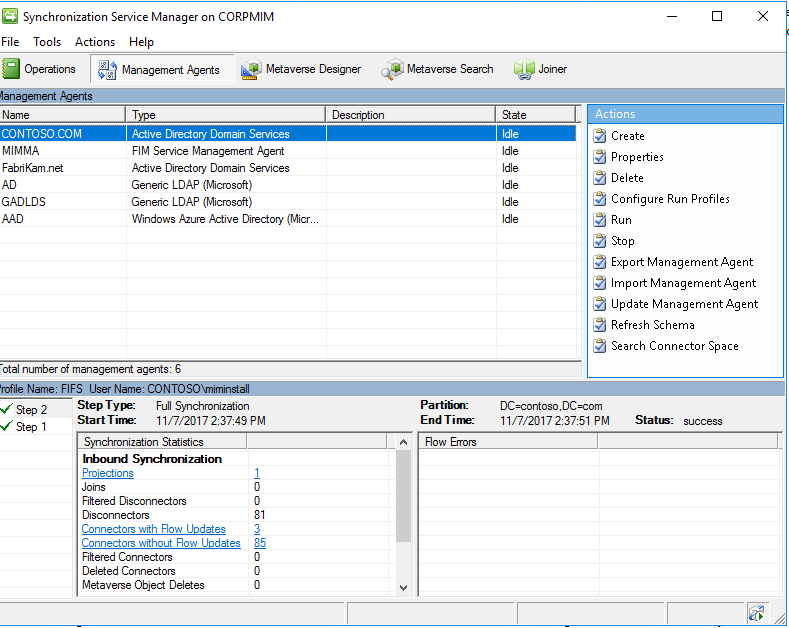

## Microsoft Identity Manager Service

>[!IMPORTANT]
>Follow the instructions in this section carefully when you convert Microsoft Identity Manager service-related accounts to gMSA accounts.

1. Create Group Managed Accounts for Microsoft Identity Manager Service, the PAM Rest API, PAM Monitoring Service, PAM Component Service, the self-service password reset (SSPR) Registration Portal, and the SSPR Reset Portal.

    -   Update the gMSA delegation and service principal name (SPN):

        - `Set-ADServiceAccount -Identity \<account\> -ServicePrincipalNames
            @{Add="\<SPN\>"}`
    -   Delegation:

        - `Set-ADServiceAccount -Identity \<gmsaaccount\>
                -TrustedForDelegation $true`
    -   Constrained delegation:
        -   `$delspns = 'http/mim', 'http/mim.contoso.com'`
        -   `New-ADServiceAccount -Name \<gmsaaccount\> -DNSHostName
                \<gmsaaccount\>.contoso.com
                -PrincipalsAllowedToRetrieveManagedPassword \<group\>
                -ServicePrincipalNames $spns -OtherAttributes
                @{'msDS-AllowedToDelegateTo'=$delspns }`

1. Add an account for Microsoft Identity Manager Service in Sync Groups. This step is necessary for SSPR.

    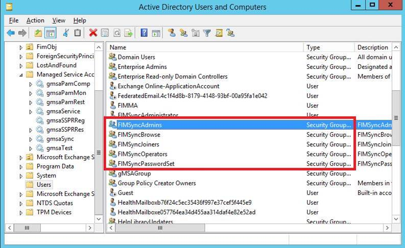

    > [!NOTE]  
    > A known issue on Windows Server 2012 R2 is that services that use a managed account stop responding after the server is restarted, because Microsoft Key Distribution Service isn't started after Windows restarts. The workaround for this issue is to run the following command: 
    >
    > `sc triggerinfo kdssvc start/networkon`
    >
    > The command starts Microsoft Key Distribution Service when the network is on (typically early in the boot cycle).
    >
    > For a discussion about a similar issue, see [AD FS Windows 2012 R2: adfssrv hangs in starting mode](https://social.technet.microsoft.com/Forums/en-US/a290c5c0-3112-409f-8cb0-ff23e083e5d1/ad-fs-windows-2012-r2-adfssrv-hangs-in-starting-mode?forum=winserverDS).

1.  Run Elevated MSI of Microsoft Identity Manager Service, and select **Change**.

1.  In the **Configure mail server connection** window, select the **Use different user for Exchange (for managed accounts)** check box. You are given the option to use the current Exchange account or the cloud mailbox.

    >[!NOTE]
    >If you select the **Use Exchange Online** option, to enable Microsoft Identity Manager Service to process approval responses from the Microsoft Identity Manager Outlook add-in, set the registry key **HKLM\SYSTEM\CurrentControlSet\Services\FIMService** value of *PollExchangeEnabled* to **1** after the installation.
    
    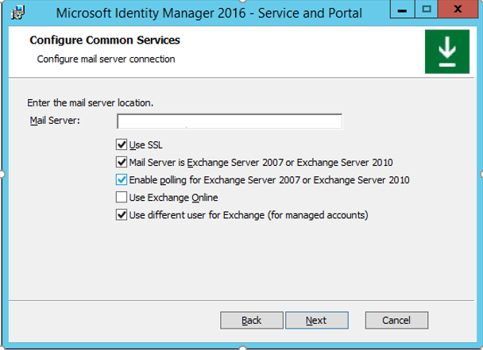

1.  In the **Configure the MIM service account** window, in the **Service Account Name** box, enter the name. Be sure to include the dollar sign ($) symbol. Also enter a password in the **Service Email Account Password** box. The **Service Account Password** box should be unavailable.

    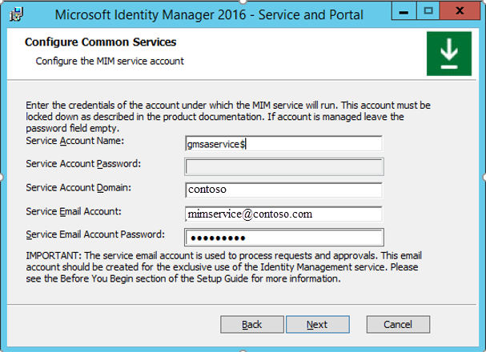

    Because the LogonUser function doesn’t work for managed accounts, the next page displays the warning, “Please check if Service Account is secure in its current configuration.”

    

1.  In the **Configure Privileged Access Management REST API** window, in the **Application Pool Account Name** box, enter the account name. Be sure to include the dollar sign ($) symbol. Leave **Application Pool Account Password** box empty.

    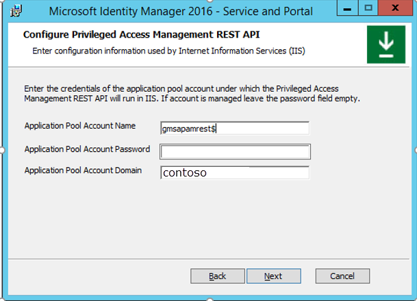

1.  In the **Configure PAM Component Service** window, in the **Service Account Name** box, enter the account name. Be sure to include the dollar sign ($) symbol. Leave the **Service Account Password** box empty.

    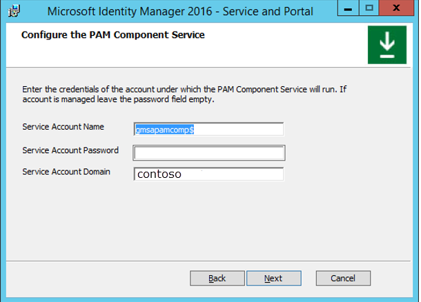

    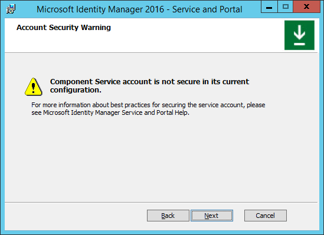

1.  In the **Configure the Privileged Access Management Monitoring Service** window, in the **Service Account Name** box, type the service account name. Be sure to include the dollar sign ($) symbol. Leave the **Service Account Password** box empty.

    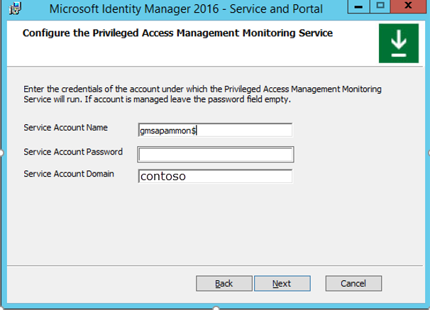

1.  In the **Configure MIM Password Registration Portal** window, in the **Account Name** box, enter the account name. Be sure to include the dollar sign ($) symbol. Leave the **Password** box empty.

    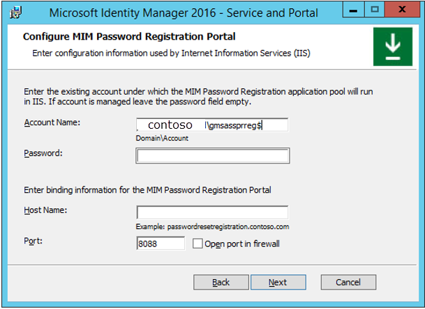

1.  In the **Configure MIM Password Reset Portal** window, in the **Account Name** box, enter the account name. Be sure to include the dollar sign ($) symbol. Leave the **Password** box empty.

    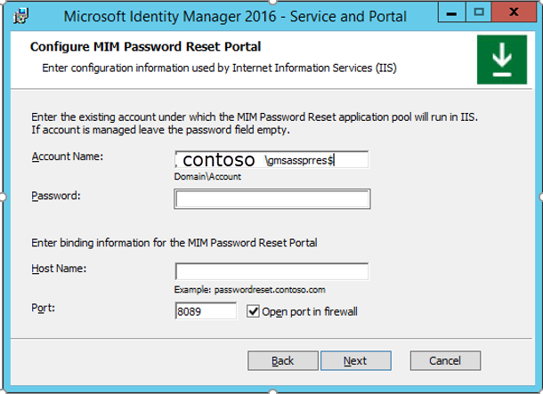

1.  Complete the installation.

    > [!NOTE]
    > During the installation, two new keys are created in the registry path **HKEY_LOCAL_MACHINE\SOFTWARE\Microsoft\Forefront Identity Manager\2010\Service** for storing the encrypted Exchange password. One entry is for *ExchangeOnline*, and the other is for *ExchangeOnPremise*. For one of the entries, the value in the **Data** column should be empty.

    > 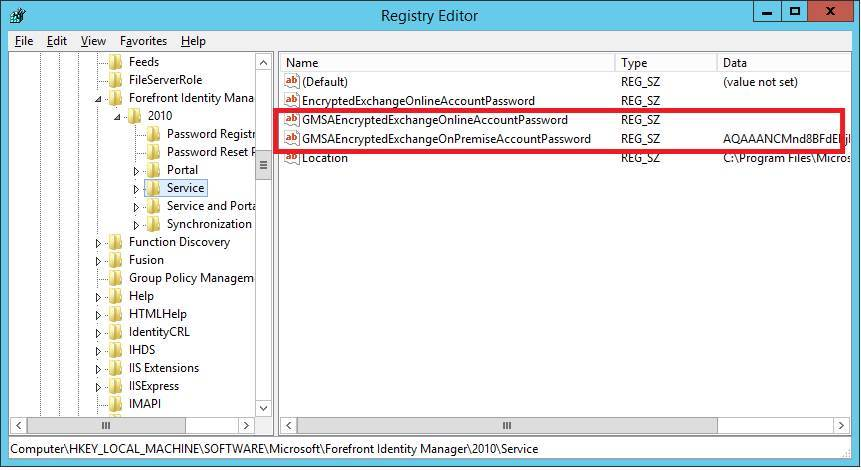

To update the password to your stored accounts without having to run change mode, [download this PowerShell script](microsoft-identity-manager-2016-gmsascript.md).

To encrypt the Exchange password, the installer creates an additional service and runs it under the managed account. The following messages are added in the **Application** event log during installation:

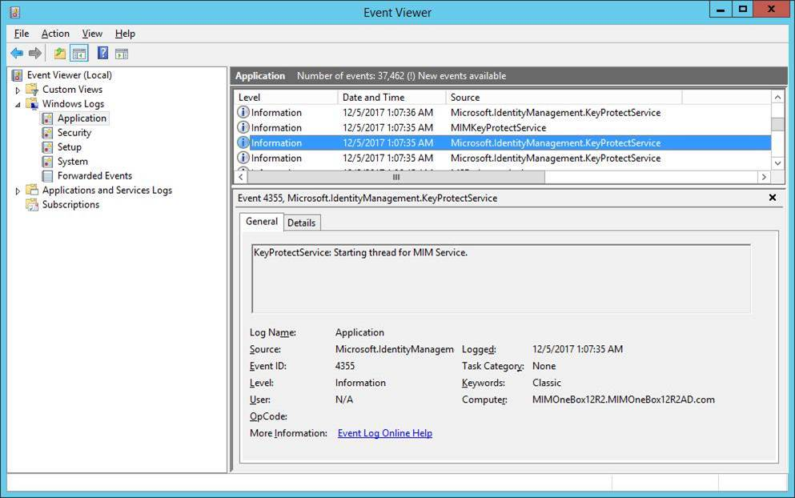
