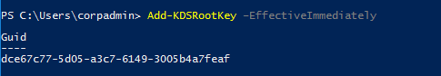
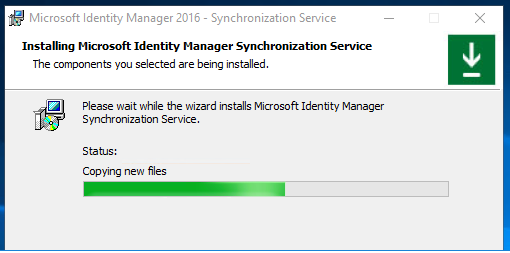

# Conversion of MIM Specific Services to gMSA
===========================================

This Guide will step through the basic steps to configure gMSA for supported
services. The process to convert to gMSA is easy once you pre-configure your
environment.

Hotfix Required: \<link to latest KB\>

Supported:

-   MIM Syncronization service(FIMSynchronizationService)
-   MIM Service(FIMService)
-   MIM Password Registration
-   MIM Password Reset
-   PAM Monitoring Service(PamMonitoringService)
-   PAM Component Service(PrivilegeManagementComponentService)

Not Supported:

-   MIM Portal is not supported as this is part of the sharepoint enviroment and you would need to deploy in farm mode and [Configure automatic password change in SharePointServer](https://docs.microsoft.com/sharepoint/administration/configure-automatic-password-change)
-   All Management Agents
-   Microsoft Certificate Management
-   BHOLD

General Information 
--------------------

Reading needed to complete setup and understand

-   [Group Managed Service Accounts Overview](https://docs.microsoft.com/windows-server/security/group-managed-service-accounts/group-managed-service-accounts-overview)

-   <https://docs.microsoft.com/en-us/powershell/module/addsadministration/new-adserviceaccount?view=win10-ps>

-   <https://technet.microsoft.com/en-us/library/jj128430(v=ws.11).aspx>

Fist Step on your windows domain controller

1.  Create the Key Distribution Services(KDS) Root Key (only once per domain) if
    needed. This is used by the KDS service on DCs (along with other
    information) to generate passwords.

    -   Add-KDSRootKey –EffectiveImmediately

    -   "–EffectiveImmediately" means wait up to \~10 hours / need to replicate
        to all DC. This was approximately 1 hour for 2 domain controllers.

## Synchronization Service
-----------------------

1.  Fist Step we create a group call “MIMSync_Servers” and add all
    Synchronization servers to this group.

2.  From windows PowerShell, we then executed this command as domain admin with
    computer account already joined to the domain

    -   New-ADServiceAccount -Name MIMSyncGMSAsvc -DNSHostName
        MIMSyncGMSAsvc.contoso.com -PrincipalsAllowedToRetrieveManagedPassword
        "MIMSync_Servers"

-   Get details of the GSMA for sync:

-   If running PCNS Service, you will need to update the delegation

    -   Set-ADServiceAccount -Identity MIMSyncGMSAsvc -ServicePrincipalNames
        \@{Add="PCNSCLNT/mimsync.contoso.com"}

3. Next on the synchronization service we want to backup the encryption key as
    this will be requested upon change mode install

    -   On the Server that the Synchronization Service is installed on locate
        the Synchronization Service Key Management tool

    -   By Default, the** Export key set** is already selected

    -   Click on **Next**

    -   You will now be prompted to enter the existing synchronization account
        information

    -   Enter and verify the FIM Sync Account information

        -   Account Name - Account name of the Synchronization Service account
            used during the initial install

        -   Password - Password of Synchronization Service account

        -   Domain - Domain that the Synchronization Service account is apart of

    -   Once you entered the information click on **Next**

    -   If you entered something incorrectly you will receive the following
        error

    -   Once you have successfully entered the Account information you will be
        presented with an option to change the destination (export file
        location) of the back up encryption key

        -   By Default, the export file location
            is **C:\\Windows\\system32**\\miiskeys-1.bin.

4. Install Microsoft Identity Manager SP1 Synchronization Service build
    4.4.1302.0, This can be found on Volume
    License Download Center or MSDN Download Site. At the end of the install make sure you save keyset
    miiskeys.bin.

5. Install latest [hotfix 4.5.x.x](https://docs.microsoft.com/en-us/microsoft-identity-manager/reference/version-history) or later.

- Once Patched Stop FIM Syncronization service.
- Control Panel Programs Programs and Features Microsoft Identity Manager
- Synchronization service Change -\> Next -\> Configure -\> Next

-  Clear the account name
-  Type service account name **MIMSyncGMSA** with \$ symbol as on the
- screenshot. Leave Password empty.

- Next-\> Next-\> Install
- Restore keyset from the .bin file saved.

> [!NOTE]
> SQL permission added is account is created for login therefore you
must allow the user applying change mode permission to add account and dbo on
the synchronization service database

## MIM Service
-----------

>[!IMPORTANT]
>The following process must be used when first converting the MIM
Service related accounts to be gMSA accounts. The PowerShell cmdlets noted in
the Appendix can only be used to change the account information once the initial
configuration has been done.*

1.  Create Group Managed Accounts for MIM Service, PAM Rest API, PAM Monitoring
    Service, PAM Component Service, SSPR Registration Portal, SSPR Reset Portal.

    -   Make sure you update gMSA delegation and SPN
        -   Set-ADServiceAccount -Identity \<account\> -ServicePrincipalNames
            \@{Add="\<SPN\>"}
        -   Delegation
            -   Set-ADServiceAccount -Identity \<gsmaaccount\>
                -TrustedForDelegation \$true
        -   Constrained Delegation
            -   \$delspns = 'http/mim', 'http/mim.contoso.com'
            -   New-ADServiceAccount -Name \<gsmaaccount\> -DNSHostName
                \<gsmaaccount\>.contoso.com
                -PrincipalsAllowedToRetrieveManagedPassword \<group\>
                -ServicePrincipalNames \$spns -OtherAttributes
                \@{'msDS-AllowedToDelegateTo'=\$delspns }

2.  Add account for MIM Service in Sync Groups. It is necessary for SSPR.

3.  **NOTE**. We found issue that services that use managed account hang after
    restarting server due to  Microsoft Key Distribution Service is not started
    after restarting the Windows. After that Service could not be started and
    Windows could not be restarted too. The issue is reproducible at least on
    Windows Server 2012 R2. Workaround for this issue is run command 

-   **sc triggerinfo kdssvc start/networkon**

    to start the Microsoft Key Distribution Service when the network is on
    (typically very early in the boot cycle).

    See discussion about similar issue:
    <https://social.technet.microsoft.com/Forums/en-US/a290c5c0-3112-409f-8cb0-ff23e083e5d1/ad-fs-windows-2012-r2-adfssrv-hangs-in-starting-mode?forum=winserverDS>

4.  Run Elevated MSI of MIM Service and select change.

5.  On “Configure main server connection page” check “Use different account for
    Exchange (for managed accounts)” checkbox. Here you will have an option to
    use the old account that has a mailbox or use cloud mailbox.

6.  On “Configure MIM Service account” page type service account with \$ symbol
    at the end. Also type Service Email Account Password. Service Account
    Password should be disabled.

7.  As LogonUser function doesn’t work for managed accounts, Next page will be
    warning “Please check if Service Account is secure in its current
    configuration”.

8.  On “Configure Privileged Access Management REST API” page type Application
    Pool Account Name with \$ symbol at the end and leave Password field empty.

9.  On “Configure PAM Component Service” page type Service Account Name with \$
    symbol at the end and leave Password field empty.

10.  On “Configure Privileged Access Management Monitoring Service” page type
    Service Account Name with \$ symbol at the end and leave Password field
    empty.

11.  On “Configure MIM Password Registration Portal” page type Account Name with
    \$ symbol at the end and leave Password field empty.

12.  On “Configure MIM Password Reset Portal” page type Account Name with \$
    symbol at the end and leave Password field empty.

13.  Complete installation.

Note:

-  After installation two new keys are created in registry by path
    - “HKEY_LOCAL_MACHINE\\SOFTWARE\\Microsoft\\Forefront Identity
    - Manager\\2010\\Service” for storing encrypted Exchange password. One for
    - Exchange Online and another for Exchange on premise (One of them should be
    - empty).

- To update the password, we provided a script [download here](Exchange.ps1.txt) so customers will not have to
    - run change mode

- To encrypt Exchange password the installer creates additional service and
    - runs it under the managed account. Following messages will be added in
    - Application Event Log during installation.

