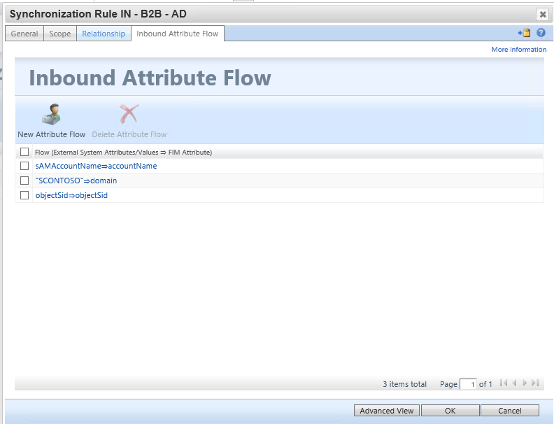

Azure AD business-to-business (B2B) collaboration with Microsoft Identity Manager(MIM) 2016 SP1 with Azure Application Proxy (Public Preview)
============================================================================================================================

Summary
=======

The initial scenario in preview for the Microsoft Identity Manager management
agent for Microsoft Graph (preview) is external user AD account lifecycle
management.   In this scenario, an organization has invited guests into their
Azure AD directory, and wish to give those guests access to on-premises Windows
Integrated Authentication or Kerberos-based applications, via the [Azure AD
application](https://docs.microsoft.com/en-us/azure/active-directory/active-directory-application-proxy-publish)
proxy or other gateway mechanisms. The Azure AD application proxy requires each
user to have their own AD DS account, for identification and delegation purposes

## Scenario Specific Supported Guidance

The initial scenario in preview for the Microsoft Identity Manager management
agent for Microsoft Graph (preview) is external user AD account lifecycle
management.   In this scenario, an organization has invited guests into their
Azure AD directory, and wish to give those guests access to on-premises Windows
Integrated Authentication or Kerberos-based applications, via the [Azure AD
application](https://docs.microsoft.com/en-us/azure/active-directory/active-directory-application-proxy-publish)
proxy or other gateway mechanisms. The Azure AD application proxy requires each
user to have their own AD DS account, for identification and delegation purposes

A few assumptions made in the configuration of B2B with MIM and Azure
Application Proxy

-   You have already installed the [Graph Management
    Agent](microsoft-identity-manager-2016-connector-graph.md).

-   You have an on-premises AD and Azure AD Connect set up for synchronizing
    users and groups to Azure AD.

    -   Office Groups controlling application access using [Azure AD
        Connect](http://robsgroupsblog.com/blog/how-to-write-back-an-office-group-in-azure-active-directory-to-a-mail-enabled-security-group-in-an-on-premises-active-directory)

-   You have already set up Application Proxy connectors and connector groups

-   Published one or more applications which rely on Windows Integrated
    Authentication or individual AD accounts via Azure AD App Proxy

-   You have invited or you will invite one or more guests, which will be new
    users created in Azure AD
    <https://docs.microsoft.com/en-us/azure/active-directory/active-directory-b2b-self-service-portal>

-   Microsoft Identity Manager is installed and basic configuration of Service
    and Portal and Active Directory Management Agent.
    <https://docs.microsoft.com/en-us/microsoft-identity-manager/microsoft-identity-manager-deploy>

## B2B End to End Deployment

Scenario

Contoso Pharmaceuticals works Trey Research Inc. as part of their R&D
Department. Trey Research employees will need to access the research reporting
application provided by Contoso Pharmaceuticals.

-   Contoso Pharmaceuticals will be in an independent tenant, where we have
    configured a custom domain scontoso.com.

-   We have invited an external user:  to the Contoso Pharmaceuticals tenant.
    This user has accepted the invitation and can access resources that will be
    shared.

-   We have published some App Proxy applications, and in this scenario, we will
    use SQL Reporting Services app, which is a reporting component for System
    Center Service Manager.

## Create the Graph Management Agent

Note: Before creating connector make sure you have reviewed the [Graph
Management Agent](microsoft-identity-manager-2016-connector-graph.md).

In the Synchronization Service Manager UI, select **Connectors** and **Create**.
Select **Graph (Microsoft)** and give it a descriptive name

### Connectivity

On the Connectivity page, you must specify the Graph API Version Production
ready is **V 1.0**, Non-Production is **Beta**

### Capabilities

On the Global Parameters page, you configure the DN to the delta change log and
additional LDAP features. The page is pre-populated with the information
provided by the LDAP server.

### Global Parameters

On the Global Parameters page, you configure the DN to the delta change log and
additional LDAP features. The page is pre-populated with the information
provided by the LDAP server.

### Configure Provisioning Hierarchy

This page is used to map the DN component, for example OU, to the object type
that should be provisioned, for example organizationalUnit. leve this default click next

### Configure Partitions and Hierarchies

On the partitions and hierarchies page, select all namespaces with objects you
plan to import and export.

#### Select Object Types

On the partitions and hierarchies page, select all namespaces with objects you
plan to import and export.

#### Select Attributes

On the Select Attributes screen we will only select needed attributes to manage B2B Users. The Attribute "id" is required

-   id

-   displayName

-   mail

-   givenName

-   surname

-   userPrincipalName

-   userType

#### Configure Anchors

On the Configure Anchor 
Configure the anchor is a required step. by defauilt we use the id attribute for mapping.

#### Configure Connector Filter

On the onfigure Connector Filter page, Allows you to filter out objects based on attribute filter. In this scenario for B2B we only want to bring in Users with the userType that equals Guest and not member.

#### Configure Join and Projection Rules

Configuring Join and Projection rules will be handled by sync rule thus we do not have to identify a join and projection on the connector itself. Leave default and click ok.

#### Configure Attribute Flow

Like the join and projection we will not need to define the attribute flow here as it will be handle by the sync rule we create. Leave default and click ok.

#### Configure Deprovision

Configure deprovision allow you to delete the object if metaverse object is deleted. In this test we will make them disconnectors as we want to leave them in Azure also we are not exporting anything to azure as it is Import only.

#### Configure Extensions

Configure Extentions on this managment agent is an option but not required as we are using a syncronization rule. If we decided to to a advance rule in the attribute flow earlier then this would be an option to define.

## Creating MIM Service Syncronization Rules

in the steps below we will begin the mapping of B2B guest account and the attribute flow. Some asumptions are made here that you already have the Active Directory Mangement Agent Configured and the FIM MA configured to talk to the MIM Service and portal.

Before creating the sync rule, we need to create an attribute called userPrincipalName tied to the person object using the MV Designer.

In the Synchronization client select Metaverse Designer

Then Select the Person Object Type

Next under actions click Add Attribute

Finally complete the following details

Attribute name: **userPrincipalName**

Attribute Type: **String (Indexable)**

Indexed = **True**

The next steps will require the configuration minimal configuration of the FIM
Service Management Agent and The Active Directory Domain Services Management
Agent .

More details can be found here for the configuration
<https://technet.microsoft.com/en-us/library/ff686263(v=ws.10).aspx> - How Do I
Provision Users to AD DS

### Synchronization Rule: Import Guest User to MV to Synchronization Service Metaverse from Azure Active Directory 

### Synchronization Rule: Create Guest User shadow account to Active Directory 

This synchronization rule will create the user in active directory

Flow Rules:

| **Initial Flow Only** | **Use as Existence Test** | **Flow (FIM Value ⇒ Destination Attribute)**                          |
|-----------------------|---------------------------|-----------------------------------------------------------------------|
|                       |                           | [accountName⇒sAMAccountName](javascript:void(0);)                     |
|                       |                           | [givenName⇒givenName](javascript:void(0);)                            |
|                       |                           | [mail⇒mail](javascript:void(0);)                                      |
|                       |                           | [sn⇒sn](javascript:void(0);)                                          |
|                       |                           | [userPrincipalName⇒userPrincipalName](javascript:void(0);)            |
| **Y**                 |                           | ["CN="+uid+",OU=B2BGuest,DC=scontoso,DC=com"⇒dn](javascript:void(0);) |
| **Y**                 |                           | [RandomNum(0,999)+userPrincipalName⇒unicodePwd](javascript:void(0);)  |
| **Y**                 |                           | [262656⇒userAccountControl](javascript:void(0);)                      |

### Synchronization Rule: Import Shadow User SID to allow for login to MIM 

This synchronization rule will create the user in active directory

Lastly, we will invite the user and then run the management in the following
order:

-   Full Import and Synchronization on the MIMMA Management Agent

-   Full Import and Synchronization on the ADMA_SCONTOSO_B2B Management Agent

-   Full Import and Synchronization on the B2B Graph Management Agent

-   Export, Delta Import and Synchronization on the ADMA_SCONTOSO_B2B Management
    Agent

-   Export, Delta Import and Synchronization on the MIMMA Management Agent

## Testing: Application Proxy with B2B Guest and Logging into MIM

Now that we have created the synchronization rules in MIM. In App Proxy
configuration we are using the cloud principle to allow for KCD on app proxy.
Also, we added the user manually to the manage users and groups. We do have
options not to show the user until creation has occurred in MIM to add the guest
to an office group once provisioned this requires a bit more configuration not
covered in this document.

Once All configure

Finally have B2B user login and see the application

Next Steps
----------

[How Do I Provision Users to AD DS](https://technet.microsoft.com/en-us/library/ff686263(v=ws.10).aspx)

[Functions Reference for FIM 2010](https://technet.microsoft.com/en-us/library/ff800820(v=ws.10).aspx)

[How to provide secure remote access to on-premises applications](https://docs.microsoft.com/en-us/azure/active-directory/active-directory-application-proxy-get-started)
