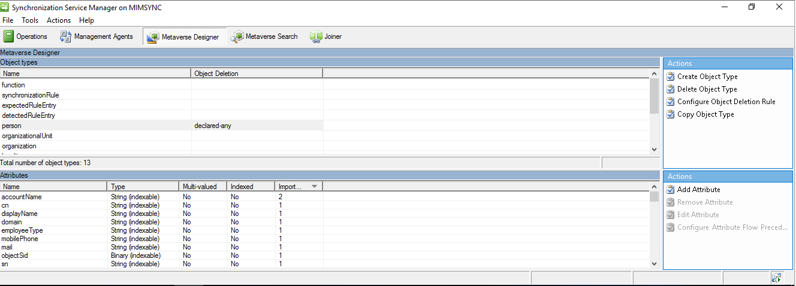
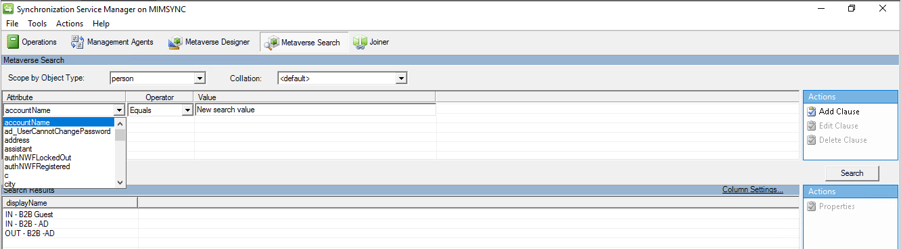
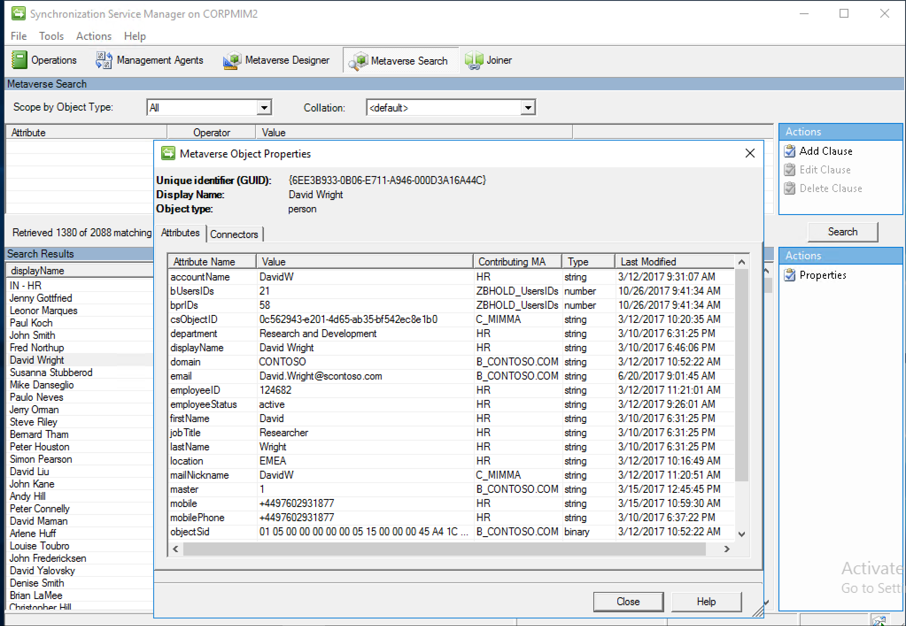
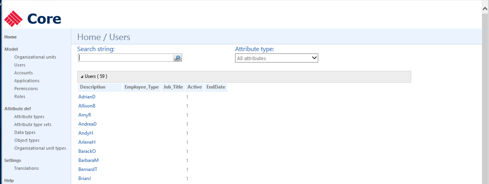
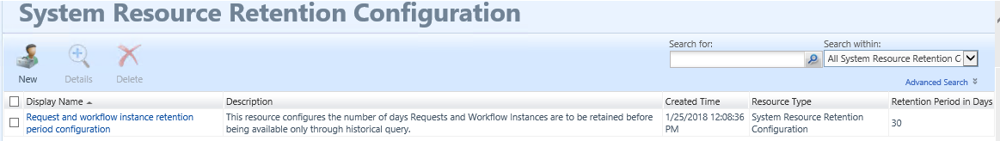
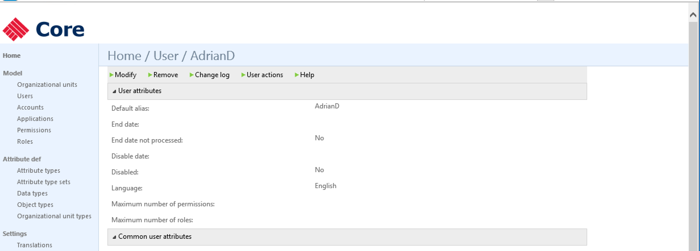
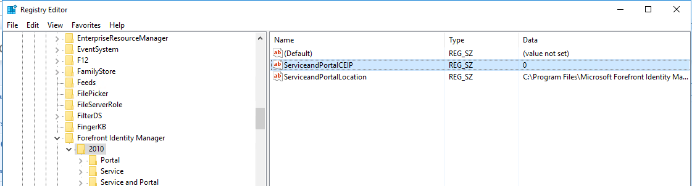

---
# required metadata

title: Microsoft Identity Manager data handling  | Microsoft Docs
description: Understand Microsoft Identity Manager data handling to identify and report on data within the environment, take action in given system based on operational functions and requirement.
keywords:
author: billmath
ms.author: billmath
manager: amycolannino
ms.date: 09/14/2023
ms.topic: conceptual
ms.service: microsoft-identity-manager

ms.assetid: b0b39631-66df-4c5f-80c9-a1774346f816

# optional metadata

#ROBOTS:
#audience:
#ms.devlang:
ms.suite: ems
#ms.tgt_pltfrm:
#ms.custom:

---
# Microsoft Identity Manager data handling 

This article provides guidance on how organizations can make decisions that can be applied across many connected data sources.  This can be achieved through the search, delete, update, and report operations.  Before deciding on your approach of deleting or updating, an understanding of the current design and configuration of your identity manager system (MIM) is critical. 

Organizations need to consider and answer the following questions: 

- What data do you need for your identity management to help with business process?
- Where is current data going to be stored in MIM?
- How will you use this data in the system?
- Are you sharing this data with any external partners data sources(Exporting)
- What is the Authoritative source for the data and the processing of it?
- What will your data retention and data deletion plan in place?
- Have you identified all the technology you need to process and manage data?

## Searching for and identifying personal data
Searching data within MIM will be dependent on the configuration and setup. Most environments are interconnected, but for clarity the scenarios are broken out by high-level component.

### Synchronization Service

All data in MIM that relates to users is derived from Active Directory (AD) and HR Data sources. When searching for personal data, the first place you should consider searching is AD or connected data sources. 

If you're not sure the source of authority you can track this user from the MIM Synchronization Service Manager console, click the Metaverse Search bar to view the identifiable personal data that is stored in the database. Users can search for a specific user or attribute.

- To perform a review or search of user objects data
    - Open the synchronization service client
        - Using the metaverse designer allow you to see attribute flow imports and precedence.

        - Using the metaverse search allows you to search on any object and attribute within the database

 
After finding the object, clicking on the object will open the user profile page. The object details provide you with the comprehensive details about the object, its attributes, last modified and source of authority, and related connected data source derived from management agent configuration.

### Service and Portal / PAM
If you have an instance of the Service and Portal or PAM installed being able to search for users is important. 

If you installed the Portal, you can use the UI to search on any attribute or query for a particular user.

If you only have the service server, without Portal UI, installed you can run a search using the cmdlets in the `FIMAutomation` PSSnapin.

PAM can use the same cmdlets, or you can use the [MIMPAM Module](/powershell/module/mimpam/get-pamuser?view=idm-ps-2016sp1), specifically the `get-pamuser` cmdlet, to search for the user within the PAM environment.

### BHOLD
BHOLD Core service has a UI that allows you to search for a user or attributes.

If you are synchronizing BHOLD with [access management connector](/microsoft-identity-manager/bhold/bhold-access-management-connector-install) for synchronization service you will be able to see the connected user objects and the attributes you are sending to BHOLD core.

Also you can load the [BHOLD Reporting](/microsoft-identity-manager/bhold/bhold-concepts-guide#reporting) module.

### Certificate Management
Certificate management service search is built into the UI. The administrator can launch its UI and select `Find user and view or manage their information`.

## Exporting personal data
Because the data related to entities in MIM is derived from multiple sources, most data is stored in the Synchronization Service database. For this reason, you should export object-related data from MIM Sync so you can determine the owner of this data.

### Synchronization Service
Exporting data from Synchronization service can be done from the search UI; copy and paste into a CSV or preferred format. 

### Service and Portal / PAM
Exporting data from MIM Service and portal, along with PAM, can be done by running a search cmdlet based on the `FIMAutomation PSSnapin`. An example can be found [here](/archive/technet-wiki/22713.fim-portals-use-powershell-to-find-all-users-without-a-manager); export the output to [CSV](/powershell/module/microsoft.powershell.utility/export-csv?viewFallbackFrom=powershell-6&view=powershell-7.2).

PAM can use the same cmdlet or you can use the [MIMPAM Module](/powershell/module/mimpam/get-pamuser?view=idm-ps-2016sp1), specifically the `get-pamuser` cmdlet, to search for the user within the PAM environment and export it to a CSV file.

### BHOLD
BHOLD data can be exported using the BHOLD reporting module to your preferred format.

### Certificate Management
Certificate management data related to personal data is connected to active directory. An administrator can export this data using Active Directory PowerShell.

## Updating personal data

Personal data about users or objects in MIM Solutions typically is derived from the user's object in your organization's connected data sources. Because any changes made to the user profile in HR source, or another authoritative system of record such as AD, are then reflected in MIM Synchronization Service.

### Synchronization Service

In order to perform management operations, administrators must be part of synchronization operations or admin defined [here](/previous-versions/mim/jj590183(v%3dws.10)).

Updating of data is done by defining rules from the source of authority. Management console helps identify the source of authority to update it at the source. Another option is create sync rule or rule extension to control the data updating if source like HR data still needs to remain. 

For more information on different ways to update attributes, see the following links. 

- [Using Rules Extensions](https://msdn.microsoft.com/library/windows/desktop/ms698810(v=vs.100).aspx)
- [Understanding Data Synchronization with External Systems](/previous-versions/mim/jj133850(v%3dws.10))

### Service and Portal / PAM

Service and Portal to include PAM data can be updated using the FIMAutomation or MIMPAM cmdlets. If you have the Portal, you can also directly update data originating in MIM Service by searching and modify the object. 

### BHOLD

Users can be directly updated with BHOLD Core user interface or the access management connector.

### Certificate Management

Users in the certificate management service are all a reflection from Active Directory. To update, use Active Directory to change object details.

## Deleting personal data

>[!Note] 
> This article provides guidance on ways to delete personal data from Microsoft Identity Manager and can be used to support your obligations under the GDPR. If you’re looking for general info about GDPR, see the [GDPR section of the Service Trust portal](https://servicetrust.microsoft.com/viewpage/GDPR).

Data in MIM is synced and always updated from its connected data source. When an object is deleted in target, the object's data in MIM can be maintained for purposes of security investigation. Object Deletion is configured per connected data source rules, rule extension code or Object deletion rules.

### Synchronization Service
Synchronization Service has many ways to handle data or delete data depending on business processes. For more information on options for deleting and updating attributes, see:

- [Understanding Deprovisioning](/archive/technet-wiki/1270.understanding-deprovisioning-in-fim)
- [Using Rules Extensions](https://msdn.microsoft.com/library/windows/desktop/ms698810(v=vs.100).aspx)
- [MIM Best Practices](/microsoft-identity-manager/mim-best-practices)

### Service and Portal / PAM

It is recommended for the Service & Portal that you keep the default 30 days system resource retention configuration. This tells the service when it will delete,  not only request data but also any object that needs to be cleared from the system. Once the process occurs, all data linked to this object is deleted. This includes all SSPR registration data.

There is one table where MIM stores the guid of the objects. To reduce the overall size of the table, build 4.4.1459 added a process called FIM_DeleteExpiredSystemObjectsJob; details on this process can be found [here](https://support.microsoft.com/en-us/help/4012498/hotfix-rollup-package-build-4-4-1459-0-is-available-for-microsoft-iden).

### BHOLD

BHOLD like most systems connected to the synchronization service can be configured to delete once the source object like HR is removed. This is configured on the management agent, and controlled by the Object Deletion rules as described under the synchronizations service features.

Another option is to remove the user object right from the BHOLD Core User interface. Depending on setup, this could work fine, but note provisioning logic could re-create this user if not deleted at the source.

### Certificate Management
To remove a user from Certificate Management, delete the user is in Active Directory.

Certificate management will only store the profile uid from Certificate Services with domain and sAMAccountName. Once the user is deleted from AD, the user cache is only present for the certificates which they have enrolled. Deleting from the MIM CM database is not supported as this can cause overall harm to the operation of the environment.

## Opt-out of telemetry
Previous builds of FIM and MIM used to collect anonymized telemetry about each deployment and transmits this data over HTTPS to Microsoft servers. This data was used by Microsoft to help improve versions of FIM/MIM in the past.

>[!Note] 
> In later releases of 4.5.x.x or greater data collection will be disabled.

To disable data collection in previous versions, run change mode and deselect the following prompt:

or edit the registry and set the value to 0: (Component)CEIP
HKLM\SOFTWARE\Microsoft\Forefront Identity Manager\2010

## Next Steps 
- [SQL related privacy guidance](/sql/relational-databases/security/security-center-for-sql-server-database-engine-and-azure-sql-database?view=sql-server-2017)
- [GDPR section of the Service Trust portal](https://servicetrust.microsoft.com/ViewPage/GDPRGetStarted)

