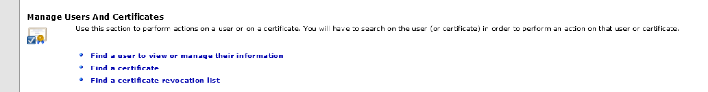
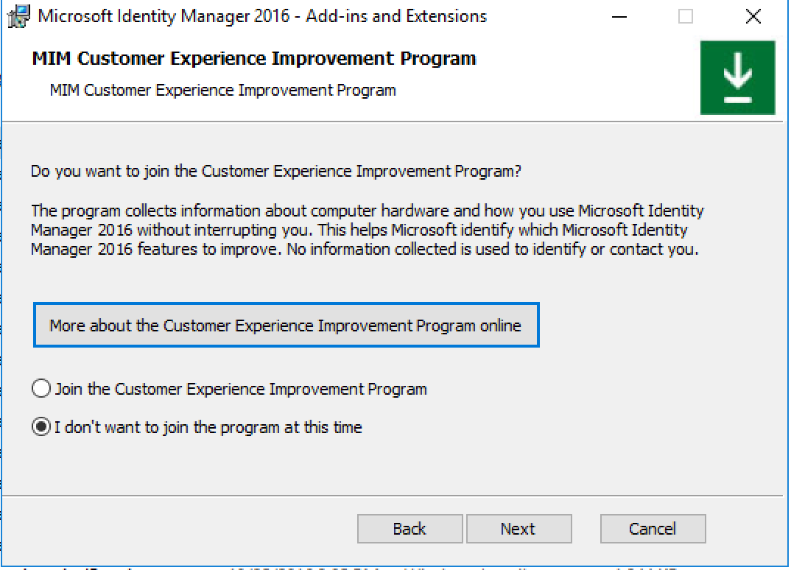

---
# required metadata

title: Microsoft Identity Manager data handling  | Microsoft Docs
description: Understand Microsoft Identity Manager data handling to indentify and report on data within the enviroment, take action in given system based on operational functions and requirement.
keywords:
author: billmath
ms.author: billmath
manager: daveba
ms.date: 12/02/2018
ms.topic: conceptual
ms.prod: microsoft-identity-manager

ms.assetid: b0b39631-66df-4c5f-80c9-a1774346f816

# optional metadata

#ROBOTS:
#audience:
#ms.devlang:
ms.suite: ems
#ms.tgt_pltfrm:
#ms.custom:

---
# Microsoft Identity Manager data handling 

This article will provide guidance on how organizations can make decisions that can be applied across many connected data sources.  This can be achieved through the search, delete, update, and report operations.  Before deciding on your approach of deleting or updating, an understanding of the current design and configuration of your identity manager system (MIM) is critical. 

Below are a few scenarios customers will need to consider and answer the following questions: 

- What data do you need for you identity management to help with business process?
- Where is current data going to be stored in MIM?
- How do will you use this data in the system?
- Are you sharing this data with any external partners data sources(Exporting)
- What is the Authoritative source for the data and the processing of it?
- What will your data retention and data deletion plan in place?
- Have you identified all the technology you need to process and manage data?

To help you understand a current MIM environment you can utilize the following tool to document your MIM environment, or defer to your implementation design documents.
- [MIM Documentor - Allows to export current configuration](https://github.com/Microsoft/MIMConfigDocumenter)

## Searching for and identifying personal data
Searching data within MIM will be dependent on the configuration and setup. Most environments are interconnected but for clarity we broke them out by high-level component.

### Synchronization Service

All data in MIM that relates to users is derived from Active Directory (AD) and HR Data sources. When searching for personal data, the first place you should consider searching is AD or connected data sources. 

If you're not sure the source of authority you can track this user from the MIM Synchronization Service Manager console, click the Metaverse Search bar to view the identifiable personal data that is stored in the database. Users can search for a specific user or attribute.

- To perform a review or search of user objects data
    - Open the synchronization service client
        - Using the metaverse designer allow you to see attribute flow imports and precedence.

        - Using the metaverse search allows you to search on any object and attribute within the database

 
After finding the object, clicking on the object will open the user profile page. The object details provide you with the comprehensive details about the object, its attributes, last modified and source of authority, and related connected data source derived from management agent configuration example below.

### Service and Portal / PAM
If you have an instance of the Service and Portal or PAM installed being able to search for users is important. 

If you installed the Portal, you can use the UI to search on any attribute or query for a particular user.

If you only have the service server(without Portal UI) installed you can run a search syntax based on the [FIMAutomation PSSnapin], Example found [here](https://social.technet.microsoft.com/wiki/contents/articles/22713.fim-portals-use-powershell-to-find-all-users-without-a-manager.aspx).

PAM can use the same syntax above or you can use the [MIMPAM Module](https://docs.microsoft.com/powershell/module/mimpam/get-pamuser?view=idm-ps-2016sp1) specifically the get-pamuser cmdlet to search for the user within the PAM environment.

Other reporting options to search on available data is in the service and portal.
- [Hybrid Reporting](https://docs.microsoft.com/microsoft-identity-manager/identity-manager-hybrid-reporting-azure)
- [Reporting with SCSM](https://docs.microsoft.com/previous-versions/mim/jj133853%28v%3dws.10%29)

### BHOLD
Bhold Core service has a UI that allows you to search for a user or attributes. 

If you are synchronizing BHOLD with [access management connector](https://docs.microsoft.com/microsoft-identity-manager/bhold/bhold-access-management-connector-install) for synchronization service you will be able to see the connected user objects and the attributes your sending to BHOLD core.

Also you can load the BHOLD Reporting module.

- [BHOLD Reporting](https://docs.microsoft.com/microsoft-identity-manager/bhold/bhold-concepts-guide#reporting)

### Certificate Management
Certificate management service search is built into the UI. The administrator will launch and select the 'Find user and view or manage their information'  

## Exporting personal data
Because the data related to entities in MIM is derived from multiple sources, most data is stored in the Synchronization Service database. For this reason, you should export object-related data from MIM Sync or you can determine the owner of this data.

### Synchronization Service
Synchronization services for exporting data simply select the data from the search UI and copy and paste into a csv or preferred format. Another way to export this data is to create a File-based MA to drop current data needed about a flagged user of interest. An exmaple of using file-based MA can be found [here](https://blogs.msdn.microsoft.com/connector_space/2016/11/17/management-agent-configuration-part-4-delimited-text-file-management-agent/).

### Service and Portal / PAM
Service and portal along with PAM you can export this data run a search syntax based on the [FIMAutomation PSSnapin], Example found [here](https://social.technet.microsoft.com/wiki/contents/articles/22713.fim-portals-use-powershell-to-find-all-users-without-a-manager.aspx) and pipe it to [csv](https://docs.microsoft.com/powershell/module/microsoft.powershell.utility/export-csv?view=powershell-6).

PAM can use the same syntax above or you can use the [MIMPAM Module](https://docs.microsoft.com/powershell/module/mimpam/get-pamuser?view=idm-ps-2016sp1) specifically the get-pamuser to search for the user within the PAM environment and pipe it to a csv.

- [Example Querying The MIM Service Using PowerShell](https://gallery.technet.microsoft.com/Querying-The-FIMMIM-dcb82de3)

### BHOLD
Bhold data can be exported using the bhold reporting module to your preferred format.

### Certificate Management
Certificate management data related to personal data is connected to active directory. An administrator can export this data using Active Directory powershell.

## Updating personal data

Personal data about users or objects in MIM Solutions typically is derived from the user's object in your organization's connected data sources. Because any changes made to the user profile in HR source, or another authoritative system of record, such as AD are then reflected in MIM Synchronization Service.

### Synchronization Service

In order to perform management operations, administrators must be part of synchronization operations or admin defined [here](https://docs.microsoft.com/previous-versions/mim/jj590183(v%3dws.10)).

Updating of data is done by defining rules from the source of authority. Management console helps identify the source of authority to update it at the source. Another option is create sync rule or rule extention to control the data updating if source like HR data still needs to remain. These are avialible supported options.

For more information on different ways to update attribute, see below. 

- [Using Rules Extensions](https://msdn.microsoft.com/library/windows/desktop/ms698810(v=vs.100).aspx)
- [Understanding Data Synchronization with External Systems](https://docs.microsoft.com/previous-versions/mim/jj133850(v%3dws.10))

### Service and Portal / PAM

Service and Portal to include PAM data can be updated using the FIMAutomation or PAM cmdlets. If you have the Portal, you can also directly update by searching and modify the object. One thing to note and depending on configuration simply updating from the portal doesn't mean it will remain. As source of authority is highly dependent on overall configuration.

### BHOLD

Users can be directly updated with BHOLD Core user interface or the access management connector.

### Certificate Management

Users in the certificate management service are all a reflection from active directory. To update use Active Directory to change object details.

## Deleting personal data

>[!Note] 
> This article provides guidance on ways to delete personal data from Microsoft Identity Manager and can be used to support your obligations under the GDPR. If you’re looking for general info about GDPR, see the [GDPR section of the Service Trust portal](https://servicetrust.microsoft.com/ViewPage/GDPRGetStarted).

Data in MIM is synced and always updated from its connected data source. When an object is deleted in target, the object's data in MIM can be maintained for purposes of security investigation. Object Deletion is configured per connected data source rules or rule extension(code) and/or Object deletion rules.

### Synchronization Service
Synchronization Service as many ways to handle data or delete data depending on business processes. To help understand, below are some articles to help understand options on deleting and updating attributes: 

- [Understanding Deprovisioning](https://social.technet.microsoft.com/wiki/contents/articles/1270.understanding-deprovisioning-in-fim.aspx)
- [Using Rules Extensions](https://msdn.microsoft.com/library/windows/desktop/ms698810(v=vs.100).aspx)
- [MIM Best Practices](https://docs.microsoft.com/microsoft-identity-manager/mim-best-practices)

### Service and Portal / PAM

It is recommended for the Service & Portal that you keep the default 30 days system resource retention configuration. This tells the service when it will delete,  not only request data but also any object that needs to be cleared from the system. Once the process occurs, all data linked to this object is deleted this includes all SSPR registration data. This plays into the object deletion configuration above. We do have one table were we store the guid of the objects. To reduce the overall size of the table in build 4.4.1459 we added a process called FIM_DeleteExpiredSystemObjectsJob details on this process can be found [here](https://support.microsoft.com/en-us/help/4012498/hotfix-rollup-package-build-4-4-1459-0-is-available-for-microsoft-iden).

### BHOLD

Bhold like most systems connected to the synchronization service can be configured to delete once the source object like HR is removed. This is configured on the management agent. and controlled by the Object Deletion rules as described under the synchronizations service features.

Another option is to remove the user object right from the BHOLD Core User interface. Depending on setup this could work fine but note provisioning logic could re-create this user if not deleted at the source.

### Certificate Management
To remove a user from CM, delete the user is in active directory.

Certificate management as it will only store the profile uid from certificate services with domain sAMAccountName. Once the user is deleted from AD the user cache is only present for the certificates, witch they have enrolled. We do not recommend deleting anything in the database as this can cause overall harm to the operation of the environment.

## Opt-out of telemetry
Previous builds FIM/MIM used to collects anonymized telemetry about each deployment and transmits this data over HTTPS to Microsoft servers. This data was used by Microsoft to help improve future versions of FIM/MIM in the past.

>[!Note] 
> In later releases of 4.5.x.x or greater data collection will be disabled.

To disable data collection in previous version run change mode and deselect the following prompt:

or edit the registry and set the value to 0: (Component)CEIP
HKLM\SOFTWARE\Microsoft\Forefront Identity Manager\2010

## Next Steps 
- [For SQL Related privacy Guidance](https://docs.microsoft.com/sql/relational-databases/security/microsoft-sql-and-the-gdpr-requirements?view=sql-server-2017)
- [GDPR section of the Service Trust portal](https://servicetrust.microsoft.com/ViewPage/GDPRGetStarted)
- [FIM 2010 Archive: Ramp Up - Implementing Forefront Identity Manager 2010](https://social.technet.microsoft.com/wiki/contents/articles/35789.fim-2010-archive-ramp-up-implementing-forefront-identity-manager-2010.aspx)
