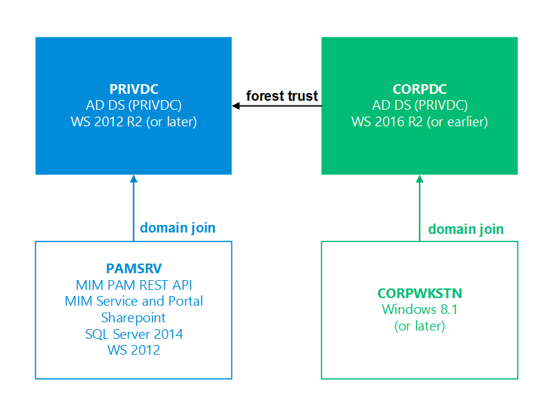

---
# required metadata

title: PAM environment overview | Microsoft Docs
description: Find the required number and configuration of virtual machines to successfully deploy Privileged Access Management.
keywords:
author: henrymbuguakiarie
ms.author: henrymbuguakiarie
ms.date: 04/08/2025
ms.topic: article
ms.service: microsoft-identity-manager

ms.assetid: 479db14c-1bfb-4d7c-a344-cd718a01f328

# optional metadata

#ROBOTS:
#audience:
#ms.devlang:
ms.reviewer: mwahl
ms.suite: ems
#ms.tgt_pltfrm:
#ms.custom:

---
# MIM PAM test lab environment overview

> [!NOTE]
> The PAM approach provided by MIM PAM is not recommended for new deployments in Internet-connected environments. MIM PAM is intended to be used in a custom architecture for isolated AD environments where Internet access is not available, where this configuration is required by regulation, or in high impact isolated environments like offline research laboratories and disconnected operational technology or supervisory control and data acquisition environments. MIM PAM is distinct from [Microsoft Entra Privileged Identity Management](https://azure.microsoft.com/documentation/articles/active-directory-privileged-identity-management-configure/) (PIM). Microsoft Entra PIM is a service that enables you to manage, control, and monitor access to resources in Microsoft Entra ID, Azure, and other Microsoft Online Services such as Microsoft 365 or Microsoft Intune. For guidance on on-premises Internet-connected environments and hybrid environments, see [securing privileged access](/security/compass/overview).

To set up a test lab of MIM PAM, you can install the software on virtual machines.
Privileged Access Management works with virtual machines (VMs) with separate drives that are connected to each other on a shared network. These virtual machines can be hosted by Windows Server or other operating system platforms.

You need a minimum of three virtual machines. If you don't already have an AD domain for PAM to manage, you need one additional VM to act as a CORP domain controller. If you wish to configure the PRIV software for high availability, you need two additional VMs.

The drives where the VM disk images will be stored need at least 120 GB of free disk space. If you plan to deploy for high availability, make sure that the disk subsystem meets the requirements for SQL shared storage. The shared storage can be in the form of Windows Server Failover Clustering cluster disks, disks on a Storage Area Network (SAN), or file shares on an SMB server.

> [!IMPORTANT]
> Storage must be dedicated to the bastion environment. Sharing storage with other workloads outside of the bastion environment is not recommended as it could jeopardize the integrity of the bastion environment.

## Next steps

- [Privileged Access Management for Active Directory Domain Services](privileged-identity-management-for-active-directory-domain-services.md) is an overview of PAM and how it works.
- [Understand the components of PAM](principles-of-operation.md) is an overview of the various components of PAM.
