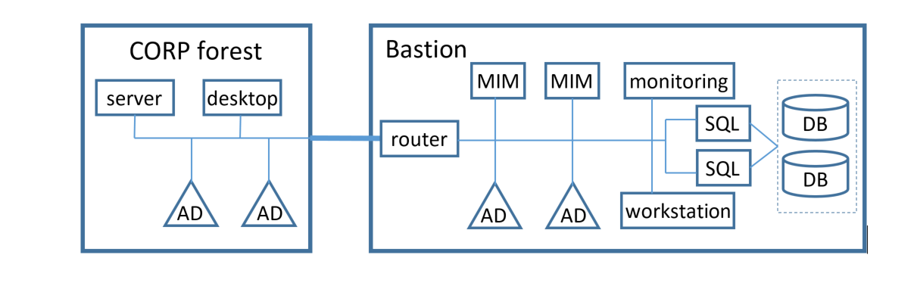
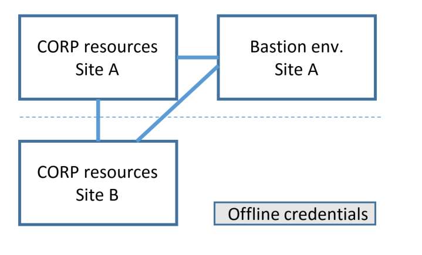
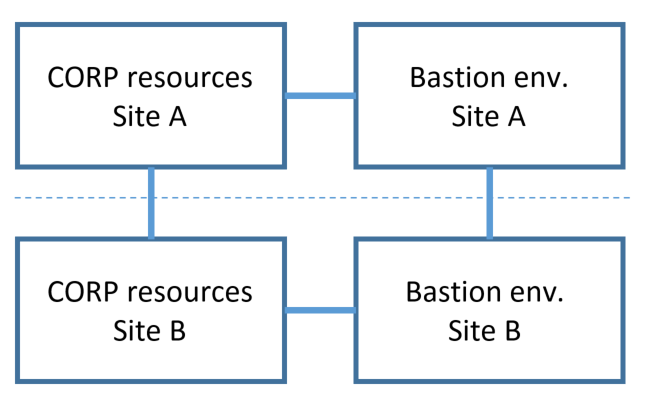
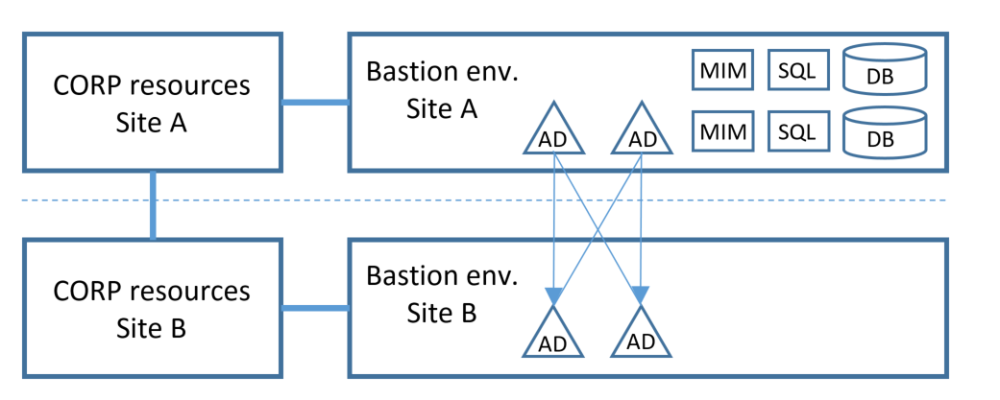
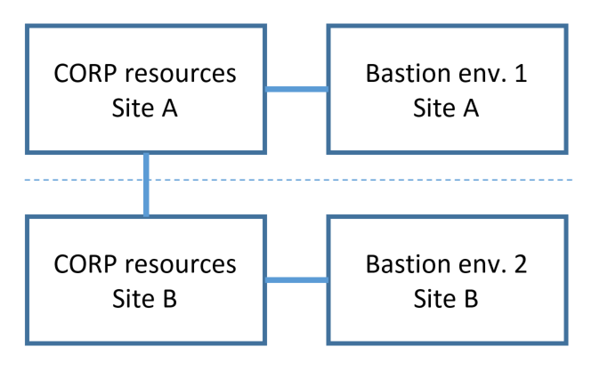
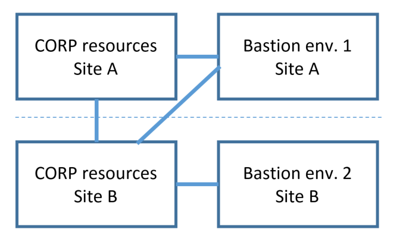

---
# required metadata

title: PAM disaster recovery | Microsoft Docs
description: Learn how to configure Privileged Access Management for high availability and disaster recovery.
keywords:
author: billmath
ms.author: billmath
manager: amycolannino
ms.date: 09/14/2023
ms.topic: article
ms.service: microsoft-identity-manager

ms.assetid: 03e521cd-cbf0-49f8-9797-dbc284c63018

# optional metadata

#ROBOTS:
#audience:
#ms.devlang:
ms.reviewer: mwahl
ms.suite: ems
#ms.tgt_pltfrm:
#ms.custom:

---
# High availability and disaster recovery considerations for the bastion environment

This article describes considerations for high availability and disaster recovery when deploying Active Directory Domain Services (AD DS) and Microsoft Identity Manager 2016 (MIM) for Privileged Access Management (PAM).

Enterprises focus on high availability and disaster recover for workloads in Windows Server, SQL Server, and Active Directory. But the reliable availability of the bastion environment for Privileged Access Management is also important. The bastion environment is a critical part of the organization's IT infrastructure, as users interact with its components in order to take on administrative roles. For more information on high availability in general, you can download the white paper [Microsoft High Availability Overview](https://download.microsoft.com/download/3/B/5/3B51A025-7522-4686-AA16-8AE2E536034D/Microsoft%20High%20Availability%20Strategy%20White%20Paper.doc).

## High availability and disaster recovery scenarios

When planning for high availability and disaster recovery, take the following questions into consideration:

- Which functions could be impacted by an outage?
- Which functions are business critical and/or critical to IT operations?
- What are the risks that could lead to an outage in these systems?

The scope of these considerations impacts the total cost for deployment and operations, so organizations may prioritize certain functions higher than others, and also accept the risk of temporary outages for lower priority functions. The following table outlines one potential priority ranking an organization might use:

| **Bastion forest function** | **Relative priority during recovery** | **Mitigation if function unavailable** |
| --------------------------- | --------------------- | -------------- |
| Trust establishment         | Low | Wait until bastion environment is restored |
| User and group mitigation   | Low | Wait until bastion environment is restored |
| MIM administration          | Low | Wait until bastion environment is restored |
| Privileged role activation  | Medium | Dedicated smartcard-backed accounts to manually add users to administrative groups |
| Resource management         | High | Dedicated smartcard-backed accounts to manually add users to administrative groups |
| Monitoring of users and groups in existing forest | Low | Wait until bastion environment is restored |

Now let's take a look at each one of these bastion forest functions in turn.

### Trust establishment

There needs to be a forest trust between the domains of the existing forest and the bastion environment's forest. This is so that users authenticating to the bastion environment can administer resources in the existing forests. Additional configuration may be required, for instance, to permit migration of users from existing domains on earlier versions of Windows Server.

Trust establishment requires that the existing forest domain controllers be online, as well as the MIM and AD components of the bastion environment. If there is an outage of any of these during trust establishment, the administrator can retry once the outage has been addressed. In case the existing forest domain controllers or bastion environment have been recovered following an outage, MIM also includes PowerShell cmdlets `Test-PAMTrust` and `Test-PAMDomainConfiguration` that can be used to verify that a trust is still in place.

### User and group migration

Once trust has been established, shadow groups can be created in the bastion environment, as well as user accounts for members of those groups and approvers. This enables those users to activate privileged roles and regain effective group memberships.

User and group migration requires that the existing forest domain controllers be online, as well as the MIM and AD components of the bastion environment. If the existing forest domain controllers are unreachable, then no additional users and groups can be added to the bastion environment, but existing users and groups are unaffected. If an outage of any of the components occurs during the migration, the administrator can retry once the outage has been addressed.

### MIM administration

Once users and groups have been migrated, then an administrator can further configure in MIM the role assignments linking users as candidates for activation into roles. They can also configure the MIM policies for approval.

MIM administration requires that the MIM and AD components of the bastion environment be online.

### Privileged role activation

When a user wishes to activate a privileged role, they must authenticate to the bastion environment domain, and submit a request to MIM. MIM includes SOAP and REST APIs, as well as user interfaces in PowerShell and in a web page.

Privileged role activation requires that the MIM and AD components of the bastion environment be online. 

### Resource Management

Once a user has been successfully activated into the role, the domain controller can generate a Kerberos ticket for them that is usable by domain controllers in the existing domains, and will recognize the user's new temporary group memberships.

Resource management requires that a domain controller for the resource domain be online, as well as a domain controller in the bastion environment. Once a user is activated, issuing their Kerberos ticket does not require MIM or SQL to be online in the bastion environment. Note that this requires MIM PAM and Windows Server to be using Windows Server 2016 or later as the functional level for the bastion environment, so that AD DS can remove the temporary membership.)

### Monitoring of users and groups in the existing forest

MIM also includes a PAM monitoring service, which regularly checks the users and groups in the existing domains, and updates the MIM database and AD accordingly. This service does not need to be online for role activation or during resource management.

Monitoring requires that the existing forest domain controllers be online, as well as the MIM and AD components of the bastion environment. 

## Deployment options

The [Environment overview](environment-overview.md) illustrates a basic topology suitable for learning the technology that is not intended for high availability. This section describes how to expand upon that topology for providing high availability, for organizations with a single site as well as those with multiple existing sites.

### Networking

The network traffic between the computers in the bastion environment should be isolated from the existing networks, such as by using a different physical or virtual network. Depending on the risks to the bastion environment, it may be also necessary to have independent physical interconnects between the computers. Certain failover cluster technologies have additional requirements on network interfaces.

The computers hosting Active Directory Domain Services and those hosting the MIM Services in the bastion environment require bidirectional connectivity to resources in the existing forest for:

- users to be authenticated by the PRIV forest domain controllers
- users to request activation
- users to have Kerberos tickets consumable by resources in existing forest
- MIM to monitor the existing forest domains
- MIM to send email via mail servers located in the existing forest.

### Minimal high availability topologies

An organization can select which functions in their bastion environment require high availability, with the following constraints:

- High availability for any function provided by the bastion environment requires at least two domain controllers. 
- High availability for activation requests requires at least two computers hosting the MIM Service and also requires high availability for the SQL Server.
- SQL Server high availability with failover clusters requires at least two servers providing SQL Server, and these cannot be the same as a domain controller.
- MIM Service should not be installed on the domain controller, in order to minimize the attack surface of each server.

The smallest high availability topology for all functions in a bastion environment comprises at least four servers, and shared storage. Two of the servers must be configured as domain controllers, providing Active Directory Domain Services. The other two servers can be configured as a failover cluster providing SQL Server, and provide the MIM Service.

In addition, a typical deployment of the bastion environment would also include a privileged administration workstation for management of these servers, as well as a monitoring component

The following diagram illustrates one possible architecture:

Additional servers can be configured for each of these functions, in order to provide higher performance under load conditions, or for geographic redundancy as described in the following sections.

### Deployments supporting multiple sites

Choosing the right deployment topology for resources that are deployed across multiple sites depends on three factors:

- Goals and risks for high availability and disaster recovery
- The hardware capability for hosting the bastion environment
- The administrative work model for each site.

One of the simplest approaches would be to host the bastion environment at a particular site. Under normal conditions, users would connect to the MIM deployment in that site's bastion environment and request activation, and the activations would have effect across resources at each site. In case the network link is broken or the site hosting the bastion environment is unavailable, offline credentials could be accessed at another site, in order to perform temporary administration until the network is reconnected. This approach might be suitable for situations where local administration of a particular site, such as a branch office, is anticipated to be rare and limited to reconnecting that site to the remainder of an organization's network.

For high availability and disaster recovery across sites, it is also possible to deploy the components of the bastion environment in each site, sharing a common PRIV directory and common SQL database. In this topology, should the network link be broken, users at each site can continue to operate independently.

One constraint on this deployment approach is that SQL Server requires a cluster that spans both sites, which may be complex to deploy. In that situation, consider as an alternative only replicating the Active Directory (PRIV forest) of the bastion environment. In case there is a network break between sites, users in site B who have previously already activated their privileged roles would be able to continue to operate for administering resources in site B.

If each site represents a separate administrative boundary, then it is also possible to deploy multiple independent bastion environments. While each bastion environment would have the same software, the domain names of each would be different, and there would be no commonality between the directories and databases of each bastion environment. A user who wishes to manage resources in a particular site would activate a user account in the bastion environment in that site.

Finally, more complex deployments are possible, as multiple bastion environments may be configured independently to manage resources in a particular domain.

### Hosted bastion environment

Some organizations have also considered establishing the bastion environment separate from any of their existing sites. The bastion environment software can be hosted on a virtualization platform either within the organization's networks, or at an external hosting provider. When evaluating this approach, keep in mind that:

- In order to protect against attacks originating from the existing domains, administration of the bastion environment must be isolated from the administrative accounts of the existing domain.
- The bastion environment requires TCP/IP connectivity to the domain controllers in the existing domain. A list of ports can be found at [How to configure a firewall for domains and trusts](https://support.microsoft.com/kb/179442).
- A virtualized deployment of Active Directory Domain Services requires specific features from the virtualization platform, as described in [Virtualized Domain Controller Deployment and Configuration](https://technet.microsoft.com/library/jj574223.aspx).
- A high availability deployment of SQL Server for MIM Service requires specialized storage configuration, described in the section [SQL Server database storage](#sql-server-database-storage). Not all hosting providers may currently offer Windows Server hosting with disk configurations suitable for SQL Server failover clusters.

## Deployment preparation and recovery procedures

Preparing for a high availability or disaster recovery-ready deployment of the bastion environment requires consideration for how to install Windows Server Active Directory, SQL Server, its database on shared storage, and the MIM Service and its PAM components.

### Windows Server

Windows Server contains a built-in feature for high availability, enabling multiple computers to work together as a failover cluster. The clustered servers are connected by physical cables and by software. If one or more of the cluster nodes fail, other nodes begin to provide service (a process known as failover). More details can be found at the [Failover Clustering overview](https://technet.microsoft.com/library/hh831579.aspx).

Make sure the operating system and applications in the bastion environment receive updates for security issues. Some of these updates may require a server restart, so coordinate the times in which updates are applied across the servers to avoid extended outages. One approach is to use [Cluster-Aware Updating](https://technet.microsoft.com/library/hh831694.aspx) for the servers in a Windows Server failover cluster.

The servers in the bastion environment will be joined to a domain, and dependent on the domain services. Make sure that they are not inadvertently configured with a dependency on a particular domain controller for services such as DNS.

### Bastion environment Active Directory

Windows Server Active Directory Domain Services natively includes support for high availability and disaster recovery.

#### Preparation

A typical production deployment of privileged access management includes at least two domain controllers in the bastion environment. Instructions for setting up the first domain controller in the bastion environment are included in step 2 of the deployment articles, [Prepare the PRIV domain controller](step-2-prepare-priv-domain-controller.md).

The procedure for adding an additional domain controller can be found at [Install a Replica Windows Server 2012 Domain Controller in an Existing Domain (Level 200)](https://technet.microsoft.com/library/jj574134.aspx). 

>[!NOTE]
> If the domain controller is to be hosted on a virtualization platform such as Hyper-V, review the caveats in [Virtualized Domain Controller Deployment and Configuration](https://technet.microsoft.com/library/jj574223.aspx).

#### Recovery

After an outage, ensure that at least one domain controller is available in the bastion environment before restarting other servers.

Within a domain, Active Directory distributes the Flexible Single Master Operation (FSMO) roles across domain controllers, as described in [How Operations Masters Work](https://technet.microsoft.com/library/cc780487.aspx). If a domain controller has failed, it may be necessary to transfer one or more of the [Domain Controller Roles that that domain controller was assigned.

After determining that a domain controller will not be returned to production, be sure to check whether any roles were assigned to that domain controller and reassign them as necessary. Instructions can be found in [View the Current Operations Master Role Holders](https://technet.microsoft.com/library/cc816893.aspx) and its related articles.

It is also recommended to check DNS settings of computers joined to the bastion environment, as well as the domain controllers in CORP domains which have a trust relationship to that domain controller, to ensure none are hard coded with a dependency on that domain controller computer's IP address.

### SQL Server database storage

A high availability deployment requires SQL Server failover clusters, and SQL Server failover cluster instances reply upon shared storage between all nodes for database and log storage. The shared storage can be in the form of Windows Server Failover Clustering cluster disks, disks on a Storage Area Network (SAN), or file shares on an SMB server. Note that these must be dedicated to the bastion environment; sharing storage with other workloads outside of the bastion environment is not recommended as it could jeopardize the integrity of the bastion environment.

### SQL Server

MIM Service requires a SQL Server deployment in the bastion environment. For High Availability, SQL can be deployed using a failover cluster instance (FCI). Unlike in standalone instances, in FCIs the high availability of SQL Server is protected by the presence of redundant nodes in the FCI. In case of a failure or a planned upgrade, the resource group ownership is moved to another Windows Server Failover Cluster node.

If you only need support for disaster recovery but not high availability, then log shipping, transaction replication, snapshot replication, or database mirroring can be used instead of failover clustering. 

#### Preparation

When you install the SQL Server in the bastion environment, it must be independent from any SQL Server already present in the CORP forests. Furthermore, it is recommended that the SQL Server be deployed on a dedicated server, distinct from that of the domain controller.
More information is documented in the SQL Server guide to [AlwaysOn Failover Cluster Instances](https://msdn.microsoft.com/library/ms189134.aspx).

#### Recovery

If SQL Server was configured for disaster recovery using log shipping, then action must be taken to update SQL Server during recovery. Furthermore, restarting each MIM Service instance is required.

If SQL Server has failed or connectivity between SQL Server and MIM Service has been lost, then after SQL Server has been restored, it is recommended to restart each MIM Service. This will ensure that MIM Service re-establishes its connection to SQL Server.

### MIM Service
The MIM Service is required to process activation requests. In order that a computer hosting MIM Service can be taken down for maintenance while activation requests are still being received, multiple MIM Service computers can be deployed. Note that MIM Service is not involved in Kerberos operations once a user has been added to a group. 

#### Preparation
It is recommended to deploy the MIM Service on multiple servers joined to the PRIV domain.
For high availability, see the Windows Server documents for [Failover Clustering Hardware Requirements and Storage Options](https://technet.microsoft.com/library/jj612869.aspx) and [Creating a Windows Server 2012 Failover Cluster](https://techcommunity.microsoft.com/t5/failover-clustering/creating-a-windows-server-2012-failover-cluster/ba-p/371763).

For production deployment across multiple servers, you can use Network Load Balancing (NLB) to distribute the processing load. You should also have a single alias (for instance, A, or CNAME records) so that one common name is exposed to the user.

>[!IMPORTANT]
> If you use a load-balancing technology other than the NLB feature in Windows Server 2012 R2 or later, make sure your solution will redirect one session to the same server and not to a random server.

In a multi-server MIM deployment, each MIM Service has an external host name, a service name, and a service partition name. The default value of the service name is the computer's name, and the default value of the external hostname and service partition name are configured during MIM Service installation on the screen that asks for the MIM Service Server address. These three names are stored in file %ProgramFiles%\Microsoft Forefront Identity Manager\Service\Microsoft.ResourceManagementService.exe.config file as attributes `externalHostName`, `serviceName`, and `servicePartitionName` of the `resourceManagementService` configuration node. 

When a MIM Service receives a request, the service partition name is stored as an attribute on that request. Subsequently, only other MIM Service installations that have the same service partition name are permitted to interact with that request. As a result, if the PAM scenario includes manual approvals or other long-lived request processing, ensure that each MIM Service has the same `servicePartitionName` attribute in that configuration file.

#### Recovery

After an outage, ensure that at least one Active Directory domain controller and SQL Server are available in the bastion environment prior to restarting MIM Service. 

A workflow instance can only be completed by a MIM Service server that has the same service partition name and service name as the MIM Service server which started it. If a particular computer fails while hosting a MIM Service that was processing requests, and that computer will not be returned to service, then it will be necessary to install MIM Service on a new computer. On the new MIM Service after installation, edit the *resourcemanagementservice.exe.config* file and set the `serviceName` and `servicePartitionName` attributes of the new MIM deployment to be the same as the host name and service partition name of the computer which failed.

### MIM PAM components

The MIM Service and Portal installer also incorporates additional PAM components, including PowerShell modules and two services.

#### Preparation

The Privileged Access Management components should be installed on each computer in the bastion environment where MIM Service is being installed. They cannot be added subsequently.

#### Recovery

After recovery from an outage, ensure that the MIM Service is running on at least one server. Then ensure that the MIM PAM monitoring service is also running on that server, using `net start "PAM Monitoring service"`.

If the bastion environment forest functional level was not at Windows Server 2012 R2, ensure that the MIM PAM component service is also running on that server, using the command `net start "PAM Component service"`.
