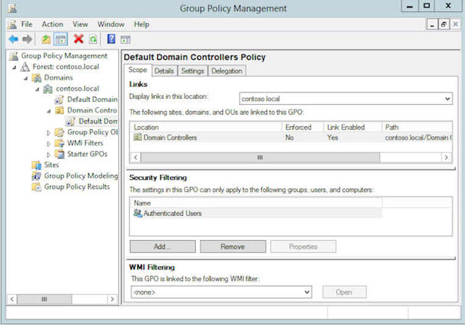
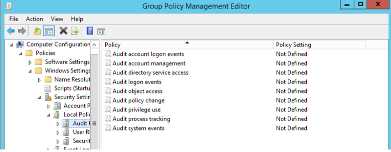
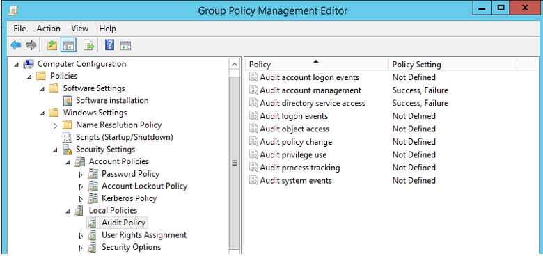

---
# required metadata

title: Planning a bastion environment | Microsoft Identity Manager
description:
keywords:
author: kgremban
manager: femila
ms.date: 09/16/2016
ms.topic: article
ms.prod: identity-manager-2015
ms.service: microsoft-identity-manager
ms.technology: active-directory-domain-services
ms.assetid: bfc7cb64-60c7-4e35-b36a-bbe73b99444b

# optional metadata

#ROBOTS:
#audience:
#ms.devlang:
ms.reviewer: mwahl
ms.suite: ems
#ms.tgt_pltfrm:
#ms.custom:

---

# Planning a bastion environment

Adding a bastion environment with a dedicated administrative forest to an Active Directory enables organizations to easily manage administrative accounts, workstations, and groups in an environment that has stronger security controls than their existing production environment.

This architecture enables a number of controls that aren’t possible or easily configured in a single forest architecture. That includes provisioning accounts as standard non-privileged users in the administrative forest that are highly privileged in the production environment, enabling greater technical enforcement of governance. This architecture also enables the use of the selective authentication feature of a trust as a means to restrict logons (and credential exposure) to only authorized hosts. In situations in which a greater level of assurance is desired for the production forest without incurring the cost and complexity of a complete rebuild, an administrative forest can provide an environment that increases the assurance level of the production environment.

Additional techniques can be used in addition to the dedicated administrative forest. These include restricting where administrative credentials are exposed, limiting role privileges of users in that forest, and ensuring administrative tasks are not performed on hosts used for standard user activities (for example, email and web browsing).

## Best practice considerations

A dedicated administrative forest is a standard single domain Active Directory forest used for Active Directory management. A benefit to using administrative forests and domains is that they can have more security measures than production forests because of their limited use cases. Furthermore, since this forest is separated and does not trust the organization's existing forests, a security compromise in another forest would not extend to this dedicated forest.

An administrative forest design has the following considerations:

### Limited scope

The value of an admin forest is the high level of security assurance and reduced attack surface. The forest can house additional management functions and applications, but each increase in scope will increase the attack surface of the forest and its resources. The objective is to limit the functions of the forest to keep the attack surface minimal.

According to the [Tier model](tier-model-for-partitioning-administrative-privileges.md) of partitioning administrative privileges, the accounts in a dedicated administrative forest should be in a single tier, typically either tier 0 or tier 1. If a forest is in tier 1, consider restricting it to a particular scope of application (e.g., finance apps) or user community (e.g., outsourced IT vendors).

### Restricted trust

The production *CORP* forest should trust the administrative *PRIV* forest, but not the other way around. This can be a domain trust or a forest trust. The admin forest domain does not need to trust the managed domains and forests to manage Active Directory, though additional applications may require a two-way trust relationship, security validation, and testing.

Selective authentication should be used to ensure that accounts in the admin forest only use the appropriate production hosts. For maintaining domain controllers and delegating rights in Active Directory, this typically requires granting the “Allowed to logon” right for domain controllers to designated Tier 0 admin accounts in the admin forest. See [Configuring Selective Authentication Settings](http://technet.microsoft.com/library/cc816580.aspx) for more information.

## Maintain logical separation

In order to ensure that the bastion environment is not impacted by existing or future security incidents in the organizational Active Directory, the following guidelines should be used when preparing systems for the bastion environment:

- Windows Servers should not be domain joined or leverage software or settings distribution from the existing environment.

- The bastion environment must contain its own Active Directory Domain Services, providing Kerberos and LDAP, DNS, time and time services, to the bastion environment.

- MIM should not use a SQL database farm in the existing environment. SQL Server should be deployed on dedicated servers in the bastion environment.

- The bastion environment requires Microsoft Identity Manager 2016, specifically the MIM Service and PAM components must be deployed.

- Backup software and media for the bastion environment must be kept separate from that of systems in the existing forests, so that an administrator in the existing forest cannot subvert a backup of the bastion environment.

- Users who manage the bastion environment servers must log in from workstations that are not accessible to administrators in the existing environment, so that the credentials for the bastion environment are not leaked.

## Ensure availability of administration services

As administration of applications will be transitioned to the bastion environment, take into account how to provide sufficient availability to meet the requirements of those applications. The techniques include:

- Deploy Active Directory Domain Services on multiple computers in the bastion environment. At least two are necessary to ensure continued authentication, even if one server is temporarily restarted for scheduled maintenance. Additional computers may be necessary for higher load or to manage resources and administrators based in multiple geographic regions.

- Prepare break glass accounts in the existing forest and the dedicated admin forest, for emergency purposes.

- Deploy SQL Server and MIM Service on multiple computers in the bastion environment.

- Maintain a backup copy of AD and SQL for each change to users or role definitions in the dedicated admin forest.

## Configure appropriate Active Directory permissions

The administrative forest should be configured to least privilege based on the requirements for Active Directory administration.

- Accounts in the admin forest that are used to administer the production environment should not be granted administrative privileges to the admin forest, domains in it, or workstations in it.

- Administrative privileges over the admin forest itself should be tightly controlled by an offline process to reduce the opportunity for an attacker or malicious insider to erase audit logs. This also helps ensure that personnel with production admin accounts cannot relax the restrictions on their accounts and increase risk to the organization.

- The administrative forest should follow the Microsoft Security Compliance Manager (SCM) configurations for the domain, including strong configurations for authentication protocols.

When creating the bastion environment, before installing Microsoft Identity Manager, identify and create the accounts that will be used for administration within this environment. This will include:

- **Break glass accounts** should only be able to log into the domain controllers in the bastion environment.

- **"Red Card" administrators** provision other accounts and perform unscheduled maintenance. No access to existing forests or systems outside of the bastion environment is provided to these accounts. The credentials, e.g., a smartcard, should be physically secured, and use of these account should be logged.

- **Service accounts** needed by Microsoft Identity Manager, SQL Server, and other software.

## Harden the hosts

All hosts, including domain controllers, servers, and workstations joined to the administrative forest should have the latest operating systems and service packs installed and kept up to date.

- The applications required for performing administration should be pre-installed on workstations so that accounts using them don’t need to be in the local administrators group to install them. Domain Controller maintenance can typically be performed with RDP and Remote Server Administration Tools.

- Admin forest hosts should be automatically updated with security updates. While this may create risk of interrupting domain controller maintenance operations, it provides a significant mitigation of security risk of unpatched vulnerabilities.

### Identify administrative hosts

The risk of a system or workstation should be measured by the highest risk activity that is performed on it, such as Internet browsing, sending and receiving email, or the use of other applications that process unknown or untrusted content.

Administrative hosts include the following computers:

- A desktop on which credentials of the administrator are physically typed or entered.

- Administrative “jump servers” on which administrative sessions and tools are run.

- All hosts on which administrative actions are performed, including those that use a standard user desktop running an RDP client to remotely administer servers and applications.

- Servers that host applications that need to be administered, and are not accessed using RDP with Restricted Admin Mode or Windows PowerShell remoting.

### Deploy dedicated administrative workstations

Although inconvenient, separate hardened workstations dedicated to users with high-impact administrative credentials may be required. It's important to provide a host with a level of security that is equal to or greater than the level of the privileges entrusted to the credentials. Consider incorporating the following measures for additional protection:

- **Verify all media in the build as clean** to mitigate against malware installed in a master image or injected into an installation file during download or storage.

- **Security Baselines** should be used as starting configurations. The Microsoft Security Compliance Manager (SCM) can help configure the baselines on administrative hosts.

- **Secure Boot** to mitigate against attackers or malware attempting to load unsigned code into the boot process.

- **Software restriction** to ensure that only authorized administrative software is executed on the administrative hosts. Customers can use AppLocker for this task with a whitelist of authorized applications, to help prevent malicious software and unsupported applications from executing.

- **Full volume encryption** to mitigate against physical loss of computers, such as administrative laptops used remotely.

- **USB restrictions** to protect against physical infection.

- **Network isolation** to protect against network attacks and inadvertent admin actions. Host firewalls should block all incoming connections except those explicitly required and block all unneeded outbound Internet access.

- **Antimalware** to protect against known threats and malware.

- **Exploit mitigations** to mitigate against unknown threats and exploits, including the Enhanced Mitigation Experience Toolkit (EMET).

- **Attack surface analysis** to prevent introduction of new attack vectors to Windows during installation of new software. Tools such as the Attack Surface Analyzer (ASA) help assess configuration settings on a host and identify attack vectors introduced by software or configuration changes.

- **Administrative privileges** should not be given to users on their local computer.

- **RestrictedAdmin mode** for outgoing RDP sessions, except when required by the role. See [What's New in Remote Desktop Services in Windows Server](https://technet.microsoft.com/library/dn283323.aspx) for more information.

Some of these measures might seem extreme, but public revelations in recent years have illustrated the significant capabilities that skilled adversaries possess to compromise targets.

## Prepare existing domains to be managed by the bastion environment

MIM uses PowerShell cmdlets to establish trust between the existing AD domains and the dedicated administrative forest in the bastion environment. After the bastion environment is deployed, and before any users or groups are converted to JIT, then the `New-PAMTrust` and `New-PAMDomainConfiguration` cmdlets will update the domain trust relationships and create artifacts needed for AD and MIM.

When the existing Active Directory topology changes, the `Test-PAMTrust`, `Test-PAMDomainConfiguration`, `Remove-PAMTrust` and `Remove-PAMDomainConfiguration` cmdlets can be used to update the trust relationships.

## Establish trust for each forest

The `New-PAMTrust` cmdlet must be run once for each existing forest. It is invoked on the MIM Service computer in the administrative domain. The parameters to this command are the domain name of the top domain of the existing forest, and credential of an administrator of that domain.

```
New-PAMTrust -SourceForest "contoso.local" -Credentials (get-credential)
```

After establishing the trust, then configure each domain to enable management from the bastion environment, as described in the next section.

## Enable management of each domain

There are seven requirements for enabling management for an existing domain.

### 1. A security group on the local domain

There must be a group in the existing domain, whose name is the NetBIOS domain name followed by three dollar signs, e.g., *CONTOSO$$$*. The group scope must be *domain local* and the group type must be *Security*. This is needed for groups to be created in the dedicated administrative forest with the same Security identifier as groups in this domain. Create this group with the following PowerShell command, performed by an administrator of the existing domain and run on an workstation joined to the existing domain:

```
New-ADGroup -name 'CONTOSO$$$' -GroupCategory Security -GroupScope DomainLocal -SamAccountName 'CONTOSO$$$'
```

### 2. Success and failure auditing

The group policy settings on the domain controller for auditing must include both success and failure auditing for Audit account management and Audit directory service access. This can be done with the Group Policy management console, performed by an administrator of the existing domain and run on a workstation joined to the existing domain:

3. Go to **Start** > **Administrative Tools** > **Group Policy Management**.

4. Navigate to **Forest: contoso.local** > **Domains** > **contoso.local** > **Domain Controllers** > **Default Domain Controllers Policy**. An informational message will appear.

    

5. Right-click on **Default Domain Controllers Policy** and select **Edit**. A new window will appear.

6. In the Group Policy Management Editor window, under the Default Domain Controllers Policy tree, navigate to **Computer Configuration** > **Policies** > **Windows Settings** > **Security Settings** > **Local Policies** > **Audit Policy**.

    

5. In the details pane, right click on **Audit account management** and select **Properties**. Select **Define these policy settings**, put a checkbox on **Success**, put a checkbox on **Failure**, click **Apply** and **OK**.

6. In the details pane, right click on **Audit directory service access** and select **Properties**. Select **Define these policy settings**, put a checkbox on **Success**, put a checkbox on **Failure**, click **Apply** and **OK**.

    

7. Close the Group Policy Management Editor window and the Group Policy Management window. Then apply the audit settings by launching a PowerShell window and typing:

    ```
    gpupdate /force /target:computere
    ```

The message “Computer Policy update has completed successfully.” should appear after a few minutes.

### 3. Allow connections to the Local Security Authority

The domain controllers must allow RPC over TCP/IP connections for Local Security Authority (LSA) from the bastion environment. On older versions of Windows Server, TCP/IP support in LSA must be enabled in the registry:

```
New-ItemProperty -Path HKLM:SYSTEM\\CurrentControlSet\\Control\\Lsa -Name TcpipClientSupport -PropertyType DWORD -Value 1
```

### 4. Create the PAM domain configuration

The `New-PAMDomainConfiguration` cmdlet must be run on the MIM Service computer in the administrative domain. The parameters to this command are the domain name of the existing domain, and credential of an administrator of that domain.

```
 New-PAMDomainConfiguration -SourceDomain "contoso" -Credentials (get-credential)
```

### 5. Give read permissions to accounts

The accounts in the bastion forest used to establish roles (admins who use the `New-PAMUser` and `New-PAMGroup` cmdlets), as well as the account used by the MIM monitor service, need read permissions in that domain.

The following steps enable read access for the user *PRIV\Administrator* to the domain *Contoso* within the *CORPDC* domain controller:

1. Ensure you are logged into CORPDC as a Contoso domain administrator (such as Contoso\Administrator).

2. Launch Active Directory Users and Computers.

3. Right click on the domain **contoso.local** and select **Delegate Control**.

4. On the Selected users and groups tab, click **Add**.

5. On the Select Users, Computers, or Groups popup, click **Locations** and change the location to *priv.contoso.local*. On the object name, type *Domain Admins* and click **Check Names**. When a popup appears, for the username type *priv\administrator* and the password.

6. After Domain Admins, type *; MIMMonitor*. After the names Domain Admins and MIMMonitor are underlined, click **OK**, then click **Next**.

7. In the list of common tasks, select **Read all user information**, then click **Next** and **Finish**.

18. Close Active Directory Users and Computers.

### 6. A break glass account

If the goal of the privileged access management project is to reduce the number of accounts with Domain Administrator privileges permanently assigned to the domain, there must be a *break glass* account in the domain, in case there is a later problem with the trust relationship. Accounts for emergency access to the production forest should exist in each domain, and should only be able to log into domain controllers. For organizations with multiple sites, additional accounts may be required for redundancy.

### 7. Update permissions in the bastion environment

Review the permissions on the *AdminSDHolder* object in the System container in that domain. The *AdminSDHolder* object has a unique Access Control List (ACL), which is used to control the permissions of security principals that are members of built-in privileged Active Directory groups. Note if any changes to the default permissions have been made that would impact users with administrative privileges in the domain, since those permissions will not apply to users whose account is in the bastion environment.

## Select users and groups for inclusion

The next step is defining the PAM roles, associating the users and groups to which they should have access. This will typically be a subset of the users and groups for the tier identified as being managed in the bastion environment. More information is in [Defining roles for Privileged Access Management](defining-roles-for-pam.md).
