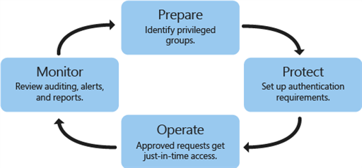
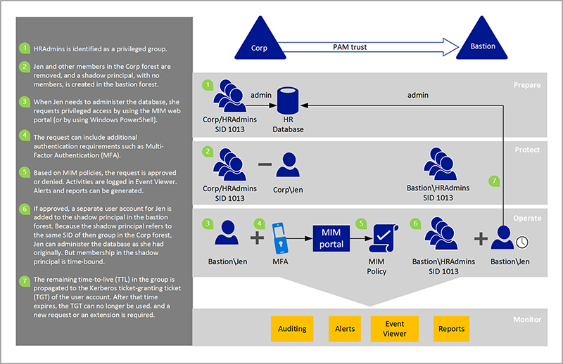

---
# required metadata

title: What is PAM for ADDS? | Microsoft Identity Manager
description: Learn about Privileged Access Management, and how it can help you manage and protect your Active Directory environment.
keywords:
author: kgremban
ms.author: kgremban
manager: femila
ms.date: 10/25/2016
ms.topic: article
ms.service: microsoft-identity-manager
ms.technology: active-directory-domain-services
ms.assetid: cf3796f7-bc68-4cf7-b887-c5b14e855297

# optional metadata

#ROBOTS:
#audience:
#ms.devlang:
ms.reviewer: mwahl
ms.suite: ems
#ms.tgt_pltfrm:
#ms.custom:
experimental: true
experiment_id: kgremban_images
---

# Privileged Access Management for Active Directory Domain Services
Privileged Access Management (PAM) is a solution that helps organizations restrict privileged access within an existing Active Directory environment.

Privileged Access Management accomplishes two goals:

- Re-establish control over a compromised Active Directory environment by maintaining a separate bastion environment that is known to be unaffected by malicious attacks.  
- Isolate the use of privileged accounts to reduce the risk of those credentials being stolen.

> [!NOTE]
> PAM is an instance of [Privileged Identity Management](https://azure.microsoft.com/documentation/articles/active-directory-privileged-identity-management-configure/) (PIM) that is implemented using Microsoft Identity Manager (MIM).

## What problems does PAM help solve?
A real concern for enterprises today is resource access within an Active Directory environment. Particularly troubling is news about vulnerabilities, unauthorized privilege escalations, and other types of unauthorized access including pass-the-hash, pass-the-ticket, spear phishing, and Kerberos compromises.

Today, it’s too easy for attackers to obtain Domain Admins account credentials, and it’s too hard to discover these attacks after the fact. The goal of PAM is to reduce opportunities for malicious users to get access, while increasing your control and awareness of the environment.

PAM makes it harder for attackers to penetrate a network and obtain privileged account access. PAM adds protection to privileged groups that control access across a range of domain-joined computers and applications on those computers. It also adds more monitoring, more visibility, and more fine-grained controls so that organizations can see who their privileged administrators are and what are they doing. PAM gives organizations more insight into how administrative accounts are used in the environment.

## How is PAM set up?
PAM builds on the principle of just-in-time administration, which relates to [just enough administration (JEA)](http://channel9.msdn.com/Events/TechEd/NorthAmerica/2014/DCIM-B362). JEA is a Windows PowerShell toolkit that defines a set of commands for performing privileged activities and an endpoint where administrators can get authorization to run those commands. In JEA, an administrator decides that users with a certain privilege can perform a certain task. Every time an eligible user needs to perform that task, they enable that permission. The permissions expire after a specified time period, so that a malicious user can't steal the access.

PAM setup and operation has four steps.

1.  **Prepare**: Identify which groups in your existing forest have significant privileges. Recreate these groups without members in the bastion forest.

2.  **Protect**: Set up lifecycle and authentication protection, such as Multi-Factor Authentication (MFA), for when users request just-in-time administration. MFA helps prevent programmatic attacks from malicious software or following credential theft.

3.  **Operate**: After authentication requirements are met and a request is approved, a user account gets added temporarily to a privileged group in the bastion forest. For a pre-set amount of time, the administrator has all privileges and access permissions that are assigned to that group. After that time, the account is removed from the group.

4.  **Monitor**: PAM adds auditing, alerts, and reports of privileged access requests. You can review the history of privileged access, and see who performed an activity. You can decide whether the activity is valid or not and easily identify unauthorized activity, such as an attempt to add a user directly to a privileged group in the original forest. This step is important not only to identify malicious software but also for tracking "inside" attackers.

## How does PAM work?
PAM is based on new capabilities in AD DS, particularly for domain account authentication and authorization, and new capabilities in Microsoft Identity Manager. PAM separates privileged accounts from an existing Active Directory environment. When a privileged account needs to be used, it first needs to be requested, and then approved. After approval, the privileged account is given permission via a foreign principal group in a new bastion forest rather than in the current forest of the user or application. The use of a bastion forest gives the organization greater control, such as when a user can be a member of a privileged group, and how the user needs to authenticate.

Active Directory, the MIM Service, and other portions of this solution can also be deployed in a high availability configuration.

The following example shows how PIM works in more detail.

The bastion forest issues time-limited group memberships, which in turn produce time-limited ticket-granting tickets (TGTs). Kerberos-based applications or services can honor and enforce these TGTs, if the apps and services exist in forests that trust the bastion forest.

Day-to-day user accounts do not need to move to a new forest. The same is true with the computers, applications, and their groups. They stay where they are today in an existing forest. Consider the example of an organization that is concerned with these cybersecurity issues today, but has no immediate plans to upgrade the server infrastructure to the next version of Windows Server. That organization can still take advantage of this combined solution by using MIM and a new bastion forest, and can better control access to existing resources.

PAM offers the following advantages:

-   **Isolation/scoping of privileges**: Users do not hold privileges on accounts that are also used for non-privileged tasks like checking email or browsing the Internet. Users need to request privileges. Requests are approved or denied based on MIM policies defined by a PAM administrator. Until a request is approved, privileged access is not available.

-   **Step-up and proof-up**: These are new authentication and authorization challenges to help manage the lifecycle of separate administrative accounts. The user can request the elevation of an administrative account and that request goes through MIM workflows.

-   **Additional logging**: Along with the built-in MIM workflows, there is additional logging for PAM that identifies the request, how it was authorized, and any events that occur after approval.

-   **Customizable workflow**: The MIM workflows can be configured for different scenarios, and multiple workflows can be used, based on the parameters of the requesting user or requested roles.

## How do users request privileged access?
There are a number of ways in which a user can submit a request, including:  
- The MIM Services Web Services API  
- A REST endpoint  
- Windows PowerShell (`New-PAMRequest`)

Get details about the [Privileged Access Management cmdlets](https://technet.microsoft.com/library/mt604080.aspx).

## What workflows and monitoring options are available?
As an example, let’s say a user was a member of an administrative group before PIM is set up. As part of PIM setup, the user is removed from the administrative group, and a policy is created in MIM. The policy specifies that if that user requests administrative privileges and is authenticated by MFA, the request is approved and a separate account for the user will be added to the privileged group in the bastion forest.

Assuming the request is approved, the Action workflow communicates directly with bastion forest Active Directory to put a user in a group. For example, when Jen requests to administer the HR database, the administrative account for Jen is added to the privileged group in the bastion forest within seconds. Her administrative account’s membership in that group will expire after a time limit. With Windows Server Technical Preview, that membership is associated in Active Directory with a time limit; with Windows Server 2012 R2 in the bastion forest, that time limit is enforced by MIM.

> [!NOTE]
> When you add a new member to a group, the change needs to replicate to other domain controllers (DCs) in the bastion forest. Replication latency can impact the ability for users to access resources. For more information about replication latency, see [How Active Directory Replication Topology Works](https://technet.microsoft.com/library/cc755994.aspx).
>
> In contrast, an expired link is evaluated in real time by the Security Accounts Manager (SAM). Even though the addition of a group member needs to be replicated by the DC that receives the access request, the removal of a group member is evaluated instantaneously on any DC.

This workflow is specifically intended for these administrative accounts. Administrators (or even scripts) who need only occasional access for privileged groups, can precisely request that access. MIM logs the request and the changes in Active Directory, and you can view them in Event Viewer or send the data to enterprise monitoring solutions such as System Center 2012 - Operations Manager Audit Collection Services (ACS), or other third-party tools.
