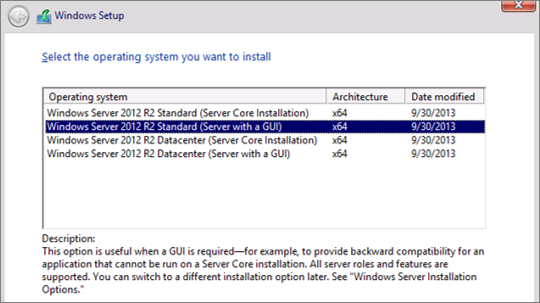

---
# required metadata

title: Deploy PAM step 3 – PAM server | Microsoft Docs
description: Prepare a PAM server that will host both SQL and SharePoint for your Privileged Access Management deployment.
keywords:
author: barclayn
ms.author: barclayn
manager: mbaldwin
ms.date: 09/13/2017
ms.topic: article
ms.service: microsoft-identity-manager
ms.technology: active-directory-domain-services
ms.assetid: 68ec2145-6faa-485e-b79f-2b0c4ce9eff7

# optional metadata

ROBOTS: noindex,nofollow
#audience:
#ms.devlang:
ms.reviewer: mwahl
ms.suite: ems
#ms.tgt_pltfrm:
#ms.custom:

---
# Step 3 – Prepare a PAM server

>[!div class="step-by-step"]
[« Step 2](step-2-prepare-priv-domain-controller.md)
[Step 4 »](step-4-install-mim-components-on-pam-server.md)

## Install Windows Server 2012 R2

On a third virtual machine, install Windows Server 2012 R2, specifically Windows Server 2012 R2 Standard (Server with a GUI) x64, to make *PAMSRV*. Since SQL Server and SharePoint 2013 will be installed on this computer, it requires at least 8GB of RAM.

1. Select **Windows Server 2012 R2 Standard (Server with a GUI) x64**.

    

2. Review and accept the license terms.

3.  Since the disk will be empty, select **Custom: Install Windows only** and use the **uninitialized disk space**.

4.  Sign in to that new computer as its administrator.  Using Control Panel, give it a static IP address on the virtual network, configure that network interface to send DNS queries to the IP address of PRIVDC and set the computer name to *PAMSRV*.  This will require a server restart.

5.  If the virtual network does not provide Internet connectivity, add an additional network interface to the computer that provides a connection to the Internet.  This will be needed for the SharePoint installation, and can be disabled after this step is completed.

6.  After the server has restarted, sign in as the administrator. Using Control Panel, configure the computer to check for updates, and install any updates needed.  This may require a server restart.

7.  After the server restarts, sign in as Administrator, open the Control Panel and join PAMSRV to the PRIV domain (priv.contoso.local).  This will require providing the username and credentials of a PRIV domain administrator (PRIV\Administrator). After the welcome message appears, close the dialog box and restart this server.


### Add the web server (IIS) and application server roles

Add the Web Server (IIS) and Application Server roles, the .NET Framework 3.5 Features, the Active Directory module for Windows PowerShell, and other features required by SharePoint

1.  Sign in as a PRIV domain administrator (PRIV\Administrator) and launch PowerShell.

2.  Type the following commands. Note that it may be necessary to specify a different location for the source files for .NET Framework 3.5 features. These features are typically not present when Windows Server installs, but are available in the side-by-side (SxS) folder on the OS install disk sources folder, e.g., d:\Sources\SxS\.

    ```PowerShell
    import-module ServerManager
    Install-WindowsFeature Web-WebServer, Net-Framework-Features,
    rsat-ad-powershell,Web-Mgmt-Tools,Application-Server,
    Windows-Identity-Foundation,Server-Media-Foundation,
    Xps-Viewer –includeallsubfeature -restart -source d:\sources\SxS
    ```

### Configure the server security policy

Configure the server security policy to allow the newly-created accounts to run as services.

1.  Launch the **Local Security Policy** program.   
2.  Navigate to **Local Policies** > **User Rights Assignment**.  
3.  On the details pane, right click on **Log on as a service**, and select **Properties**.  
4.  Click **Add User or Group**, and in the User and group names, type *priv\mimmonitor; priv\MIMService; priv\SharePoint; priv\mimcomponent; priv\SqlServer*. Click **Check Names**, and click **OK**.  

5.  Click **OK** to close the Properties window.  
6.  On the details pane, right click on **Deny access to this computer from the network**, and select **Properties**.  
7.  Click **Add User or Group**, and in the User and group names, type *priv\mimmonitor; priv\MIMService; priv\mimcomponent* and click **OK**.  
8.  Click **OK** to close the properties window.  

9. On the details pane, right click on **Deny log on locally**, and select **Properties**.  
10. Click **Add User or Group**, and in the User and group names, type *priv\mimmonitor; priv\MIMService; priv\mimcomponent* and click **OK**.  
11. Click **OK** to close the properties window.  
12. Close the Local Security Policy window.  

13. Open Control Panel and switch to **User Accounts**.  
14. Click **Give others access to this computer**.  
15. Click **Add**, enter the user *MIMADMIN* in the domain *PRIV*, and on the next screen in the wizard, click **Add this user as an Administrator**.  
16. Click **Add**, enter the user *SharePoint* in the domain *PRIV*, and on the next screen in the wizard, click **Add this user as an Administrator**.  
17. Close Control Panel.  

### Change the IIS configuration

There are two ways to change the IIS configuration to allow applications to use Windows Authentication mode. Make sure you are signed in as MIMAdmin and then follow one of these options.

If you want to use PowerShell:
1.  Right click on PowerShell and select **Run as administrator**.  
2.  Stop IIS and unlock the application host settings using these commands  
    ```CMD
    iisreset /STOP
    C:\Windows\System32\inetsrv\appcmd.exe unlock config /section:windowsAuthentication -commit:apphost
    iisreset /START
    ```

If you want to use a text editor such as Notepad:   
1. Open the file **C:\Windows\System32\inetsrv\config\applicationHost.config**   
2. Scroll down to line 82 of that file. The tag value of **overrideModeDefault** should be **<section name="windowsAuthentication" overrideModeDefault="Deny" />**  
3. Change the value of **overrideModeDefault** to *Allow*  
4. Save the file, and restart IIS with the PowerShell command `iisreset /START`

## Install SQL Server

If SQL Server is not in the bastion environment already, install either SQL Server 2012 (Service Pack 1 or later) or SQL Server 2014. The following steps assume SQL 2014.

1. Make sure you are signed in as MIMAdmin.
2. Right click on PowerShell and select **Run as administrator**.   
3. Navigate to the directory where the SQL Server setup program is located.  
4. Type the following command.  
    ```
    .\setup.exe /Q /IACCEPTSQLSERVERLICENSETERMS /ACTION=install /FEATURES=SQL,SSMS /INSTANCENAME=MSSQLSERVER /SQLSVCACCOUNT="PRIV\SqlServer" /SQLSVCPASSWORD="Pass@word1" /AGTSVCSTARTUPTYPE=Automatic /AGTSVCACCOUNT="NT AUTHORITY\Network Service" /SQLSYSADMINACCOUNTS="PRIV\MIMAdmin"
    ```

## Install SharePoint Foundation 2013

Using the SharePoint Foundation 2013 with SP1 installer, install SharePoint’s software prerequisites on PAMSRV.

> [!NOTE]
> This installer requires an internet connection to download the prerequisites. And after they are installed, the server will restart.

1. Right click on PowerShell and select **Run as administrator**.  
2. Change to the directory where SharePoint was unpacked.  
3. Type the command `.\prerequisiteinstaller.exe`.

After the SharePoint prerequisites are installed, install SharePoint Foundation 2013 with SP1.

1.  Right click on PowerShell and select **Run as administrator**.  
2.  Change to the directory where SharePoint was unpacked.  
3.  Type the command `.\setup.exe`.  
4.  Select the **complete server** type.  
5.  After the install completes, select to run the wizard.  

### Configure SharePoint

Run the SharePoint Products Configuration Wizard to configure SharePoint.

1.  On the Connect to a Server Farm tab, change to **Create a new server farm**.  
2.  Specify **PAMSRV** as the database server for the configuration database, and **PRIV\SharePoint** as the database access account for SharePoint to use.  
3.  Specify a password as the farm security passphrase (it will not be used later in this walkthrough).  
4.  For now, accept the rest of the SharePoint configuration wizard default settings to make a single-server farm.    
5.  When the configuration wizard completes configuration task 10 of 10, click **Finish** and a web browser will open.  
6.  In the Internet Explorer popup, authenticate as the domain administrator (PRIV\MIMAdmin) to proceed.  
7.  Start the wizard within the web app to configure the SharePoint farm.  
8.  Select to use the existing managed account (PRIV\SharePoint), uncheck to disable any optional services, and click **Next**.  
9. Once the Creating a Site Collection Window appears, click **Skip** then **Finish**.  

## Create a SharePoint Foundation 2013 web application

After the wizards complete, use PowerShell to create a SharePoint Foundation 2013 Web Application to host the MIM Portal. Since this walkthrough is for demonstration purposes, SSL will not be enabled.

1.  Right click on SharePoint 2013 Management Shell, select **Run as administrator**, and run the following PowerShell script:

    ```PowerShell
    $dbManagedAccount = Get-SPManagedAccount -Identity PRIV\SharePoint
    New-SpWebApplication -Name "MIM Portal" -ApplicationPool "MIMAppPool" -ApplicationPoolAccount $dbManagedAccount -AuthenticationMethod "Kerberos" -Port 82 -URL http://PAMSRV.priv.contoso.local
    ```

2. A warning message will appear that Windows Classic authentication method is being used, and it may take several minutes for the final command to return.  When completed, the output will give the URL of the new portal.

> [!NOTE]
> Keep the SharePoint 2013 Management Shell window open to use it in the next step.

## Create a SharePoint site collection

Next, create a SharePoint Site Collection associated with that web application to host the MIM Portal.

1.  Launch  **SharePoint 2013 Management Shell**, if not already open, and run the following PowerShell script

    ```PowerShell
    $t = Get-SPWebTemplate -compatibilityLevel 14 -Identity "STS#1"
    $w = Get-SPWebApplication http://pamsrv.priv.contoso.local:82
    New-SPSite -Url $w.Url -Template $t -OwnerAlias PRIV\MIMAdmin                -CompatibilityLevel 14 -Name "MIM Portal" -SecondaryOwnerAlias PRIV\BackupAdmin
    $s = SpSite($w.Url)
    $s.AllowSelfServiceUpgrade = $false
    $s.CompatibilityLevel
    ```

    Make sure that the **CompatibilityLevel** variable is set to *14*. If it returns *15*, then the site collection was not created for the 2010 experience version; delete the site collection and recreate it.

2.  Run the following PowerShell commands in the **SharePoint 2013 Management Shell**. This will isable SharePoint server-side viewstate, and the SharePoint task **Health Analysis Job (Hourly, Microsoft SharePoint Foundation Timer, All Servers)**.

    ```PowerShell
    $contentService = [Microsoft.SharePoint.Administration.SPWebService]::ContentService;
    $contentService.ViewStateOnServer = $false;
    $contentService.Update();
    Get-SPTimerJob hourly-all-sptimerservice-health-analysis-job | disable-SPTimerJob
    ```

## Change update settings

1. Open the Control Panel, navigate to **Windows Update**, and click to **change settings**.  
2. Change the settings to receive updates from Window Update and other products from Microsoft Updates.  
3. Check for new updates and make sure any pending important updates are installed before continuing.

## Set the website as the local intranet

1. Launch Internet Explorer and open a new web browser tab
2. Navigate to http://pamsrv.priv.contoso.local:82/ and sign in as PRIV\MIMAdmin.  An empty SharePoint site named “MIM Portal” will be shown.  
3. In Internet Explorer open **Internet Options**, change to the **Security** tab, select **Local intranet**, and add the URL `http://pamsrv.priv.contoso.local:82/`.

If sign in fails, the Kerberos SPNs created earlier in [Step 2](step-2-prepare-priv-domain-controller.md) might need to be updated.

## Start the SharePoint administration service

Using **Services** (located in Administrative Tools), start the **SharePoint Administration** service, if not already running.

In Step 4, you will start installing the MIM components onto the PAM server.

>[!div class="step-by-step"]
[« Step 2](step-2-prepare-priv-domain-controller.md)
[Step 4 »](step-4-install-mim-components-on-pam-server.md)
