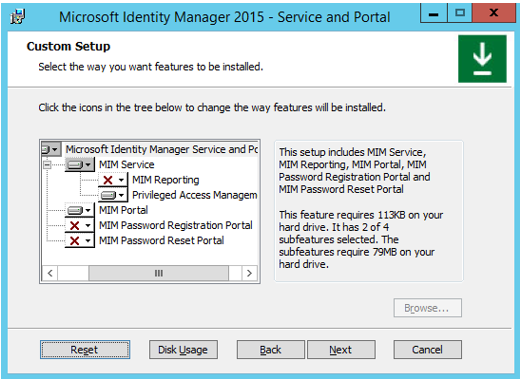
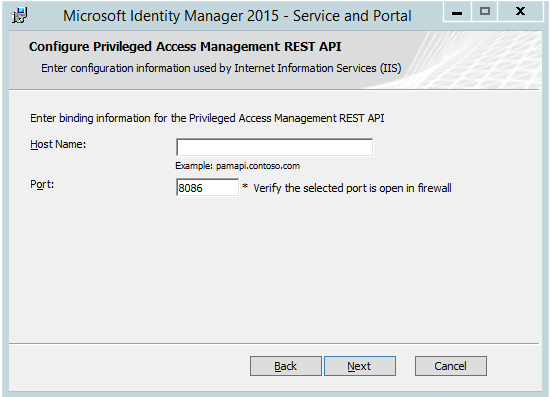
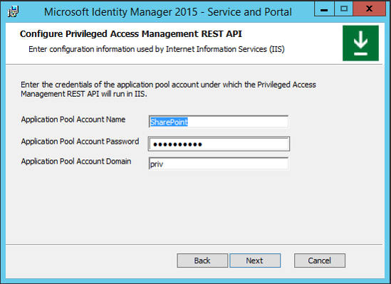
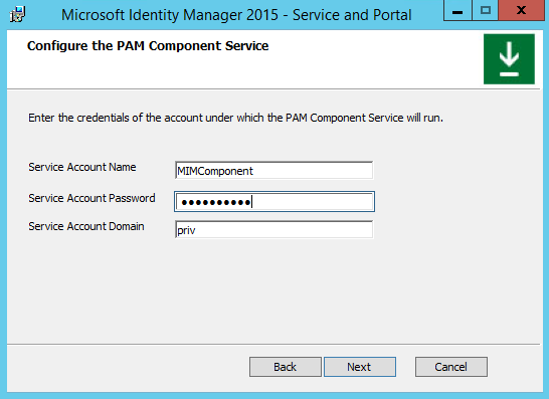
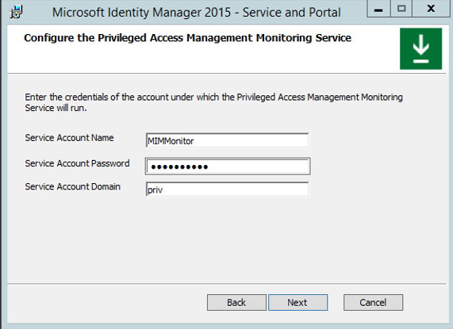

---
# required metadata

title: Step 4 – Install MIM components on PAM server and workstation | Microsoft Identity Manager
description:
keywords:
author: kgremban
manager: femila
ms.date: 06/16/2016
ms.topic: article
ms.prod: identity-manager-2015
ms.service: microsoft-identity-manager
ms.technology: active-directory-domain-services
ms.assetid: ef605496-7ed7-40f4-9475-5e4db4857b4f

# optional metadata

ROBOTS: noindex,nofollow
#audience:
#ms.devlang:
ms.reviewer: mwahl
ms.suite: ems
#ms.tgt_pltfrm:
#ms.custom:

---

# Step 4 – Install MIM components on PAM server and workstation

>[!div class="step-by-step"]
[« Step 3](step-3-prepare-pam-server.md)
[Step 5 »](step-5-establish-trust-between-priv-corp-forests.md)


On PAMSRV, sign in as PRIV\Administrator to be able to install MIM Service and Portal and the sample portal web application.

  > [!NOTE] You must be a domain administrator; if you are not running the following commands as a domain administrator, the trust validation checks in the next step will not be completed.

If you have downloaded MIM, unpack the MIM installation archive to a new folder.

##  Run the Service and Portal install program.  

Follow the guidelines of the installer and complete the installation.

1.  When selecting component features, include MIM Service (with Privileged Access Management, but not MIM Reporting) and MIM Portal  

    

2.  When configuring common services and the MIM database connection, specify **Create a new database**.

    > [!NOTE] If you install MIM Service multiple times for high availability, specify **Use an existing database** for all subsequent installations.

3.  When configuring a mail server connection, set the mail server to the hostname of an Exchange or SMTP server for the CORP environment (use corpdc.contoso.local if you do not have a mail server) and uncheck the **Use SSL** and **Mail Server is Exchange Server 2007 or Exchange Server 2010** checkboxes.

4.  Choose to generate a new self-signed certificate.

5.  Set the following account credentials:
    - Service Account Name: *MIMService*  
    - Service Account Password: *Pass@word1* (or the password you created in Step 2)  
    - Service Account Domain: *PRIV*  
    - Service Email Account: *MIMService@priv.contoso.local*  

6.  Accept the defaults for the synchronization server hostname and specify the MIM Management Agent account as *PRIV\MIMMA*. A warning message will appear that the MIM synchronization service does not exist. This is OK, since the MIM synchronization service is not used in this scenario.

7.  Set *PAMSRV* as MIM Service server address.

8.  Set *http://pamsrv.priv.contoso.local:82* as the SharePoint site collection URL.

9. Leave the registration portal URL blank.

10. Select the checkbox to open ports 5725 and 5726 in the firewall, and the checkbox to grant all authenticated users access to the MIM portal site.

11. Leave the PAM REST API hostname empty, and set *8086* as the port number.

  

12. Configure the MIM PAM REST API account to use the same account as SharePoint (as the MIM Portal is co-located on this server):
    - Application Pool Account Name: *SharePoint*  
    - Application Pool Account Password: *Pass@word1* (or the password you created in Step 2)  
    - Application Pool Account Domain: *PRIV*  

    

    A warning may appear that the Service Account is not secure in its current configuration. That's OK.

13. Configure the MIM PAM component service:
    - Service Account Name: *MIMComponent*
    - Service Account Password: *Pass@word1* (or the password you created in Step 2)  
    - Service Account Domain: *PRIV*

  

14. Configure the PAM Monitoring Service:
    - Service Account Name: *MIMMonitor*  
    - Service Account Password: *Pass@word1* (or the password you created in Step 2)  
    - Service Account Domain: *PRIV*  

  

15. On the Enter Information for MIM Password Portals page, leave checkboxes empty and continue. Click **Next** to continue the installation.

After installation completes, the server will reboot, then verify that the MIM Portal is active and enable users to view their own object resource in MIM.

## Set up MIM Portal management policy rules

1. After PAMSRV reboots, sign in as PRIV\Administrator.

2. Launch Internet Explorer and connect to the MIM Portal on http://pamsrv.priv.contoso.local:82/identitymanagement. There may be a short delay the first time this page is located.

3. If necessary, sign in as PRIV\Administrator for Internet Explorer.

4. In Internet Explorer, open the **Internet Options**, change to the **Security** tab, and add the site to the **Local intranet zone** if it is not already there. Close the Internet Options dialog.

5. Using Internet Explorer to view MIM Portal, click on **Management Policy Rules**.

6. Search for the management policy rule **User management: Users can read attributes of their own**.

7. Select this management policy rule, uncheck **Policy is disabled**, click **OK**, and then click **Submit**.

## Verify the firewall connections

The firewall should allow incoming connections to TCP port 5725, 5726, 8086 and 8090.

1.  Launch **Windows Firewall with Advanced Security** (located in Administrative Tools).  
2.  Click on **Inbound Rules**.  
3.  Verify that these two rules are listed:  
    - Forefront Identity Manager Service (STS)
    - Forefront Identity Manager Service (Webservice)  
4.  Click **New rule** > **Port** > **TCP**, and type the specific local ports *8086* and *8090*. Click through the wizard accepting the defaults, give the rule a name, and click **Finish**.  
5.  After completing the wizard, close the Windows Firewall application.

6.  Launch **Control Panel**.  
7.  Under Network and Internet select **View network status and tasks**.  
8.  Verify that there is an active Network which is listed as being priv.contoso.local and a Domain network.  
9. Close **Control Panel**.

## Set up the sample web application

In this section you will install and configure the sample web application for the MIM PAM REST API.

1.  From the sample web application archive, download the [Identity Management samples](https://github.com/Azure/identity-management-samples) as a zip file.

2. Unpack the contents of the folder **identity-management-samples-master\Privileged-Access-Management-Portal\src** into a new folder **C:\Program Files\Microsoft Forefront Identity Manager\2010\Privileged Access Management Portal**.

3.  Create new web site in IIS with a site name of MIM Privileged Access Management Example Portal, physical path C:\Program Files\Microsoft Forefront Identity Manager\2010\Privileged Access Management Portal, and port 8090.  This can be done using the following PowerShell command:

  ```
  New-WebSite -Name "MIM Privileged Access Management Example Portal" -Port 8090   -PhysicalPath "C:\Program Files\Microsoft Forefront Identity Manager\2010\Privileged Access Management Portal\"
  ```

4.  Set up the sample web application to be able to redirect users to the MIM PAM REST API. Using a text editor such as Notepad, edit the file **C:\Program Files\Microsoft Forefront Identity Manager\2010\Privileged Access Management REST API\web.config**. In the **<system.webServer>** section, add the following lines:

  ```
  <httpProtocol>
    <customHeaders>
      <add name="Access-Control-Allow-Credentials" value="true"  />
      <add name="Access-Control-Allow-Headers" value="content-type" />
      <add name="Access-Control-Allow-Origin" value="http://pamsrv:8090" />  
    </customHeaders>
  </httpProtocol>
  ```

5.  Configure the sample web application. Using a text editor such as Notepad, edit the file **C:\Program Files\Microsoft Forefront Identity Manager\2010\Privileged Access Management Portal\js\utils.js**. Set the value of **pamRespApiUrl** to *http://pamsrv.priv.contoso.local:8086/api/pamresources/*.

6.  Restart IIS with the following command for these changes to take effect.

  ```
  iisreset
  ```

7.  (Optional) Verify that the user can authenticate to the REST API. Open a web browser as the administrator on PAMSRV.  Navigate to the web site URL http://pamsrv.priv.contoso.local:8086/api/pamresources/pamroles/, authenticate if needed, and ensure that a download occurs.

## Install the MIM PAM requestor cmdlets

Install the MIM PAM requestor cmdlets on the workstation configured in Step 1.

1.  Sign in to CORPWKSTN as an administrator.

2.  Download the **Add-ins and extensions** to the CORPWKSTN computer, if not already present.

3.  Unpack from the archive the folder **Add-ins and extensions** to a new folder.

4.  Run the installer **setup.exe**.

5.  On the custom setup, specify the **PAM Client** is to be installed, but not the **MIM Add-in for Outlook** or the **MIM Password and Authentication Extensions**.

6.  On the PAM Server address, specify as the hostname of the PRIV MIM server *pamsrv.priv.contoso.local*.

After the installation completes, restart CORPWKSTN to complete the registration of the new PowerShell module.

In the next step, you will establish trust between PRIV and CORP forests.

>[!div class="step-by-step"]
[« Step 3](step-3-prepare-pam-server.md)
[Step 5 »](step-5-establish-trust-between-priv-corp-forests.md)
