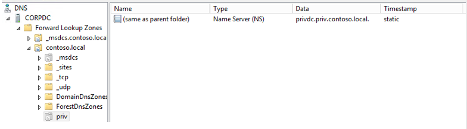

---
# required metadata

title: Deploy PAM step 5 – Forest link | Microsoft Docs
description: Establish trust between the PRIV and CORP forests so that privileged users in PRIV can still access resources in CORP.
keywords:
author: billmath
ms.author: billmath
manager: daveba
ms.date: 11/29/2017
ms.topic: article
ms.prod: microsoft-identity-manager

ms.assetid: eef248c4-b3b6-4b28-9dd0-ae2f0b552425

# optional metadata

#ROBOTS:
#audience:
#ms.devlang:
ms.reviewer: mwahl
ms.suite: ems
#ms.tgt_pltfrm:
#ms.custom:

---
# Step 5 – Establish trust between PRIV and CORP forests

> [!div class="step-by-step"]
> [« Step 4](step-4-install-mim-components-on-pam-server.md)
> [Step 6 »](step-6-transition-group-to-pam.md)

For each CORP domain such as contoso.local, the PRIV and CONTOSO domain controllers need to be bound by a trust. This lets users in the PRIV domain to access resources on the CORP domain.

## Connect each domain controller to its counterpart

Before establishing trust, each domain controller must be configured for DNS name resolution for its counterpart, based on the other domain controller/DNS server’s IP address.

1.  If the domain controllers or server with the MIM software are deployed as virtual machines, ensure that there are no other DNS servers which are providing domain naming services to those computers.
    - If the virtual machines have multiple network interfaces, including network interfaces connected to public networks, you may need to temporarily disable those connections or override the Windows network interface settings. It's important to make sure that a DHCP-supplied DNS server address is not used by any virtual machines.

2.  Verify that each existing CORP domain controller is able to route names to the PRIV forest. On each domain controller outside of the PRIV forest, such as CORPDC, launch PowerShell, and type the following command:

    ```cmd
    nslookup -qt=ns priv.contoso.local.
    ```
    Check that the output indicates a nameserver record for the PRIV domain with the correct IP address.

3.  If the domain controller is unable to route the PRIV domain, use **DNS Manager** (located in **Start** > **Application Tools** > **DNS**) to configure DNS name forwarding for the PRIV domain to PRIVDC’s IP address. If it is a superior domain (e.g., contoso.local), expand the nodes for this domain controller and its domain, such as **CORPDC** > **Forward Lookup Zones** > **contoso.local**, and ensure a key named **priv** is present as a Name Server (NS) type.

    

## Establish trust on PAMSRV

On PAMSRV, establish one-way trust with each domain such as CORPDC so that the CORP domain controllers trust the PRIV forest.

1. Sign in to PAMSRV as a PRIV domain administrator (PRIV\Administrator).

2.  Launch PowerShell.

3.  Type the following PowerShell commands for each existing forest. Enter the credential for the CORP domain administrator (CONTOSO\Administrator) when prompted.

    ```PowerShell
    $ca = get-credential
    New-PAMTrust -SourceForest "contoso.local" -Credentials $ca
    ```

4.  Type the following PowerShell commands for each domain in the existing forests. Enter the credential for the CORP domain administrator (CONTOSO\Administrator) when prompted.

    ```PowerShell
    $ca = get-credential
    New-PAMDomainConfiguration -SourceDomain "contoso" -Credentials $ca
    ```

## Give forests read access to Active Directory

For each existing forest, enable read access to AD by PRIV administrators and the monitoring service.

1. Sign in to the existing CORP forest domain controller, (CORPDC), as a domain administrator for the top-level domain in that forest (Contoso\Administrator).  
2. Launch **Active Directory Users and Computers**.  
3. Right click on the domain **contoso.local** and select **Delegate Control**.  
4. On the Selected Users and Groups tab, click **Add**.  
5. On the Select Users, Computers, or Groups window, click **Locations** and change the location to *priv.contoso.local*.  On the object name, type *Domain Admins* and click **Check Names**. When a popup appears, enter the username *priv\administrator* and its password.  
6. After Domain Admins, add "*; MIMMonitor*". Once the names **Domain Admins** and **MIMMonitor** are underlined, click **OK**, then click **Next**.  
7. In the list of common tasks, select **Read all user information**, then click **Next** and **Finish**.  
8. Close Active Directory Users and Computers.

9. Open a PowerShell window.
10. Use `netdom` to ensure SID history is enabled and SID filtering is disabled. Type:
    ```cmd
    netdom trust contoso.local /quarantine:no /domain priv.contoso.local
    netdom trust /enablesidhistory:yes /domain priv.contoso.local
    ```
    The output should say either **Enabling SID history for this trust** or **SID history is already enabled for this trust**.

    The output should also indicate that **SID filtering is not enabled for this trust**. See [Disable SID filter quarantining](http://technet.microsoft.com/library/cc772816.aspx)  for more information.

## Start the Monitoring and Component services

1.  Sign in to PAMSRV as a PRIV domain administrator (PRIV\Administrator).

2.  Launch PowerShell.

3.  Type the following PowerShell commands.

    ```cmd
    net start "PAM Component service"
    net start "PAM Monitoring service"
    ```

In the next step, you will move a group to PAM.

> [!div class="step-by-step"]
> [« Step 4](step-4-install-mim-components-on-pam-server.md)
> [Step 6 »](step-6-transition-group-to-pam.md)
