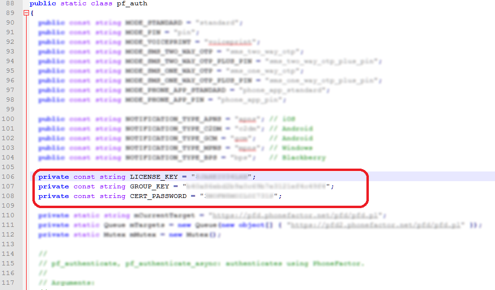

# Using Azure MFA for activation
> [!IMPORTANT]
> Due to the announcement of Deprecation of Azure Multi-Factor Authentication Software Development Kit. The Azure MFA SDK will be supported for existing customers up until the retirement date of November 14, 2018. New customers and current customers will not be able to download SDK anymore via the Azure classic portal. To download you will need to reach out to Azure customer support to receive your generated MFA Service Credentials package. <br> The Microsoft development team is working on changes to MFA by integrating with MFA Server SDK.  This will be included in an upcoming hotfix please see [version history](/reference/version-history.md) for announcements. 


When configuring a PAM role, you can choose how to authorize users that request to activate the role. The choices that the PAM authorization activity implements are:

- Role owner approval
- [Azure Multi-Factor Authentication (MFA)](https://docs.microsoft.com/azure/multi-factor-authentication/multi-factor-authentication)

If neither check is enabled, candidate users are automatically activated for their role.

Microsoft Azure Multi-Factor Authentication (MFA) is an authentication service that requires users to verify their sign-in attempts by using a mobile app, phone call, or text message. It is available to use with Microsoft Azure Active Directory, and as a service for cloud and on-premises enterprise applications. For the PAM scenario, Azure MFA provides an additional authentication mechanism. Azure MFA can be used for authorization, regardless of how a user authenticated to the Windows PRIV domain.

## Prerequisites

In order to use Azure MFA with MIM, you need:

- Internet access from each MIM Service providing PAM, to contact the Azure MFA service
- An Azure subscription
- Azure Active Directory Premium licenses for candidate users, or an alternate means of licensing Azure MFA
- Phone numbers for all candidate users

## Creating an Azure MFA Provider

In this section, you set up your Azure MFA provider in Microsoft Azure Active Directory.  If you are already using Azure MFA, either standalone or configured with Azure Active Directory Premium, skip to the next section.

1.  Open a web browser and connect to the [Azure classic portal](https://manage.windowsazure.com) as an Azure subscription administrator.

2.  In the bottom left hand corner, click **New**.

3.  Click **App Services > Active Directory > Multi-Factor Auth Provider > Quick Create**.

4.  In the **Name** field, enter **PAM**, and in the Usage Model field, select Per Enabled User. If you have an Azure AD directory already, select that directory. Finally, click **Create**.

## Downloading the Azure MFA Service Credentials

Next, you’ll generate a file that includes the authentication material for PAM to contact Azure MFA.

1. Open a web browser and connect to the [Azure classic portal](https://manage.windowsazure.com) as an Azure subscription administrator.

2.  Click **Active Directory** in the Azure Portal menu, and then click the **Multi-Factor Auth Providers** tab.

3.  Click on the Azure MFA provider you'll be using for PAM, and then click **Manage**.

4.  In the new window, on the left panel, under **Configure**, click on **Settings**.

5.  In the **Azure Multi-Factor Authentication** window, click **SDK** under **Downloads**.

6.  Click the **Download** link in the ZIP column for the file with language **SDK for ASP.net 2.0 C\#**.


7.  Copy the resulting ZIP file to each system where MIM Service is installed. 

>[!NOTE]
> The ZIP file contains keying material which is used to authenticate to the Azure MFA service.

## Configuring the MIM Service for Azure MFA

1.  On the computer where the MIM Service is installed, sign in as an administrator or as the user who installed MIM.

2.  Create a new directory folder under the directory where the MIM Service was installed, such as ```C:\Program Files\Microsoft Forefront Identity Manager\2010\Service\MfaCerts```.

3.  Using Windows Explorer, navigate into the ```pf\certs``` folder of the ZIP file downloaded in the previous section. Copy the file ```cert\_key.p12``` to the new directory.

4.  Using Windows Explorer, navigate into the ```pf``` folder of the ZIP, and open the file ```pf\_auth.cs``` in a text editor like Wordpad.

5. Find these three parameters: ```LICENSE\_KEY```, ```GROUP\_KEY```, ```CERT\_PASSWORD```.



6. Using Notepad, open **MfaSettings.xml** located in ```C:\Program Files\Microsoft Forefront Identity Manager\2010\Service```.

7. Copy the values from the LICENSE\_KEY, GROUP\_KEY, and CERT\_PASSWORD parameters in the pf\_auth.cs file into their respective xml elements in the MfaSettings.xml file.

8. In the **<CertFilePath>** XML element, specify the full path name of the cert\_key.p12 file extracted earlier.

9. In the **<username>** element enter any username.

10. In the **<DefaultCountryCode>** element enter the country code for dialing your users, such as 1 for the United States and Canada. This value is used in case users are registered with telephone numbers that do not have a country code. If a user’s phone number has an international country code distinct from that configured for the organization, then that country code must be included in the phone number that will be registered.

11. Save and overwrite the **MfaSettings.xml** file in the MIM Service folder ```C:\Program Files\Microsoft Forefront Identity Manager\2010\\Service```.

> [!NOTE]
> At the end of the process, ensure that the file **MfaSettings.xml**, or any copies of it or the ZIP file are not publically readable.

## Configure PAM users for Azure MFA

For a user to activate a role that requires Azure MFA, the user's telephone number must be stored in MIM. There are two ways this attribute is set.

First, the `New-PAMUser` command copies a phone number attribute from the user's directory entry in CORP domain, to the MIM Service database. Note that this is a one-time operation.

Second, the `Set-PAMUser` command updates the phone number attribute in the MIM Service database. For example, the following replaces an existing PAM user's phone number in the MIM Service. Their directory entry is unchanged.

```PowerShell
Set-PAMUser (Get-PAMUser -SourceDisplayName Jen) -SourcePhoneNumber 12135551212
```

## Configure PAM roles for Azure MFA

Once all of the candidate users for a PAM role have their telephone numbers stored in the MIM Service database, the role can be configured to require Azure MFA. This is done using the `New-PAMRole` or `Set-PAMRole` commands. For example,

```PowerShell
Set-PAMRole (Get-PAMRole -DisplayName "R") -MFAEnabled 1
```

Azure MFA can be disabled for a role by specifying the parameter "-MFAEnabled 0" in the `Set-PAMRole` command.

## Troubleshooting

The following events can be found in the Privileged Access Management event log:

| ID  | Severity | Generated by | Description |
|-----|----------|--------------|-------------|
| 101 | Error       | MIM Service            | User did not complete Azure MFA (e.g., did not answer the phone) |
| 103 | Information | MIM Service            | User completed Azure MFA during activation                       |
| 825 | Warning     | PAM Monitoring Service | Telephone number has been changed                                |

To find out more information about failing telephone calls (event 101), you can also view or download a report from Azure MFA.

1.  Open a web browser and connect to the [Azure classic portal](https://manage.windowsazure.com) as an Azure AD global administrator.

2.  Select **Active Directory** in the Azure Portal menu, and then select the **Multi-Factor Auth Providers** tab.

3.  Select the Azure MFA provider you're using for PAM, and then click **Manage**.

4.  In the new window, click **Usage**, then click **User Details**.

5.  Select the time range, and check the box by the **Name** in the additional report column. Click **Export to CSV**.

6.  When the report has been generated, you can view it in the portal or, if the MFA report is extensive, download it to a CSV file. **SDK** values in the **AUTH TYPE** column indicate rows that are relevant as PAM activation requests: these are events originating from MIM or other on-premises software. The **USERNAME** field is the GUID of the user object in the MIM service database. If a call was unsuccessful, the value in the **AUTHD** column will be **No** and the value of the **CALL RESULT** column will contain the details of the failure reason.

## Next Steps

- [What is Azure Multi-Factor Authentication](https://docs.microsoft.com/azure/multi-factor-authentication/multi-factor-authentication)
- [Create your free  Azure account today](https://azure.microsoft.com/free/)