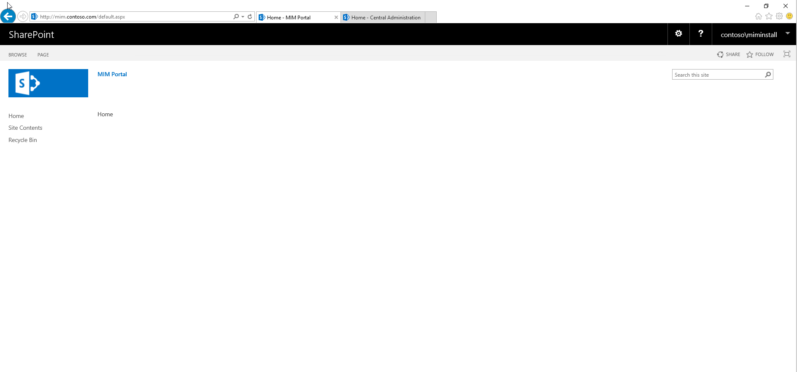

---
# required metadata

title: Configure SharePoint for Microsoft Identity Manager 2016 | Microsoft Docs
description: Install and configure SharePoint Foundation so that it can host the MIM Portal page.
keywords:
author: billmath
ms.author: billmath
manager: daveba
ms.date: 04/26/2018
ms.topic: conceptual
ms.prod: microsoft-identity-manager

ms.assetid: c01487f2-3de6-4fc4-8c3a-7d62f7c2496c

# optional metadata

#ROBOTS:
#audience:
#ms.devlang:
ms.reviewer: mwahl
ms.suite: ems
#ms.tgt_pltfrm:
#ms.custom:

---

# Set up an identity management server: SharePoint

> [!div class="step-by-step"]
> [« SQL Server](prepare-server-sql2016.md)
> [Exchange Server »](prepare-server-exchange.md)
> 

> [!NOTE]
> SharePoint Server 2019 setup procedure does not differ from SharePoint Server 2016 setup procedure **except** one extra step that must be taken to unblock ASHX files used by the MIM Portal.

> [!NOTE]
> This walkthrough uses sample names and values from a company called Contoso. Replace these with your own. For example:
> - Domain controller name - **corpdc**
> - Domain name - **contoso**
> - MIM Service Server name - **corpservice**
> - MIM Sync Server name - **corpsync**
> - SQL Server name - **corpsql**
> - Password - <strong>Pass@word1</strong>


## Install **SharePoint 2016**

> [!NOTE]
> The installer requires an Internet connection to download its prerequisites. If the computer is on a virtual network which does not provide Internet connectivity, add an additional network interface to the computer that provides a connection to the Internet. This can be disabled after installation is completed.

Follow these steps to install SharePoint 2016. After you finish installation, the server will restart.

1.  Launch **PowerShell** as a domain account with local admin on the **corpservice** and **sysadmin** on SQL database server we will use out **contoso\miminstall**.

    -   Change to the directory where SharePoint was unpacked.

    -   Type the following command.
    ```
    .\prerequisiteinstaller.exe
    ```

2.  After **SharePoint** prerequisites are installed, install **SharePoint 2016** by typing the following command:

    ```
    .\setup.exe
    ```

3.  Select the complete server type.

4.  After the install completes, run the wizard.

## Run the wizard to configure SharePoint

Follow the steps lined out in the **SharePoint Products Configuration Wizard** to configure SharePoint to work with MIM.

1. On the **Connect to a server farm** tab, change to create a new server farm.

2. Specify this server as the database server like **corpsql** for the configuration database, and *Contoso\SharePoint* as the database access account for SharePoint to use.
3. Create a password for the farm security passphrase.

4. In the configuration Wizard we recommend selecting [MinRole](/sharepoint/install/overview-of-minrole-server-roles-in-sharepoint-server) type of **Front-end**

5. When the configuration wizard completes configuration task 10 of 10, click Finish and a web browser will open..

6. If prompted the Internet Explorer popup, authenticate as *Contoso\miminstall* (or the equivalent administrator account) to proceed.

7. In the web wizard (within the web app) click **Cancel/Skip**.


## Prepare SharePoint to host the MIM Portal

> [!NOTE]
> Initially, SSL will not be configured. Be sure to configure SSL or equivalent before enabling access to this portal.

1. Launch  **SharePoint 2016 Management Shell** and run the following PowerShell script to create a **SharePoint 2016 Web Application**.

    ```PowerShell
    New-SPManagedAccount ##Will prompt for new account enter contoso\mimpool 
    $dbManagedAccount = Get-SPManagedAccount -Identity contoso\mimpool
    New-SpWebApplication -Name "MIM Portal" -ApplicationPool "MIMAppPool" -ApplicationPoolAccount $dbManagedAccount -AuthenticationMethod "Kerberos" -Port 80 -URL http://mim.contoso.com
    ```

    > [!NOTE]
    > A warning message will appear saying that Windows Classic authentication method is being used, and it may take several minutes for the final command to return. When completed, the output will indicate the URL of the new portal. Keep the **SharePoint 2016 Management Shell** window open to reference later.

2. Launch  SharePoint 2016 Management Shell and run the following PowerShell script to create a **SharePoint Site Collection** associated with that web application.
    ```PowerShell
    $t = Get-SPWebTemplate -compatibilityLevel 15 -Identity "STS#1"
    $w = Get-SPWebApplication http://mim.contoso.com/
    New-SPSite -Url $w.Url -Template $t -OwnerAlias contoso\miminstall -CompatibilityLevel 15 -Name "MIM Portal"
    $s = SpSite($w.Url)
    $s.CompatibilityLevel
    ```
    > [!NOTE]
    > Verify that the result of the *CompatibilityLevel* variable is “15”. If the result is other than “15”, then the site collection was not created the correct experience version; delete the site collection and recreate it.

    > [!IMPORTANT]
    > SharePoint Server 2019 uses different web application property to keep a list of blocked file extensions. Therefore, in order to unblock .ASHX files used by the MIM Portal three extra commands must be manually executed from the SharePoint Management Shell.
    <br/>
    **Execute the next three commands for SharePoint 2019 only:**

    ```PowerShell
    $w.BlockedASPNetExtensions.Remove("ashx")
    $w.Update()
    $w.BlockedASPNetExtensions
    ```
   > [!NOTE]
   > Verify that the the *BlockedASPNetExtensions* list does not contain ASHX extension anymore otherwise several MIM Portal pages will fail to render correctly.


3. Disable **SharePoint Server-Side Viewstate** and the SharePoint task "Health Analysis Job (Hourly, Microsoft SharePoint Foundation Timer, All Servers)" by running the following PowerShell commands in the **SharePoint 2016 Management Shell**:

   ```PowerShell
   $contentService = [Microsoft.SharePoint.Administration.SPWebService]::ContentService;
   $contentService.ViewStateOnServer = $false;
   $contentService.Update();
   Get-SPTimerJob hourly-all-sptimerservice-health-analysis-job | disable-SPTimerJob
   ```

4. On your identity management server, open a new web browser tab, navigate to http://mim.contoso.com/ and login as *contoso\miminstall*.  An empty SharePoint site named *MIM Portal* will be shown.

    

5. Copy the URL, then in Internet Explorer, open **Internet Options**, change to the **Security tab**, select **Local intranet**, and click **Sites**.

    

6. In the **Local intranet** window, click on **Advanced** and paste the copied URL in the **Add this website to the zone** text box. Click **Add** then close the windows.

7. Open the **Administrative Tools** program, navigate to **Services**, locate the SharePoint Administration service, and start it if it is not already running.

> [!div class="step-by-step"]  
> [« SQL Server](prepare-server-sql2016.md)
> [Exchange Server »](prepare-server-exchange.md)
