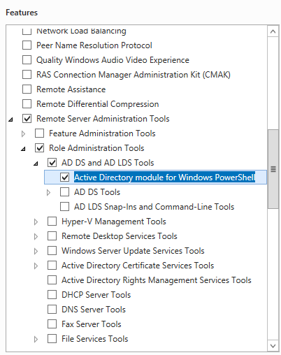
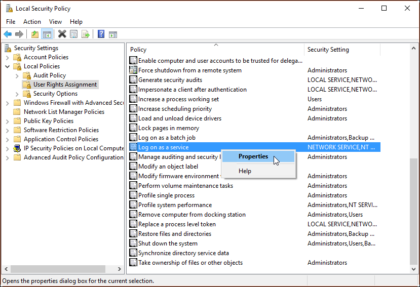

---
# required metadata

title: Configure Windows Server 2016 or later versions for MIM 2016 SP2 | Microsoft Docs
description: Get the steps and minimum requirements to prepare Windows Server 2016 or later versions to work with MIM 2016 SP2.
keywords:
author: billmath
ms.author: billmath
manager: daveba
ms.date: 01/27/2023
ms.topic: conceptual
ms.prod: microsoft-identity-manager

ms.assetid: 51507d0a-2aeb-4cfd-a642-7c71e666d6cd

# optional metadata

#ROBOTS:
#audience:
#ms.devlang:
ms.reviewer: mwahl
ms.suite: ems
#ms.tgt_pltfrm:
#ms.custom:

---

# Set up an identity management server: Windows Server 2016 or later versions

> [!div class="step-by-step"]
> [« Preparing a domain](preparing-domain.md)
> [SQL Server »](prepare-server-sql2016.md)
> 

> [!NOTE]
> Windows Server 2019 setup procedure does not differ from Windows Server 2016 setup procedure.


> [!NOTE]
> This walkthrough uses sample names and values from a company called Contoso. Replace these with your own. For example:
> - Domain controller name - **corpdc**
> - Domain name - **contoso**
> - MIM Service Server name - **corpservice**
> - MIM Sync Server name - **corpsync**
> - SQL Server name - **corpsql**
> - Password - <strong>Pass@word1</strong>

## Join Windows Server 2016 to your domain

Start with a Windows Server 2016 machine, with a minimum of 8-12GB of RAM. When installing specify "Windows Server 2016 Standard/Datacenter (Server with a GUI) x64" edition.

1. Log into the new computer as its administrator.

2. Using the Control Panel, give the computer a static IP address on the network. Configure that network interface to send DNS queries to the IP address of the domain controller in the previous step, and set the computer name to **CORPSERVICE**.  This operation will require a server restart.

3. Open the Control Panel and join the computer to the domain that you configured in the last step, *contoso.com*.  This operation includes providing the username and credentials of a domain administrator such as *Contoso\Administrator*.  After the welcome message appears, close the dialog box and restart this server again.

4. Sign in to the computer *CORPSERVICE* as a domain account with local machine administrator such as *Contoso\MIMINSTALL*.


5. Launch a PowerShell window as administrator and type the following command to update the computer with the group policy settings.

    ```
    gpupdate /force /target:computer
    ```

    After no more than a minute, it will complete with the message "Computer Policy update has completed successfully."

6. Add the **Web Server (IIS)** and **Application Server** roles, the **.NET Framework** 3.5, 4.0, and 4.5 features, and the **Active Directory module for Windows PowerShell**.

    

7. In PowerShell, type the following commands. Note that it may be necessary to specify a different location for the source files for **.NET Framework** 3.5 features. These features are typically not present when Windows Server installs, but are available in the side-by-side (SxS) folder on the OS install disk sources folder, e.g., “*d:\Sources\SxS\*”.

    ```
    import-module ServerManager
    Install-WindowsFeature Web-WebServer, Net-Framework-Features,rsat-ad-powershell,Web-Mgmt-Tools,Application-Server,Windows-Identity-Foundation,Server-Media-Foundation,Xps-Viewer –includeallsubfeature -restart -source d:\sources\SxS
    ```

## Configure the server security policy

Set up the server security policy to allow the newly-created accounts to run as services.
> [!NOTE] 
> Depending on your configuration, single server(all-in-one) or distributed servers you only need to add, based on role of the member machine, like synchronization server. 

1. Launch the Local Security Policy program

2. Navigate to **Local Policies > User Rights Assignment**.

3. On the details pane, right-click on **Log on as a service**, and select **Properties**.

    

4. Click **Add User or Group**, and in the text box type following based on role `contoso\MIMSync; contoso\MIMMA; contoso\MIMService; contoso\SharePoint; contoso\SqlServer; contoso\MIMSSPR`, click **Check Names**, and click **OK**.

5. Click **OK** to close the **Log on as a service Properties** window.

6.  On the details pane, right-click on **Deny access to this computer from the network**, and select **Properties**.>

7. Click **Add User or Group**, and in the text box type `contoso\MIMSync; contoso\MIMService` and click **OK**.

8. Click **OK** to close the **Deny access to this computer from the network Properties** window.

9. On the details pane, right-click on **Deny log on locally**, and select **Properties**.

10. Click **Add User or Group**, and in the text box type `contoso\MIMSync; contoso\MIMService` and click **OK**.

11. Click **OK** to close the **Deny log on locally Properties** window.

12. Close the Local Security Policy window.

## Software prerequisites

Before installing MIM 2016 SP2 components please make sure you install all software prerequisites:

13. Install [Visual C++ 2013 Redistributable Packages](https://www.microsoft.com/download/details.aspx?id=40784).

14. Install .NET Framework 4.6.

15. On the server that will host MIM Synchronization Service, MIM Synchronization Service requires [SQL Server Native Client](https://www.microsoft.com/download/details.aspx?id=50402).

16. On the server that will host MIM Service, MIM Service requires .NET Framework 3.5.

17. Optionally, if using TLS 1.2 or FIPS mode, see [MIM 2016 SP2 in "TLS 1.2 only" or FIPS-mode environments](preparing-tls.md).

## Change the IIS Windows Authentication mode if needed

1.  Open a PowerShell window.

2.  Stop IIS with the command *iisreset /STOP*

    ```
    iisreset /STOP
    C:\Windows\System32\inetsrv\appcmd.exe unlock config /section:windowsAuthentication -commit:apphost
    iisreset /START
    ```

> [!div class="step-by-step"]  
> [« Preparing a domain](preparing-domain.md)
> [SQL Server »](prepare-server-sql2016.md)
