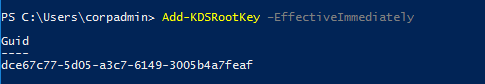
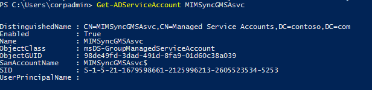

---
# required metadata

title: Set up a gMSAs for Microsoft Identity Manager 2016 | Microsoft Docs
description: Set up Group Managed Service Accounts in a domain for Microsoft Identity Manager 2016
keywords:
author: EugeneSergeev
ms.author: esergeev
manager: aashiman
ms.date: 1/7/2019
ms.topic: article
ms.prod: microsoft-identity-manager

ms.assetid: 50345fda-56d7-4b6e-a861-f49ff90a8376

# optional metadata

#ROBOTS:
#audience:
#ms.devlang:
ms.reviewer: markwahl-msft
ms.suite: ems
#ms.tgt_pltfrm:
#ms.custom:

---

# Configure a domain for Group Managed Service Accounts (gMSA) scenario

> [!div class="step-by-step"]
> [Windows Server »](prepare-server-ws2016.md)

> [!IMPORTANT]
> This article applies to MIM 2016 SP2 only.

Microsoft Identity Manger (MIM) works with your Active Directory (AD) domain. You should already have AD installed, and make sure you have a domain controller in your environment for a domain that you are able to administer.  This article describes how to set up Group Managed Service Accounts in that domain for use by MIM.

## Overview

Group Managed Service Accounts eliminate the need to periodically change service account passwords. With the release of MIM 2016 SP2, the following MIM components can have gMSA accounts configured to be used during the installation process:

-   MIM Synchronization service (FIMSynchronizationService)
-   MIM Service (FIMService)
-   MIM Password Registration web site application pool
-   MIM Password Reset web site application pool
-   PAM REST API web site application pool
-   PAM Monitoring Service (PamMonitoringService)
-   PAM Component Service (PrivilegeManagementComponentService)

The following MIM components do not support running as gMSA accounts:

-   MIM Portal. This is because MIM Portal is part of the SharePoint environment. Instead, you can deploy SharePoint in farm mode and [Configure automatic password change in SharePoint Server](https://docs.microsoft.com/sharepoint/administration/configure-automatic-password-change).
-   All Management Agents
-   Microsoft Certificate Management
-   BHOLD


More information about gMSA can be found in these articles:
-   [Group Managed Service Accounts Overview](https://docs.microsoft.com/windows-server/security/group-managed-service-accounts/group-managed-service-accounts-overview)

-   [New-ADServiceAccount](https://docs.microsoft.com/powershell/module/addsadministration/new-adserviceaccount?view=win10-ps)

-   [Create the Key Distribution Services KDS Root Key](https://technet.microsoft.com/library/jj128430(v=ws.11).aspx)

## Create user accounts and groups

All the components of your MIM deployment need their own identities in the domain. This includes the MIM components like Service and Sync, as well as SharePoint and SQL.


> [!NOTE]
> This walkthrough uses sample names and values from a company called Contoso. Replace these with your own. For example:
> - Domain controller name - **dc**
> - Domain name - **contoso**
> - MIM Service Server name - **mimservice**
> - MIM Sync Server name - **mimsync**
> - SQL Server name - **sql**
> - Password - <strong>Pass@word1</strong>

1. Sign in to the domain controller as the domain administrator (*e. g. Contoso\Administrator*).

2. Create the following user accounts for MIM services. Start PowerShell and type the following PowerShell script to create new AD domain users (not all accounts are mandatory, although the script is provided for informational purposes only, it is a best practice to use a dedicated *MIMAdmin* account for MIM and SharePoint install process).

    ```PowerShell
    import-module activedirectory
    $sp = ConvertTo-SecureString "Pass@word1" –asplaintext –force

    New-ADUser –SamAccountName MIMAdmin –name MIMAdmin
    Set-ADAccountPassword –identity MIMAdmin –NewPassword $sp
    Set-ADUser –identity MIMAdmin –Enabled 1 –PasswordNeverExpires 1

    New-ADUser –SamAccountName svcSharePoint –name svcSharePoint
    Set-ADAccountPassword –identity svcSharePoint –NewPassword $sp
    Set-ADUser –identity svcSharePoint –Enabled 1 –PasswordNeverExpires 1

    New-ADUser –SamAccountName svcMIMSql –name svcMIMSql
    Set-ADAccountPassword –identity svcMIMSql –NewPassword $sp
    Set-ADUser –identity svcMIMSql –Enabled 1 –PasswordNeverExpires 1

    New-ADUser –SamAccountName svcMIMAppPool –name svcMIMAppPool
    Set-ADAccountPassword –identity svcMIMAppPool –NewPassword $sp
    Set-ADUser –identity svcMIMAppPool –Enabled 1 -PasswordNeverExpires 1
    ```

3.  Create security groups to all the groups.

    ```PowerShell
    New-ADGroup –name MIMSyncAdmins –GroupCategory Security –GroupScope Global –SamAccountName MIMSyncAdmins
    New-ADGroup –name MIMSyncOperators –GroupCategory Security –GroupScope Global –SamAccountName MIMSyncOperators
    New-ADGroup –name MIMSyncJoiners –GroupCategory Security –GroupScope Global –SamAccountName MIMSyncJoiners
    New-ADGroup –name MIMSyncBrowse –GroupCategory Security –GroupScope Global –SamAccountName MIMSyncBrowse
    New-ADGroup –name MIMSyncPasswordSet –GroupCategory Security –GroupScope Global –SamAccountName MIMSyncPasswordSet
    Add-ADGroupMember -identity MIMSyncAdmins -Members Administrator
    Add-ADGroupMember -identity MIMSyncAdmins -Members MIMAdmin
    ```

4.  Add SPNs to enable Kerberos authentication for service accounts

    ```PowerShell
    setspn -S http/mim.contoso.com contoso\svcMIMAppPool
    ```

5.  Make sure to register the following DNS 'A' records for proper name resolution (assuming that MIM Service, MIM Portal, Password Reset and Password Registration web sites will be hosted on the same machine)

    - mim.contoso.com - point to MIM Service and Portal server physical IP address
    - passwordreset.contoso.com - point to MIM Service and Portal server physical IP address
    - passwordregistration.contoso.com - point to MIM Service and Portal server physical IP address

## Create Key Distribution Service Root Key

Ensure that you are signed into your domain controller as an administrator to prepare the group key distribution service.

If there is already a root key for the domain (use **Get-KdsRootKey** to check), then continue to the next section.

6.  Create the Key Distribution Services (KDS) Root Key (only once per domain) if
    needed. Root Key is used by the KDS service on domain controllers (along with other
    information) to generate passwords. As a domain administrator, type the following PowerShell command:

    ```PowerShell
    Add-KDSRootKey –EffectiveImmediately
    ```
    *–EffectiveImmediately* may require a delay of up to \~10 hours as it will need to replicate
        to all domain controllers. This delay was approximately 1 hour for two domain controllers.

    

    >[!NOTE]
    >In the Lab or Test environment you can avoid 10 hours replication delay by running the following command instead:
    ><br/>
    >Add-KDSRootKey -EffectiveTime ((Get-Date).AddHours(-10))

## Create MIM Synchronization Service account, group and service principal
-----------------------

Ensure that all the computer accounts for computers where MIM software is to be installed are already joined to the domain.  Then, perform these steps in PowerShell as a domain administrator.

7.  Create a group *MIMSync_Servers* and add all MIM Synchronization servers to this group.
    Type the following to create new AD group for MIM Synchronization Servers. Then, the add MIM Synchronization server Active Directory computer accounts, e.g. *contoso\MIMSync$*, into this group.

    ```PowerShell
    New-ADGroup –name MIMSync_Servers –GroupCategory Security –GroupScope Global –SamAccountName MIMSync_Servers
    Add-ADGroupmember -identity MIMSync_Servers -Members MIMSync$
    ```

8.  Create MIM Synchronization Service gMSA. Type the following PowerShell.

    ```PowerShell
    New-ADServiceAccount -Name MIMSyncGMSAsvc -DNSHostName MIMSyncGMSAsvc.contoso.com -PrincipalsAllowedToRetrieveManagedPassword "MIMSync_Servers"
    ```

    Check details of the GSMA created by executing *Get-ADServiceAccount* PowerShell command:

    

9.  If you plan to run Password Change Notification Service, you need to register Service Principal Name by executing this PowerShell command:

    ```PowerShell
    Set-ADServiceAccount -Identity MIMSyncGMSAsvc -ServicePrincipalNames @{Add="PCNSCLNT/mimsync.contoso.com"}
    ```

10. Reboot your MIM Synchronization server to refresh a Kerberos token associated with the server as the "MIMSync_Server" group membership has changed.

## Create MIM Service Management Agent service account

11. Typically when installing MIM Service, you will create a new account for the MIM Service Management Agent (MIM MA account).  With gMSA, there are two options available:

- Use MIM Synchronization Service group managed service account and do not create a separate account

    You can skip creation of the MIM Service Management Agent service account. In this case, use MIM Synchronization Service gMSA name, e.g. *contoso\MIMSyncGMSAsvc$*, instead of the MIM MA account when installing MIM Service. Later on in the MIM Service Management Agent configuration enable *'Use MIMSync Account'* option.

    Do not enable 'Deny Logon from Network' for the MIM Synchronization Service gMSA as MIM MA account requires 'Allow Network Logon' permission.

- Use a regular service account for the MIM Service Management Agent service account

    Start PowerShell as domain administrator and type the following to create new AD domain user:

    ```PowerShell
    $sp = ConvertTo-SecureString "Pass@word1" –asplaintext –force
    
    New-ADUser –SamAccountName svcMIMMA –name svcMIMMA
    Set-ADAccountPassword –identity svcMIMMA –NewPassword $sp
    Set-ADUser –identity svcMIMMA –Enabled 1 –PasswordNeverExpires 1
    ```

    Do not enable 'Deny Logon from Network' for the MIM MA account as it requires 'Allow Network Logon' permission.

## Create MIM Service accounts, groups and service principal

Continue using PowerShell as a domain admin.
   
12. Create a group *MIMService_Servers* and add all MIM Service servers to this group.  Type the following PowerShell to create new AD group for MIM Service servers and add MIM Service server Active Directory computer account, e.g. *contoso\MIMPortal$*, into this group.

    ```PowerShell
    New-ADGroup –name MIMService_Servers –GroupCategory Security –GroupScope Global –SamAccountName MIMService_Servers
    Add-ADGroupMember -identity MIMService_Servers -Members MIMPortal$
    ```

1.  Create MIM Service gMSA.

    ```PowerShell
    New-ADServiceAccount -Name MIMSrvGMSAsvc -DNSHostName MIMSrvGMSAsvc.contoso.com -PrincipalsAllowedToRetrieveManagedPassword "MIMService_Servers" -OtherAttributes @{'msDS-AllowedToDelegateTo'='FIMService/mimportal.contoso.com'} 
    ```

1.  Register Service Principal Name and enable Kerberos delegation by executing this PowerShell command:

    ```PowerShell
    Set-ADServiceAccount -Identity MIMSrvGMSAsvc -TrustedForDelegation $true -ServicePrincipalNames @{Add="FIMService/mimportal.contoso.com"}
    ```

1.  For SSPR scenarios you need MIM Service Account be able to communicate with MIM Synchronization Service, therefore MIM Service account must be either a member of MIMSyncAdministrators or MIM Sync Password Reset and Browse groups:

    ```PowerShell
    Add-ADGroupmember -identity MIMSyncPasswordSet -Members MIMSrvGMSAsvc$ 
    Add-ADGroupmember -identity MIMSyncBrowse -Members MIMSrvGMSAsvc$ 
    ```

16. Reboot your MIM Service server to refresh a Kerberos token associated with the server as the "MIMService_Servers" group membership has changed.

## Create other MIM accounts and groups if needed

If you are configuring MIM SSPR, then following the same guidelines as described above for the MIM Synchronization Service and MIM Service, you can create other gMSA for:

- MIM Password Reset web site application pool
- MIM Password Registration web site application pool

If you are configuring MIM PAM, then following the same guidelines as described above for the MIM Synchronization Service and MIM Service, you can create other gMSA for:

- MIM PAM REST API web site application pool
- MIM PAM Component service
- MIM PAM Monitoring service

## Specifying a gMSA when installing MIM

As a general rule, in most cases when using a MIM installer, to specify that you want to use a gMSA instead of a regular account,  append a dollar sign character to gMSA name, e.g. **contoso\MIMSyncGMSAsvc$**, and leave the password field empty. One exception is the *miisactivate.exe* tool that accepts gMSA name without the dollar sign.
<br/>

> [!div class="step-by-step"]
> [Windows Server »](prepare-server-ws2016.md)
