# Generic CSV Connector - Step-by-Step Reference Guide (Preview)
This article describes the Generic CSV Connector. The article applies to the following  products:

* [Microsoft Identity Manager 2016 (MIM2016)](/microsoft-identity-manager)

For MIM 2016, the Connector is available as a download from the [Microsoft Download Center](https://go.microsoft.com/fwlink/?LinkId=717495).

> [!NOTE]
> The [Azure AD provisioning](https://learn.microsoft.com/azure/active-directory/app-provisioning/user-provisioning) service now provides a lightweight agent based solution for provisioning users into CSV files, without a full MIM sync deployment. We recommend evaluating if it meets your needs. [Learn more](https://learn.microsoft.com/azure/active-directory/app-provisioning/on-premises-sql-connector-configure).

## Prepare the Sample CSV files
On a server running the MIM Synchronization Server, create the folder ***C:\GCSV*** and copy the following CSV files found in [Appendix A – Sample CSV Files](#appendix-a---sample-csv-files) into it. Be sure to grant the MIM Synchronization Service account both read-and-write permissions to that folder.

Copy the following CSV into the ***C:\GCSV\SCRIPTS*** folder:

* Sample Users CSV File (*Users.csv*)
* Sample Groups CSV File (*Groups.csv*)
* Sample Members CSV File (*Members.csv*)

> [!NOTE]
> This guide assumes that the CSV files are in the following path on your MIM Synchronization server: **C:\GCSV** and that they are saved using the file names indicated. If you install them in a different location or rename these files, you will need to make the appropriate changes through the reset of this guide. 

## Prepare the Sample PowerShell Scripts

On a server running the MIM Synchronization Server, create the folder ***C:\GCSV\SCRIPTS*** and copy the sample PowerShell scripts located in [Appendix B - Sample PowerShell Files](#appendix-b---sample-powershell-files) into it. 
Be sure that the MIM Synchronization service account has appropriate [PowerShell ExecutePolicy permissions](https://learn.microsoft.com/powershell/module/microsoft.powershell.core/about/about_execution_policies) in order to execute the scripts.

Copy the following PowerShell scripts into the ***C:\GCSV\SCRIPTS*** folder:

* Sample Pre-Import Script (Pre-Import.ps1)
* Sample Post-Import Script (Post-Import.ps1)
* Sample Pre-Export Script (Pre-Export.ps1)
* Sample Post-Export Script (Post-Export.ps1)

> [!NOTE]
> This guide assumes that the CSV files are in the following path on your MIM Synchronization server: C:\GCSV\SCRIPTS. If you install them in a different location, you will need to make the appropriate changes through the reset of this guide. 

> [!IMPORTANT]
>The MIM Synchronization Service account requires the appropriate [PowerShell ExecutePolicy permissions](https://learn.microsoft.com/powershell/module/microsoft.powershell.core/about/about_execution_policies) on the MIM Synchronization server in order execute the sample PowerShell scripts. 

## Create a New Connector

The following list is a high-level overview of the steps outlined in this guide. In order to being, an account with the *MIM Syncs Admin* role needs to be used to perform these tasks:

* Open the *Create New Management Agent (MA)* window from the *MIM Sync Service Manager*.
* Select the *Generic CSV Connector* as the connector type.
* Provide the file path and name of the CSV file to be imported or exported.
* Specify the file encoding, value separator, multi-value separator, and text qualifier for the CSV file.
* Choose whether to use the values in the first row as header fields or not.
* Select the object types and attributes to be imported or exported from the CSV file.
* Configure the partition, run profile, and mapping details for the MA.
* Provide the script paths and parameters for the PowerShell scripts, if any.
* Run the MA to perform the import, sync, or export operations.
* Evaluate the results.

Let's Begin! 

To Create a Generic CSV connector, in *MIM Synchronization Service Manager* select *Management Agent* and *Create*. Select the **Generic CSV (Microsoft)** Connector.


Probide the name for the connector (for example: **Generic CSV**) and click the **Next** button.

## Connectivity
The Connectivity page contains the file paths where the connector can locate the User, Groups, and Group Members CSV files. 

The following image is an example of the *Connectivity* page: 


The following is a list of the values that should be provided for the settings on this page:

| Setting Name | Setting Value | Notes |
| --- | --- | --- |
| *Users File* | **C:\GCSV\USERS.CSV** | (The fully qualified path and file name used.) |
| *Groups File* | **C:\GCSV\GROUPS.CSV** | (The fully qualified path and file name used.) |
| *Members File* | **C:\GCSV\MEMBERS.CSV** | (The fully qualified path and file name used.) |

After verifying that the settings match the provided values, click the **Next** button.

## Capabilities
This page describes the connector’s capabilities. The GCSV Connector capabilities are fixed and can't be modified. 

The following image is an example of the *Capabilities* page: 


For a detailed description of these capabilities settings, refer to the [Generic CSV Connector – Technical Reference Guide](microsoft-identity-manager-2016-connector-genericcsv.md).

After reviewing the configurations about, click the **Next** button.

### Schema 1 (CSV File Format Configurations)

The Generic CSV (GCSV) Connector utilizes three kinds of separators (or delimiters) to delimit and parse CSV fields and their values: *Value Separators*, *Multivalued separators*, and *Text qualifiers*. For a more details explanation of these delimiter types, see the [Generic CSV Connector – Technical Reference Guide](microsoft-identity-manager-2016-connector-genericcsv.md)

This page contains the character value settings for these delimiters and the encoding type that was used to create the file as CSV. 

The following image is an example of the *Schema 1* (CSV File Format Configurations) page:

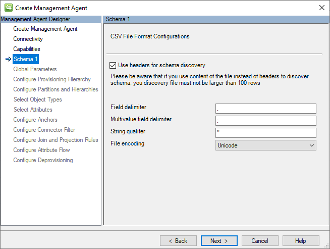

The following section is a list of the individual configurations:
* **Use headers for schema discovery**: If this option is selected, it instructs the connector to ignore the first record of each CSV file as a data record and use it as a header record (that is, that has the names of each field.) If this option isn't selected, the connector gives a generic name to each field (for example, Attribute1, Attribute2, etc.)  and use the first row as a data record.  
* **Values separator**: This character separates the fields (that is, values) of the CSV records. The comma (,) is the default, but any alphanumeric character that can be printed is allowed.  
* **Multivalue separator**: This type of separator is used to delimit the individual values of a multi–valued string (for example, proxy addresses) or reference attributes (for example, subordinates.) The default is a semi-colon (;) but any printable alphanumeric character is acceptable.
* **Text qualifier**: If a string value contains characters that would otherwise be interpreted as delimiters (for example, such as commas), it requires that the value be qualified so that the CSV parser can correctly interpret the string as a single field. The double quotes (") are the default, but any alphanumeric character that can be printed is allowed.
* **File encoding**: This setting indicates the encoding used on the CSV files added in the Connectivity tab. Ensure that it matches the encoding of your CSV files.

>[!NOTE]
> If you are not sure about the encoding type of your CSV files, you should try to use the default *Unicode* encoding type. Unicode is a common standard that supports many characters and symbols, making it a good option for encoding text data across most languages or character set is used.

### Schema 2 (Identity and Reference Field Configurations)

The anchor value is a unique identifier for a record in a CSV file. It differentiates one record from the others. The GCSV Connector also uses this value to build the distinguished name (DN) that uniquely identifies its connector space object. 

On this page, the anchor attribute settings are set up for each of the CSV files that are listed on the Connectivity page. 

The following image is an example of the *Schema 2* (Identity and Reference Field Configurations) page.


In the following table are the individual values that should be assigned to each of the settings on this page:

| Setting Name | Setting Value | 
| --- | --- |
| *Users Record ID Field* | **EmployeeID** |
| *User Record ID Field attribute type* | **String**  |
| *Group Record ID Field* | **GroupID** |
| *Group Record ID Field attribute type* | **String** |
| *Parent Group ID* | **ParentID** |
| *Member ID* | **MemberID** |
| *Member Object Type* | **ObjectType** |

After verifying that the settings match the provided values, click the **Next** button.

### Schema 3 (Users File Attribute Schema Configurations)

This page is used to assign a data type for each attribute in the Users CSV file's schema and whether they can have more than one value. 

The following image is an example of the *Schema 3* (Users File Attribute Schema Configurations) page.

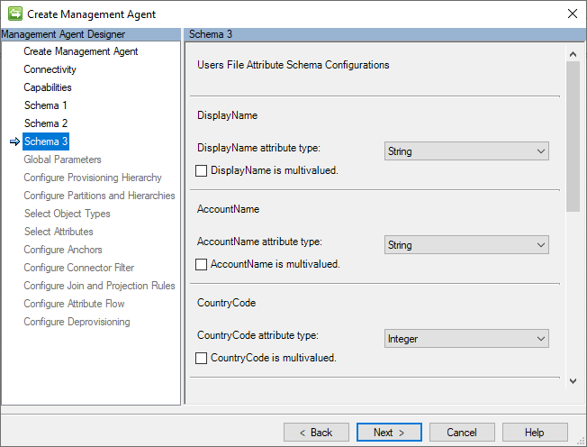

In the following table are the individual values that should be assigned to each of the settings on this page:

| Setting Name | Setting Value | Notes |
| --- | --- | --- |
| *DisplayName attribute type* | **String** | Examples of qualified strings are in this field | 
| *DisplayName is multivalued* | **false** | -- |	
| *AccountName attribute type* | **String** | -- |
| *AccountName is multivalued* | **false** | -- |
| *CountryCode attribute type* | **Integer** | -- |	
| *CountryCode is multivalued* | **false** | -- |	
| *Manager attribute type* | **Reference** | Contains the anchor attribute values of their assigned managers user record (for example, *E001*) |
| *Manager is multivalued* | **false** | -- |
| *ProxyAddresses attribute type* | **String** | -- |
| *ProxyAddresses is multivalued* | **TRUE** | Contains examples of how to delimit multivalued strings |
| *IsActive attribute type* | **Boolean** | -- |	
| *IsActive is multivalued* | **false** | -- |
| *ProfilePic attribute type* | **Binary** | -- |
| *ProfilePic is multivalued* | **false** | -- | 

After verifying that the settings match the provided values, click the **Next** button.

### Schema 4 (Groups File Attribute Schema Configurations)

This page is used to assign a data type for each attribute in the Groups CSV file's schema and whether they can have more than one value. 

The following image is an example of the *Schema 4* (Groups File Attribute Schema Configurations) page. 


In the following table are the individual values that should be assigned to each of the settings on this page:

| Setting Name | Setting Value | Notes |
| --- | --- | --- |
| *DisplayName attribute type* | **String** | -- | 
| *DisplayName is multivalued* | **false** | Provides an example of qualified string values. |	
| *Description attribute type* | **String** | -- |
| *Description is multivalued* | **false** | -- |
| *Owner attribute type* | **Reference** | Provides an example of reference values.|	
| *Owner is multivalued* | **false** | -- |	

After verifying that the settings match the provided values, click the **Next** button.

### Global Parameters (PowerShell Scripts Configuration)

This page allows for the configuration of PowerShell scripts that will run before and/or after import and/or export operations. The value of this input parameters provides an opportunity to perform a wide variety of pre-and-post processing actions on your identity user and group records.

The following image is an example of the *Global Parameters* page. 


In the following table are the individual values that should be assigned to each of the settings on this page:

| Setting Name | Setting Value | Notes |
| --- | --- | --- |
| *Pre-Import File* | **C:\GCSV\SCRIPTS\PRE-IMPORT.CSV** | This script executes before a full import |
| *Post-Import File* | **C:\GCSV\SCRIPTS\POST-IMPORT.CSV** | This script executes after a full import |
| *Pre-Export File* | **C:\GCSV\SCRIPTS\PRE-EXPORT.CSV** | This script executes before a full export or (delta) export |
| *Post-Export File* | **C:\GCSV\SCRIPTS\POST-EXPORT.CSV** | This script executes before a full export or (delta) export |

After verifying that the settings match the provided values, click the **Next** button.

#### PowerShell Script Execution 
The GCSV Connector runs each configured PowerShell script in its own session and doesn't provide support for passing variables between the execution of scripts. 

Moreover, the GCSV Connector executes the PowerShell script inside the files, not as a cmdlet. This means that input parameters can't be passed into scripts by adding them to the end of their path statements. Doing this causes the execution of the script to fail. 

>[!Important]
>The GCSV Connector does not support the use of passing input parameters in the execution of the PowerShell scripts.

If a pre-import or pre-export script execution throws an exception, to prevent the importing or exporting of improperly processed User or Group records, the GCSV Connector will abort and stop the whole run profile’s execution. 

Similarly, if a post-import or post-export operation encounters an exception, it causes the operation status to fail. 

Errors encountered during PowerShell script execution will be logged into the MIM Synchronization server’s *Event *Log. 

#### PowerShell Input Parameter: OperationType 

Although the use of input parameters is not supported, the GCSV Connector does pass one input parameter into execution of every PowerShell script: `OperationType`. 

The input variable `OperationType` will have the value ***Full*** or ***Delta*** to show the kind of operation (for example, Full Import, Delta Import, Full Export, (Delta) Export) that is running with the script. This value allows scripts to check if they're running under a full or delta import/export context and do their pre- or post-processing tasks accordingly.

## Provisioning Hierarchy

Because CSV files don't store information in a hierarchical structure; the Generic CSV connector doesn't support any hierarchical provisioning configurations. 

The following image is an example of the *Provisioning Hierarchy* page.

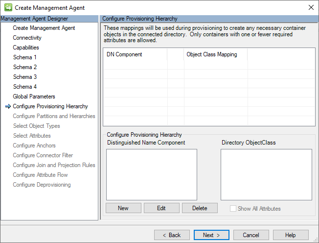

After verifying that the settings match the provided values, click the **Next** button.

### Partitions and Hierarchies

The Generic CSV Connector builds a distinct distinguished name (DN) for every user and group record in its connector space, following this LDAP format: 

`CN=[ANCHOR_VALUE],Object=User|Group,O=CSV`

The following image is an example of the *Partitions and Hierarchies* page.


After verifying that the settings match the provided values, click the **Next** button.

### Object Types

The Generic CSV connector requires that at least the User object type be specified. The choice of the Group object type is optional. 

The following image is an example of the *Object Types* page.


After verifying that the settings match the provided values, click the **Next** button.

### Attributes

This page displays a normalized list of all attributes across all selected object type schemas. 

The following image is an example of the *Attributes* page.

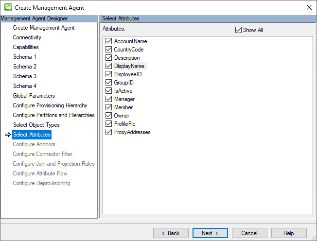

After verifying that the settings match the provided values, click the **Next** button.

>[!Note]
> Anchor attributes are always required in order for the GCSV Connector to operate properly.

### Anchors

The Generic CSV Connector doesn't support the use of complex anchors or anchor attribute configurations that differ from their corresponding object's CSV file’s anchor ID field designation. This is why the anchor selection fields are locked. To make a change in anchor attribute designation, return to the [Schema 2 (Identity and Reference Field Configurations)](./microsoft-identity-manager-2016-connector-genericcsv-step-by-step.md#schema-2-identity-and-reference-field-configurations) page.

The following image is an example of the *Anchors* page.

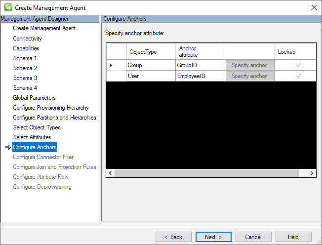

After reviewing the default settings on the page, click the **Next** button.

### Connector Filters

This guide won't be making use of any connector filter configurations. This section is here to provide continuity in the guide. 

The following image is an example of the *Connector Filters* page.


After reviewing the default settings on the page, click the **Next** button.

### Join and Projection Rules

This guide won't be making use of any join and projection rules configurations. This section is here to provide continuity in the guide. 

The following image is an example of the *Join and Projection Rules* page.


After reviewing the default settings on the page, click the **Next** button.

### Attribute Flow

This guide won't be making use of any attribute flow rules configurations. This section is here to provide continuity in the guide. 

The following image is an example of the *Attribute Flow* page.

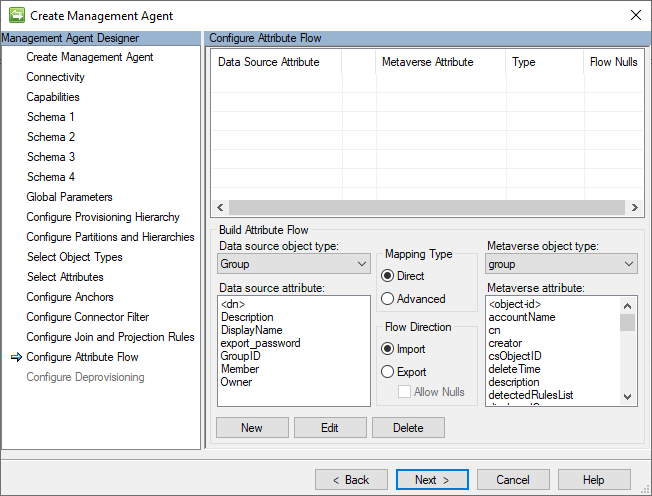

After verifying that the settings match the default values, click the **Next** button.

### Deprovisioning

This guide we won't be changing the default deprovisioning settings of this connector. This section is here to provide continuity in the guide. 

The following image is an example of the *Deprovisioning* page.

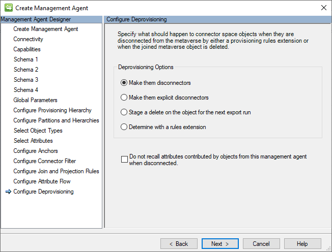

After verifying that the settings match the default values, click the **Next** button.

## Create a Full Import Run Profile

A Full Import Run Profile is required to import User and Group identity data from the CSV records into Connector Space objects. 

Use the following steps to create a new Full Import Run Profile:

* Go back to the *Synchronization Service Manager*.
* Select the GCSV management agent.
* Right-click on it and choose **Configure Run Profiles**.
* Click **New Profile**.

The Configure Run Profile window will appear.

### Name the Run Profile 

In the Profile Name page, enter then name **Full Import**

The following image is an example of the Profile page. 

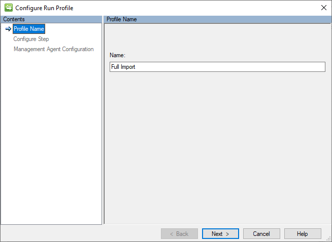

After verifying that the settings match the provided values, click the **Next** button.

### Specify Type

In the Configure Step page, select the Type: **Full Import**.

The Connector filtering operates the same in the GCSV Connector as in any other ECMA connector. 

The following image is an example of the *Connector Filter* page.

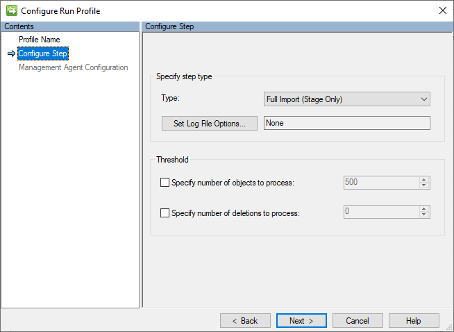

After verifying that the settings match the provided values, click the **Next** button.

### Management Agent Configuration Type

On the Management Agent Configuration Type page, ensure the ***O=CSV*** partition is selection.


Leave the rest of the settings in their default values. Clicking the **Finish** button will create the Run Profile.

## Validate Results

This section details the steps necessary to validate the results of the creating a new GCSV Connector and importing the User and Group records from the sample CSV files.

### Run Full Import

After creating the Run profile, use following steps to a run this new Full Import Run Profile:

* Go back to the *Synchronization Service Manager*.
* Select the GCSV management agent.
* Right-click on it and choose **Run**.
* Select **Full Import** and click **OK**.

### Validate Full Import Operation Results

There ought to be five (5) Adds based upon contents of the Sample CSV Files:

The following image is an example of the results of successfully importing the contents of the sample CSV files:


### Examine the GCSV Connector Space

After creating the Run profile, use following steps to a run this new Full Import Run Profile:

* Go back to the *Synchronization Service Manager*.
* Select the *GCSV Connector* management agent.
* Right-click on it and choose Search Connector Space.
* Leave the scope to its default value of *Subtree* and click the **Search** button.

The following image is an example of the *Search Connector Space* window that will appear. 


#### Validate User Object

Select one of the user objects for inspection. The following image is an example of a user’s GCSV connector space object:

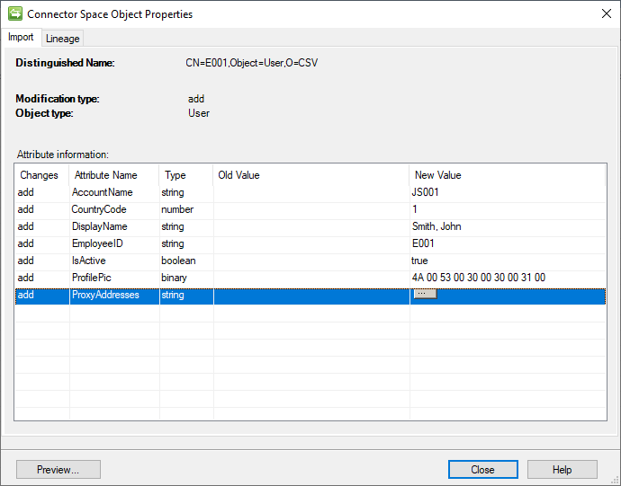

Examination of the *DisplayName* field shows how a qualified string was properly parsed. 

Clicking on the button within the *ProxyAddresses* entry reveals that the multivalued string was also properly parsed into individual values:


#### Validate Group Object

Selecting one of the group objects for inspection. The following image is an example of a group’s GCSV connector space object:

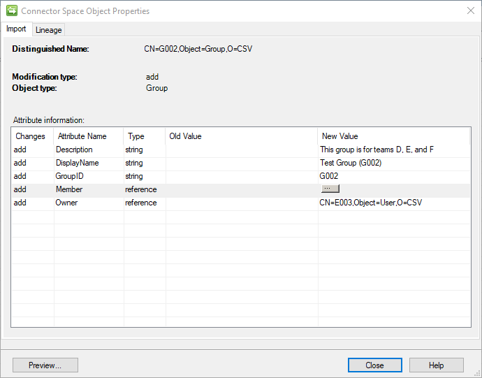

Clicking on the button within the *Member* entry reveals how the associated records group file member records withing the Members file has been properly loaded as members:


### Validate PowerShell Execution Logs

The sample PowerShell scripts provided in this guide are designed to add a CSV entry to a central log to demonstrate their successful execution. 

The default location for this log is **C:\GCSV\PS_Run_Ledger.csv**.

Opening the log reveals: 

```CSV
"DateTime","Stage","Name","Type","Description"

"3/17/2024 1:05:44 PM","Pre","Import","Full","The Pre-Import PowerShell script was executed successfully."
"3/17/2024 1:05:46 PM","Pre","Import","Full","The Post-Import PowerShell script was executed successfully."
```

These two records indicate that both the Pre-Import and Post-Import PowerShell scripts ran successfully. Note the Type field indicates that these PowerShell scripts were run during a Full Import. It obtains these values from OperationType PowerShell input parameter that indicates whether the script was run during a Full or Delta operation. 

## Appendix A - Sample CSV Files

The following sections contain the CSV Files used in this guide.

### Sample Users CSV File

In the configuration of the connector, this guide assumes the file name of **USERS.CSV**.

```CSV
EmployeeID,DisplayName,AccountName,CountryCode,Manager,ProxyAddresses,IsActive,ProfilePic
E001,"Smith, John",JS001,1,,SMTP:john.smith@contoso.com;smtp:js001@contoso.com,True,SgBTADAAMAAxAA==
E002,"Doe, Jane",JD003,1,E001,SMTP:jane.doe@contoso.com;smtp:jd002@contoso.com,True,SgBEADAAMAAyAA==
E003,"Perez, Juan",JP003,1,E001,SMTP:juan.perez@contoso.com;smtp:jp003@contoso.com,False,SgBEADAAMAAyAA==
```

### Sample Groups CSV File

In the configuration of the connector, this guide assumes the file name of **GROUPS.CSV**.

```CSV
GroupID,DisplayName,Description,Owner
G001,Test Group (G001),"This group is for teams A, B, and C",E002
G002,Test Group (G002),"This group is for teams D, E, and F",E003
```

### Sample Members CSV File

In the configuration of the connector, this guide assumes the file name of **MEMBERS.CSV**.

```CSV
ParentID,MemberID,ObjectType
G001,E001,USER
G001,E002,USER
G001,E003,USER
G002,E001,USER
G002,E002,USER
G002,E003,USER
G002,G001,GROUP
G003,E001,USER
G003,E002,USER
G003,E003,USER
G003,G001,GROUP
```

## Appendix B - Sample PowerShell Files

Contained within this appendix is the set of sample PowerShell scripts used in this guide. The following sections detail some of the considerations that should be made when

>[!Important]
>any use of ``write-host``commands in the PowerShell scripts will cause the script's exection to fail. 

### Sample Pre-Import PowerShell Script

In the configuration of the connector, this guide assumes the file name of **PRE-IMPORT.PS1**.

~~~PowerShell
param ([string]$OperationType)

[string]$stage = "Pre"
[string]$operation = "Import"
[string]$filePath = "C:\GCSV\PS_Run_Ledger.csv"

# Create a new record
$record = [PSCustomObject]@{
    "DateTime" = (Get-Date).ToString()
    "Stage" = $stage
    "Type" = $OperationType
    "Name" = $operation
    "Description" = "The $stage-$operation PowerShell script was successfully executed before a $OperationType-$operation."
}

$record | Export-Csv -Path $FilePath -NoTypeInformation -Append
~~~

### Sample Post-Import PowerShell Script

In the configuration of the connector, this guide assumes the file name of **POST-IMPORT.PS1**.

~~~PowerShell
param ([string]$OperationType)

[string]$stage = "Post"
[string]$operation = "Import"
[string]$filePath = "C:\GCSV\PS_Run_Ledger.csv"

# Create a new record
$record = [PSCustomObject]@{
    "DateTime" = (Get-Date).ToString()
    "Stage" = $stage
    "Type" = $OperationType
    "Name" = $operation
    "Description" = "The $stage-$operation PowerShell script was successfully executed after a $OperationType-$operation."
}

$record | Export-Csv -Path $FilePath -NoTypeInformation -Append
~~~

### Sample Pre-Export PowerShell Script

In the configuration of the connector, this guide assumes the file name of **PRE-EXPORT.PS1**.

~~~PowerShell
param ([string]$OperationType)

[string]$stage = "Pre"
[string]$operation = "Export"
[string]$filePath = "C:\GCSV\PS_Run_Ledger.csv"

# Create a new record
$record = [PSCustomObject]@{
    "DateTime" = (Get-Date).ToString()
    "Stage" = $stage
    "Type" = $OperationType
    "Name" = $operation
    "Description" = "The $stage-$operation PowerShell script was successfully executed before a $OperationType-$operation."
}

$record | Export-Csv -Path $FilePath -NoTypeInformation -Append
~~~

### Sample Post-Export PowerShell Script

In the configuration of the connector, this guide assumes the file name of **POST-EXPORT.PS1**.

~~~PowerShell
param ([string]$OperationType)

[string]$stage = "Post"
[string]$operation = "Export"
[string]$filePath = "C:\GCSV\PS_Run_Ledger.csv"

# Create a new record
$record = [PSCustomObject]@{
    "DateTime" = (Get-Date).ToString()
    "Stage" = $stage
    "Type" = $OperationType
    "Name" = $operation
    "Description" = "The $stage-$operation PowerShell script was successfully executed after a $OperationType-$operation."
}

$record | Export-Csv -Path $FilePath -NoTypeInformation -Append
~~~
