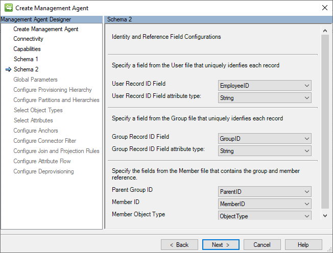
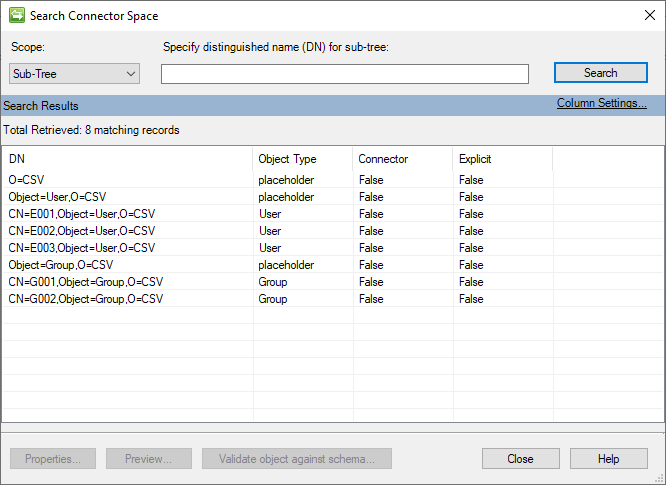

# Generic CSV Connector - Technical Reference Guide (Preview)

This article describes the Generic CSV (GCSV) Connector. The article applies to the following products:

* [Microsoft Entra Connect Provisioning Agent (ECMA2Host)](https://learn.microsoft.com/entra/identity/app-provisioning/on-premises-application-provisioning-architecture)
* [Microsoft Identity Manager 2016 (MIM2016)](https://learn.microsoft.com/microsoft-identity-manager)

For MIM 2016, the Connector is available as a download from the [Microsoft Download Center](https://go.microsoft.com/fwlink/?LinkId=717495).

To see this Connector in action, see the [Generic SQL Connector step-by-step](microsoft-identity-manager-2016-connector-genericsql-step-by-step.md) article.

> [!NOTE]
> The [Azure AD provisioning](https://learn.microsoft.com/azure/active-directory/app-provisioning/user-provisioning) service now provides a lightweight agent based solution for provisioning users into CSV files, without a full MIM sync deployment. We recommend evaluating if it meets your needs. [Learn more](https://learn.microsoft.com/azure/active-directory/app-provisioning/on-premises-sql-connector-configure).

## Overview of the Generic CSV Connector

The Generic CSV (GCSV) Connector lets you integrate User and Group identity data maintained in CSV files with Microsoft products, such as the Microsoft Entra Connect Provisioning Agent (ECMA2Host) and Microsoft Identity Manager 2016 (MIM2016).  

It has various features, such as the ability to orchestrate the use of PowerShell to manage identity data before-or-after imports or exports operations. It offers support for multiple datatypes including binary and references, support for qualified-string values, and multivalued strings.  

This article describes the features and functions of the Generic CSV Connector, and how to configure it for MIM 2016.  

The following table lists the features that the current release of the connector supports, from a high-level perspective:

| Feature | Details |
| --- | --- |
| Multiple Product Support | Use of this connector is supported with the following Microsoft products: <li>Microsoft Entra Connect Provisioning Agent (ECMA2Host)</li><li>Microsoft Identity Manager 2016 (MIM2016)</li> |
| CSV Files Supported | This connector supports the management of user (required) and groups (optional), through the configuration of up to three CSV files: <li>Users CSV File (ex. Users.csv)</li><li>Groups CSV File (ex. Groups.csv)</li><li>Group Members CSV File (ex. Members.csv)</li> |
| Pre/Post Operation Processing with PowerShell | This connector supports the configuration of up to four (4) PowerShell Scripts to facilitate pre-or-post processing of User and Group identity data before or after imports or exports. |
| CSV File Encoding Supported | The connector supports all default (or installed) server encoding types: (ex. Unicode, UTF-8, UTF-7, ASCII, etc.) |
| CSV Field Data Types Supported | The connector supports the following attribute data types: <li>Binary – (as base64 strings)</li><li>Boolean – (as True/False)</li><li>Integers</li><li>Strings / Multivalued Strings</li><li>Reference</li> |
| CSV Field Delimitation | Support for commas (,) or any printable alphameric character to qualify the beginning and end of any string value. |
| String Qualification Support | Support for double-quotes (“) or any printable alphameric character to qualify the beginning and end of any string value. |
| Multivalued String Support | Support for multivalued strings |
| Supported Connector Operations | The connector supports the following operations: <li>Full Import</li><li>Export</li><li>Full Export</li> |
| Schema | <p>Schema discovery is dynamic, but requires manual configuration for completion.</p><p>Fields are dynamically identified based upon a specified delimiter (or known as a "Value Separator.") </p><p>Field datatypes are manually designated during configuration.<p> |

### Prerequisites
Before you use the connector, make sure you have the following on the synchronization server:

* Microsoft .NET 4.6.2 Framework or later
* CSV Files that contain the desired schema for the following identity types:
  * Users File (required)
  * Groups (optional)
  * Group Members (required if groups are used)
* (Optional) PowerShell scripts to manage pre-and-post processing for the following Operation Types events:
  * Pre-Import – This script is executed before an import operation is run.
  * Post-Import – This script is executed after an import operation is run.
  * Pre-Export – This script is executed before an export operation is run.
  * Post-Export – This script is executed after an export operation is run.

#### MIM Synchronization Service Account Permissions

>[!IMPORTANT]
> The MIM 2016 Synchronization service account is the security context that performs the file operations to CSV files and runs the pre/post-processing PowerShell scripts. This service account needs Read/Write permissions for all the CSV and PowerShell files that are configured. It also needs the appropriate [PowerShell ExecutePolicy permissions](https://learn.microsoft.com/powershell/module/microsoft.powershell.core/about/about_execution_policies) to run any scripts that are configured.  

## Create a new Connector

The following list is a high-level overview of the steps outlined in this guide. In order to begin, an account with the *MIM Syncs Admin* role needs to be used to perform these tasks:

* Open the *Create New Management Agent (MA)* window from the *MIM Sync Service Manager*.
* Select the *Generic CSV Connector* as the connector type.
* Provide the file path and name of the CSV file to be imported or exported.
* Specify the file encoding, value separator, multi-value separator, and text qualifier for the CSV file.
* Choose whether to use the values in the first row as header fields or not.
* Select the object types and attributes to be imported or exported from the CSV file.
* Configure the partition, run profile, and mapping details for the MA.
* Provide the script paths and parameters for the PowerShell scripts, if any.
* Run the MA to perform the import, sync, or export operations.

To Create a Generic CSV connector, in **Synchronization Service** select **Management Agent** and **Create**. Select the **Generic CSV (Microsoft)** Connector.


### Connectivity

The Connectivity page contains the file locations of the Users, Groups, and Group Members CSV files. 

The following image is an example of the *Connectivity* page. 


The locations of the following CSV files are specified on this page:

* **Users File**: The fully qualified path of the CSV file that contains the user records and their attribute values. This file is required.
* **Groups File**: The fully qualified path of the CSV file that contains the group records. This file is optional. 
* **Members File**: The fully qualified path of the CSV file that contains group member reference records. 

>[!IMPORTANT]
>The MIM Sync service account must have **read** and **write** permissions to all the designated CSV files. As mentioned previously, the group and member files are not necessary if only users are configured.

The Connectivity screen is the first when you create a new Generic SQL Connector. You first need to provide The following section information:

### Capabilities

This page describes the connector’s capabilities. Connector capabilities are fixed and can't be changed, but they're explained here to provide information on how the connector operates. 

The following image is an example of the *Capabilities* page. 


The following section lists of the individual configurations and their meanings:

*	**Distinguished Name Style (LDAP)**: The GCSV Connector uses the LDAP (Lightweight Directory Access Protocol) syntax to construct the DN (distinguished name) to uniquely identify each User or Group object in its connector space. All DN values are expressed in the following format: **CN=[ANCHOR_VALUE],Object=[User|Group],O=CSV**.
*	**Object Confirmation (Normal)**: Normally, the sync engine assumes that it can retrieve the object again in a subsequent delta import after an export. This is how the sync engine usually works, but  not all connected systems operate this way. This setting of *Normal* ensures that there's no `exported-change-not-reimported` warning in the follow-up import.
* **Export Type (MultivaluedReferenceAttributeUpdate)**: The export type specifies how objects are formatted and sent to the target system during synchronization. *MultivaluedReferenceAttributeUpdate* is an export type designed to work with Microsoft Entra ID. It only sends the attributes that have changed. For value-type attributes, it uses AttributeReplace and for reference attributes, it uses AttributeUpdate. 
* **Normalizations (None)**: Normalizations refer to standardizing data to a consistent format. None means that no specific normalization rules are applied. Data remains as-is without any additional transformations by the connector.

### Schema 1 (CSV File Format Configurations)

The GCSV Connector utilizes three kinds of separators (or delimiters) to delimit and parse CSV fields and their values. 

This page contains the character value settings for these separators and the encoding type that was used to create the file as CSV. 

The following image is an image of the *Schema 1 (CSV File Format Configurations)* page.


The following section is a list of the individual configurations:

* **Use headers for schema discovery**: When this option is selected, it instructs the connector to treat the first record of each CSV file as a header record and not identity data record. If this option isn't selected, the connector assigns the name *Attribute* with an appended unique incremented integer value (for example, *Attribute1*, *Attribute2*, etc.) and treats the first row of as an identity data record.  
* **Values separator**: This character separates the fields (that is, values) of the CSV records. The comma (,) is the default, but any alphanumeric character that can be printed is allowed.  
* **Multivalue separator**: This type of separator is used to delimit the individual values of a multi–valued string (for example, proxy addresses) or reference attributes (for example, subordinates.) The default is a semi-colon (;) but any printable alphanumeric character is acceptable.
* **Text qualifier**: When a string value contains characters that would otherwise be interpreted as delimiters (for example, such as commas), it requires that the value be qualified so that the CSV parser can correctly interpret the string as a single field. The double quotes (") are the default, but any alphanumeric character that can be printed is allowed.

>[!NOTE]
>Although the schemas of CSV files may not contain any multivalued fields or may not contain any values that require string qualification, the designation of a unique printable character for each separator type is required.

* **File encoding**: This setting indicates the encoding used on the CSV files added in the Connectivity tab. Ensure that it matches the encoding of your CSV files.

>[!NOTE]
> If you are not sure about the encoding type of your CSV files, you should try to use the default Unicode encoding type. Unicode is a common standard that supports many characters and symbols, making it a good option for encoding text data across most languages or character set is used.

### Schema 2 (Identity and Reference Field Configurations)

The anchor value is a unique identifier for a record in a CSV file. It differentiates one record from the others. The GCSV Connector also uses this value to create the distinguished name (DN) that identifies the related connector space object. 

On this page, the anchor attribute settings are set up for each of the CSV files that are listed on the Connectivity page. 

The following image is an example of the *Schema 2 (Identity and Reference Field Configurations)* page.



The following section is a list of the individual configurations on this page:

* **User**
  * **User Anchor**: The field in the Users file that serves as the anchor value for the user record. The first header field in the Users file is the default choice.
  * **User Anchor attribute type**: This is the attribute type of the anchor selected. 
* **Group**
  * **Group Anchor**: The field in the Groups file that serves as the anchor value for the group record. The first header field in the Groups file is the default choice.
  * **Group Anchor attribute type**: This is the attribute type of the anchor selected.
* **Member**
  * **Parent Group ID**: The field in the Members file that has the same (anchor) value as the parent group in the Groups CSV file. The first field in the Members file is used by default.
  * **Member ID**: The field in the Members file that has the same (anchor) value as in the  Users or Groups CSV file. The second field in the Members file is selected by default.
* **Member Object Type**: The field that contains either a "*User*" or "*Group*" string value to indicate object type of the member. This field is only required if the Member file contains more than two fields. The Object Type field must only contain either string value "**User**" or a "**Group**." If this field is missing, the connector assumes that the Members file records refers to a User object member. The third field found on the Members file is selected by default. 

>[!IMPORTANT]
>The names of the attributes designated to be used as anchors must be unique across all object type schemas. This includes the anchors specified in the Group Members file.

### Schema 3 (Users File Attribute Schema Configurations)

This page is for specifying and explaining the data type of each of the fields that are identified in the schema of the Users CSV file and whether they can have more than one value. 

The following image is an example of the *Schema 3 (Users File Attribute Schema Configurations)* page.


The following section lists considerations when making attribute data type assignments.

#### Supported Data Types

The GCSV Connector supports the use of The following section data types: 

* **Boolean**: a value that can be either true or false.
* **Binary**: a value that is stored as a sequence of bytes, typically used to store data such as images or other files.
* **Integer**: a value that is a whole number, without any decimal places.
* **String**: a value that is a sequence of characters, typically used to store text data.
* **Reference**: a value that is a reference to another user object. To specify a reference value in a CSV file, populate its field with the anchor value of the referred user object.

>[!IMPORTANT]
>User or Group reference attributes can only be used to refer to user objects. This does not apply to the *Member* attribute of Group objects, which can contain both user or group references so long as the object type field is specified.

#### Supported Multiple-Value Data Types

The connector supports use of multivalued attributes for only the following data types:

* String

>[!NOTE]
> If the schema of both the User and Group objects both have an (non-anchor) attribute by the same name, differing datatypes may not be assigned between them. They both must share the same data type.

### Schema 4 (Groups File Attribute Schema Configurations)
This page is for specifying and explaining the data type of each of the fields that are identified in the schema of the Groups CSV file and whether they can have more than one value. 

The following image is an example of the *Schema 4 (Groups File Attribute Schema Configurations)* page. 


The guidance offered in [Schema 3 (Users File Attribute Configurations](./microsoft-identity-manager-2016-connector-genericcsv-step-by-step.md#schema-3-users-file-attribute-schema-configurations) applies to this section as well. .

After the running an initial full import operation, the connector space will look similar to the image the following image: 



### Global Parameters (PowerShell Scripts Configuration)

This page allows for the configuration of PowerShell scripts that will run before and/or after import and/or export operations. These features provide opportunities to perform a wide variety of pre-and-post processing actions on your identity user and group records.

The following image is an example of the *Global Parameters* page. 


The following section lists the individual configuration settings on this page:

* **Script Timeout (Minutes)**: the number of minutes that a script will run before it's automatically aborted. The default value for this setting is *100* and requires a value greater than zero (0). 
* **Pre-import script file**: the fully qualified path to the PowerShell script that should run before an import. This setting is optional and doesn't require a value.
* **Post-import script file**: the fully qualified path to the PowerShell script that should run after an import. This setting is optional and doesn't require a value.
* **Pre-export script file**: the fully qualified path to the PowerShell script that should run before an export. This setting is optional and doesn't require a value.
* **Post-export script file**: the fully qualified path to the PowerShell script that should run after an export. This setting is optional and doesn't require a value.

#### PowerShell Script Execution and Input Parameters

The GCSV connector executes each of the configured PowerShell scripts in its own session and doesn't support the passing of parameters between stages isn't supported. 

The connector passes one input parameter into each script named OperationType. The value of this parameter varies depending on the Run Profile operation that is performed, and it can be one of three values: 

>[!IMPORTANT]
> The dynamic creation of CSV files before import or export operations is not supported. The all the CSV files must be present before any for Run Profiles will execute.

#### PowerShell Input Parameter: OperationType 

Although the use of input parameters isn't supported, the GCSV connector does pass one input parameter into execution of every PowerShell script: `OperationType`. 

* **Full** – this value is provided during Full Import or Full Export operations.
* **Delta** – this value is provided during Export operations.

This parameter value can be used within the logic of the PowerShell scripts to determine the appropriate pre/post processing operation or action to take. 
 
### Provisioning Hierarchy

Because CSV files don't store information in a hierarchical structure, the GCSV Connector doesn't support any hierarchical provisioning configurations. 

The following image is an example of the *Provisioning Hierarchy* page.


### Partitions and Hierarchies

The GCSV Connector builds a distinct distinguished name (DN) for every user and group record in its connector space, following this LDAP format: 

`CN=[ANCHOR_VALUE],Object=User|Group,O=CSV`

The following image is an example of the *Partitions and Hierarchies* page.


### Object Types

The GCSV Connector requires that at least the User object type be selected. The choice of the Group object type is optional. 

The following image is an example of the *Object Types* page.


### Attributes

This page displays a normalized list of all attributes across all selected object type schemas. 

The following image is an example of the *Attributes* page.


>[!NOTE]
> The Member attribute will only exist if Groups are selected and will contain the references to objects maintained in the group members CSV files.

### Anchors

The GCSV Connector doesn't support the use of complex anchors nor anchor attribute configurations that differ from their corresponding CSV file’s anchor ID fields. 

To change anchor designations displayed on this page, return to Schema 2 (Anchor Configurations). 

The following image is an example of the *Anchors* page.
 


## Provisioning CSV Records

In order for the GCSV connector to add new User or Group objects into their corresponding CSV files a new Connector Space Object must be provisioned for it. 

Whether using either [MIM 2016 Declarative Provisioning](https://learn.microsoft.com/microsoft-identity-manager/mim-how-provision-users-adds) or writing your own [MIM Synchronization Rules Extensions](https://learn.microsoft.com/previous-versions/windows/desktop/identity-lifecycle-manager/ms698375(v=vs.85)), new Connector Space objects must have a DN constructed using the following format:

**CN=[ANCHOR_VALUE],Object=User|Group,O=CSV**

The following table provides details on each of the component values: 

|Component | Notes |
|---|---|
| CN=[ANCHOR VALUE] | The Common Name (CN) must be a unique value to and will be written in the CSV file's designated anchor field. |
| Object=User/Group | This component indicates the object type of this connector. Supports "**User**" or "**Group**" only. |
| O=CSV | The root component common to all GCSV connector space objects. |

The following image is a *Synchronization Rule* that demonstrates how to construct a DN properly when provisioning a new User object into a GCSV Connector: 


The following code demonstrates the equivalent provisioning logic using [Metaverse Rules Extensions](https://learn.microsoft.com/previous-versions/windows/desktop/forefront-2010/ms695371(v=vs.100)).

```C#
void IMVSynchronization.Provision(MVEntry mventry)
{
	if (mventry["employeeID"].IsPresent)
	{
		ConnectedMA GCSVConnector = = mventry.ConnectedMAs["Generic CSV Conenctor"];

		if (GCSVConnector.Connectors.Count == 0)
		{
			CSEntry csentry = GCSVConnector.Connectors.StartNewConnector("user");

			//Sets DN to "CN=[ANCHOR_VALUE],OBJECT=[User|Group],O=CSV"
			csentry.DN = GCSVConnector.EscapeDNComponent("CN=" + mventry["employeeID"].Value).Concat("OBJECT=User,O=CSV");

			csentry["AccountName"].StringValue = mventry["accountName"].StringValue;
			csentry["CountryCode"].IntegerValue = 1;
			csentry["DisplayName"].Value = mventry["displayName"].Value;
			csentry["ProxyAddresses"].Value = mventry["proxyAddressCollection"].Value;
			csentry["IsActive"].BooleanValue = true;
			csentry["Manager"].Value = mventry["manager"].Value;
			csentry["ProfilePic"].Value = mventry["pic"].Value;

			csentry.CommitNewConnector();
		}
	}
}
```

In the previous image, note the use of the `EcapeDNComponent()` function to ensure that the anchor value is properly escaped to be compliant with its LDAP syntax. 

>[!IMPORTANT] 
> Improperly escaping the anchor value when constructing a DN will results in an `invalid‑dn` error. 


## CSV Field Formatting Examples

The following sections list examples of how to format different datatypes in CSV files. All the examples The following section assumes the use of the connector’s default field delimiter settings:

* Value separate: Comma (,)
* Multivalue separator: Semi-Colon (;)
* Text qualifier: Double quotes (")

### Example: Text Qualification

If a string value contains characters that would otherwise be interpreted as delimiters (for example, commas), it requires that the value be qualified so that the CSV parser can correctly interpret the string as a single field. 

The following section CSV example show how the *DisplayName* field has values that are formatted as qualified text:

```CSV
EmployeeID,DisplayName
E001,"Smith, John"
E002,"Doe, Jane"
E003,"Perez, Juan"
```

### Example: Delimiting Multivalued Strings

To provide multiple string values within one string field, delimit the values with the *Multivalue separator*. The following section CSV example shows how the ProxyAddress field with  multiple values:

```CSV
EmployeeID,DisplayName,ProxyAddresses
E001,"Smith, John",SMTP:john.smith@contoso.com;smtp:js001@contoso.com
E002,"Doe, Jane",SMTP:jane.doe@contoso.com;smtp:jd002@contoso.com
```

>[!NOTE]
> Multivalued String also support the use of string qualified values. Text qualified values may be delimited by multivalued separators.

### Example: Reference Fields

To specify a reference value in a CSV file, populate its field with the anchor value of the referred user object. In The following section CSV example, the Manager field contains the anchor value of the user record to which it refers: 

```CSV
EmployeeID,DisplayName,Manager
E001,"Smith, John",
E002,"Doe, Jane",E001
E003,"Doe, Jane", 
E004,"Perez, Juan",
```
### Example: Binary Fields

To express binary values in CSV files, they must be converted to base64 strings that use the same encoding type as the CSV file. 
The following section PowerShell function demonstrates how to encode a string value into its base64 encoded string in Unicode:

~~~PowerShell
function ConvertTo-Base64([string]$text) 
{
    $bytes = [System.Text.Encoding]::Unicode.GetBytes($text)
    $encodedText = [System.Convert]::ToBase64String($bytes)
    return $encodedText
}
~~~

Here's the equivalent function in C# that accepts an input parameter called text and returns a base64 encoded string in Unicode.

~~~C#
public static string ConvertToBase64(string text)
{
    byte[] bytes = System.Text.Encoding.UTF8.GetBytes(text);
    string encodedText = System.Convert.ToBase64String(bytes);
    return encodedText;
}
~~~

### Example: Boolean Fields

CSV Files that contain Boolean fields should use either the True or False text to indicate their value. The following section  is an

```CSV
EmployeeID,DisplayName,IsActive
E001,"Smith, John",true
E002,"Doe, Jane",true
E003,Perez, Juan",false
```

## Known Limitations
The following list contains the known limitations of the GCSV connector.
* **Reference Attributes**
  * Multivalued reference attributes are not supported.
  * Reference value must refer to user objects. References to group objects is not supported. 
* **Anchors**
  * Duplicate anchor values between user and group objects are not supported. 
  * The names of the anchor attributes must be unique across user and group schemas.
* **PowerShell**
  * The passing of input variables into PowerShell scripts is not supported. 

## Troubleshooting

* For information on how to enable logging to troubleshoot the connector, see the [How to Enable ETW Tracing for Connectors](https://go.microsoft.com/fwlink/?LinkId=335731).
