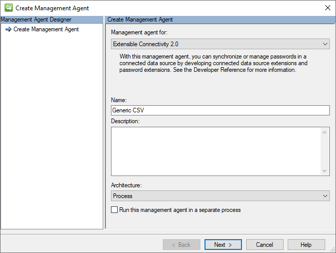
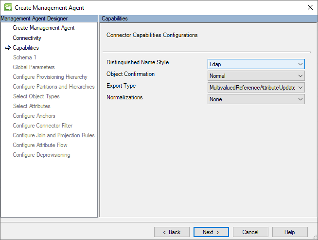
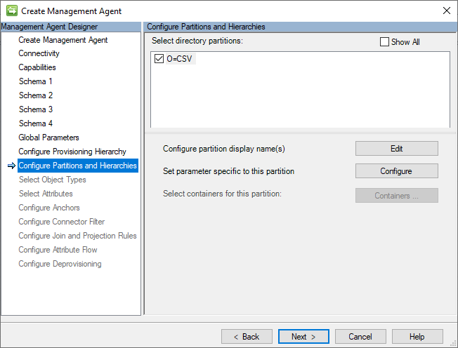

# Generic CSV Connector technical reference
This article describes the Generic SQL Connector. The article applies to the following products:

* [Microsoft Entra Connect Provisioning Agent (ECMA2Host)](https://learn.microsoft.com/en-us/entra/identity/app-provisioning/on-premises-application-provisioning-architecture)
* [Microsoft Identity Manager 2016 (MIM2016)](https://learn.microsoft.com/en-us/microsoft-identity-manager)

For MIM2016, the Connector is available as a download from the [Microsoft Download Center](https://go.microsoft.com/fwlink/?LinkId=717495).

> [!NOTE]
> The [Azure AD provisioning](https://learn.microsoft.com/azure/active-directory/app-provisioning/user-provisioning) service now provides a lightweight agent based solution for provisioning users into an SQL database, without a full MIM sync deployment. We recommend evaluating if it meets your needs. [Learn more](https://learn.microsoft.com/azure/active-directory/app-provisioning/on-premises-sql-connector-configure).

## Overview of the Generic CSV Connector
The Generic CSV Connector lets you transfer User and Group data from CSV files to Microsoft products, such as the Microsoft Entra Connect Provisioning Agent (ECMA2Host) and Microsoft Identity Manager 2016 (MIM2016). It has various features, such as the ability to use PowerShell to handle identity data before-or-after imports or exports operations. It offers support for multiple datatypes including binary and references, and the ability to specify qualified-string values, and multi-valued attributes.  

This article describes the features and functions of the Generic CSV Connector, and how to configure it for MIM 2016.  

The following table details the features included in this release:

| Feature | Details |
| --- | --- |
| Multiple Product Support | Use of this connector is supported with the following Microsoft products: <li>Microsoft Entra Connect Provisioning Agent (ECMA2Host)</li><li>Microsoft Identity Manager 2016 (MIM2016)</li> |
| CSV Files Supported | This connector supports the management of user (required) and groups (optional), through the configuration of up to three CSV files: <li>Users CSV File (ex. Users.csv)</li><li>Groups CSV File (ex. Groups.csv)</li><li>Group Members CSV File (ex. Members.csv)</li> |
| Pre/Post Operation Processing with PowerShell | This connector supports the configuration of up to four (4) PowerShell Scripts to facilitate pre-or-post processing operations.<br/>Script Execution Opportunities:<li>Before Import (ex. PreImport.ps1)</li><li>After Import (ex. PostImport.ps1)</li><li>Before Export (ex. PreExport.ps1)</li><li>After Export (ex. PostExport.ps1)</li> |
| CSV File Encoding Supported | The connector supports all default (or installed) server encoding types: (ex. Unicode, UTF-8, UTF-7, ASCII, etc.) |
| CSV Field Data Types Supported | The connector supports the following attribute data types: <li>Binary – (as 64base strings)</li><li>Boolean – (as True/False)</li><li>Integers</li><li>Strings / Multi-valued Strings</li><li>Reference / Mult-valued References</li> |
| CSV Field Delimitation | Support for comas (,) or any printable alphanumeric character to dynamically delimitate the fields of CSV records. |
| String Qualification Support | Support for double-quotes (“) or any printable alphameric character to qualify the beginning and end of any string value. |
| Multi-valued String & Reference Support | Support for multi-valued strings and references fields |
| Supported Connector Operations | The connector supports the following operations: <li>Full Import</li><li>Export</li><li>Full Export</li> |
| Schema | <p>Schema discovery is dynamic, but requires manual configuration for completion.</p><p>Fields are dynamically identified based upon a specified delimiter (i.e. “Value Separator”). </p><p>Field datatypes are manually designated during configuration.<p> |

### Prerequisites
Before you use the connector, make sure you have the following on the synchronization server:

* Microsoft .NET 4.6.2 Framework or later
* CSV Files that contain the desired schema for the following identity types:
  * Users File (required)
  * Groups (optional)
  * Group Members (required if groups are used)
* (Optional) PowerShell scripts to manage pre-and-post processing for the following Operation Types events:
  * Pre-Import – This script will be executed before an import operation is run.
  * Post-Import – This script will be executed after an import operation is run.
  * Pre-Export – This script will be executed before an export operation is run.
  * Post-Export – This script will be executed after an export operation is run.

#### MIM Synchronization Service Account Permissions
> [!IMPORTANT]
> The MIM 2016 Synchronization service account is the security context that performs the file operations to CSV files and runs the pre/post-processing PowerShell scripts. This service account needs Read/Write permissions for all the CSV and PowerShell files that are configured. It also needs the appropriate [PowerShell ExecutePolicy permissions](https://learn.microsoft.com/en-us/powershell/module/microsoft.powershell.core/about/about_execution_policies?view=powershell-7.4) to run any scripts that are configured.  

## Create a new Connector

To use the Generic CSV Connector in MIM 2016, the MIM administrator needs to perform the following steps:
* Create a management agent (MA) using the ECMA2Host extension.
* Select the Generic CSV Connector as the connector type.
* Provide the file path and name of the CSV file to be imported or exported.
* Specify the file encoding, value separator, multi-value separator, and text qualifier for the CSV file.
* Choose whether to use the values in the first row as header fields or not.
* Select the object types and attributes to be imported or exported from the CSV file.
* Configure the partition, run profile, and mapping details for the MA.
* Provide the script paths and parameters for the PowerShell scripts, if any.
* Run the MA to perform the import, sync, or export operations.

To Create a Generic SQL connector, in **Synchronization Service** select **Management Agent** and **Create**. Select the **Generic CSV (Microsoft)** Connector.



### Connectivity

When first creating a new Generic CSV Connector its Connectivity page is used to specify the location of the User, Groups, and Group Members CSV files. 


On this page is where you specify the locations of the following CSV files:  
* **Users File**: The fully qualified path of the CSV file that contains the user records and their attribute values. This file is required.
* **Groups File**: The fully qualified path of the CSV file that contains the group records. This file is optional. 
* **Members File**: The fully qualified path of the CSV file that contains group member reference records. 

>[!IMPORTANT]
>The MIM Sync service account must have **read** and **write** permissions to all the designated CSV files. As mentioned previously, the group and member files are not necessary if only users are configured.

The Connectivity screen is the first when you create a new Generic SQL Connector. You first need to provide the following information:

### Capabilities

This page allows you to configure the connector’s capabilities. Connector capabilities are not configurable but displayed for your information only to explain the expected DN style for outbound provisioning synchronization rules. 



The connector capabilities are not configurable but displayed for your information on expected DN style for outbound provisioning synchronization rules.

### Schema 1 (File Configurations)

This page is used to provide the information necessary to parse the schema of the CSV files and to delimitate their records. 

Every object type is presented as a partition and configured further on **Configure Partitions and Hierarchies**.


Below is a list of the individual configurations:
* **Use headers for schema discovery**: If this option is selected, the connector assumes the first record of each CSV file contains a header record (i.e. that contains the names of each field,) and will not treat it as a data record. If this option is not selected, the connector will assign a generic attribute name (e.g. Attribute1, Attribute2, etc.) for each field discovered and will treat the first row as a data record. 

* **Values separator**: This character is used to delimitate the fields (i.e., values) of the CSV records. The default value is the coma (,) but any printable alphanumeric character may be used. 
* **Multivalue separator**: This character is used to delimitate the individual values within a multivalued string (e.g., proxy addresses) or reference (e.g., employees) field. The default value is a semi-colon (;) but any printable alphanumeric character may be used.
* **Text qualifier**: This character is used to indicate that the field value contains a qualified string. String qualification is necessary whenever the contents of a field contain a character used for delimitation (e.g. Multivalue or Value separators)
* **File encoding**: This indicates the encoding used on the CSV files added in the Connectivity tab. Ensure that it matches the encoding of your CSV files.

#### Multi-Valued and String Qualification examples

##### Stringqualficaition Eampxe

Example: 
```
ID,AccountName,DisplayName
E001,JDoe001,“Doe, John”
```

##### Stringqualficaition Eampxe

String qualification can also be used in multi-valued string values:

Example: 
```CSV
ID,AccountName,DisplayNames
E001,JDoe001,“Doe, John”;“Doe, Johnny”
```

##### Stringqualficaition Eampxe
Example: 
```
ID,AccountName,ProxyAddresses
E001,JDoe001,SMTP:john.doe@contoso.com;smtp:jdoe001@contoso.com
```

Example:
| ID | AccountName | DisplayName |
| --- | --- | --- |
| E001 | JDoe001 | "Doe, John" |

### Schema 2 (Anchor Configurations)


### Schema 3 (User File Attribute Configurations)


### Schema 4 (Group File Attribute Configuration)


### Global Parameters (PowerShell Scripts Configuration)


### Provisioning Hierarchy


### Partitions and Hierarchies




### Object Types

The Generic CSV connector requires that at least the User object type be specified. The selection of the Group object type is optional. 


### Attributes

This page displays a normalized list of all attributes across all selected object type schemas. 


Note the Member attribute will only exist if Groups are selected and will contain the references to objects maintained in the group members CSV files.

### Anchors

The Generic CSV Connector does not support the use of complex anchors nor anchor attribute configurations that differ from their corresponding CSV file’s anchor ID fields. 

To change anchor designations displayed on this page, return to Schema 2 (Anchor Configurations). 


# Appendix I - Sample CSVs Files
## Sample Users CSV File
```CSV
USER_ID,DISPLAY_NAME,SINGLE_STRING,SINGLE_STRING_QUALIFIED,SINGLE_INTEGER,SINGLE_REFERENCE,SINGLE_BINARY,SINGLE_BOOLEAN,MULTI_STRING,MULTI_STRING_QUALIFIED
E001,Ima Testuser (E001),SINGLE_STRING1,"SINGLE,STRING,QUALIFIED1",1,E001,AAAAAAAAAAAAAAAAAAAAAAAAAAAAAAAAAAA=,True,MULTI_STRING1;MULTI_STRING1,"MULTI,STRING,QUALIFIED1";"MULTI,STRING,QUALIFIED2"
E002,Ima Testuser (E002),SINGLE_STRING2,"SINGLE,STRING,QUALIFIED2",2,E001,AAAAAAAAAAAAAAAAAAAAAAAAAAAAAAAAAAA=,True,MULTI_STRING2;MULTI_STRING1,"MULTI,STRING,QUALIFIED1";"MULTI,STRING,QUALIFIED2"
E003,Ima Testuser (E003),SINGLE_STRING3,"SINGLE,STRING,QUALIFIED3",3,E001,AAAAAAAAAAAAAAAAAAAAAAAAAAAAAAAAAAA=,True,MULTI_STRING3;MULTI_STRING1,"MULTI,STRING,QUALIFIED1";"MULTI,STRING,QUALIFIED2"
E004,Ima Testuser (E004),SINGLE_STRING4,"SINGLE,STRING,QUALIFIED4",4,E001,AAAAAAAAAAAAAAAAAAAAAAAAAAAAAAAAAAA=,True,MULTI_STRING4;MULTI_STRING1,"MULTI,STRING,QUALIFIED1";"MULTI,STRING,QUALIFIED2"
E005,Ima Testuser (E005),SINGLE_STRING5,"SINGLE,STRING,QUALIFIED5",5,E001,AAAAAAAAAAAAAAAAAAAAAAAAAAAAAAAAAAA=,True,MULTI_STRING5;MULTI_STRING1,"MULTI,STRING,QUALIFIED1";"MULTI,STRING,QUALIFIED2"
E006,Ima Testuser (E006),SINGLE_STRING6,"SINGLE,STRING,QUALIFIED6",6,E001,AAAAAAAAAAAAAAAAAAAAAAAAAAAAAAAAAAA=,True,MULTI_STRING6;MULTI_STRING1,"MULTI,STRING,QUALIFIED1";"MULTI,STRING,QUALIFIED2"
E007,Ima Testuser (E007),SINGLE_STRING7,"SINGLE,STRING,QUALIFIED7",7,E001,AAAAAAAAAAAAAAAAAAAAAAAAAAAAAAAAAAA=,True,MULTI_STRING7;MULTI_STRING1,"MULTI,STRING,QUALIFIED1";"MULTI,STRING,QUALIFIED2"
E008,Ima Testuser (E008),SINGLE_STRING8,"SINGLE,STRING,QUALIFIED8",8,E001,AAAAAAAAAAAAAAAAAAAAAAAAAAAAAAAAAAA=,True,MULTI_STRING8;MULTI_STRING1,"MULTI,STRING,QUALIFIED1";"MULTI,STRING,QUALIFIED2"
E009,Ima Testuser (E009),SINGLE_STRING9,"SINGLE,STRING,QUALIFIED9",9,E001,AAAAAAAAAAAAAAAAAAAAAAAAAAAAAAAAAAA=,True,MULTI_STRING9;MULTI_STRING1,"MULTI,STRING,QUALIFIED1";"MULTI,STRING,QUALIFIED2"
E010,Ima Testuser (E010),SINGLE_STRING10,"SINGLE,STRING,QUALIFIED10",10,E001,AAAAAAAAAAAAAAAAAAAAAAAAAAAAAAAAAAA=,True,MULTI_STRING10;MULTI_STRING1,"MULTI,STRING,QUALIFIED1";"MULTI,STRING,QUALIFIED2"
```

# Appendix I - CSV User File


# Appendix I - CSV User File

EMPLOYEE_ID,ACCOUNT_NAME,DISPLAY_NAME,ACTIVE,MANAGER,PROXY_ADDRESSES
E001,"Doe, John",JD001,,TRUE,john.doe@contoso.com;jd001@contoso.com
E002,"Ivanovich, Ivan",II002,E001,TRUE,john.doe@contoso.com;jd001@contoso.com
E003,"Kariuki, John",JK003,E001,TRUE,john.doe@contoso.com;jd001@contoso.com
E004,"Perez, Juan",JP004,E001,TRUE,john.doe@contoso.com;jd001@contoso.com
E005,"Meier, Hans",HM005,E001,FALSE,has.doe@contoso.com;jd001@contoso.com


E006,
 or Jan Janssen
Brazil: Fulano (de Tal) or João da Silva / Maria Aparecida
Bulgaria: Ivan Ivanov / Maria Ivanova
Chile: Juan Perez
Croatia: Ivan Horvat / Ivana or Ana Horvat
Czech Republic: Jan Novák
United States: John Doe, Jane Doe, Baby Doe, John Roe, Richard Roe, and Janie Doe / Johnny Doe (for children) 1.


## Troubleshooting
* For information on how to enable logging to troubleshoot the connector, see the [How to Enable ETW Tracing for Connectors](https://go.microsoft.com/fwlink/?LinkId=335731).
