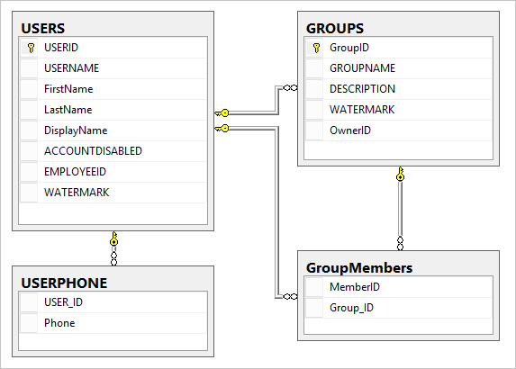
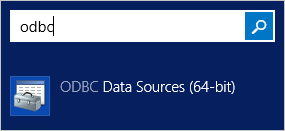
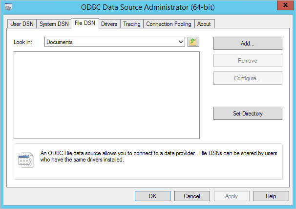
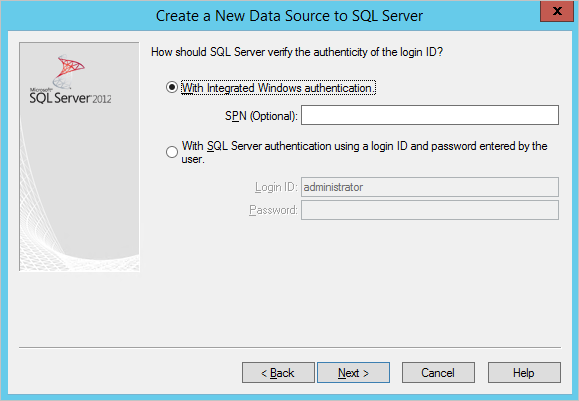
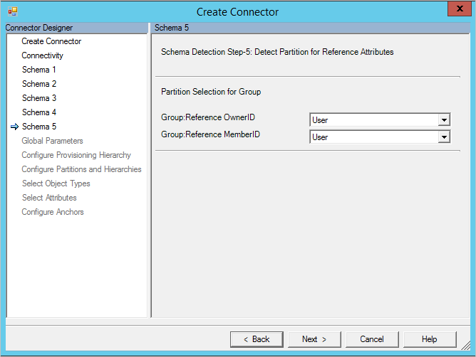
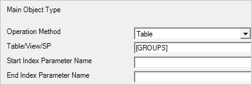

# Generic SQL Connector step-by-step
This topic is a step-by-step guide. It creates a simple sample HR database and use it for importing some users and their group membership.

> [!NOTE]
> The [Azure AD provisioning](https://learn.microsoft.com/azure/active-directory/app-provisioning/user-provisioning) service now provides a lightweight agent based solution for provisioning users into a SQL database, without a full MIM sync deployment. We recommend evaluating if it meets your needs. [Learn more](https://learn.microsoft.com/azure/active-directory/app-provisioning/on-premises-sql-connector-configure).

## Prepare the sample database
On a server running SQL Server, run the SQL script found in [Appendix A](#appendix-a). This script creates a sample database with the name GSQLDEMO. The object model for the created database looks like this picture:  


Also create a user you want to use to connect to the database. In this walkthrough, the user is called FABRIKAM\SQLUser and located in the domain.

## Create the ODBC connection file
The Generic SQL Connector is using ODBC to connect to the remote server. First we need to create a file with the ODBC connection information.

1. Start the ODBC management utility on your server:  
   
2. Select the tab **File DSN**. Click **Add...**.  
   
3. The out-of-box driver works fine, so select it and click **Next>**.  
   
4. Give the file a name, such as **GenericSQL**.  
   
5. Click **Finish**.  
   
6. Time to configure the connection. Give the data source a good description and provide the name of the server running SQL Server.  
   
7. Select how to authenticate with SQL. In this case, we use Windows Authentication.  
   
8. Provide the name of the sample database, **GSQLDEMO**.  
   
9. Keep everything default on this screen. Click **Finish**.  
   
10. To verify everything is working as expected, click **Test Data Source**.  
    
11. Make sure the test is successful.  
    
12. The ODBC configuration file should now be visible in File DSN.  
    

We now have the file we need and can start creating the Connector.

## Create the Generic SQL Connector
1. In the Synchronization Service Manager UI, select **Connectors** and **Create**. Select **Generic SQL (Microsoft)** and give it a descriptive name.  
   
2. Find the DSN file you created in the previous section and upload it to the server. Provide the credentials to connect to the database.  
   
3. In this walkthrough, we are making it easy for us and say that there are two object types, **User** and **Group**.
   
4. To find the attributes, we want the Connector to detect those attributes by looking at the table itself. Since **Users** is a reserved word in SQL, we need to provide it in square brackets [ ].  
   
5. Time to define the anchor attribute and the DN attribute. For **Users**, we use the combination of the two attributes username and EmployeeID. For **group**, we use GroupName (not realistic in real-life, but for this walkthrough it works).
   
6. Not all attribute types can be detected in a SQL database. The reference attribute type in particular cannot. For the group object type, we need to change the OwnerID and MemberID to reference.  
   
7. The attributes we selected as reference attributes in the previous step require the object type these values are a reference to. In our case, the User object type.  
   
8. On the Global Parameters page, select **Watermark** as the delta strategy. Also type in the date/time format **yyyy-MM-dd HH:mm:ss**.
   
9. On the **Configure Partitions and Hierarchies** page, select both object types.
   
10. On the **Select Object Types** and **Select Attributes**, select both object types and all attributes. On the **Configure Anchors** page, click **Finish**.

## Create Run Profiles
1. In the Synchronization Service Manager UI, select **Connectors**, and **Configure Run Profiles**. Click **New Profile**. We start with **Full Import**.  
   
2. Select the type **Full Import (Stage Only)**.  
   
3. Select the partition **OBJECT=User**.  
   
4. Select **Table** and type **[USERS]**. Scroll down to the multi-valued object type section and enter the data as in the following picture. Select **Finish** to save the step.  
     
     
5. Select **New Step**. This time, select **OBJECT=Group**. On the last page, use the configuration as in the following picture. Click **Finish**.  
     
     
6. Optional: If you want to, you can configure additional run profiles. For this walkthrough, only the Full Import is used.
7. Click **OK** to finish changing run profiles.

## Add some test data and test the import
Fill out some test data in your sample database. When you are ready, select **Run** and **Full import**.

Here is a user with two phone numbers and a group with some members.  
  
  

## Appendix A
**SQL script to create the sample database**

```SQL
---Creating the Database---------
Create Database GSQLDEMO
Go
-------Using the Database-----------
Use [GSQLDEMO]
Go
-------------------------------------
USE [GSQLDEMO]
GO
/****** Object:  Table [dbo].[GroupMembers]   ******/
SET ANSI_NULLS ON
GO
SET QUOTED_IDENTIFIER ON
GO
CREATE TABLE [dbo].[GroupMembers](
    [MemberID] [int] NOT NULL,
    [Group_ID] [int] NOT NULL
) ON [PRIMARY]

GO
/****** Object:  Table [dbo].[GROUPS]   ******/
SET ANSI_NULLS ON
GO
SET QUOTED_IDENTIFIER ON
GO
CREATE TABLE [dbo].[GROUPS](
    [GroupID] [int] NOT NULL,
    [GROUPNAME] [nvarchar](200) NOT NULL,
    [DESCRIPTION] [nvarchar](200) NULL,
    [WATERMARK] [datetime] NULL,
    [OwnerID] [int] NULL,
PRIMARY KEY CLUSTERED
(
    [GroupID] ASC
)WITH (PAD_INDEX = OFF, STATISTICS_NORECOMPUTE = OFF, IGNORE_DUP_KEY = OFF, ALLOW_ROW_LOCKS = ON, ALLOW_PAGE_LOCKS = ON) ON [PRIMARY]
) ON [PRIMARY]

GO
/****** Object:  Table [dbo].[USERPHONE]   ******/
SET ANSI_NULLS ON
GO
SET QUOTED_IDENTIFIER ON
GO
SET ANSI_PADDING ON
GO
CREATE TABLE [dbo].[USERPHONE](
    [USER_ID] [int] NULL,
    [Phone] [varchar](20) NULL
) ON [PRIMARY]

GO
SET ANSI_PADDING OFF
GO
/****** Object:  Table [dbo].[USERS]   ******/
SET ANSI_NULLS ON
GO
SET QUOTED_IDENTIFIER ON
GO
CREATE TABLE [dbo].[USERS](
    [USERID] [int] NOT NULL,
    [USERNAME] [nvarchar](200) NOT NULL,
    [FirstName] [nvarchar](100) NULL,
    [LastName] [nvarchar](100) NULL,
    [DisplayName] [nvarchar](100) NULL,
    [ACCOUNTDISABLED] [bit] NULL,
    [EMPLOYEEID] [int] NOT NULL,
    [WATERMARK] [datetime] NULL,
PRIMARY KEY CLUSTERED
(
    [USERID] ASC
)WITH (PAD_INDEX = OFF, STATISTICS_NORECOMPUTE = OFF, IGNORE_DUP_KEY = OFF, ALLOW_ROW_LOCKS = ON, ALLOW_PAGE_LOCKS = ON) ON [PRIMARY]
) ON [PRIMARY]

GO
ALTER TABLE [dbo].[GroupMembers]  WITH CHECK ADD  CONSTRAINT [FK_GroupMembers_GROUPS] FOREIGN KEY([Group_ID])
REFERENCES [dbo].[GROUPS] ([GroupID])
GO
ALTER TABLE [dbo].[GroupMembers] CHECK CONSTRAINT [FK_GroupMembers_GROUPS]
GO
ALTER TABLE [dbo].[GroupMembers]  WITH CHECK ADD  CONSTRAINT [FK_GroupMembers_USERS] FOREIGN KEY([MemberID])
REFERENCES [dbo].[USERS] ([USERID])
GO
ALTER TABLE [dbo].[GroupMembers] CHECK CONSTRAINT [FK_GroupMembers_USERS]
GO
ALTER TABLE [dbo].[GROUPS]  WITH CHECK ADD  CONSTRAINT [FK_GROUPS_USERS] FOREIGN KEY([OwnerID])
REFERENCES [dbo].[USERS] ([USERID])
GO
ALTER TABLE [dbo].[GROUPS] CHECK CONSTRAINT [FK_GROUPS_USERS]
GO
ALTER TABLE [dbo].[USERPHONE]  WITH CHECK ADD  CONSTRAINT [FK_USERPHONE_USER] FOREIGN KEY([USER_ID])
REFERENCES [dbo].[USERS] ([USERID])
GO
ALTER TABLE [dbo].[USERPHONE] CHECK CONSTRAINT [FK_USERPHONE_USER]
GO
```
