# Generic SQL Connector technical reference
This article describes the Generic SQL Connector. The article applies to the following products:

* Microsoft Identity Manager 2016 (MIM2016)
* Forefront Identity Manager 2010 R2 (FIM2010R2)
  * Must use hotfix 4.1.3671.0 or later [KB3092178](https://support.microsoft.com/kb/3092178).

For MIM2016 and FIM2010R2, the Connector is available as a download from the [Microsoft Download Center](https://go.microsoft.com/fwlink/?LinkId=717495).

To see this Connector in action, see the [Generic SQL Connector step-by-step](microsoft-identity-manager-2016-connector-genericsql-step-by-step.md) article.

## Overview of the Generic SQL Connector
The Generic SQL Connector enables you to integrate the synchronization service with a database system that offers ODBC connectivity.  

From a high-level perspective, the following features are supported by the current release of the connector:

| Feature | Support |
| --- | --- |
| Connected data source |The Connector is supported with all 64-bit ODBC drivers*. It has been tested with the following: <li>Microsoft SQL Server & SQL Azure</li><li>IBM DB2 10.x</li><li>IBM DB2 9.x</li><li>Oracle 10 & 11g</li><li>Oracle 12c and 18c</li><li>MySQL 5.x</li> |
| Scenarios |<li>Object Lifecycle Management</li><li>Password Management</li> |
| Operations |<li>Full Import and Delta Import, Export</li><li>For Export: Add, Delete, Update, and Replace</li><li>Set Password, Change Password</li> |
| Schema |<li>Dynamic discovery of objects and attributes</li> |

> [!NOTE]
> *Connections to data sources not listed above, e.g. PostgreSQL, are currently limited to query-based import and export strategies.

### Prerequisites
Before you use the Connector, make sure you have the following on the synchronization server:

* Microsoft .NET 4.5.2 Framework or later
* 64-bit ODBC client drivers
* If you are using the connector to communicate with Oracle 12c, this requires Oracle Instant Client 12.2.0.1 or newer with the ODBC package.
* If you are using the connector to communicate with Oracle 18c, this requires Oracle Instant Client 18.3.0.0 or newer with ODBC Package, and the NLS_LANG system variable to be set to support UTF8 characters.

### Permissions in connected data source
To create or perform any of the supported tasks in Generic SQL connector, you must have:

* db_datareader
* db_datawriter

### Ports and protocols
For the ports required for the ODBC driver to work, consult the database vendor's documentation.

## Create a new Connector
To Create a Generic SQL connector, in **Synchronization Service** select **Management Agent** and **Create**. Select the **Generic SQL (Microsoft)** Connector.

### Connectivity
The Connector uses an ODBC DSN file for connectivity. Create the DSN file using **ODBC Data Sources** found in the start menu under **Administrative Tools**. In the administrative tool, create a **File DSN** so it can be provided to the Connector.

The Connectivity screen is the first when you create a new Generic SQL Connector. You first need to provide the following information:

* DSN file path
* Authentication
  * User Name
  * Password

The database should support one of these authentication methods:

* **Windows authentication**: The authenticating database uses the Windows credentials to verify the user. The user name/password specified is used to authenticate with the database. This account needs permissions to the database.
* **SQL authentication**: The authenticating database uses the user name/password defined one the Connectivity screen to connect to the database. If you store the user name/pasword in the DSN file, the credentials provided on the Connectivity screen have precedence.
* **Azure SQL Database authentication**: For more information, see [Connect to SQL Database By Using Azure Active Directory Authentication](https://docs.microsoft.com/azure/sql-database/sql-database-aad-authentication-configure).

**DN is Anchor**: If you select this option, the DN is also used as the anchor attribute. It can be used for a simple implementation but also has the following limitation:

* Connector supports only one object type. Therefore any reference attributes can only reference the same object type.

**Export Type: Object Replace**: During export, when only some attributes have changed, the entire object with all attributes is exported and replaces the existing object.

### Schema 1 (Detect object types)
On this page, you are going to configure how the Connector is going to find the different object types in the database.

Every object type is presented as a partition and configured further on **Configure Partitions and Hierarchies**.

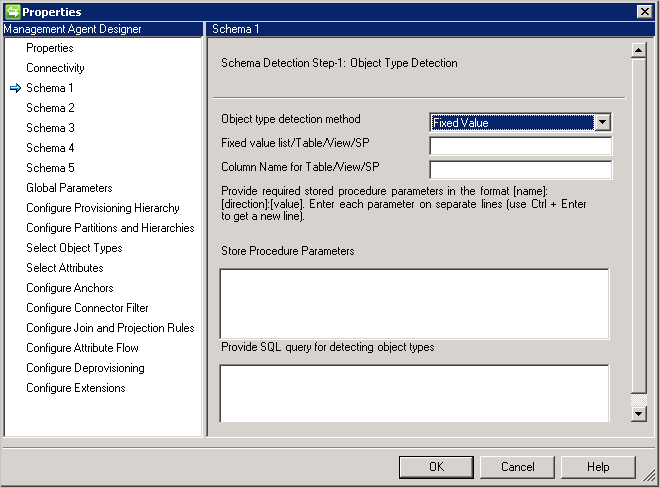

**Object Type detection method**: The Connector supports these object type detection methods.

* **Fixed Value**: You provide the list of object types with a comma-separated list. For example: `User,Group,Department`.  
  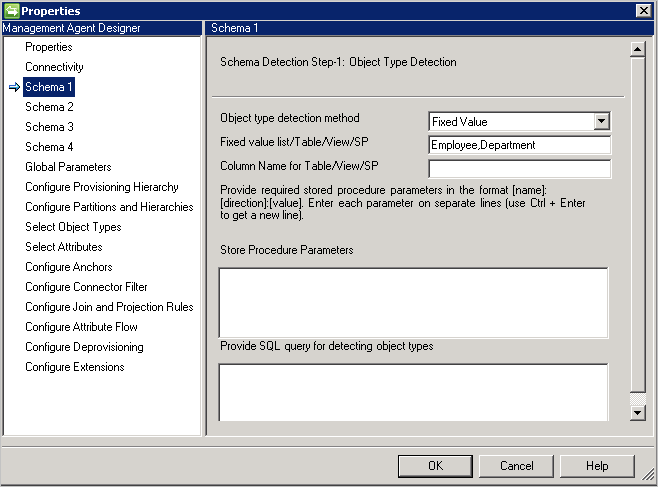
* **Table/View/Stored Procedure**: Provide the name of the table/view/stored procedure and then the column name that provides the list of object types. If you use a stored procedure, then also provide parameters for it in the format **[Name]:[Direction]:[Value]**. Provide each parameter on a separate line (use Ctrl+Enter to get a new line).  
  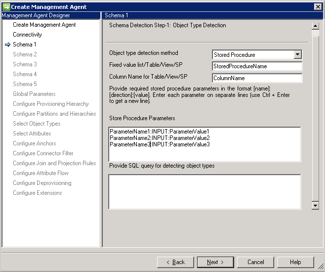
* **SQL Query**: This option allows you to provide a SQL query that returns a single column with object types, for example `SELECT [Column Name] FROM TABLENAME`. The returned column must be of type string (varchar).

### Schema 2 (Detect attribute types)
On this page, you are going to configure how the attribute names and types are going to be detected. The configuration options are listed for every object type detected on the previous page.

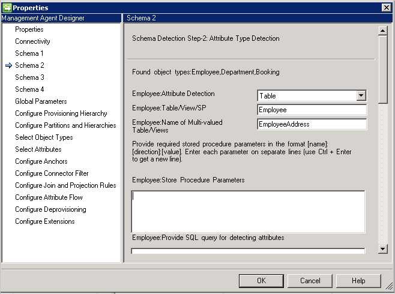

**Attribute Type detection method**: The Connector supports these attribute type detection methods with every detected object type in Schema 1 screen.

* **Table/View/Stored Procedure**: Provide the name of the table/view/stored procedure that should be used to find the attribute names. If you use a stored procedure, then also provide parameters for it in the format **[Name]:[Direction]:[Value]**. Provide each parameter on a separate line (use Ctrl+Enter to get a new line). To detect the attribute names in a multi-valued attribute, provide a comma-separated list of Tables or Views. Multivalued scenarios are not supported when parent and child table have same column names.
* **SQL query**: This option allows you to provide a SQL query that returns a single column with attribute names, for example `SELECT [Column Name] FROM TABLENAME`. The returned column must be of type string (varchar).

### Schema 3 (Define anchor and DN)
This page allows you to configure anchor and DN attribute for each detected object type. You can select multiple attributes to make the anchor unique.

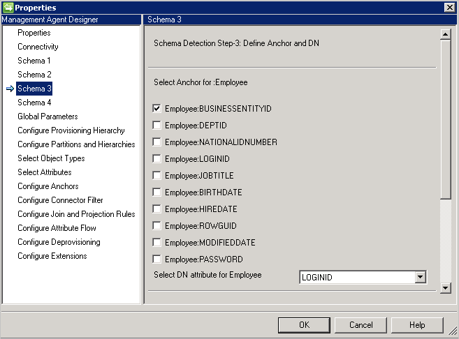

* Multi-valued and Boolean attributes are not listed.
* Same attribute cannot use for DN and anchor, unless **DN is Anchor** is selected on the Connectivity page.
* If **DN is Anchor** is selected on the Connectivity page, this page requires only the DN attribute. This attribute would also be used as the anchor attribute.

  

### Schema 4 (Define attribute type, reference, and direction)
This page allows you to configure the attribute type, such as integer, binary, or Boolean, and direction for each attribute. All attributes from page **schema 2** are listed including multi-valued attributes.

* **DataType**: Used to map the attribute type to those types known by the sync engine. The default is to use the same type as detected in the SQL schema, but DateTime and Reference are not easily detectable. For those, you need to specify **DateTime** or **Reference**.
* **Direction**: You can set the attribute direction to Import, Export, or ImportExport. ImportExport is default.

Notes:

* If an attribute type is not detectable by the Connector, it uses the String data type.
* **Nested tables** can be considered one-column database tables. Oracle stores the rows of a nested table in no particular order. However, when you retrieve the nested table into a PL/SQL variable, the rows are given consecutive subscripts starting at 1. That gives you array-like access to individual rows.
* **VARRYS** are not supported in the connector.

### Schema 5 (Define partition for reference attributes)
On this page, you configure for all reference attributes which partition (object type) an attribute is referring to.

If you use **DN is anchor**, then you must use the same object type as the one you are referring from. You cannot reference another object type.

> [!NOTE]
> Starting in the March 2017 update there is now an option for "*" When this option is chosen then all possible member types will be imported.

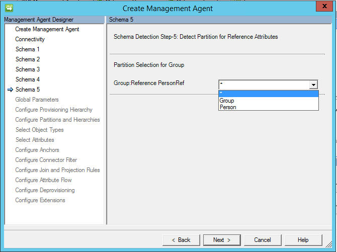

> [!IMPORTANT]
>  As of May 2017 the “\*” aka **any option** has been changed to support import and export flow. If you want to use this option your multi-valued table/view should have an attribute that contains the object type.

   If "*" is selected then the name of the column with the object type must also be specified.  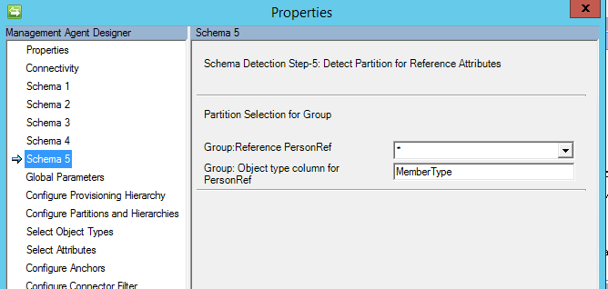

After import you will see something similar to the image below:

  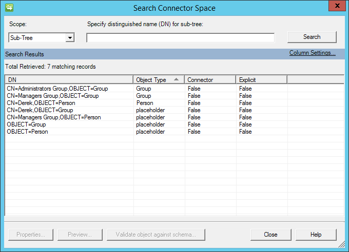

### Global Parameters
The Global Parameters page is used to configure Delta Import, Date/Time format, and Password method.

The Generic SQL Connector supports the following methods for Delta Import:

* **Trigger**: See [Generating Delta Views Using Triggers](https://technet.microsoft.com/library/cc708665.aspx).
* **Watermark**: A generic approach that can be used with any database. The watermark query is pre-populated based on the database vendor. A watermark column must be present on every table/view used. This column must track inserts and updates to the tables as and its dependent (multi-valued or child) tables. The clocks between Synchronization Service and the database server must be synchronized. If not, some entries in the delta import might be omitted.  
  Limitation:
  * Watermark strategy does not support deleted objects.
* **Snapshot**: (Works only with Microsoft SQL Server) [Generating Delta Views Using Snapshots](https://technet.microsoft.com/library/cc720640.aspx)
* **Change Tracking**: (Works only with Microsoft SQL Server) [About Change Tracking](https://msdn.microsoft.com/library/bb933875.aspx)  
  Limitations:
  * Anchor & DN attribute must be part of primary key for the selected object in the table.
  * SQL query is unsupported during Import and Export with Change Tracking.

**Additional Parameters**: Specify the Database Server Time Zone indicating where your Database server is located. This value is used to support the various formats of date & time attributes.

The Connector always stores date and date-time in UTC format. To be able to correctly convert the date and times, the time zone of the database server and the format used must be specified. The format should be expressed in .Net format.

During export every date time attribute must be provided to the Connector in UTC time format.

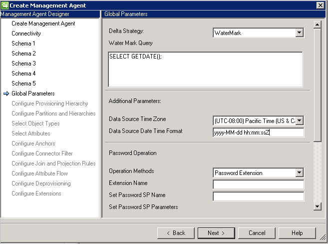

**Password Configuration**: The connector provides password synchronization capabilities and supports set and change password.

The Connector provides two methods to support password synchronization:

* **Stored Procedure**: This method requires two stored procedures to support Set & Change password. Type all parameters for add and change the password operation in **Set Password SP** and **Change Password SP** Parameters respectively as per below example.
  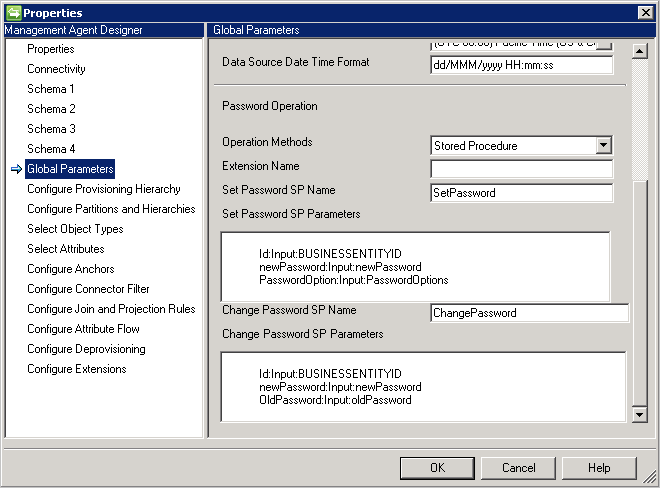
* **Password Extension**: This method requires Password extension DLL (you need to provide the Extension DLL Name that is implementing the [IMAExtensible2Password](https://msdn.microsoft.com/library/microsoft.metadirectoryservices.imaextensible2password.aspx) interface). Password extension assembly must be placed in extension folder so that the connector can load the DLL at runtime.
  

You also have to enable the Password Management on the **Configure Extension** page.

### Configure Partitions and Hierarchies
On the partitions and hierarchies page, select all object types. Each object type is its own partition.

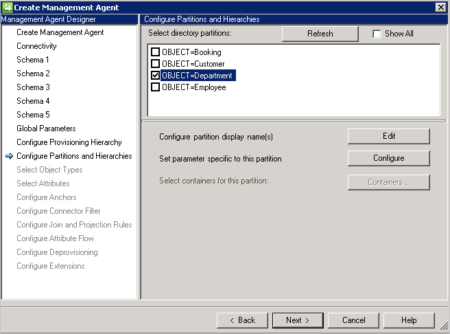

You can also override the values defined on the **Connectivity** or **Global Parameters** page.

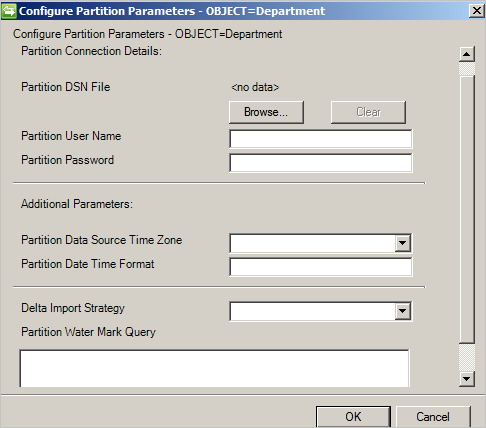

### Configure Anchors
This page is read-only since the anchor has already been defined. The selected anchor attribute is always appended with the object type to ensure it remains unique across object types.

## Configure Run Step Parameter
These steps are configured on the run profiles on the Connector. These configurations do the actual work of importing and exporting data.

### Full and Delta Import
Generic SQL Connector support Full and Delta Import using these methods:

* Table
* View
* Stored Procedure
* SQL Query

**Table/View**  
To import multi-valued attributes for an object, you have to provide the table/view name in **Name of Multi-Valued table/views** and respective join conditions in the **Join condition** with the parent table. If there are more than one multi-valued table in the data source, you can  use union to a single view.

> [!IMPORTANT]
> The Generic SQL management agent can work only with one multi-valued table. Do not put into Name of Multi-Valued table/views more than one name of table. It is the limitation of Generic SQL.

Example: You want to import the Employee object and all its multi-valued attributes. There are two tables, named Employee (main table) and Department (multi-valued).
Do the following:

* Type **Employee** in **Table/View/SP**.
* Type Department in **Name of Multi-Valued table/views**.
* Type the join condition between Employee & Department in **Join Condition**, for example `Employee.DEPTID=Department.DepartmentID`.
  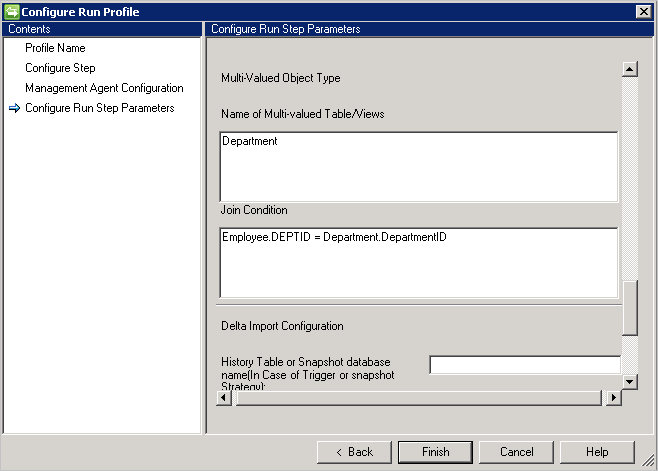

**Stored procedures**  

* If you have much data, it is recommended to implement pagination with your Stored Procedures.
* For your Stored Procedure to support pagination, you need to provide Start Index and End Index. See: [Efficiently Paging Through Large Amounts of Data](https://msdn.microsoft.com/library/bb445504.aspx).
* @StartIndex and @EndIndex are replaced at execution time with respective page size value configured on **Configure Step** page. For example, when the connector retrieves first page and the page size is set 500, in such situation @StartIndex would be 1 and @EndIndex 500. These values increase when connector retrieves subsequent pages and change the @StartIndex & @EndIndex value.
* To execute parameterized Stored Procedure, provide the parameters in `[Name]:[Direction]:[Value]` format. Enter each parameter on a separate line (Use Ctrl + Enter to get a new line).
* Generic SQL connector also supports Import operation from Linked Servers in Microsoft SQL Server. If information should be retrieved from a Table in Linked server, then Table should be provided in the format: `[ServerName].[Database].[Schema].[TableName]`
* Generic SQL Connector supports only those objects that have similar structure (both alias name and data type) between run steps information and schema detection. If the selected object from schema and provided information at run step is different, then SQL Connector is unable to support this type of scenarios.

**SQL Query**  
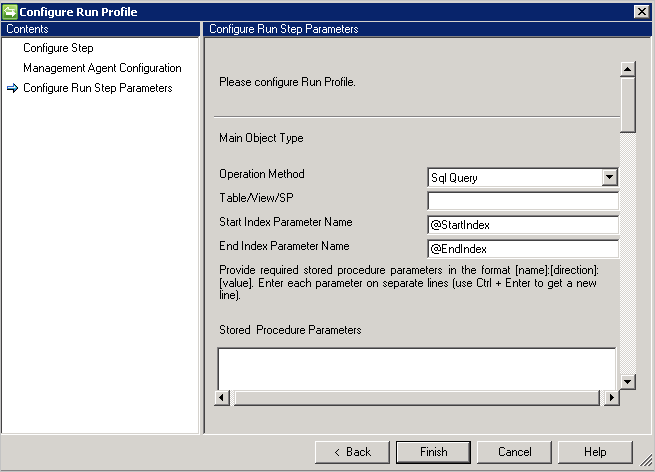

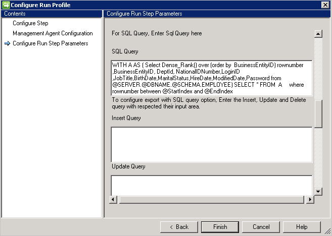

* Multiple result sets queries not supported.
* SQL query supports the pagination and provide start Index and End Index as a variable to support pagination.

### Delta Import

Delta Import configuration requires some more configuration compared with Full Import.

* If you choose the Trigger or Snapshot approach to track delta changes, then provide History Table or Snapshot database in **History Table or Snapshot database name** box.
* You also need to provide join condition between History table and Parent table, for example `Employee.ID=History.EmployeeID`
* To track the transaction on the parent table from the history table, you must provide the column name that contains the operation information (Add/Update/Delete).
* If you choose Watermark to track delta changes, then provide the column name that contains the operation information in **Water Mark Column Name**.
* The **change Type attribute** column is required for the change type. This column maps a change that occurs in the primary table or multi-value table to a change type in the delta view. This column can contain the Modify_Attribute change type for attribute-level change or an Add, Modify, or Delete change type for an object-level change type. If it is something other than the default value Add, Modify, or Delete, then you can define those values using this option.

### Export

Generic SQL Connector support Export using four supported methods such as:

* Table
* View
* Stored Procedure
* SQL Query

**Table/View**  
If you choose the Table/View option, then the connector generates the respective queries to do the Export.

**Stored procedures**  
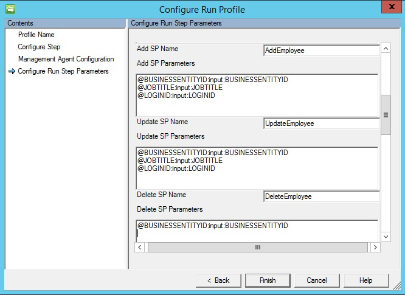

If you choose the Stored Procedure option, Export requires three different Stored procedures to perform Insert/Update/Delete operations.

* **Add SP Name**: This SP runs if any object comes to connector for insertion in the respective table.
* **Update SP Name**: This SP runs if any object comes to connector for update in the respective table.
* **Delete SP Name**: This SP runs if any object comes to connector for deletion in the respective table.
* Attribute selected from the schema used as a parameter value to the stored procedure. For example, `@EmployeeName: INPUT: EmployeeName` (EmployeeName is selected in the connector schema and the connector replaces the respective value while doing export)
* To run parameterized stored procedure, provide parameters in `[Name]:[Direction]:[Value]` format. Enter each parameter on a separate line (Use Ctrl + Enter to get a new line).

**SQL query**  
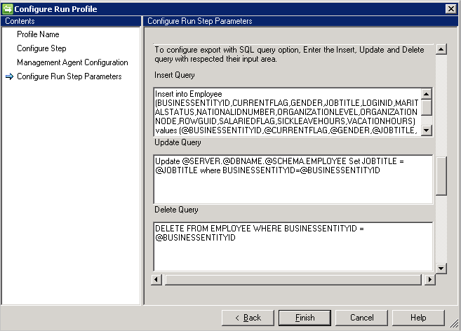

If you choose the SQL query option, Export requires three different queries to perform Insert/Update/Delete operations.

* **Insert Query**: This query runs if any object comes to connector for insertion in the respective table.
* **Update Query**: This query runs if any object comes to connector for update in the respective table.
* **Delete Query**: This query runs if any object comes to connector for deletion in the respective table.
* Attribute selected from the schema used as a parameter value to the query, for example `Insert into Employee (ID, Name) Values (@ID, @EmployeeName)`

## Troubleshooting
* For information on how to enable logging to troubleshoot the connector, see the [How to Enable ETW Tracing for Connectors](https://go.microsoft.com/fwlink/?LinkId=335731).
