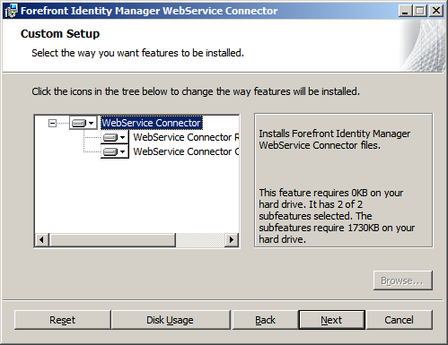

---
# required metadata

title: MIM Installation steps for web config tool | Microsoft Docs
description: This article covers the steps required to install the web service configuration tool
keywords:
author: barclayn
ms.author: barclayn
manager: mbaldwin
ms.date: 11/27/2017
ms.topic: get-started-article
ms.service: microsoft-identity-manager
ms.technology: security
ms.assetid: 
---
# Installing the Web Service Configuration Tool

The Connector and default projects are available from [Microsoft Download Center](https://www.microsoft.com/en-us/download/details.aspx?id=51495).

**Web Service Connector MSI**: This MSI exposes two features:

-   *Web ServiceConnector Runtime* which will install the core Connector, its dependencies and the packaged Connector.

-   *Web Service Configuration Tool* that will install the Web Service Configuration Tool.

The configuration tool can be installed without having the Synchronization
Service installed. This allows configuration on a separate computer.

## Default Projects

Additional default projects are shipped with the Web Services Connector. These are available as self-extract EXE files. You may download web service Connector project as appropriate to your requirement.

After the installation is complete the different components with their binaries are installed at below folder location on your system.

| **Contents**                                                                                                          | **Location**                                                                                                                                                            |
|-----------------------------------------------------------------------------------------------------------------------|-------------------------------------------------------------------------------------------------------------------------------------------------------------------------------------------------------------------------------------------------------------------------------------------------|
| Web Service Connector Runtime                                                                                         | **%Program Files%\\Microsoft Forefront Identity Management\\2010\\Synchronization Service\\Extensions**                                                                                                                                                                                         |
| Web Service Connector Project                                                                                         | **% Program Files%\\Microsoft Forefront Identity Management\\2010\\Synchronization Service\\Extensions**                                                                                                                                                                                        |
| Packaged Connector                                                                                                    | **% Program Files %\\Microsoft Forefront Identity Management\\2010\\Synchronization Service\\UIShell\\XMLs\\PackagedMAs**                                                                                                                                                                       |
| Web Service Configuration tool. This is the default install location, you can choose to change it while installation. | **%Program Files%\\Microsoft Forefront Identity Management\\2010\\Synchronization Service\\UIShell\\Web Service Configuration**                                                                                                                                                                 |
| Web Service Project file                                                                                              | User can select any target folder to extract this file into but the extracted project (**.WsConfig file**) will be visible to FIM Sync UI only if it is extracted to FIM’s Extensions folder. The extracted project file will be visible to the Web Service Configuration tool in any location. |

## Additional Permissions

Project file can be saved and opened from any location (with the appropriate access privileges of its executor); however, only project files that are saved to  synchronization Service\\Extension folder will be able to get selected in the Web Service connector wizard accessed through FIM Sync UI.

The user running the Web Service Configuration tool will require the following privileges:

- Read/Write permissions to the Synchronization Service Extension folder.
- Read access to the registry key **HKLM\\System\\CurrentControlSet\\Services\\FIMSynchronizationService\\Parameters**
