---
# required metadata

title: Web Service Connector configuration options | Microsoft Docs
description: This article covers the steps required to install the web service configuration tool
keywords:
author: barclayn
ms.author: barclayn
manager: mbaldwin
ms.date: 11/27/2017
ms.topic: get-started-article
ms.service: microsoft-identity-manager
ms.technology: security
ms.assetid: 
---

# Web Service Connector configuration options
This article describes the steps to configure a new Web Service Connector or to make changes in an existing Web Service Connector through Microsoft Identity Manager Synchronization Service UI. 
>[!IMPORTANT]
You will need to download and install the [web services connector](https://www.microsoft.com/download/details.aspx?id=51495) before attempting the steps in this article.

## Configuration of the Web Service Connector in the MIM Sync UI

You can create a new Web Service Connector using Management Agent designer. After creating the Connector, you can define multiple Run Profiles to perform different tasks. While configuring an existing Connector, you can change a task by clicking the appropriate page in Management Agent Designer. Follow the below steps to configure a new Web Service Connector.

1.  Open Microsoft® Identity Manager 2016 Synchronization Service. On the **Tools** menu, click **Management Agents**.

2.  On the **Actions** menu, click **Create**. This will open the Management Agent Designer.

3.  In **Management Agent Designer**, in **Management Agent for**, select **Web Service (Microsoft).**

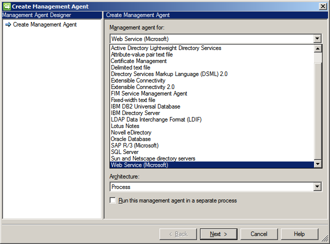

4. Click **Next**.

5.  On the **Connectivity** screen, select the default **Web Service Connector project**. Provide the **Host** and **Port**.

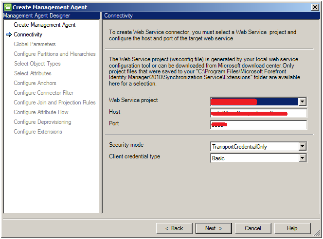

6. Click **Next**.

7.  Define the **Global Parameters.** Use the login credential procured from Web Service Admin for connecting to the Host. 

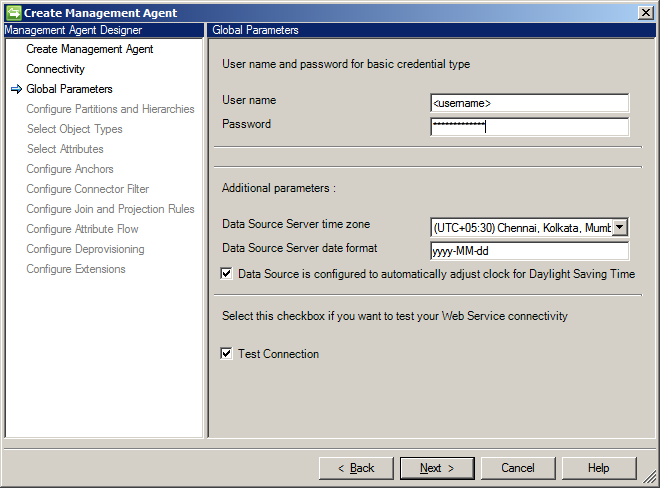

    -   If the location of data source  observes Daylight Saving and the data source is configured to automatically adjust to daylight saving settings then you must check the box for **Data Source is configured to automatically adjust clock for Daylight Saving Time**.

    -   If you want to trigger the test connection workflow from this connector then you must check the check box for **Test Connection**.

8. Click **Next.**.

9.  On next screen select **default** for **Select directory partitions.**

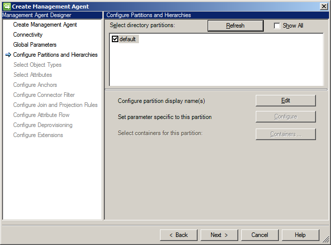

10. Click **Next.**.

11.  On **Select Object Types** screen, select the object type you want to work with. By default Web Service Connector supports two object types:
    **Employee** and **User.**

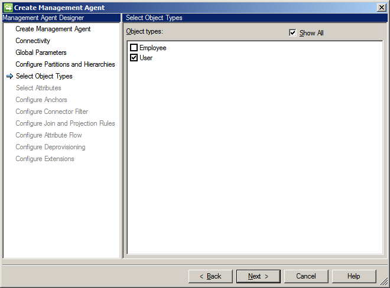

12.   Click **Next**.

13.  On **Select Attributes** page, check all the mandatory attributes for the selected objects and the attributes you need to work with.

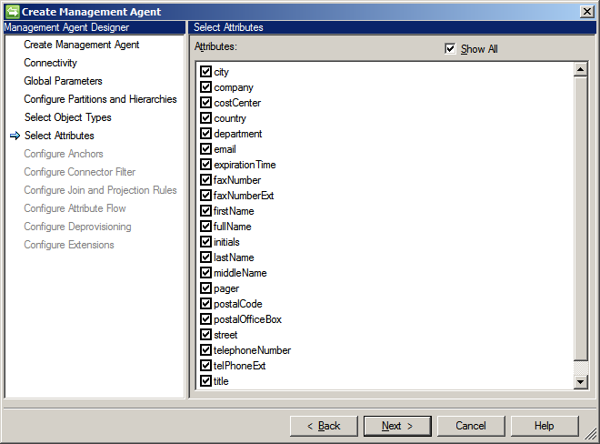

14.   Click **Next**.

15.  On the next displayed **Configure Anchors** page, specify the anchor attributes.

16.  Specify the **Connector Filter** on **Configure Connector Filter** page.

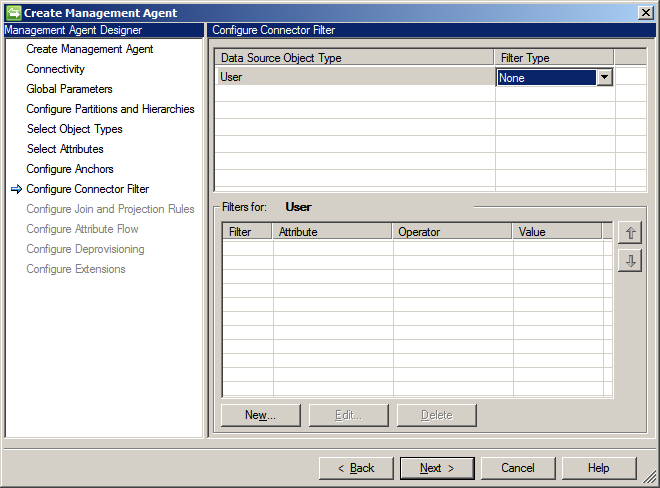

17.   Click **Next**.

18.  Specify the join and projection rules on **Configure Join and Projection Rules** page. You can create a new join rule and projection rule by clicking **New Join Rule** and **New Projection Rule** respectively**.**

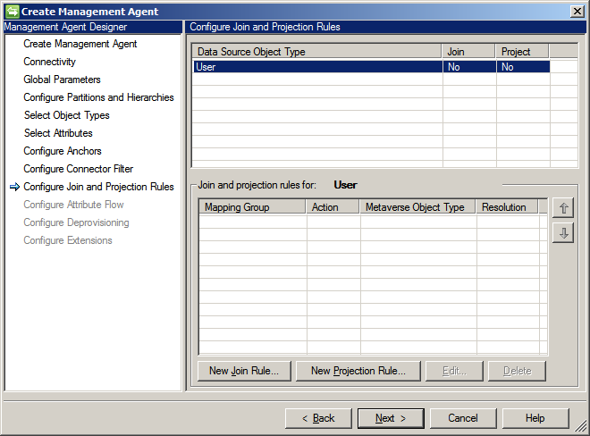

19. Click **Next**.

20.  Configure attribute flow on the next page. You must specify the **Mapping Type** and the **Flow Direction** for the attributes for selected object types.

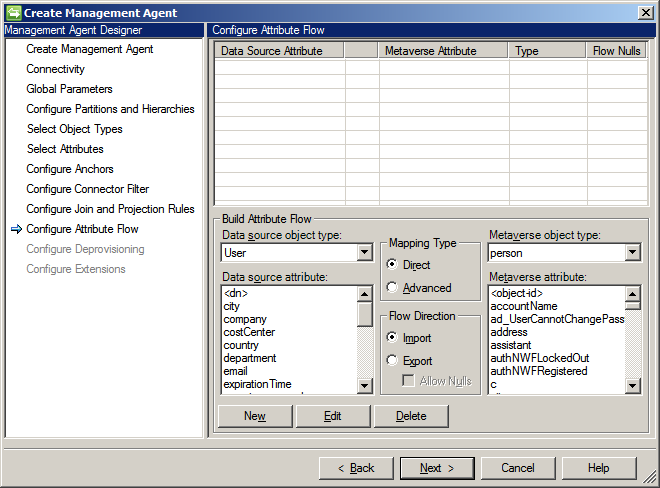

21. Click **Next**.

22.  Specify the type of de-provisioning that should be applicable for the objects.

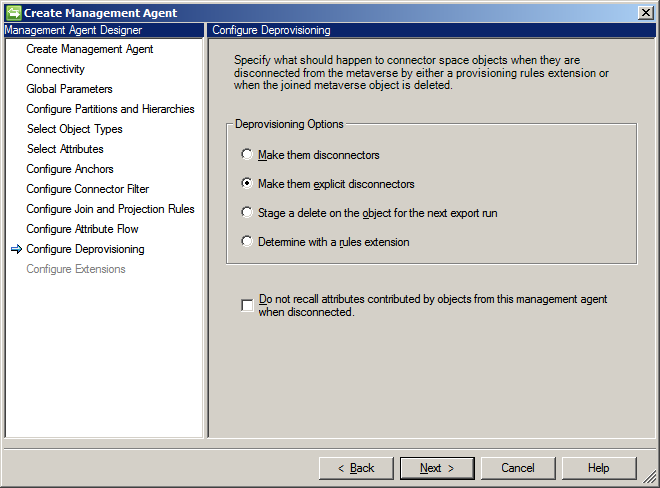

23.   Click **Next**.

24.  The **Configure Extensions** page is disabled in case of Import flow. You can configure it for Export flows by first selecting the **Advanced** mapping type on **Configure Attribute Flow** page.

25. Click **Finish**.

After performing the above steps, you get a configured Connector.

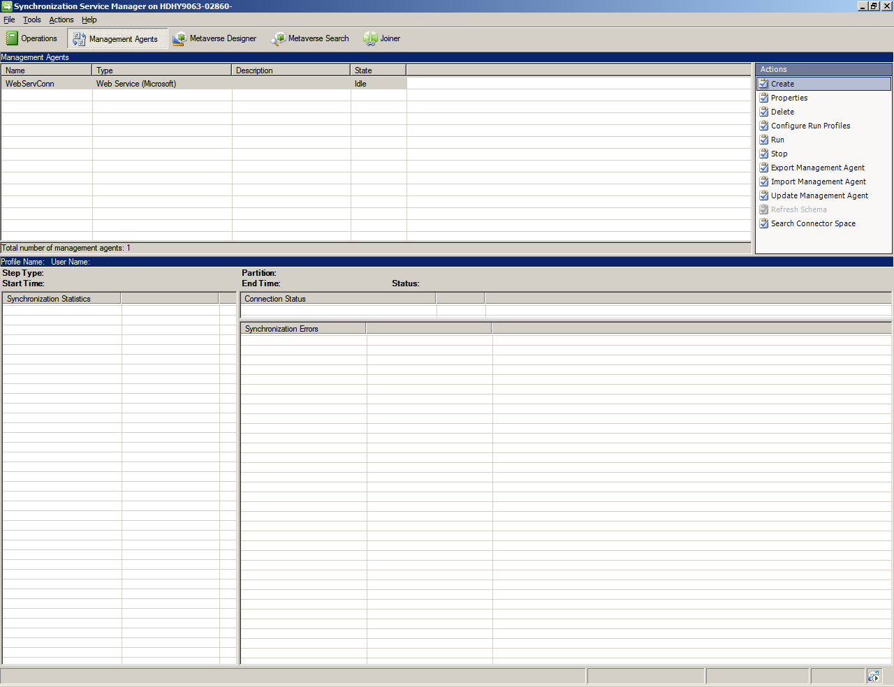

Once, the Connector is configured, the next step is to configure the Run Profiles by clicking action **Configure Run Profiles**.

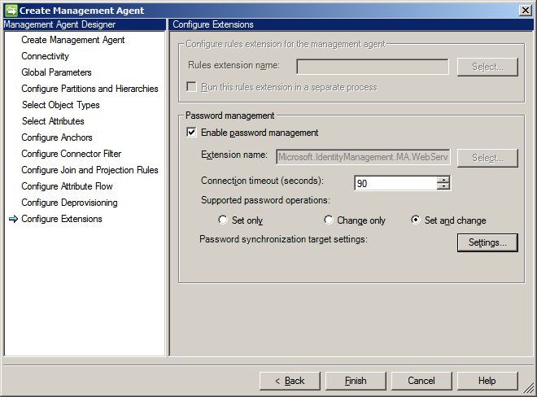

## Next steps

-  [Install the Web Service Config Tool](microsoft-identity-manager-2016-ma-ws-install.md)

-  [Soap Based deployment guide](microsoft-identity-manager-2016-ma-ws-soap.md)

-  [Rest Based deployment guide](microsoft-identity-manager-2016-ma-ws-restgeneric.md)

-  [Web Service MA Configuration](microsoft-identity-manager-2016-ma-ws-restgeneric.md)

