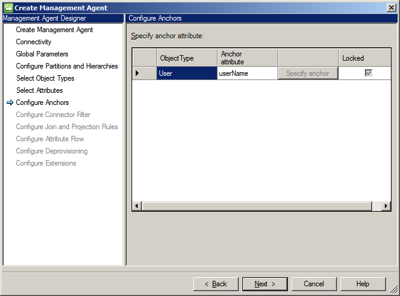

---
# required metadata

title: Web Service Connector configuration options | Microsoft Docs
description: This article covers the steps required to install the Web Service Configuration Tool.
keywords:
author: billmath
ms.author: billmath
manager: mtillman
ms.date: 11/28/2017
ms.topic: get-started-article
ms.prod: microsoft-identity-manager

ms.assetid: 
---

# Web Service Connector configuration options
This article describes the steps to configure a new Web Service Connector or to make changes in an existing Web Service Connector through Microsoft Identity Manager (MIM) Synchronization Service UI.

>[!IMPORTANT]
>Download and install the [Web Service Connector](https://www.microsoft.com/download/details.aspx?id=51495) before attempting the steps in this article.

## Configure the Web Service Connector in the Synchronization Service

You can create a new Web Service Connector using Management Agent designer. After creating the Connector, you can define multiple Run Profiles to perform different tasks. While configuring an existing Connector, you can change a task by clicking the appropriate page in Management Agent Designer. Follow the below steps to configure a new Web Service Connector.

1. Open Microsoft Identity Manager 2016 Synchronization Service. On the **Tools** menu, select **Management Agents**.

2. On the **Actions** menu, select **Create**. The Management Agent Designer opens.

3. In **Management Agent Designer**, under **Management Agent for**, select **Web Service (Microsoft)**. Then, select **Next**.

    

4. On the **Connectivity** screen, select the default **Web Service Connector project**. Provide values for the **Host** and **Port**. Then, select **Next**.

    

5. Define the **Global Parameters**. Use the login credential procured from the Web Service Admin for connecting to the Host. Then, select **Next**.

    

    - If the location of the data source observes Daylight Saving and the data source is configured to automatically adjust to daylight saving settings, check the **Data Source is configured to automatically adjust clock for Daylight Saving Time** option.
    - If you want to trigger the test connection workflow from this connector, check the **Test Connection** option.

6. On next screen select **default** for **Select directory partitions**. Then, select **Next**.

    

7. On the **Select Object Types** screen, select the object type that you want to work with. By default, Web Service Connector supports two object types: **Employee** and **User**. Then, select **Next**.

    

8. On the **Select Attributes** page, select all of the mandatory attributes for the selected objects and attributes that you need to work with. Then, select **Next**.

    

9. On the **Configure Anchors** page, specify the anchor attributes. Then, select **Next**.

    

10. On **Configure Connector Filter** page, specify the **Connector Filter**. Then, select **Next**.

    

11. On **Configure Join and Projection Rules** page, specify the join and projection rules. You can create a new join rule and projection rule by selecting **New Join Rule** and **New Projection Rule**, respectively. Then, select **Next**.

    

12. On the next page, configure the attribute flow. You must specify the **Mapping Type** and **Flow Direction** for the attributes for the selected object types. Then, select **Next**.

    

13. Specify the type of deprovisioning to apply to the objects. Then, select **Next**.

    

14. In the case of an Import flow, the **Configure Extensions** page is disabled. You can configure extensiones for Export flows by first selecting the **Advanced** mapping type on the **Configure Attribute Flow** page.

    

15. Click **Finish**.

Your Connector is now configured:

After a Connector is configured, you can configure the Run Profiles by selecting **Configure Run Profiles**.

## Next steps 

- [Install the Web Service Configuration Tool](microsoft-identity-manager-2016-ma-ws-install.md)
- [SOAP deployment guide](microsoft-identity-manager-2016-ma-ws-soap.md)
- [REST deployment guide](microsoft-identity-manager-2016-ma-ws-restgeneric.md)
- [Web Service MA configuration](microsoft-identity-manager-2016-ma-ws-maconfig.md)
