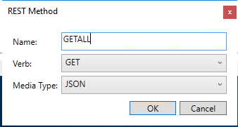

---
# required metadata

title: Web Service Connector workflow guide for the REST API | Microsoft Docs
description: This article covers how to deploy a REST API sample.
keywords:
author: billmath
ms.author: billmath
manager: amycolannino
ms.date: 01/27/2023
ms.topic: conceptual
ms.prod: microsoft-identity-manager

ms.assetid: 
---


# Web Service Connector workflow guide for a REST API sample

This article covers the deployment of a sample REST API to walk through the Web Service Configuration tool with a REST API Web Data Source.

## Prerequisites

The following prerequisites are required to use the sample:

- The Web Service Configuration Tool is installed.
- REST data source sample service is deployed. Download and install the sample from (see here).

<!-- No link provided for "see here" -->
<!-- Should Note go with bullet point #2 -->

>[!NOTE]
>JSON data must contain a single object with a property that contains an array.

<!-- Should JSON be exactly as-is or just a sample -->
<!-- Should JSON be part of Note content -->
```JSON
{

"EmployeeList":[

{"id":"1","employee_name":"Albano","employee_salary":"22213","employee_age":"37","profile_image":""},{"id":"2","employee_name":"Albano","employee_salary":"22213","employee_age":"37","profile_image":""}

]

}
```

## Configure REST project discovery in the Web Service Configuration Tool
The following steps show you how to create a new project for your data source in the Web Service Configuration Tool.

1. Open Web Service Configuration Tool. It opens a blank SOAP project.

   

2. Select **File** > **New** > **REST Project**.

   
   <!-- Image shows SOAP project selected, not REST project -->

3. On the left, select **REST Project** and then select **Add**.

   

4. On the next page, provide the following information:

   - The new web service name
   - Address (REST API URL path)
   - Namespace
   - Security mode (authentication type)

   
    
   The following screen shows examples for these values:
    
   

   Set the **Security Mode** to _None_. Set the **Address** to the sample JSON Server that's hosted in Azure.

5. Select **OK**. The REST project listed in the Web Services Configuration Tool.

   

6. The next step is to define the REST API call and translate the call to the Windows Communication Foundation (WCF) calls.

   1. Expand the **REST Project** and select the _RESTSAMPLE_ service.

   2. Select **Add**. You're prompted to add two values:
   
      
      
      1. Enter the **Name**. This step is labeled as 3 in the screenshot.
      2. Enter the **Address**. This step is labeled as 4 in the screenshot.
      3. Select **OK**. A REST resource is added to the description for the _RESTSAMPLE_ service.

7. In the **Resources** box, select the REST resource that you just added. Add the following method:

   
   <!-- How does this dialog appear, by selecting Edit? -->

8. Select the REST method. Notice that it is possible for you to create multiple methods in the same resource and define the queries passed during execution.

9. For the GETALL method, no queries are required. Leave the parameter values blank. When exporting or importing the REST API, you must define the Sample Request /or Response depending on function. Copy and paste the JSON return when navigating to this sample.

   

10. Select **Save**. Save the project to `C:\Program Files\Microsoft Forefront Identity Manager\2010\Synchronization Service\Extensions`. 

>[!NOTE]
>After the project is saved, the WsConfig file is generated. The configuration file contains multiple files that are defined earlier in the Web Service overview.


## Configure object types in the Web Service Configuration Tool
The following steps show you how to configure object types for your data source in the Web Service Configuration Tool.

1. Next step is to define the connector space schema. This is achieved by creating the Object Type and defining their object types. Click **Object Types** in left pane and click **Add** button. Doing this opens below screen. Add a new object type and provide a name. Click the **OK** button.

   

2. Adding an object type provides below screen.

   

3. The right pane corresponding to object type allows you to maintain the attributes and their properties for the selected object type. Clicking Add button provides below screen where one can add attributes.

   

   

4. Below screen appears after adding all required attributes.

   

5. Object type and attributes once created, provides blank workflows that cater to the operations performed in Microsoft Identity Manager (MIM).


## Configure workflows in the Web Service Configuration Tool

The next step is to configure the workflows for your object type. Workflow files are a series of activities that are used by the Web Services Connector at run time. The workflows are used to implement the appropriate MIM operation. The Web Service configuration Tool helps you to create four different workflows:

- Import: Import data from a data source for the following two types of workflows:

    - Full import: A full import that can be configured.
    - Delta import: Not supported by the Web Service Configuration Tool.

- Export: Export data from MIM to a connected data source. The following three actions are supported for the operation. You can configure these actions based on your requirements.

    - Add
    - Delete
    - Replace

- Password: Perform password management for the user (object type). Two actions are available for this operation:

    - Set password
    - Change password

- Test Connection: Configure a workflow to check if the connection with data source server is successfully established.

>[!NOTE]
>You can configure these workflows for your project or download the default project from the Microsoft Download Center.


### Workflow Designer
The Workflow Designer opens the work area to configure the workflow as per requirement. For every object type (new /existing), the configuration tool provides the nodes for workflows that are supported by the tool. 


The Workflow Designer is composed of the following UI elements:

   - **Nodes in left pane**: These help you to select which you want to design which workflow.

   - **Central Workflow Designer**: Here you can drop the activities for configuring the workflows. To accomplish various MIM operations (Export, Import, Password management), you can use the standard and custom workflow activities of .NET Workflow Framework 4. The Web Service Configuration tool uses standard and custom workflow activities. For more information on standard activities, see [Using activity designers](https://msdn.microsoft.com/library/ee829528.aspx).

      - In the Central Workflow Designer, a red circle with exclamation mark beside any activity indicates that the operation dropped and is not defined correctly and completely. Hover over the red circle to find out the exact error. After the activity is defined correctly, the red circle changes to the yellow information mark.
      
      - In the Central Workflow Designer, a yellow triangle information mark beside any activity indicates that the activity is defined, but there is more that you can do to complete the activity. Hover over the yellow triangle to see more information.

   - **Toolbox**: Packages all the tools including system and custom activities and predefined statements to design the workflow. For more information, see [Toolbox](https://msdn.microsoft.com/library/aa480213.aspx).
   
   - **Toolbox sections**: The Toolbox has the following sections and categories:
   
      - **Description**: The header of the Toolbox. One tab accesses the Toolbox and the properties of the selected workflow activity. 

      - **Import workflow**: Custom activities to configure import workflows.
      
      - **Export workflow**: Custom activities to configure export workflows.
      
      - **Common**: Custom activities to configure any workflow.
      
      - **Debug**: System workflow activities for debugging defined in Workflow 4. These activities allow issue tracking for a workflow.
      
      - **Statements**: System workflow activities defined in Workflow 4. For more information, see [Using activity designers](https://msdn.microsoft.com/library/ee829528.aspx).

   - **Properties**: The properties tab displays the properties of a particular workflow activity that is dropped in the designer area and selected. The figure on the left shows the properties of **Assign** activity. For every activity, the properties differ and are used while configuring the custom workflow. This tab allows you to define the attributes of the selected tool that has been dropped into the central workflow designer. For more information, see [Properties](https://msdn.microsoft.com/library/ee342461.aspx).

   - **Task Bar:** The task bar includes three elements: **Variables**, **Arguments**, and **Imports**. These elements are used together with workflow activities. For more information, see [A developer's introduction to Windows Workflow Foundation (WF) in .NET 4](https://msdn.microsoft.com/library/ee342461.aspx).


## Configure a full import workflow in the Web Service Configuration Tool
The following steps show how to configure full import workflows for the REST API by using the Web Service Configuration Tool.

>[!WARNING]
>This sample only creates a workflow. Modifications to the workflow, such as to use custom logic in the API, may be required.

1. Select the Full Import workflow to configure. The **Arguments** and **Imports** are already defined and are specific to the activities. See the following screens for more information.

   

   

   After the reconfiguration of the calls you need to change the names of the attributes that change or add the namespace to variables that refer to the return structure  of the API and object types that refer to the old namespace. The toolbox in right pane holds all the custom workflow-specific activities that you require for configuration. Assign the values to the variables that you are going to use for your logic. Go to the bottom section of central workflow designer and declare the variables. Variables are declared in the next step.

2. Add a Sequence activity. Drag the **Sequence** activity designer from the **Toolbox** and drop it on to the Windows Workflow Designer surface. Refer to the following screens. The [Sequence](https://msdn.microsoft.com/library/system.activities.statements.sequence.aspx) activity contains an ordered collection of child activities that it executes in order.
   
    

3. To add a variable, locate **Create Variable**. Type _wsResponse_ for the **Name**, select the **Variable type** drop-down, and then select **Browse for Types**. A dialog is displayed. Select **generated** > **GETALL** > **Response**. Keep the **Scope** and **Default** values unselected. Alternatively, set these values by using the **Properties** view.

   

4. Drag one more **Sequence** activity designer from the **Toolbox** within already added Sequence activity.

5. Drag a **WebServiceCallActivity** presented under **Common.** This activity is used to invoke Web service operation available after Discovery. This is a custom activity and is common in different operation scenarios. 

    

   To use the Web service operation, set following properties:
   
      - **Service Name**: Enter a name for the web service.
      - **Endpoint Name**: Specify an endpoint name for the selected service.
      - **Operation Name**: Specify the respective operation for the service.
      - **Argument**: Select **Arguments**. In the next dialog, assign the argument values, as shown in the following figure:
      
         

         >[!IMPORTANT]
         >Do not change the **Name**, **Direction**, or **Type** for an argument by using this dialog. If any of these values are changed, the activity becomes invalid. Only set the **Value** for the argument. As shown in this figure, the value *wsResponse* is set.

6. Add a **ForEach** activity just below **WebServiceCallActivity.** This activity is used to iterate over all attributes (both anchors and non-anchors) of object type. While dragging this activity into your Workflow Designer surface, it automatically enumerates all attribute names for your object. Set required values as per the following screen:

   

7. In some cases, you might need to open the generated.dll that's within the WsConfig file. Copy this WsConfig file and rename it with the .zip extension. Open and extract the generated.dll by using your preferred .NET reflector tool.

   

8. Identify the public namespace for the _EmployeeList_:

    

    Next, add this return to the workflow **ForEach**:

    

9. Drag a **CreateCSEntryChangeScope** activity within **ForEach** body. This activity is used to create an instance of CSEntryChange object in workflow domain for each respective record while retrieving data from target data source. Dragging this activity provides below screen. **CreateAnchorAttribute** activities are automatically inherited. Update the **DN** value to your preferred domain name.

    

    >[!NOTE]
    >Anchor values and object names vary according to the exposed web service. The figure shows an example.

10. Drag a **CreateAttributeChange** activity below the **CreateAnchorAttribute** activity. The number of activities to drag is equal to the number of non-anchor attributes. See the following figure for reference.

    

    >[!NOTE]
    >To use this activity, pick and assign the respective fields from the drop-down and assign the values. For multivalued attributes, drop multiple **CreateValueChangeActivity** activities inside a **CreateAttributeChangeActivity** activity.

11. Save this project at the location `%FIM_INSTALL_FOLDER%\Synchronization Service\Extensions`. Then configure the Management Agent as described in [Web Service MA configuration](microsoft-identity-manager-2016-ma-ws-maconfig.md).

    
    
    Default projects should be downloaded and saved at the location `%FIM_INSTALL_DIR\2010\Synchronization Service\Extensions` on the target system. The projects are then visible in the web service connector wizard.
    
    When running the executable file, you're prompted to specify the location for the installation. Enter the save location.
    
    >[!IMPORTANT]
    >The project file can be saved and opened from any location (with the appropriate access privileges of its executor). Only project files that are saved to the `Synchronization Service\Extension` folder can be selected in the Web Service connector wizard that's accessed through the MIM Synchronization UI.
    
    The user who's running the Web Service Configuration tool requires the following privileges:
    
       - Full Control to the Synchronization Service Extension folder.
       - Read access to the registry key `HKLM\System\CurrentControlSet\Services\FIMSynchronizationService\Parameters` through which, the Extension folder path is located.


## Next steps

- [Overview of generic Web Service Connector](microsoft-identity-manager-2016-ma-ws.md)
- [Install the Web Service Configuration Tool](microsoft-identity-manager-2016-ma-ws-install.md)
- [SOAP deployment guide](microsoft-identity-manager-2016-ma-ws-soap.md)
- [REST deployment guide](microsoft-identity-manager-2016-ma-ws-restgeneric.md)
- [Web Service MA configuration](microsoft-identity-manager-2016-ma-ws-maconfig.md)
