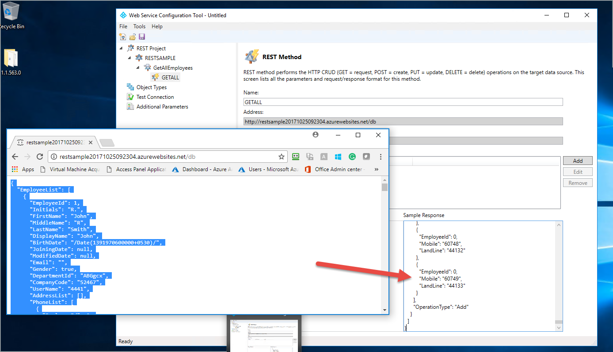
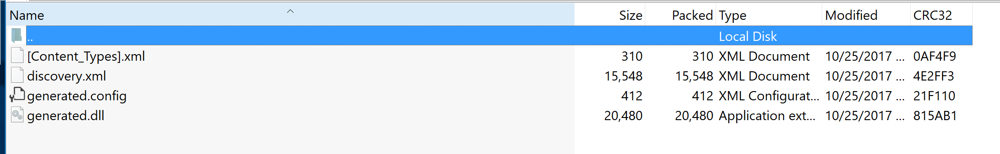

---
# required metadata

title: Web Service Connector Workflow Guide for Sample Rest | Microsoft Docs
description: This article covers the deployment of a sample RESTAPI
keywords:
author: barclayn
ms.author: barclayn
manager: mbaldwin
ms.date: 11/27/2017
ms.topic: get-started-article
ms.service: microsoft-identity-manager
ms.technology: security
ms.assetid: 
---


# Web Service Connector Workflow Guide for Sample Rest

This article covers the deployment of a sample RESTAPI to walk through the Web Service Config tool with a RESTAPI Web Data Source

## Requirements

Before you proceed make sure that you have completed the following steps:

- Installation of the Web Services Configuration Tool Completed

- Rest Data Source Sample Service Deployed (See Here)

>[!NOTE]
JSON data must have as single object with property that contains array

```JSON
{

"EmployeeList":[

{"id":"1","employee_name":"Albano","employee_salary":"22213","employee_age":"37","profile_image":""},{"id":"2","employee_name":"Albano","employee_salary":"22213","employee_age":"37","profile_image":""}

]

}
```

## Configuring Web Service Config Tool Discovery

This article describes how to create a new project for your data source in Web Service Configuration Tool. Follow the steps below to create a project.

1.  Open Web Service Configuration Tool. It opens a blank SOAP project.


2.  Click on File New *Rest Project*


3.  Select REST Project

    

4.  Clicking Add button opens below screen. Here, you must provide the new web service name, Address (REST API URL path), Namespace and Security Mode (authentication type). Click the **OK** button. Select **None** for security settings and enter the sample JSON Server hosted in Azure.


5.  Clicking Ok gets you back to the Web Services Configuration Tool


6.  The next step you need to define the REST API call and translate them to the WCF calls that are being made

    1.  Expand the (1) REST Project and select the (2) RESTSAMPLE Service, Click
        the (3) Add.

    2.  This prompts you for a (4) Name and (5) Address.

        

7.  Now select the REST Resource and Add the following method

   

8.  Select the REST Method. Notice that it is possible for you to create multiple methods in the same resource and define the queries passed during execution.

10. For GETALL there are no queries required so leave the parameters blank. But with RESTAPI exporting or importing you must define the Sample Request /or Response depending on function.  Copy and paste the JSON return when navigating to our sample.



11.  Click Save, and save it to `C:\Program Files\Microsoft Forefront Identity Manager\2010\Synchronization Service\Extensions`. 

>[!NOTE]
Once you save it generates the WsConfig file that contains multiple files defined earlier in the webservices overview

## Configuring Web Service Config Tool Object Types


12.  Next step is to define the connector space schema. This is achieved by creating the Object Type and defining their object types. Click **Object Types** in left pane and click **Add** button. Doing this opens below screen. Add a new object type and provide a name. Click the **OK** button.


13.  Adding an object type provides below screen.


14. The right pane corresponding to object type allows you to maintain the attributes and their properties for the selected object type. Clicking Add button provides below screen where one can add attributes.


15.  Below screen appears after adding all required attributes.


16.  Object type and attributes once created, provides blank workflows that cater to the operations performed in Microsoft Identity Manager (MIM).

## Configuring Work Flow in Config Tool Overview

1.  Next step is to configure the workflows for the object type. Workflow files are a series of activities that are used by the Web Services Connector at run time. They are used to implement the appropriate MIM operation. The web service configuration tool helps you to create four different workflows:

    -   Import: This operation includes two types of workflows to import data
        from data source.

        -   Full Import – Can be configured

        -   Delta Import – Not supported by Configuration Tool.

    -   Export: This operation involves the exporting of data from MIM to
        connected data source. It supports below three types of operations. You
        can configure them as per your requirement.

        -   Add

        -   Delete

        -   Replace

    -   Password: To perform password management for the user (object type)

        -   Set password

        -   Change Password

    -   Test Connection: This workflow allows you to configure a check to confirm that the connection with the data source server can be successfully established.

These workflows can be configured for your project or you can download the default project from the [Microsoft Download Center](http://www.microsoft.com/en-us/download/details.aspx?id=29944). The workflow designer allows you to configure the workflow based on your requirements. For every object type (new /existing), the configuration tool provides the nodes for workflows that are supported by the tool. The workflow is divided in to following major sections:


1.  **Nodes in left pane**: These help you to select which you want to design which workflow.

2.  **Central Workflow Designer**: Here you can drop the activities for configuring the workflows. To accomplish various FIM operations (Export, Import, Password management), you can use the standard and custom workflow activities of .Net workflow Framework 4. The Web Service Configuration tool uses standard and custom workflow activities.

3.  For more details on Standard activities, see Using Activity Designers.

4.  **Toolbox**: Packages all the tools including system and custom activities and predefined statements to design the workflow. For more details on system toolbox, see
    [Toolbox](http://msdn.microsoft.com/en-us/library/aa480213.aspx).

| **Toolbox Sections** | **Description** This section refers to the header of Toolbox. One tab accesses toolbox and the other properties of the selected individual workflow activity.                                                                                                     |
|----------------------|-------------------------------------------------------------------------------------------------------------------------------------------------------------------------------------------------------------------------------------------------------------------|
|                      | This category shows the **Import workflow** specific activities. They are custom created to use for configuring Import workflow.                                                                                                                                  |
|                      | This category shows the **Export workflow** specific activities. They are custom created to use for configuring Export workflow.                                                                                                                                  |
|                      | The activities under category **Common** are also custom created activities and can be used to configure any desired workflow.                                                                                                                                    |
|                      | The activities under category **Debug** are used for debugging. They are system activities already defined in Workflow 4 and allow you to enable issue tracking for a workflow.                                                                                   |
|                      | The activities under category **Statements** are also system workflow activities and are already defined in Workflow 4. For more details about using these activities, see [Using Activity Designers](http://msdn.microsoft.com/en-us/library/ee829528.aspx)**.** |

5.  **Properties**: The properties tab displays the properties of a particular workflow activity that is dropped in the designer area and selected. The figure on the left shows the properties of **Assign** activity. For every activity, the properties will differ and are used while configuring the custom workflow. This tab allows you to define the attributes of the selected tool that has been dropped into the central workflow designer. For more details, see
>   [Properties](http://msdn.microsoft.com/en-us/library/ee342461.aspx).

6.  **Task Bar:** The task bar includes three elements; **Variables, Arguments and Imports** used together with workflow activities**.** For more details on these, see [A Developer's Introduction to Windows Workflow Foundation (WF) in .NET 4](http://msdn.microsoft.com/en-us/library/ee342461.aspx).

7.  The Red circle with exclamation mark [] beside any activity in central designer implies that the operation dropped is not defined correctly and completely. Hover over the red circle to find out the exact error. Once the activity is defined correctly, the red circle changes to yellow information mark automatically.

8.  The Yellow triangle information mark [] beside any activity in central designer implies that the activity is defined but there is more that you can do to complete the activity. Hover cursor over the yellow triangle to see more information.

## Configuring Full Import Work Flow in Config Tool Sample REST


>[!NOTE]
This is only a sample to create workflow so one requires to do modification as per API’s custom logic.*

1.  Click on the Full Import workflow to configure. **Arguments and Imports are already defined and are specific to the activities.** See the screenshots below for more details.


After the reconfiguration of the calls you need to change the names of the attributes that change or add the namespace to variables that refer to the return structure  of the API and object types that refer to the old namespace. The toolbox in right pane holds all the custom workflow specific activities that you require for configuration. Assign the values to the variables that you are going to use for your logic. Go to the bottom section of central workflow designer and declare the variables. In next step   variables will be declared.

2.  Add a Sequence activity: drag the **Sequence** activity designer from the **Toolbox** and drop it on to the Windows Workflow Designer surface. Refer to the screen below.

The [Sequence](https://msdn.microsoft.com/en-us/library/system.activities.statements.sequence.aspx) activity contains an ordered collection of child activities that it executes in order.


3.  To add a variable locate ‘Create Variable’. Type `wsresponse` for *Name*, click on *Variable type* dropdown and select ‘Browse for Types’. Clicking      this opens a popup. Select generated--\>GETALL--\>Response. Keep ‘Scope’ and ‘Default’ values unselected. Alternatively we can set these values at     Properties box from right hand side pane.


4.  Drag one more **Sequence** activity designer from the **Toolbox** within already added Sequence activity.

5.  Drag a **WebServiceCallActivity** presented under **Common.** This activity is used to invoke Web service operation available after Discovery. This is a     custom activity and is very common in different operation scenarios.


To use this activity you must provide/set following properties:-

-  **Service Name**: - Pick a Web service name which you would like to call.

-  **Endpoint Name**: - Pick an end point name of selected service.

-  **Operation Name**: - Pick the respective operation of service.

-  **Argument**: - On clicking () it will open arguments dialog from there you can assign argument values. Example screen shot –


Do not change the argument name,direction or argument type. If you accidentally change any of them, the activity will become invalid. Only the *Value* column needs to set here. Like here ‘*wsResponse’* which is a variable of type *Response* is being set here.

1.  Add a **ForEach** activity just below **WebServiceCallActivity.** This activity will be used to iterate over all attributes (both anchors and non-anchors) of object type. While dragging this activity into your workflow designer surface it will automatically enumerate all attribute names of your object. Set required values as per below screen.


2.  The next Step will require in some cases for you to open the generated.dll this is within the WsConfig file. To do this copy this WsConfig and rename to .zip and open and extract the generated.dll. Open with your favorite .net reflector tool.



3.  We need to identify the public namespace for our EmployeeList

    

    -   Next we can add this return to the workflow foreach

        

4.  Drag a **CreateCSEntryChangeScope** activity within **foreach** body. This activity is used to create an instance of the CSEntryChange object in the workflow for each respective record while retrieving data from target data source. Dragging this activity provides below screen. **CreateAnchorAttribute** activities are automatically inherited. Update your preferred DN and


>[!HOTE]
Anchor values and object names would be varied as per the exposed web service. This is an example.

5.  Drag a CreateAttributeChange activity below the **CreateAnchorAttribute** activity. Number of activities to be dragged would be equal to the number of non-anchor attributes. See below for reference.


>[!NOTE]
To use this activity you only need to pick and assign the respective field from drop down and then assign some value. For multivalued attributes, you can drop multiple `CreateValueChangeActivity` inside `CreateAttributeChangeActivity` activity.

6.  Save this project at the location: `%FIM_INSTALL_FOLDER%\Synchronization Service\Extensions`. Then configure Management Agent [Web Service MA Configuration](microsoft-identity-manager-2016-ma-ws-maconfig.md)


Default projects should be downloaded and saved at the following location on the target system:

`%FIM_INSTALL_DIR\2010\Synchronization Service\Extensions`

>[!NOTE]
This is required for them to be visible in the web service connector wizard.

While running the executable file, it prompts to specify the location for installation; you must specify the above location.

>[!IMPORTANT]
Project file can be saved and opened from any location (with the appropriate access privileges of its executor); however, only project files that are saved to Synchronization  service\\Extension folder will be able to get selected in the Web Service connector wizard accessed through FIM Sync UI. The user running the web wervice configuration tool requires the following privileges:
- Full Control to the Synchronization Service Extension folder.
- Read access to the registry key `HKLM\System\CurrentControlSet\Services\FIMSynchronizationService\Parameters`

## Next Steps

1.  [Overview Generic Web Services Connector](microsoft-identity-manager-2016-ma-ws.md)

2.  [Install the Web Service Config Tool](microsoft-identity-manager-2016-ma-ws-install.md)

3.  [Soap Based deployment guide](microsoft-identity-manager-2016-ma-ws-soap.md)

4.  [Rest Based deployment guide](microsoft-identity-manager-2016-ma-ws-restgeneric.md)

5.  [Web Service MA Configuration](microsoft-identity-manager-2016-ma-ws-maconfig.md)
