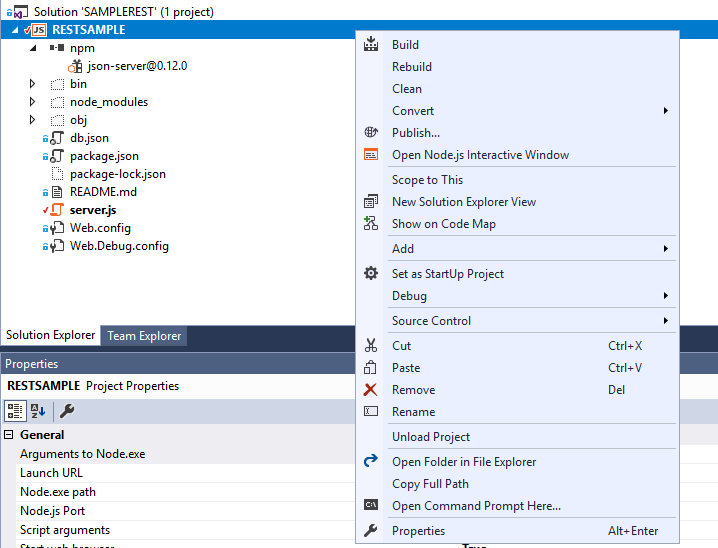
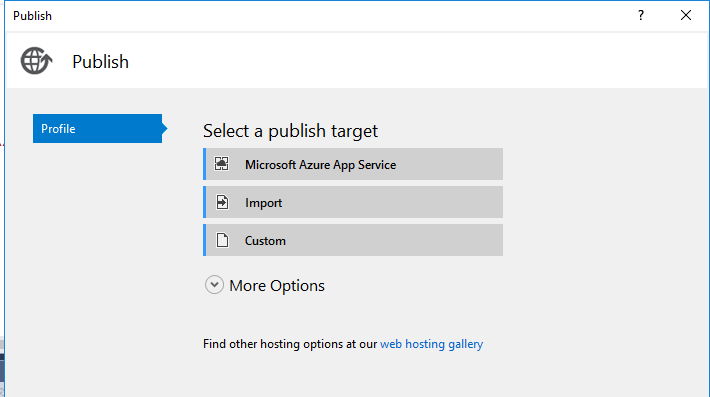
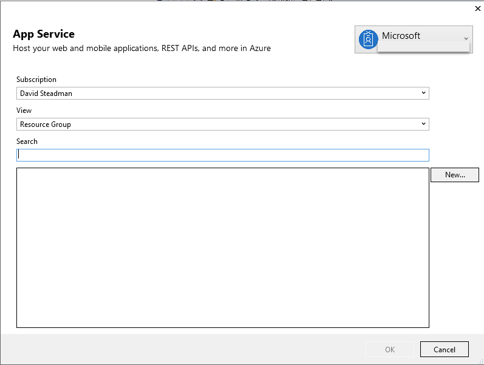
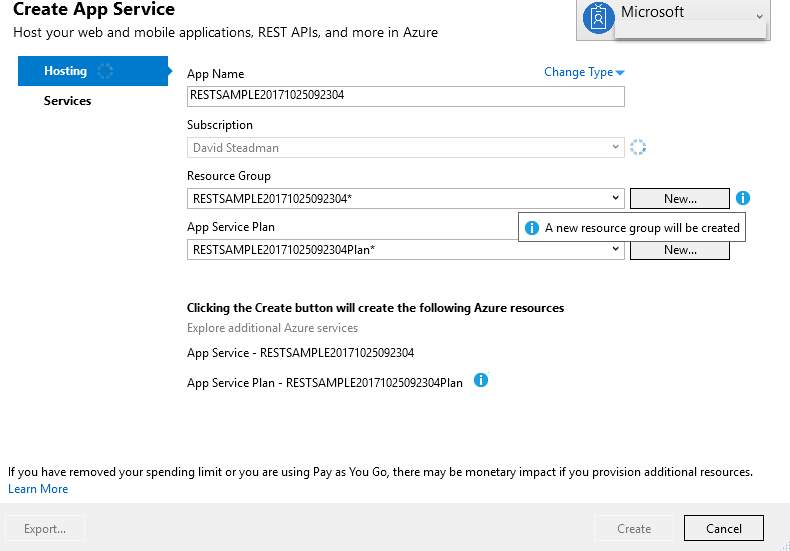
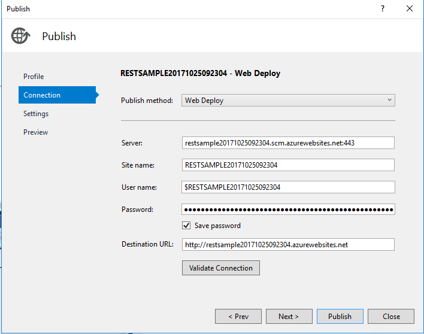
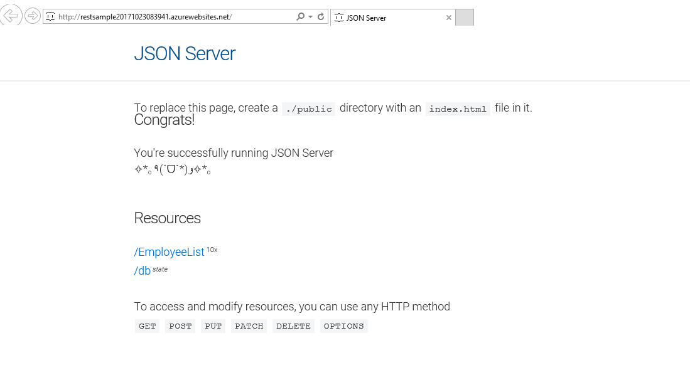
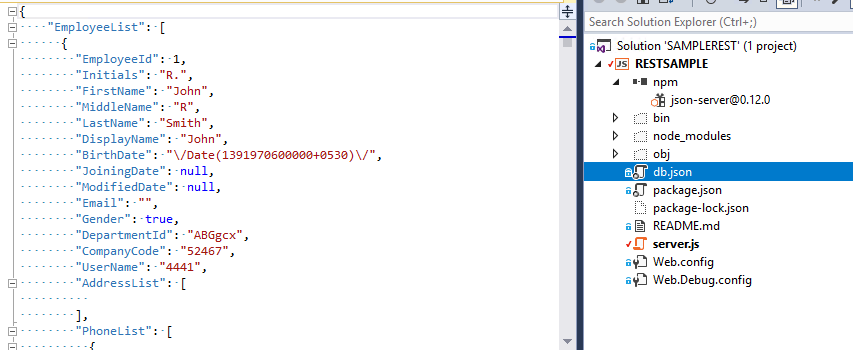

---
# required metadata

title: Web Service Connector REST API App Service sample | Microsoft Docs
description: Guide helping you implement a sample REST JSON server in Azure
keywords:
author: henrymbuguakiarie
ms.author: henrymbugua
ms.date: 04/08/2025
ms.topic: conceptual
ms.service: microsoft-identity-manager

ms.assetid: 
ms.custom: sfi-image-nochange
---

# Web Service Connector REST API App Service sample

This deployment guide will assist you deploying the sample REST JSON server to Azure. You can use this sample to help you with the configuration and understanding of the Web Service Connector.

- The sample requires Microsoft Visual Studio 2017.
- The Native Module Path (NMP) packages in the sample use this [JSON server](https://github.com/typicode/JSON-server) on GitHub.
- Download the [sample code](https://github.com/fimguy/SAMPLEREST) from GitHub, and deploy the sample code to Azure App Service.

## Deploy the JSON server sample

1. After the code is downloaded, open the solution file in [Visual Studio 2017](https://www.visualstudio.com/downloads/).

2. Deploy the solution by selecting the project, then right-click and select **Publish**:

    

3. Select the App Service to use for the deployment:

    

4. Select an existing Resource Group or create a new Resource Group:

    

5. Use the existing names for the App Service, and select **Create**:

    

    The App Service is created.

6. To publish the App Service, select **Publish**:

    

7. After the App Service is published, the REST API sample and corresponding website is launched in your default browser:

    

Now you can configure your deployment, as described in the [REST deployment guide](microsoft-identity-manager-2016-ma-ws-restgeneric.md).

## Modify the sample

To modify the JSON data and the REST API sample, make your changes in the **db.JSON** file and then update the deployment:

## Next steps

- [Overview of generic Web Service Connector](microsoft-identity-manager-2016-ma-ws.md)
- [Install the Web Service Configuration Tool](microsoft-identity-manager-2016-ma-ws-install.md)
- [SOAP deployment guide](microsoft-identity-manager-2016-ma-ws-soap.md)
- [REST deployment guide](microsoft-identity-manager-2016-ma-ws-restgeneric.md)
- [Web Service MA configuration](microsoft-identity-manager-2016-ma-ws-maconfig.md)
