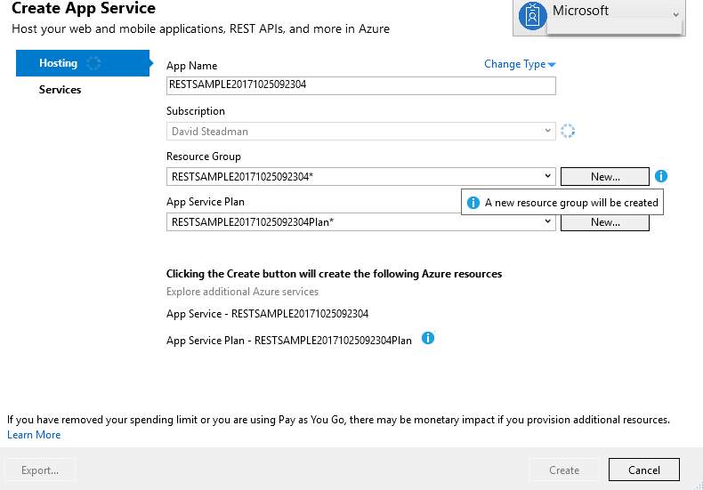

---
# required metadata

title: Web Service Connector Rest Sample App Service | Microsoft Docs
description: Guide helping you implement a sample REST JSON server in Azure
keywords:
author: barclayn
ms.author: barclayn
manager: mbaldwin
ms.date: 11/27/2017
ms.topic: get-started-article
ms.service: microsoft-identity-manager
ms.technology: security
ms.assetid: 
---

# Web Service Connector Rest Sample App Service

This deployment guide will assist you deploying the sample REST JSON server to Azure. You can use this sample to help you with the configuration and understanding of the Web Services Connector.

-   Visual Studio 2017 Installed

-   NMP packages use https://github.com/typicode/JSON-server

-   Download Sample [here](https://github.com/fimguy/SAMPLEREST) and Deploy to the Azure App Service

## Deploy JSON-server sample

1. Once downloaded, open the solution file using [Visual Studio 2017](https://www.visualstudio.com/downloads/)
2. Deploy the solution by selecting the project right click and then publish

  

3. Select App Service

4. Select or Create New Resource Group

5.   We will make all names the same and Select Create

6. Now your App Service is created you can Publish , Click Publish

7. Once fully published you will see the sample REST API and site launched in your default browser

>[!NOTE]
To update the JSON data and rest update the db.JSON file and update the deployment

Now we can continue to configure the REST Based Deployment guide

## Next Steps

-   [Overview of the Generic Web Services Connector](microsoft-identity-manager-2016-ma-ws.md)

-   [Install the Web Service Config Tool](microsoft-identity-manager-2016-ma-ws-install.md)

-   [Soap Based deployment guide](microsoft-identity-manager-2016-ma-ws-soap.md)

-   [Rest Based deployment guide](microsoft-identity-manager-2016-ma-ws-restgeneric.md)

-   [Web Service MA Configuration](microsoft-identity-manager-2016-ma-ws-maconfig.md)
