---
# required metadata

title: Web Service Connector workflow guide for SOAP | Microsoft Docs
description: This article describes how to create a new project for your SOAP data source by using the Web Service Configuration Tool.
keywords:
author: billmath
ms.author: billmath
manager: amycolannino
ms.date: 09/14/2023
ms.topic: conceptual
ms.service: microsoft-identity-manager

ms.assetid: 
---

# Web Service Connector workflow guide for SOAP

This article describes how to create a new project for your data source in the Web Service Configuration Tool. Follow these steps to create a project.

1.  Open the Web Service Configuration Tool. It opens a blank project.

    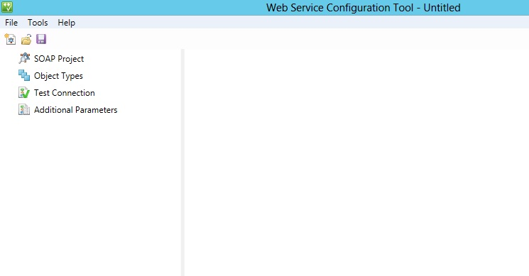

2.  Select **SOAP Project** and then select **Add**.

    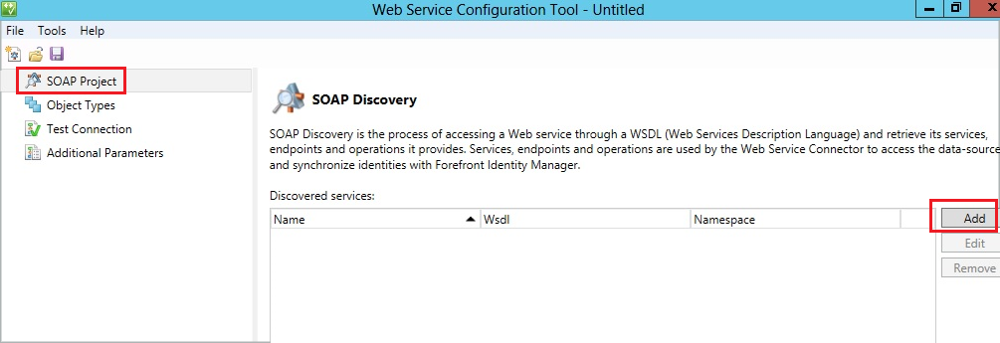

3.  On the next page, provide the following information and then, select **Next**:

    - The new web service name
    - Address (WSDL path) to retrieve the exposed services, endpoints, and operations
    - Namespace
    - Security mode (authentication type)
  
4.  In this sample, the **Credentials** page is shown with the requirements for *Basic* security mode (the mode that was selected in the previous step). If "None" was specified for the security mode, then a Credentials page wouldn't be displayed. Select **Next**.

    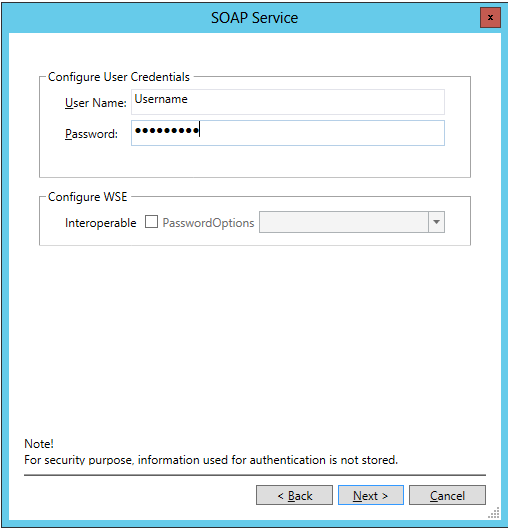

5.  The WSDL path is being accessed to retrieve the service information and the list of exposed functions is displayed. If the WSDL path entered is incorrect, then the configuration tool fails to retrieve the service information and throws an error.

    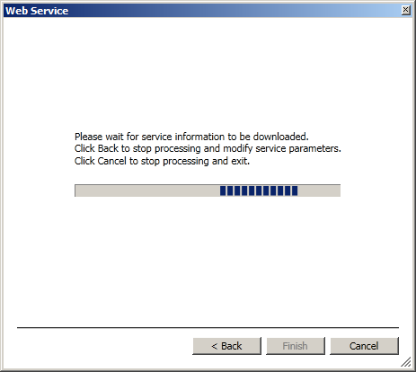

6.  Once the discovery is performed, then it lists the endpoint and the operations that are discovered. Select **Finish**.

    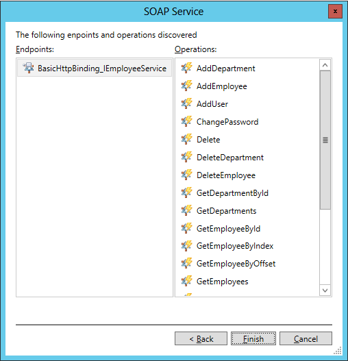

7.  Compilation is performed. Compilation is a process of compiling the data contract assembly, which can be a time consuming operation. The user is informed about any compilation errors. After the discovery is performed, the tool displays the following page:

    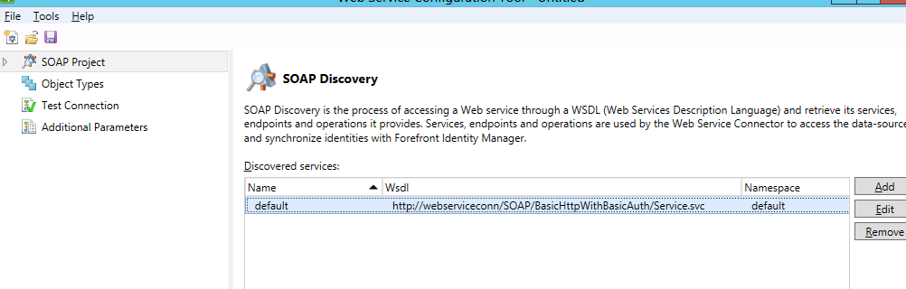

8.  Expanding **SOAP project** and selecting exposed endpoint provided below screen. This screen lists the operations that are declared under the endpoint.

    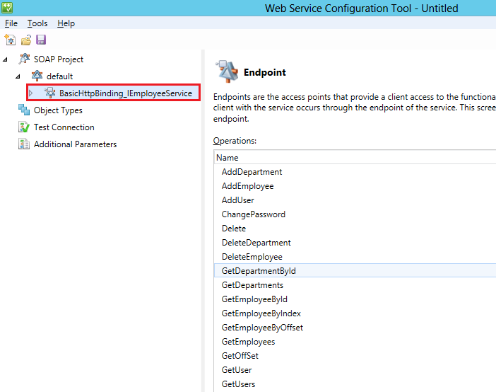

9.  Expanding endpoint displays list of operations. An operation is a function declared by an Endpoint. Each operation addresses a type of task that can be performed within the service. This screen lists the arguments that are declared for the operation. These arguments are then defined when the operation is used in configuring the workflows.

    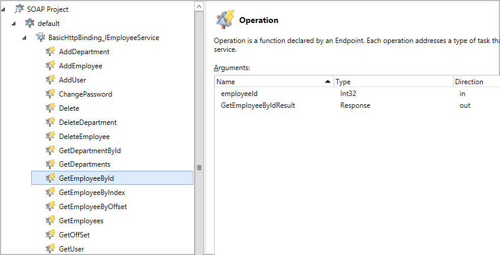

10. Next step is to define the connector space schema, which is achieved by creating the Object Type and defining their object types. Select **Object Types** and then select **Add**. In the new window, add a new object type and provide a name. Select **OK**.

    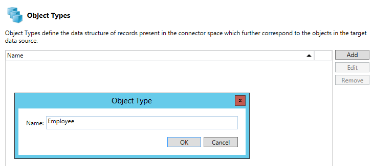

11. Adding an object type provides below screen.

    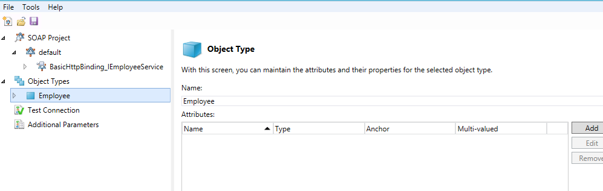

12. The right pane corresponding to object type allows you to maintain the attributes and their properties for the selected object type. Select **Add**. A new window is opened to add attributes:

    

    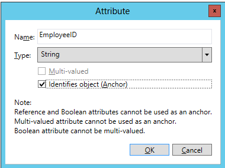

13. The following screen appears after adding all of the required attributes:

    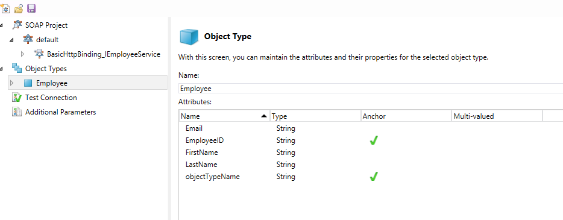

14. Object type and attributes once created, provides blank workflows that cater to the operations performed in Microsoft Identity Manager 2016 (MIM).

    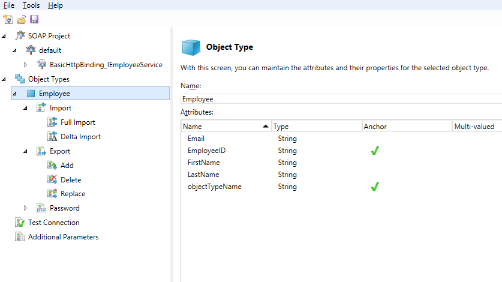

## Configure workflows in the Web Service Configuration Tool

The next step is to configure the workflows for your object type. Workflow files are a series of activities that are used by the Web Services Connector at run time. The workflows are used to implement the appropriate MIM operation. The Web Service configuration Tool helps you to create four different workflows:

- Import: Import data from a data source for the following two types of workflows:

    - Full import: A full import that can be configured.
    - Delta import: Not supported by the Web Service Configuration Tool.

- Export: Export data from MIM to a connected data source. The following three actions are supported for the operation. You can configure these actions based on your requirements.

    - Add
    - Delete
    - Replace

- Password: Perform password management for the user (object type). Two actions are available for this operation:

    - Set password
    - Change password

- Test Connection: Configure a workflow to check if the connection with data source server is successfully established.

>[!NOTE]
>You can configure these workflows for your project or download the default project from the Microsoft Download Center.

### Workflow Designer
The Workflow Designer opens the work area to configure the workflow as per requirement. For every object type (new /existing), the configuration tool provides the nodes for workflows that are supported by the tool. 

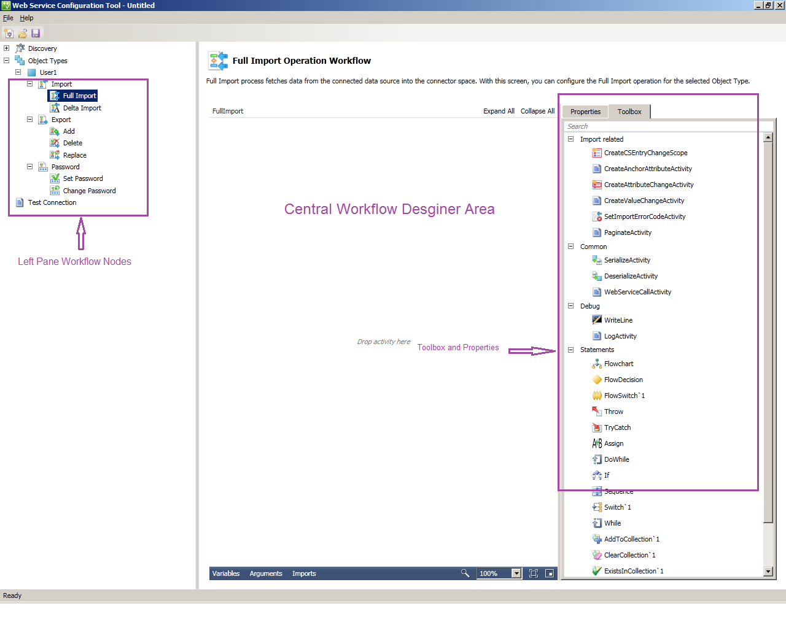

The Workflow Designer is composed of the following UI elements:

   - **Nodes in left pane**: These help you to select which you want to design which workflow.

   - **Central Workflow Designer**: Here you can drop the activities for configuring the workflows. To accomplish various MIM operations (Export, Import, Password management), you can use the standard and custom workflow activities of .NET Workflow Framework 4. The Web Service Configuration tool uses standard and custom workflow activities. For more information on standard activities, see [Using activity designers](https://msdn.microsoft.com/library/ee829528.aspx).

      - In the Central Workflow Designer, a red circle with exclamation mark beside any activity indicates that the operation dropped and is not defined correctly and completely. Hover over the red circle to find out the exact error. After the activity is defined correctly, the red circle changes to the yellow information mark.
      
      - In the Central Workflow Designer, a yellow triangle information mark beside any activity indicates that the activity is defined, but there is more that you can do to complete the activity. Hover over the yellow triangle to see more information.

   - **Toolbox**: Packages all the tools including system and custom activities and predefined statements to design the workflow. For more information, see [Toolbox](https://msdn.microsoft.com/library/aa480213.aspx).
   
   - **Toolbox sections**: The Toolbox has the following sections and categories:
   
      - **Description**: The header of the Toolbox. One tab accesses the Toolbox and the properties of the selected workflow activity. 

      - **Import workflow**: Custom activities to configure import workflows.
      
      - **Export workflow**: Custom activities to configure export workflows.
      
      - **Common**: Custom activities to configure any workflow.
      
      - **Debug**: System workflow activities for debugging defined in Workflow 4. These activities allow issue tracking for a workflow.
      
      - **Statements**: System workflow activities defined in Workflow 4. For more information, see [Using activity designers](https://msdn.microsoft.com/library/ee829528.aspx).            

   - **Properties**: The properties tab displays the properties of a particular workflow activity that is dropped in the designer area and selected. The figure on the left shows the properties of **Assign** activity. For every activity, the properties differ and are used while configuring the custom workflow. This tab allows you to define the attributes of the selected tool that has been dropped into the central workflow designer. For more information, see [Properties](https://msdn.microsoft.com/library/ee342461.aspx).

   - **Task Bar:** The task bar includes three elements: **Variables**, **Arguments**, and **Imports**. These elements are used together with workflow activities. For more information, see [A developer's introduction to Windows Workflow Foundation (WF) in .NET 4](https://msdn.microsoft.com/library/ee342461.aspx).

<h2 id="full-import-workflows">Configure a full import workflow in the Web Service Configuration Tool</h2>
The following steps show how to configure full import workflows for SOAP by using the Web Service Configuration Tool.

>[!WARNING]
>This sample only creates a workflow. Modifications to the workflow, such as to use custom logic in the API, may be required.

1. Select the Full Import workflow to configure. The **Arguments** and **Imports** are already defined and are specific to the activities. See the following screens for more information.

   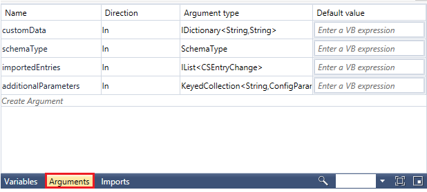
 
   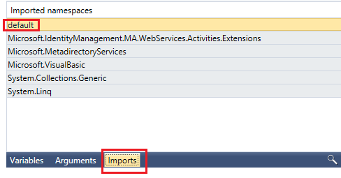

   After the reconfiguration of the calls, change the names of the attributes that change, add or change the namespace to variables that refer to the return structure of the API and object types that refers to the old namespace. The toolbox in right pane holds all the custom workflow-specific activities that you require for configuration. Assign the values to the variables that you are going to use for your logic. Go to the bottom section of central workflow designer and declare the variables. Variables are declared in the next step.

2. Add a Sequence activity. Drag the **Sequence** activity designer from the **Toolbox** and drop it on to the Windows Workflow Designer surface. Refer to the following screens. The [Sequence](https://msdn.microsoft.com/library/system.activities.statements.sequence.aspx) activity contains an ordered collection of child activities that it executes in order.
   
    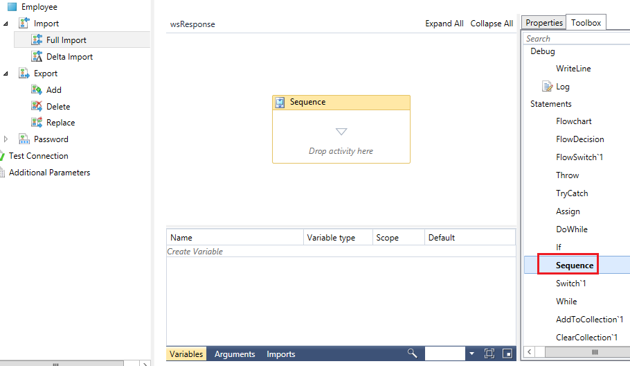

3. To add a variable, locate **Create Variable**. Type _wsResponse_ for the **Name**, select the **Variable type** drop-down, and then select **Browse for Types**. A dialog is displayed. Select **generated** > **default** > **Response**. Keep the **Scope** and **Default** values unselected. Alternatively, set these values by using the **Properties** view.

   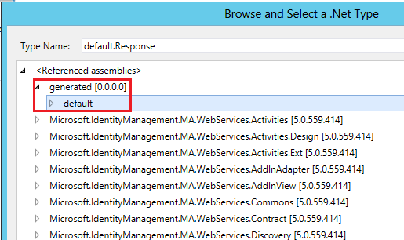

   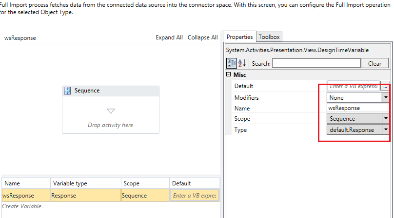

4. Now add all other variables and below is the final screen.

   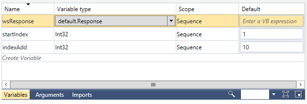

5. Drag one more **Sequence** activity designer from the **Toolbox** within already added Sequence activity.

6. Drag a **WebServiceCallActivity** presented under **Common.** This activity is used to invoke Web service operation available after Discovery. This is a custom activity and is common in different operation scenarios. 

    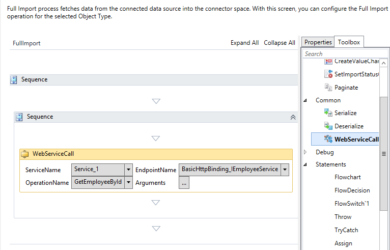

   To use the Web service operation, set following properties:
   
      - **Service Name**: Enter a name for the web service.
      - **Endpoint Name**: Specify an endpoint name for the selected service.
      - **Operation Name**: Specify the respective operation for the service.
      - **Argument**: Select **Arguments**. In the next dialog, assign the argument values, as shown in the following figure:
      
         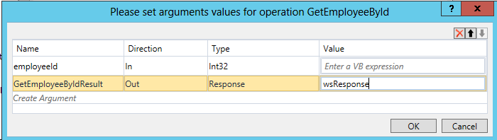

         >[!IMPORTANT]
         >Do not change the **Name**, **Direction**, or **Type** for an argument by using this dialog. If any of these values are changed, the activity becomes invalid. Only set the **Value** for the argument. As shown in this figure, the value *wsResponse* is set.

7. Add a **ForEach** activity just below **WebServiceCallActivity.** This activity is used to iterate over all attributes (both anchors and non-anchors) of object type. While dragging this activity into your Workflow Designer surface, it automatically enumerates all attribute names for your object. Set required values as per the following screen:

   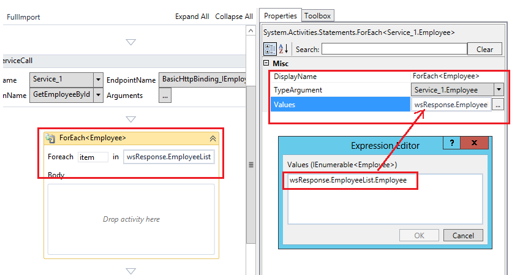

8. Drag a **CreateCSEntryChangeScope** activity within **ForEach** body. This activity is used to create an instance of CSEntryChange object in workflow domain for each respective record while retrieving data from target data source. Dragging this activity provides below screen. **CreateAnchorAttribute** activities are automatically inherited.

    

9.  Set the value of the DN expression as `‘string.Concat ("Employee",item.EmployeeID)’`. Set the **AnchorValue** for the _EmployeeID_ to **‘Convert.tostring(item.EmployeeID)’**. Set the **ObjectTypeName** as _Employee_. After making these modifications, you'll see the following screen:

    

    >[!NOTE]
    >Anchor values and object names vary according to the exposed web service. The figure shows an example.

10. Drag a **CreateAttributeChange** activity below the **CreateAnchorAttribute** activity. The number of activities to drag is equal to the number of non-anchor attributes. See the following figure for reference.

    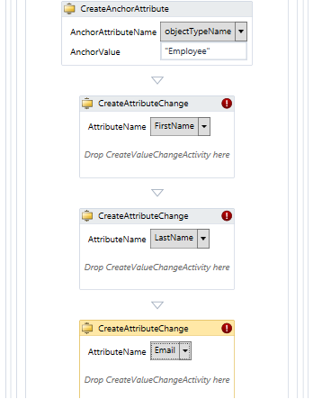

11. Drag **CreateValueChangeActivity** within **CreateAttributeChange** activity and set attribute value as per below screen.

    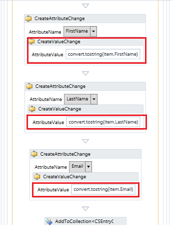

    >[!NOTE]
    >To use this activity, pick and assign the respective fields from the drop-down and assign the values. For multivalued attributes, drop multiple **CreateValueChangeActivity** activities inside a **CreateAttributeChangeActivity** activity.

12. To add conditions for an attribute, add an **If** activity as shown in the following figure:

    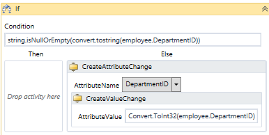

13. Finally, add an **Assign** activity and set the expression, as shown in the following figure:

    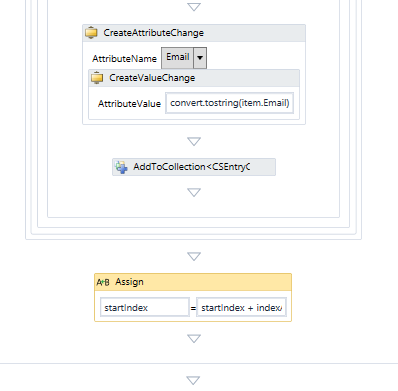

14. Save this project at the location `%FIM_INSTALL_FOLDER%\Synchronization Service\Extensions`.
    
    Default projects should be downloaded and saved at the location `%FIM_INSTALL_DIR\2010\Synchronization Service\Extensions` on the target system. The projects are then visible in the web service connector wizard.
    
    When running the executable file, you're prompted to specify the location for the installation. Enter the save location.
    
    >[!IMPORTANT]
    >The project file can be saved and opened from any location (with the appropriate access privileges of its executor). Only project files that are saved to the `Synchronization Service\Extension` folder can be selected in the Web Service connector wizard that's accessed through the MIM Synchronization UI.
    
    The user who's running the Web Service Configuration tool requires the following privileges:
    
       - Full Control to the Synchronization Service Extension folder.
       - Read access to the registry key `HKLM\System\CurrentControlSet\Services\FIMSynchronizationService\Parameters` through which, the Extension folder path is located.

## Configure export workflows in the Web Service Configuration Tool
The following sections show how to export your workflows by using the Web Service Configuration Tool.

<h3 id="attribute-change-anchor">Add workflows</h3>
Add export workflows by following these steps in the Web Service Configuration Tool.

1. Select the export workflow to configure. Under **Export**, select **Add**. The **Arguments** and **Imports** are already defined and are specific to the activities. See the following screens for reference.

    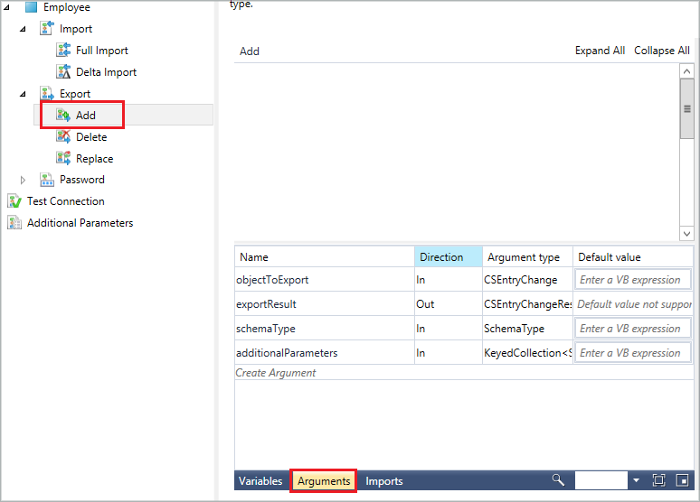

2. Add a **Sequence** activity. Drag the **Sequence** activity designer from the **Toolbox** and drop it on to the Windows Workflow Designer surface. The [Sequence](https://msdn.microsoft.com/library/system.activities.statements.sequence.aspx) activity contains an ordered collection of child activities that it executes in order. Select **Create Variable**. Assign the values to the variables that you're going to use for your logic.

    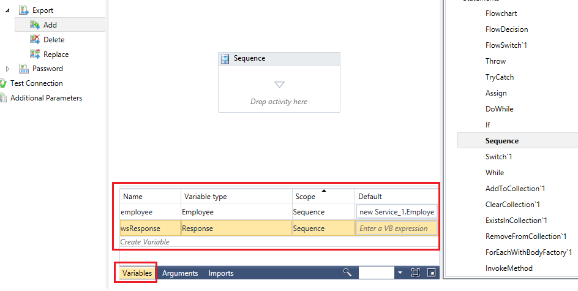

    >[!NOTE]
    >The steps to add a variable are described in the section for creating <a href="#full-import-workflows">full import workflows</a>.

3. Drag a **ForEach** activity within already added **Sequence** activity to iterate over anchor attribute values.

4. Select **Properties** and set the **Values** as per below screen. Here **objectToExport** is argument.

    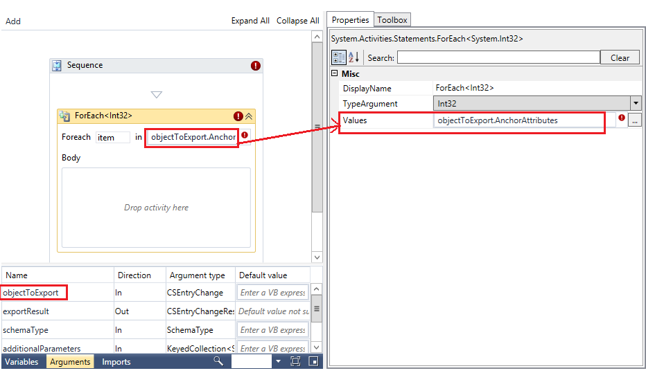

5. Set **DisplayName** as **ForEach\<AnchorAttribute\>**

   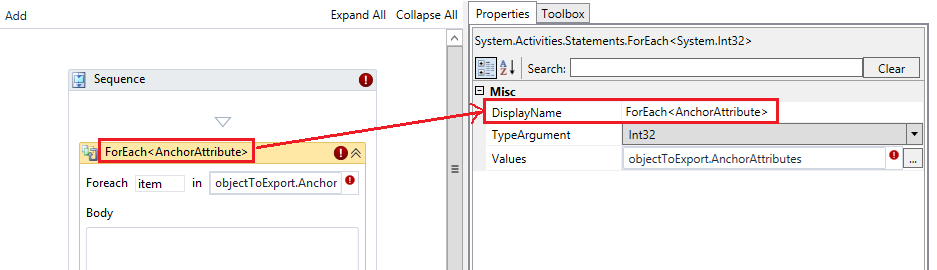

6. Set **TypeArgument** as `Microsoft.MetadirectoryServices.AnchorAttribute`.

   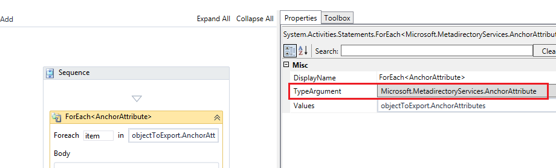

7. Add a **Switch** activity within the **ForEach** body of the **AnchorAttribute**.

   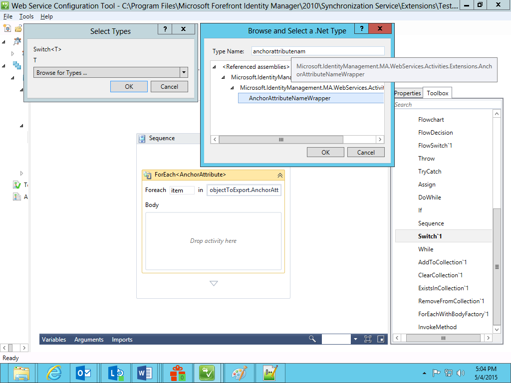

8. Add an expression as per below screen.

   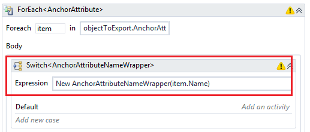

9. Select **Add a new case** and enter a value for the **EmployeeId**. Drag a **Sequence** activity and within it add an **Assign** activity.

    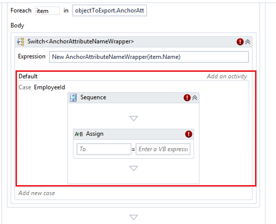

10. Assign the **To** and **Value** properties for the **Assign** activity.

    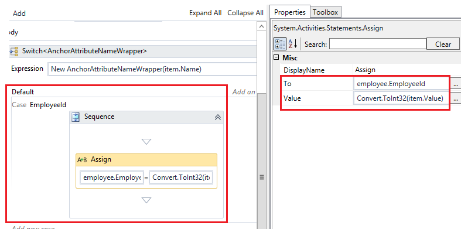

11. The **ForEach** activity is used for anchor values. Add another **ForEach** activity to assign non-anchor values. In this example, the **AttributeChange** anchor is used.

    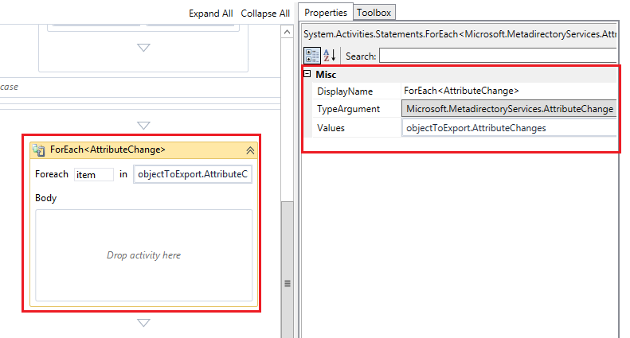

12. Add a **Switch** activity within **ForEach** body of the **AttributeChange** anchor.   

    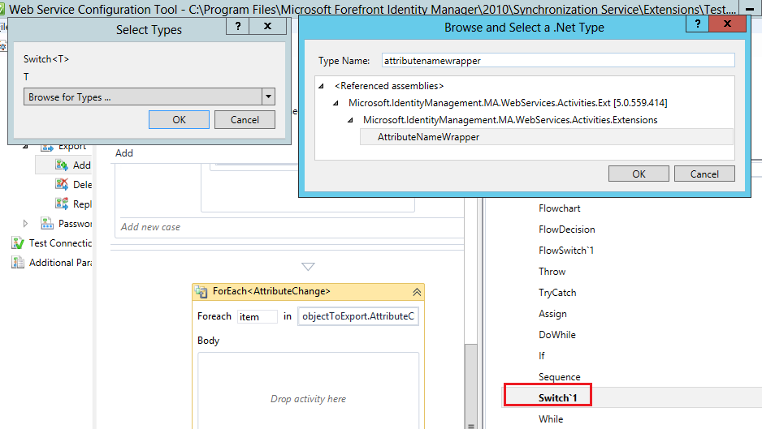

13. Add an expression as per below screen.

    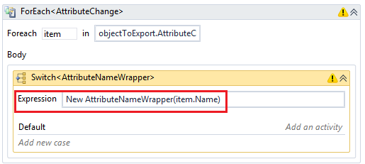

14. Select **Add a new case** and enter a value for the **FirstName**. Drag a **Sequence** activity and within it add an **Assign** activity. Assign the **To** and **Value** properties for the **Assign** activity.

    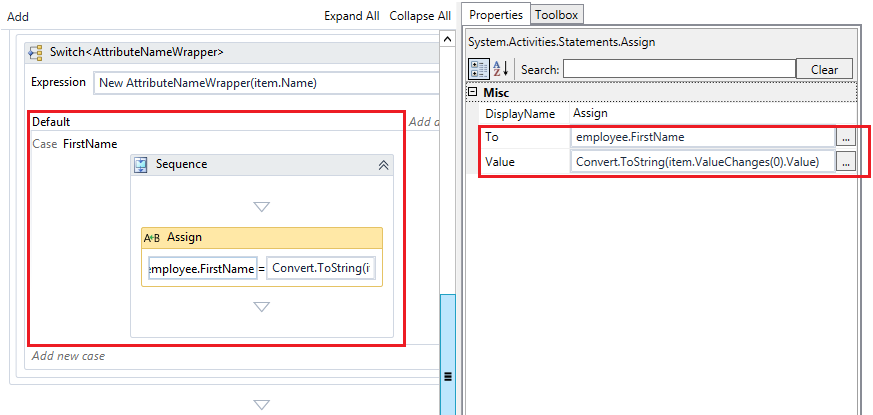

15. Add values for the required attributes like **LastName**, **Email**, and so on. 

    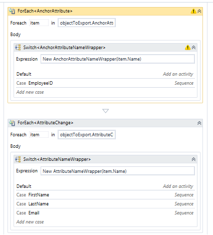

16. Under **Common**, drag a **WebServiceCallActivity** and set **Values** for its **Arguments**.

    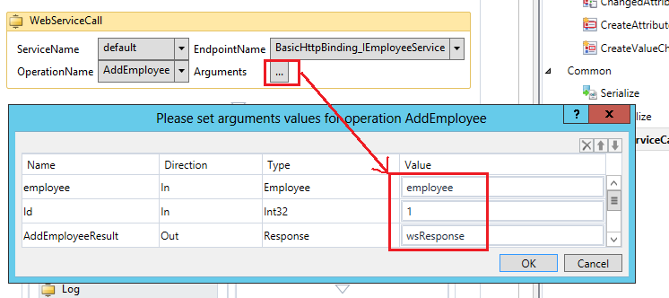

    >[!IMPORTANT]
    >Do not change the **Name**, **Direction**, or **Type** for an argument by using this dialog. If any of these values are changed, the activity becomes invalid. Only set the **Value** for the argument. As shown in this figure, the value *wsResponse* is set.

17.  Finally, add an **If** activity to check responses that are returned from the web service operation.

Creation of the export workflow with the **Add** operation is complete:

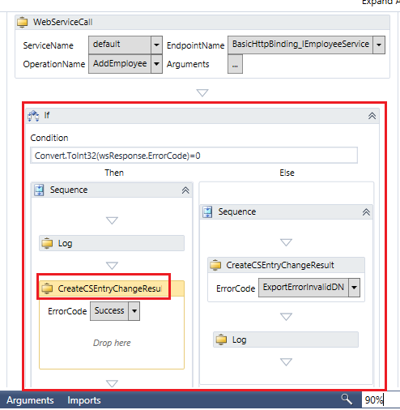

Save this project at the location `%FIM_INSTALL_FOLDER%\Synchronization Service\Extensions`.

### Delete workflows
Delete export workflows by following these steps in the Web Service Configuration Tool.

1. Select the export workflow to configure. Under **Export**, select **Delete**. The **Arguments** and **Imports** are already defined and are specific to the activities. See the following screens for reference.

   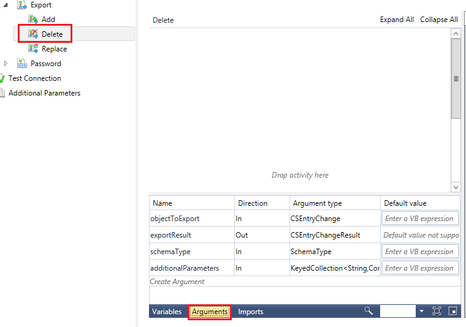

2. Add a **Sequence** activity. Select **Create Variable**. Assign the values to the variables that you are going to use for your logic.

   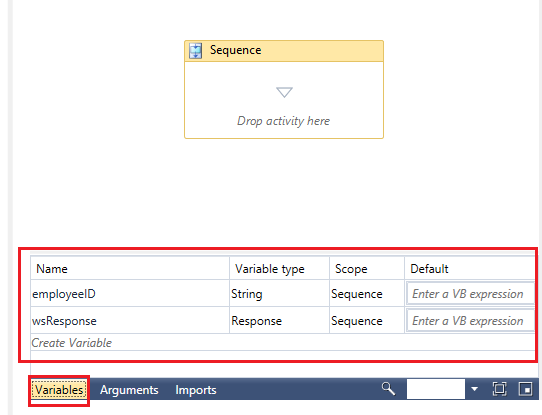

   >[!NOTE]
   >The steps to add a variable are described in the section for creating <a href="#full-import-workflows">full import workflows</a>.

3. Drag a **ForEach** activity within already added **Sequence** activity to iterate over anchor attribute values.

4. Select **Properties** and set the **Values** per below screen. Here **objectToExport** is argument.

   

5. Set the **DisplayName** as `ForEach\<AnchorAttribute\>`:

   

6. Set the **TypeArgument** as `Microsoft.MetadirectoryServices.AnchorAttribute`: 

   

7. Add a **Switch** activity within the **ForEach** body of the **AnchorAttribute**.

   

8. Add an expression as per below screen.

   

9. Select **Add a new case** and enter a value for the **EmployeeId**. Drag a **Sequence** activity and within it add an **Assign** activity.

   

10. Assign the **To** and **Value** properties for the **Assign** activity.

    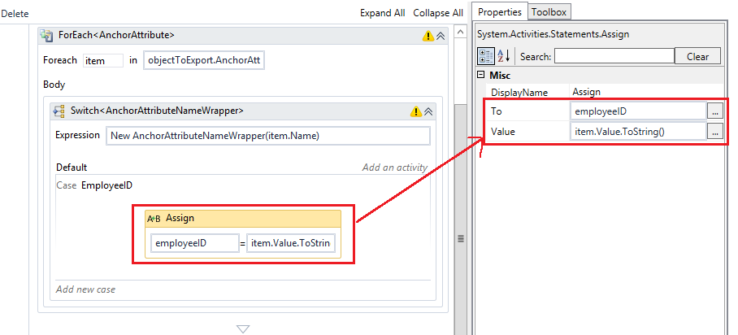

11. Under **Common**, drag a **WebServiceCallActivity** and set **Values** for its **Arguments**.

    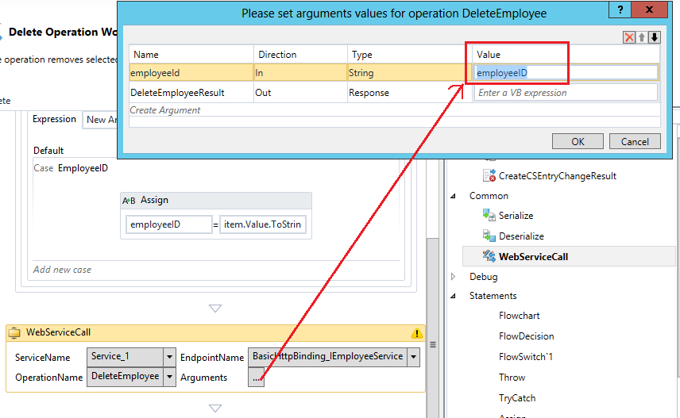

    >[!IMPORTANT]
    >Do not change the **Name**, **Direction**, or **Type** for an argument by using this dialog. If any of these values are changed, the activity becomes invalid. Only set the **Value** for the argument. As shown in this figure, the value *employeeID* is set.

12. Finally add an **If** activity to check the responses returned from the web service operation.

Deletion of the export workflow with the **Delete** operation is complete:

<!-- Image of completed Delete operation is missing from document -->

Save this project at the location `%FIM_INSTALL_FOLDER%\Synchronization Service\Extensions`.

### Replace workflows
Replace export workflows by following these steps in the Web Service Configuration Tool.

1. Select the export workflow to configure. Under **Export**, select **Replace**. The **Arguments** and **Imports** are already defined and are specific to the activities. See below screen for reference.

   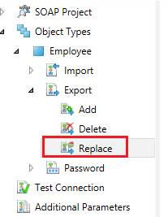

2. Add a **Sequence** activity.

3. Drag a **ForEach** activity for the **\<AnchorAttribute>.**

4. Add another **ForEach\<AttributeChange>** activity to assign non-anchor values.

5. Finally, the screen looks like the following figure. The instructions for configuring this activity are provided in the section for <a href="#attribute-change-anchor">adding export workflows</a>.

   

6. Under **Common**, drag a **WebServiceCallActivity** and set **Values** for its **Arguments**.

   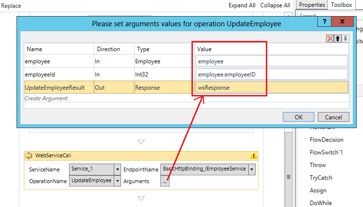

   >[!IMPORTANT]
   >Do not change the **Name**, **Direction**, or **Type** for an argument by using this dialog. If any of these values are changed, the activity becomes invalid. Only set the **Value** for the argument. As shown in this figure, the value *employee* is set.

7. Finally, add an **If** activity to check the responses that are returned from the web service operation.

Replacement of the export workflow with the **Replace** operation is complete:

Save this project at the location `%FIM_INSTALL_FOLDER%\Synchronization Service\Extensions`.

## Debug activities
The following custom activities are available to help debug the workflow template.

### Log activity
The **Log** activity is used to write text messages to the log file. For more information, see [Logging](/archive/technet-wiki/21086.fim-2010-r2-troubleshooting-how-to-enable-etw-tracing-for-connectors).

>[!NOTE]
>If you aren't able to easily debug your workflow, try debugging the workflow in the production environment.  

To use the **Log** activity, set the following properties. The properties are visible when you select the activity in Workflow Designer and view the **Properties** for the activity.
<!-- Properties missing from document -->
<!-- Image of Log activity GUI missing from document -->

### WriteLine activity
The **WriteLine** activity is used to write text messages to a provider's writer. If no writer is available, the [WriteLine](http://127.0.0.1:47873/help/1-7016/ms.help?method=page&id=T%3ASYSTEM.ACTIVITIES.STATEMENTS.WRITELINE&product=VS&productVersion=100&topicVersion=100&locale=EN-US&topicLocale=EN-US&embedded=true) activity writes the text to the console window.

<!-- Image of WriteLine activity GUI missing from document -->

In the text box, write the message that you want to be visible in the writer target.

>[!IMPORTANT]
>The console window can't be used for this activity. Use another window output writer for this task.

To use the **WriteLine** activity, set the following properties. The properties are visible when you select the activity in Workflow Designer and view the **Properties** for the activity.

- **Log Level**: Specifies the amount of content to write in the log value. The possible values are:

    - High: Write the **LogText** message to the log file if the log severity is set to High.
    - Verbose: Write the **LogText** message to the log file if the log severity is set to Verbose.
    - Disabled: Don’t write in the log file.
- **LogText**: Specifies the text content to write in the log.
- **Tag**: Adds a tag to the text to identify the type of content that's being written in the log. The possible values are: Error, Trace, or Warning.

<!-- log severity is not defined in this document -->

## Next steps

- [Overview of generic Web Service Connector](microsoft-identity-manager-2016-ma-ws.md)
- [Install the Web Service Configuration Tool](microsoft-identity-manager-2016-ma-ws-install.md)
- [SOAP deployment guide](microsoft-identity-manager-2016-ma-ws-soap.md)
- [REST deployment guide](microsoft-identity-manager-2016-ma-ws-restgeneric.md)
- [Web Service MA configuration](microsoft-identity-manager-2016-ma-ws-maconfig.md)
