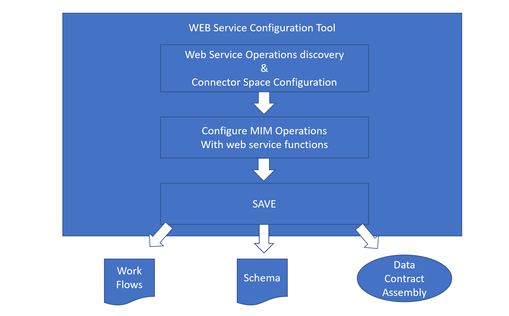
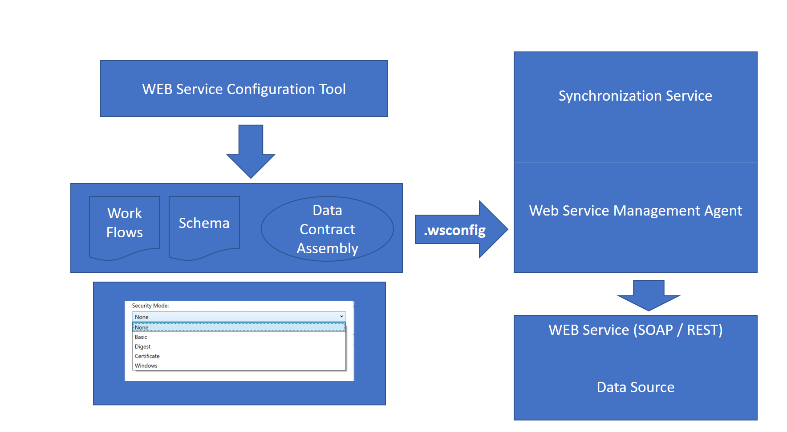
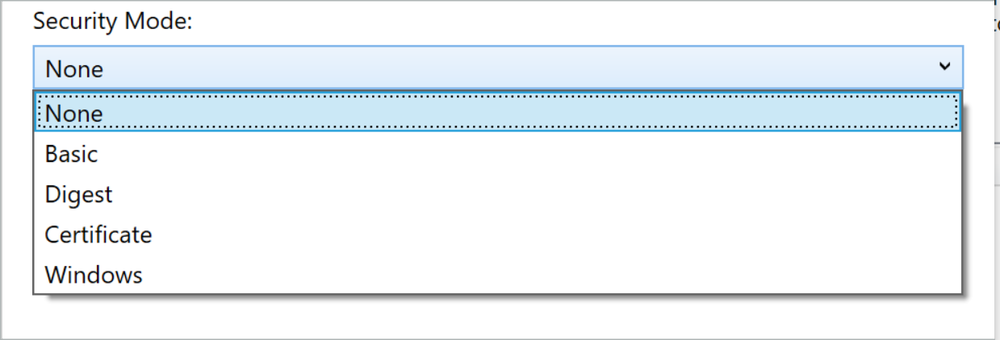

---
# required metadata

title: MIM Overview Generic Web Services Connector | Microsoft Docs
description: Overview of the generic web services connector configuration and requirements
keywords:
author: barclayn
ms.author: barclayn
manager: mbaldwin
ms.date: 11/01/2017
ms.topic: get-started-article
ms.service: microsoft-identity-manager
ms.technology: security
ms.assetid: 
---

# MIM Overview Generic Web Services Connector

The Web Service connector integrates identities through Web Service operations with Microsoft Identity Manager (MIM) 2016 SP1. The connector requires the Web Service Project file to connect with the correct data source. This project can be downloaded from [Microsoft Download Center](http://go.microsoft.com/fwlink/?LinkID=235883). You can also create it by using the Web Service Configuration Tool.
When MIM Synchronization Service invokes the Web Service connector, it loads its configured project file (**WsConfig** file). This file helps it recognize the data source’s Endpoint that should be used to establish a connection. The file also tells it the workflow to execute in order to implement a MIM operation. To execute the configured workflows, the web service connector leverages the .NET 4 Workflow Foundation run time engine.



## Web service layers

Two main layers will implement the Webservice MA solution: 

- Web Services configuration tool

- Run-time Connector implemented with Workflow .NET 4.0

## Supported data sources for Web Service discovery

The Web Service configuration tool implements the following functionalities:

- **SOAP Discovery:** Allows the administrator to enter WSDL path exposed by the target web service. Discovery will produce a tree structure of its hosted web services with their inner  endpoint(s)/operations along with the operation’s Meta data description. There is no limit to the number of discovery operations that can be done (step by step). The discovered operations  are used later to configure the flow of operations that implement the connector’s operations against the data-source (as Import/Export/Password).

- **REST Discovery:** Allows the administrator to enter Restful service details i.e. Service Endpoint, Resource Path, Method and Parameter details. A user can add unlimited number of Restful services. The rest services information will be stored in ```discovery.xml``` file of ```wsconfig``` project. They will be used later by the user to configure the Rest Web Service activity in the workflow.

- **Connector Space Schema configuration:** Allows the administrator to configure the connector space schema. The schema configuration will include a listing of Object Types and attributes for a specific implementation. The administrator can specify the object types that will be supported by the Webservice MA. The administrator may also choose here the attributes that will be part of the Connector space Schema.

- **Operation Flow configuration**: Workflow designer UI for configuring the implementation of FIM operations (Import/Export/Password) per object type through exposed web service operations  functions such as:
    - Assignments of parameters from connector space to web service functions
    - Assignments of parameters from web service functions to the connector space.

## Resources generated by the web service configuration tool

The Web Service configuration tool generates the necessary resources needed to configure a fully functional Webservice MA, this includes:

- **Connector Space Schema:** binary file includes the schema configuration. The file will be imported by MIM through the ```Get Schema``` interface when the MA is configured using the FIM Synchronization UI. It is then converted to ECMA2 Schema format object.

- **Workflows**: a series of Workflow definitions. They are used by the Webservice MA at run time in order to execute an appropriate operation.

- **WCF config file**: Produced by the discovery operation, this file includes the binding and endpoints information required to invoke a web service operation against the data-source

- **Data Contract Assembly**: Since the Web Service Connector now supports both SOAP and REST service the data contracts generated for will be different in the generated.dll file

- **SOAP Assembly**: While parsing the WSDL input, the Web Service configuration tool generates data contract types, which are data structures used by the web service operations to communicate with the remote service. These contract types are also used to expose remote data source entities for object type attribute mapping.

- **REST Assembly**: While parsing sample request-response for Rest webservice, the configuration tool will generate types (classes), which will be used in workflow to communicate with web service via Web Service Call activity. Each Request/Response will be defined in its own namespace. The namespace has a syntax as \<ServiceName\>.\<ResourceName\>.\<MethodName\>.[Request/Response]. Wrapping each request/response in separate namespace will help to reduce issues due to duplicate type(class) name.



Project file type:

MA is saved in compressed file (ZIP format) with name specified by user and “WsConfig” file extension. “WsConfig” file extension is registered and associated with Web Service configuration tool by installer. Existing MA projects can be opened, modified and saved. They may be saved to the FIM Synchronization Service extensions folder or any other location. Changes related to object type and attributes require synchronization on FIM side.  Configuration tool is a multiple- instance application designed to create and modify MA(s).

## Supported Security Modes

The REST/SOAP web service application might be secured through a Web Server like IIS. It gives options to the user to select any of the below mentioned security modes:



Supported Data Types

-   SOAP (legacy) - <https://msdn.microsoft.com/en-us/library/ms995800.aspx>

    -   BAPI Stack only

    -   Sample Templates provided at [Microsoft Download Center](https://www.microsoft.com/en-us/download/details.aspx?id=51495).

-   REST (not ODATA) - is a http protocol based connector / Web

## Next Steps 

-   [Install the Web Service Config Tool](microsoft-identity-manager-2016-ma-ws-install.md)

-   [Soap Based deployment guide](microsoft-identity-manager-2016-ma-ws-soap.md)

-   [Rest Based deployment guide](microsoft-identity-manager-2016-ma-ws-restgeneric.md)

-   [Web Service MA Configuration](microsoft-identity-manager-2016-ma-ws-maconfig.md)
