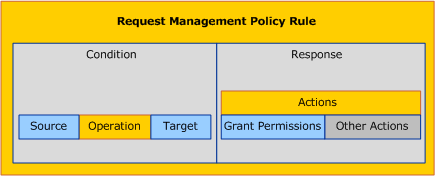
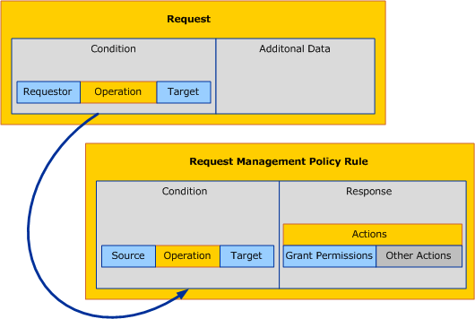
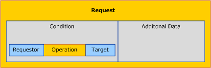
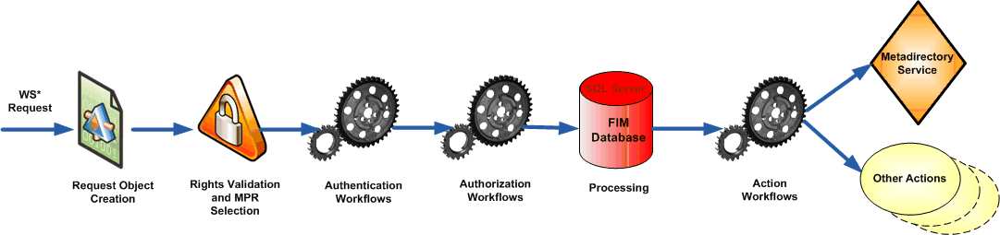
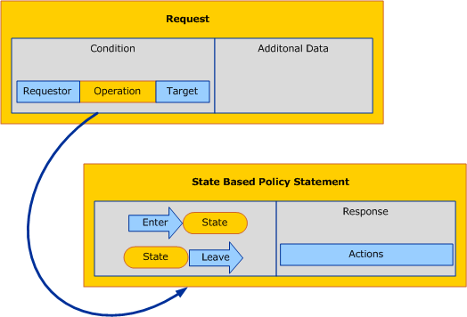

---
# required metadata

title: Microsoft Identity Manager 2016 SP1 terminology | Microsoft Docs
description: Comprehensive list of terms that are referenced in Microsoft Identity Manager 2016 SP1.
keywords: Terminology
author: henrymbuguakiarie
ms.author: henrymbuguakiarie
ms.date: 04/08/2025
ms.topic: reference
ms.service: microsoft-identity-manager

ms.assetid: b0b39631-66df-4c5f-80c9-a1774346f816

# optional metadata

#ROBOTS:
#audience:
#ms.devlang:
ms.reviewer: fimguy
ms.suite: ems
#ms.tgt_pltfrm:
#ms.custom:

---

# Microsoft Identity Manager 2016 SP1 terminology

This document is a comprehensive list of terms that are referenced in Microsoft Identity Manager 2016 SP1 and later.

## A

**Active Directory group validation**: A procedure implemented in MIM 2016 that ensures the uniqueness of the account name of a group within a domain stored in Active Directory.

**action workflow**: A workflow that carries out an action. This includes sending a notification e-mail and commit changes to MIM Service database.

**activity**: A workflow activity is the basic building block of Windows Workflow Foundation (WF) workflows. It incorporates the logic that is both initiated at design time and run time when building and running workflows.

**activity assembly**: A .DLL or an .EXE file containing a .NET assembly that implements the logic for a workflow activity.

**anchor**: One or more unique attributes of an object type that does not change and represents an object in the connected data source to which the connector space object is linked (for example, an employee number or a user ID).

**approval**: An approval is a workflow decision point that can be used to obtain authorization from a person before continuing in the workflow.

**approval e-mail**: If a request requires an approval before being committed, an approval e-mail is sent to identified approvers.

**approval request**: A request that requires an approval. For example, an e-mail message sent by MIM 2016 to an approver as part of the processing of an approval activity.

**approval response**: A response for an approval request. It contains information about if the request is approved or not. For example, an e-mail message sent from the MIM Add-in for Outlook in reply to an approval request.

**approvals search folder**: The search folders created by the MIM Add-in for Outlook that provides the user a way to see pending and completed approvals, and approval request updates.

**approval threshold**: The number of positive approval response messages needed to permit a request to continue processing.

**approver**: The person who will give approval for the request to proceed to the next stage. They receive approval request messages if MIM Add-in for Outlook is used. See also the entry for "escalation approver."

**attribute flow**: This defines the direction of which attribute values flow between the MIM service and other external systems.

**authentication activity**: A workflow activity that validates a user’s identity. For example, password reset gate and Smart Card authentication gate. See also the entry for "QA gate" and "lockout gate."

**authentication challenge**: A dialog that requires the user to provide a response to authenticate to MIM 2016. For example, questions for user to answer to reset their passwords.

**authentication challenge activity**: A Windows Workflow Foundation activity that is used to configure a challenge that's issued to a user to authenticate to MIM 2016.

**authorization workflow**: A workflow with activities that must be completed before the Request is committed to the database. Examples are data validation and approval.
 

## C

**clear registration attribute**: This attribute clears the registration associated with an authentication workflow. For example, in a Question and Answer Challenge, answers are stored in MIM 2016 in the form of registration data. When the clear registration box is checked and a workflow is saved, the registration data is deleted, requiring users to re-register.

**computed member (or member)**: A read-only set of resources computed from the combination of manually-managed members and a filter.

**connector**: An object in the connector space that represents an object in a connected data source and is currently linked to an object in the metaverse by means of predefined rules. The metadirectory uses connector objects to synchronize attribute values between a connected data source and the metaverse.

**connector filter**: A rule that you use to prevent connector space objects from linking to metaverse objects.

**connector space**: A staging area that contains representations of selected objects and attributes in a connected data source. A connector space object is an object in the connector space that is either created by a data import from the connected data source or by using rules within MIM to create new objects in different connected data sources. These objects hold attribute values that can be imported or exported from corresponding objects in the connected data source.

**count XPath**: XPath expression that returns a numeric value to be rendered within parentheses after the display name of the resource.

**criteria-based member**: A read-only set of resources computed from the combination of static group members and a filter.

**criteria-based membership**: A group in which the membership of the group is determined by a filter. See also the entry for "static membership."

**cross-forest member**: A member of a security group whose user account in a different forest from the group account.

**cross forest group calculation**: An out-of-box activity that places across forest members of a group in the Foreign Security Principal (FSP) set associated with the forest in which the group resides.

**custom expression**: The descriptive language used in defining functions or attribute flows in advanced mode.
 

## D

**destination set (or target resource definition after request)**: A set into which a resource moves because of a request that changes that resource's attributes.

**default group validation activity**: An out-of-box workflow activity that determines whether a group management request would violate the MIM 2016 or Active Directory configuration or policy.

**disconnector**: An object in the connector space that represents an object in a connected data source and is not currently linked to an object in the metaverse.

**disconnector objects**: There are three types of disconnector objects: disconnectors, explicit disconnectors, and filtered disconnectors.

**display name**: An attribute of a resource that appears in a user interface to identify that resource. A value used in a display name should be unambiguous and human-readable. It is important to provide display name if one wants to use the resource in various MIM Portal controls, such as resource picker.

**distribution group**: A collection of resources that's most commonly users and other groups that can be e-mailed simultaneously by sending e-mail to the mailbox for the group.

**domain configuration**: A configuration resource used to model Active Directory domains.

**domain local group**: A group with Domain Local scope is an Active Directory group that secures resources within a particular domain, and which can contain members from that forest or any trusted forest.

**drop file**: A drop file is an XML log file representing a potential or occurring export or import.

**dynamic attribute value**: The value of an attribute that is calculated based on other attributes. For example, a name attribute is calculated by concatenating the given name and the last name.

**dynamic group**: A group whose membership is automatically determined and kept up-to-date by MIM 2016 by ensuring that the group contains all resources (like people, groups, computers) that fall within conditions that are expressed by using XPath.
 

## E

**enumeration**: A list of resources returned by the MIM 2016 Service.

**escalation**: If an approval is not completed within the specified time, the approval is escalated and additional approvers are added to the approval.

**escalation approver**: The user who receives the approval request messages if the approvers fail to respond. See also the entry for "approver."

**explicit connector**: An object in the connector space that is linked to an object in the metaverse and cannot be disconnected by a connector filter. An explicit connector can only be created manually with Joiner, and it can only be disconnected by provisioning or by using Joiner.

**explicit disconnector**: An object in the connector space that is not linked to an object in the metaverse and can only be joined by using Joiner. An object becomes an explicit disconnector by manually disconnecting the object by using Joiner.

**export**: Exporting is the process of pushing changes to the connected data sources. An export is always a delta operation based on the last successful import. MIM processes export changes, but doesn't process the changes in the connector space until the changes have been confirmed by a new import. Depending on the type of management agent that you use, the changes implemented by an export can be at the attribute, object, or value level.

**Export Attribute Flow**: The process of translating an object’s attributes from the metaverse to the connector space. This process might involve one-to-one mappings, applying rules extensions to modify attributes or setting static attribute values. Exported attributes are staged in the connector space for the next export to the connected data source.

**Extensible Assertion Markup Language (XAML)**: An XML-based language in which workflow definitions are represented.

**external system scoping filter**: Determines the resources that you identify and filter from a source directory based on a particular condition.

**external system resource type**: This is the resource type in the external system to which the MIM 2016 resources are connected.

**external system resource creation flag**: A parameter of a synchronization rule to indicate whether a resource should be created in the connector space if based on the relationship criteria such resource does not exist in the external system. See MIM 2016 resource creation flag. <!-- Not sure what this is, should this be a term? -->

**external system scope**: A parameter of a synchronization rule containing a filter presenting resources on the external system to which the rule applies.
 

## F

**filter**: An expression containing filter conditions. A filter matches a resource if each of the filter conditions contained in the filter match the resource. In MIM 2016, filter uses XPath syntax.

**filtered disconnector**: An object in the connector space that is prevented from being joined or projected to an object in the metaverse based on connector filter rules in the associated management agent.

**FIM management agent**: A management agent that synchronizes between the MIM 2016 Service and the MIM 2016 Synchronization Service.

**FIM / MIM password reset client service**: This refers to the proxy service that resides on the end user’s computer that communicates with the MIM 2016 server.

**FIM / MIM password reset extensions**: This refers to the code that resides on the end user’s computer that extends the functionality of Windows Logon to include Self-service Password Reset.

**FIM / MIM resource creation flag**: A parameter of a synchronization rule to indicate whether a resource should be created in the MIM 2016 database if based on the relationship criteria the resources does not exist. See also the entry for "external system resource creation flag."

**function**: A component that can be included in a synchronization rule or a workflow definition to process data values.
 

## G

**gate**: A workflow activity used in the authentication phase of request processing. See also the entry for "QA gate" and "lockout gate."

**group nesting**: A field of a group definition that specifies whether the group contains other groups as members of the current group.

**group scope**: A field of a group definition, one or 'local', 'global', or 'universal’. For more information, see Active Directory group scope.
 

## I

**import**: The process of moving connected data source objects into the connector space for creation, modification, deletion, or verification purposes. An import can be a full or delta operation. For a full import, MIM requests all designated objects from the connected data source and deletes all staging objects for which a corresponding object has not been received during this import. As a result, this run profile step is useful for cleaning up the staging objects in the connector space. The objects that have been received from the connected data source are staged in the connector space. For the delta import to provide the desired results, the connected data source must implement a form of watermark. The connected data source uses the watermark to indicate when the most recent changes to an object occurred. MIM reads the watermark to determine what to include in the delta import. An example is the Active Directory USN.

**Import Attribute Flow (IAF)**: Import attribute flow is the process of importing an attribute from the connector space to the metaverse. This process might involve applying one-to-one attribute mappings, using rules extensions to modify attributes or setting static attributes.

**image URL**: URL for an image file to be rendered in the MIM 2016 Portal UI.

**initial flow**: An initial flow is an attribute value flow that only is applied once when the resource is created for the first time. That is, an initial password is created only when you create an account for the first time.

**interactive workflow**: A workflow that requires response from the user requesting a change, such as for performing additional authentication checks.
 

## J

**join**: A join is the process of linking a connector space object with an existing metaverse object. Attribute values flow only between linked objects.

**join group request**: A request to add a user to a group.
 

## L

**lockout**: A configuration setting on a person resource in the MIM 2016 database that restricts that person from authenticating to MIM 2016 or performing password reset.

**lockout gate**: A workflow activity in the authentication phase of request processing to lockout a user who has failed to authenticate. See also the entry for "lockout" and for "QA gate."

**lockout threshold**: This is an integer control that specifies the number of times a user can fail to complete the authentication workflow before they are locked out for the Lockout Duration. The default setting for this is 3. The lower limit is 0 and the upper limit is 99.

**lockout duration**: This is an integer control that specifies the duration in minutes the user is locked out for after hitting the Lockout Threshold.  The default setting for this is 15 minutes.  The lower limit for this setting is 1 and the upper limit is 9999. The upper limit allows the administrator to set the upper limit to greater than one day.

**lockout threshold count before permanent lockout**: This is an integer control that allows the administrator to configure a numeric value for the number of times a user can hit the Lockout Threshold before being permanently locked out.  Permanent lockout implies that the user must be unlocked by the system administrator. By default, this is set to 3. The range for this setting is between 1 and 99.
 

## M

**management agent**: A management agent (MA) connects a specific connected data source to the metadirectory. It is responsible for moving data from the connected data source to MIM and the rules that would determine the eligibility of the identity data to participate within MIM and any other connected data sources. When data in the metadirectory is modified, the management agent can export the data out to the connected data sources to keep the connected data source synchronized with the data in MIM. A management agent is used instead of having an agent-based connector.

**Management Policy Rule (MPR)**: Management Policy Rules (MPRs) provide a mechanism to model business processing rules for incoming requests to MIM 2016 server. They control the permissions for requesting operations on MIM 2016 resources together with the workflows that are triggered by these requests.
   
   There are two types of MPRs:
   
- Request MPRs: Grant permissions and run workflows (invoked before a requested operation has been performed).
- Set Transition MPRs: Run workflows only (reaction to an applied state change).
   
  The main design objects for MPRs are:
   
- Modeling permissions
- Modeling workflows mappings
- Modeling transitions
- Modeling reflexive definitions
- Modeling unauthenticated user access
- Modeling temporal policies
- Modeling filter permissions

**manually-managed member**: The membership of the group or set that consists of a manually selected list of users, groups, or other resources.

**metaverse**: The central data store used by MIM to contain the aggregated identity information from multiple connected data sources, providing a single global, integrated view of all combined objects. The metaverse is not to be used as a table or view of aggregate identity data for any application other than MIM since corruption can result.

**monitored mailbox**: A mailbox that MIM 2016 Service monitors to receive approval and Request e-mails from the MIM Add-in for Outlook.
 

## N

**notification activity**: A workflow activity within the action phase of request processing in which MIM 2016 sends e-mails to one or more users to notify them of the request.

**notification message**: An e-mail message sent by a notification activity. See also the entry for "notification activity."
 

## O

**ObjectID (ResourceID)**: An attribute that contains a globally unique identifier (GUID) assigned by MIM 2016 to each resource when it is created. This is also known as resource ID.

**object identifier**: A sequence of numbers used as an identifier for a field in an X.509 digital certificate, or for an attribute type or object class in an LDAP-based directory service. Object identifiers are typically assigned by software vendors and standards bodies.

**operation type**: The operation type is requested on the resource managed by MIM 2016 through the Web service. This includes create and delete of resources, and read and modify of resource attributes. In addition, Add/Remove operations let you apply further control to the modify operation to control only addition of values to attributes or their removal.

**operator**: An element of a filter that specifies a comparison or other relationship between data values.

**origin set (or target resource definition before request)**: A set in which a resource belonged prior to a change in that resource's attributes.
 

## P

**parameter**: When provisioning new resources, it is sometimes possible to provide attribute values from an external source, like a user. An attribute value is passed as a parameter to be able to successfully create a new resource.

**partition**: A logical volume of data in the connector space. A management agent can create one or more partitions to logically divide data into separate logical groupings. Each volume of data is processed individually during synchronization.

**password reset**: A procedure by which a user’s password can be changed to a known value, in situations where the user has forgotten or lost their password. See also the entry for "registration."

**phase**: Each resource creation, update, or deletion request is processed through three workflow phases. In the authentication phase, additional authentication checks of the requesting user can be performed. In the authorization phase, any necessary approvals are gathered. In the action phase, the activities are performed after the request to change the resource has been committed.

**placeholder objects**: Objects in the connector space that represent a single level of the hierarchy of the connected data source. For example, if you want to synchronize objects with an Active Directory forest, you need to import the containers that make up the path for the Active Directory objects. In the example, CN=MikeDan,OU=Users,DC=Microsoft,DC=Com, placeholder objects would be created for DC=Com and DC=Microsoft,DC=Com. Also, a placeholder object can represent an object in the connected data source to which an imported reference attribute value refers (for example, the object to which the manager attribute refers in a User object). Placeholder objects do not contain attribute values and cannot be linked to the metaverse.

**Policy Management**: Policy Management in MIM 2016 is made possible by a Sharepoint-based console for policy authoring and enforcement. Extensible Windows Workflow Foundation-based workflows enable users to define, automate, and enforce identity management policies. Policy Management also includes heterogeneous identity synchronization and consistency that is achieved by integration of a broad range of network operating systems, e-mail, database, directory, application, and flat-file access.

**policy update (or run on policy update)**: If a workflow should be rerun as an effect of a change to the sets or MPRs referring to it, the policy update flag is used to indicate this.

**precedence**: An ordering of synchronization rules.

**principal set**: A set used in Management Policy Rule to specify the set of resources (usually users) that initiate the Management Policy Rule evaluation.

**principal set relative to resource**: This is a reflexive property. Its value is defined in terms of one of the Resource properties. It's used to define dynamic management policy rules whose conditions are evaluated in the context of each target resource being processed.

**projection**: The process of creating an object in the metaverse based on projection rules and then automatically linking that object to an existing object in the connector space.

**provision**: The process of creating, renaming, and deprovisioning objects in predetermined connector spaces based on changes to an object in the metaverse. Provisioning rules can be set up to be called whenever a metaverse object is modified. These rules can perform object-level actions, such as creating a new connector space object or disconnecting existing connector space objects that are linked to the metaverse object.
 

## Q

**QA gate**: A workflow activity in an authentication phase, in which the requesting user must supply answers to one or more predetermined questions. This activity is typically used in password reset, to challenge the user to prove their identity by providing the user with a selection of pre-determined questions for which only that user would know, for which the user must supply the correct answer. See also the entry for "lockout gate."

**QA challenge**: A challenge that requires the user to answer a series of questions in order to authenticate to MIM 2016.
 

## R

**random password settings**: A setting that determines the number of characters required to set a password in the external directory.

**reference attribute type**: An attribute type in which the values of the attribute are the ObjectID (globally unique identifiers) attribute values of other resources in MIM 2016.

**referential integrity**: A constraint in MIM 2016 in which a reference attribute cannot have as a value an ObjectID of a resource that's been deleted.

**registration**: A procedure to configure self-service password reset for a user. See also the entry for "QA gate."

**re-registration**: The updating of registration for an authentication challenge in MIM 2016, typically required after a change to administrative policy for password reset registration.

**relationship creation**: Configuration flags of a synchronization rule that determines whether resources should be created automatically in MIM 2016, or in the external system, if the resources are absent.

**relationship criteria**: Setting of a synchronization rule that's used to match resources in MIM server and resources in external systems.

**relationship termination**: Indicates if related resources in other external systems should be disconnected (and possibly deleted) when the synchronization rule doesn't apply anymore.

**request management**: The ability for a user to interact with and manage submitted requests and associated workflows.

**request management policy rule (RMPR)**: A management policy rule type that is evaluated and applied against incoming requests to perform operations. RMPRS are primarily used to author access policy definitions in MIM. In other words, the answer to how the request is handled. When you configure an RMPR, the requester is in the Set designed to perform an operation.

   The MIM architecture defines six different operations that an RMPR can be defined for:
   
- Create a resource.
- Delete a resource.
- Read a resource.
- Add a value to a multivalued attribute.
- Remove a value from a multivalued attribute.
- Modify a single-valued attribute.
   
  When you define an RMPR, you must select at least one of these six operations. The operations are always defined in the context of the requester. Each condition requires the definition of a target. An operation that is applied to a target can result in a state transition of the target resource. An RMPR is always invoked before a requested operation has been performed. To effectively characterize the target of your condition, you need to configure two different states:
   
- Target Resource Definition Before Request: The state of the target before the request is applied.
- Target Resource Definition After Request: The state of the target after the request is applied.
   
  Whether you need to define both states depend on the operations your RMPR is defined to do. In a Create operation, the requested resource has no initial state. Therefore you only need to configure Target Resource Definition After Request" for a Create operation.
   
  A Read or Delete operation does not cause a state transition. For these two types of operations, you are only required to specify Target Resource Definition Before Request.
   
  For a Modify operation or all other combinations of operations, you need to configure both states, which may have the same values if no state transition takes place.
   
  You can express the related resources relative to the requester (such as the requester’s own user object, a target user's manager, or a target group's owner).
   
  The simplest form of a response to a condition is to grant permissions to perform the requested operation. In addition to granting permissions, you can also define other operations as a response to a condition in an RMPR. In the MIM architecture, these operations are defined in the form of workflows. At the time, when a given RMPR is processed, the system might not have enough information to grant permission. In this case, you can define additional authentication and authorization steps in your RMPR that apply to the person performing a given request. For example, to grant permission to perform the requested operation, you might require manual interaction of a user to approve the operation.
   
  The following figure outlines the complete architecture of an RMPR:
   
  
   
  When a new request object is created in MIM, the system queries the configured RMPRs for matching objects by comparing the request conditions with the configured conditions in your management RMPRs. If matching RMPRs are located, they are applied to the queued request object. The following figure outlines this process:
   
  
   
  In MIM Portal, permissions for operations must be explicitly granted. In other words, unless granted by an RMPR, all operations on resources are denied. Each request object requires at least one RMPR that grants permission to perform the requested operation on a target.

**request object**: When a user performs a task in the MIM Portal or the MIM Add-in for Outlook, it's represented as a request object. Request objects represent a convenient reporting mechanism for activities in your system.

   Each request object has these components:
   
- Requester: A resource that asks to perform an operation.
- Operation: The action that the requester wants to perform.
- Target: The resource that is the target of the requested operation.
   
  Logically, a request object is an implementation of the following statement:
   
  `The requester attempts to perform the following operation on this target...`
      
  The following figure outlines the general architecture of a request object:
   
  
   
  Each request object has a status property to indicate the processing state. Processing requests may require manual interaction to complete a request. For example, the owner of a group might be required to manually approve the request of another user to join a group. In addition to a manual interaction, you can also configure MIM to automatically process a specific request without the need of human interaction.
   
**request processing model**: The request processing model in MIM is composed of three main phases:

- Phase 1: Authentication
- Phase 2: Authorization
- Phase 3: Action
   
  Workflows, each of which contain one or more activities, can be attached to each of these phases and run in the context of executing a single request. A request can initiate from a single user call to one of the Web Service endpoints or through a user creating a request in the MIM Portal.
   
  The following figure shows the relationship of the request processing components:
   
  
   
  Requests are processed in the following order:
   
- Request Object Creation: MIM 2016 creates a request object in response to a call to one of the Web Service endpoints or because of a request initiated through the MIM Portal.
   
- MPR evaluation: The requester’s rights to request the action are validated and the computation of the applicable workflows is performed. The request is checked against mappings to any MPR objects. To map to an MPR, all the applicable fields of the MPR for the requested operation need to match. This includes the requester, operation, target resource, and attributes. If all of these conditions including the attributes being affected are true for an incoming request, then the appropriate MPR is matched to the request. A request must map to at least one MPR that grants the permission as part of its definition. If this is true, the request passes through the permissions check stage of request processing. If this is not true, the request fails. The system also determines the set transitions that are part of the request and locates all related set transition-based MPRs.
   
- Authentication: MIM 2016 runs authentication workflows one at a time in a non-deterministic order to confirm the requester’s identity.
   
- Authorization: MIM 2016 confirms the requester’s permission to perform the requested operation on the resource specified in the request. All dependent authorization workflows are run in parallel, but a request is not committed to the MIM Object Store unless all the workflows have been completed and all have succeeded.
   
- Processing: MIM 2016 performs the requested operation on the MIM Application Store.
   
- Action: MIM 2016 executes any processes that are to occur because of the requested operation. All action workflows are run in parallel. Read operations do not have any workflows applied to their processing. This includes the configured workflows in the RMPR as well as the workflows in the set transition-based MPRs.
   
  >[!NOTE]
  >Requests that are initiated by the Synchronization Account bypass all authentication and authorization workflows that would be applicable to them. Any applicable action workflows are applied.

**requestor**: The identity of the user or service that has submitted a request to MIM 2016.

**requestor scope**: A configured collection of users who can submit a request. Can be "everyone," or a specific set of users defined by a filter.

**resource**: An instance of a certain resource type in the MIM 2016. Each resource is uniquely identified by its ObjectID (ResourceID) attribute.

**resource control display configuration (RCDC)**: RCDCs are configuration resources that are used to render the UI in the Resource Control (RC) for authoring a specific resource type in MIM 2016.

**resource current set**: Part of the management policy rules (MPR) condition definition. The collection of target resources at the time the request is received. Applies to read, delete, and modify operation types.

**resource final set**: Part of the condition definition in management policy rules. The collection of target resources after the request is processed. Applies to create and modify operations types only.

**resource hierarchy**: In a directory service, the hierarchy of a resource entry is the collection of directory entries between the base of a naming context and that resource entry.

**resource scope**: A set of resources about which a request can be submitted.

**resource type**: A part of a schema that defines the representation of a resource in MIM 2016.

**resource type mapping**: A relationship between a resource type used to represent a resource in MIM 2016 and a resource class used to represent that resource in the metaverse.

**role**: An organizationally-assigned security principal used to manage access rights.

**rules extension**: A rules extension is a dynamic-link library (.dll) that contains a defined set of rules for managing data. You can use rules extensions during synchronizations to extend functionality. For example, you can use a rules extension to combine data from two source attributes and flow them to one target attribute (for example, `sn` and `givenName` into `displayName`).

**run history**: A set of statistics that show the results of a single run of a management agent.

**run profile**: A run profile represents a set of steps that specify how to run a management agent and configuration settings that determine how a management agent runs. A management agent can have multiple run profiles, which are stored with the management agent. A run profile is composed of at least one run profile step.
 

## S

**search folder**: See the entry for "approvals search folder."

**search scope**: Specifies the properties for a particular search context that a user may conduct from the MIM 2016 Portal. For example, a user could select a search scope from a drop-down list for "All Users," "All Distribution Lists," "My Pending Approvals," and the search results would be constrained to items meeting those criteria in addition to any search terms specified by the user.

**security descriptor**: A structure and associated data that contains the security information for a securable resource. A security descriptor identifies the resource's owner and primary group. It can also contain a DACL that controls access to the resource, and a SACL that controls the logging of attempts to access the resource.

**security principal**: An identity used for security management, such as a user account, who can authenticate to a service.

**security token**: A protocol element that transfers authentication and authorization information, based on a credential. In the web services protocols, a security token is represented as an XML element in a SOAP header, as defined by WS-Security.

**security token service**: A service that implements the WS-Trust protocol to manage trust between clients and services based on the exchange of security tokens.

**sequential workflow**: All workflows in MIM 2016 are derived from the Windows Workflow foundation sequential workflow. It includes several workflows in a sequential order.

**service account**: A Windows account assigned to be used by a Windows service, rather than to be used by a user to log in to a computer system. It represents the system account of MIM.

**Set**: A named collection of resources. Typically Sets are used to organize resources based on rules. The membership in a Set is manually–managed or criteria-based. This means, you can manually add resources to a Set and you can define criteria that automatically adds resources to a Set based on a filter statement. When a resource fulfills the filter criteria, it is automatically added to the related Set.

**Set Transition Management Policy Rule (TMPR)**: A management policy rule that is applied on changes to membership of a set. Set TMPRs apply action workflows either when object transition into or out of a specified set in the MPR.

   There are two types of TMPRs:
   
- Transition in: A resource becomes a member of the transition set.
- Transition out: A resource leaves the transition set.
   
   >[!NOTE]
   >When a transition set is deleted, the system treats the deletion as a transition out event for the affected objects.
      
  The response is a reaction to an applied state change. When the related MPR is invoked, the condition has already been applied. This means that the affected resources have already transitioned into or out of a transition set. For TMPRs, the objective of the response is not to define the reaction to a requested operation but to define the response to an applied operation. In other words, for a set transition-based MPR, it is irrelevant how a state was reached. What is relevant are the consequences of a state change.
   
  When you configure a set transition-based MPR in MIM, you need to specify the following three settings:
   
- Transition set
- Transition type
- Policy workflows
   
  The policy workflows are definitions of the processes that need to be invoked in response to the state change. The most common use cases for state-based MPRs are the granting or revoking of entitlements and provisioning and deprovisioning in external data sources.
   
  The following figure outlines the complete architecture of a set transition-based MPR:

  
  
  Set transition-based MPRs are activated by requests. When a request is processed and approved by an RMPR, the MIM service also determines whether an approved request results in a state transition and whether a state transition-based MPR that handles the state change exists.
  
  The following figure outlines the relationship between a request and a set transition-based MPR:
  
  

**SID**: A unique value used to identify a user account, group account, or logon session.

**SOAP**: A protocol for exchanging structured information between software components.

**synchronization**: The process of keeping selected data in multiple data sources in agreement. Synchronization represents operations on objects solely within MIM. Synchronization can be an operation on the entire set of data for which it is defined on a management agent or a delta operation as per the changes since the last known operation. The synchronization run profile step defines the inbound and outbound synchronization processes.

   The synchronization run profile step has two subtypes:
   
- Delta synchronization
- Full synchronization
   
  During delta synchronization, MIM processes only imported objects, which are those staging objects that are flagged as pending import. This run profile step is useful for processing only those objects that have pending changes, but were not processed during a previous synchronization run.
   
  Delta synchronization is used in two predefined run profiles, and behaves slightly differently in each one. The first run profile is Delta Synchronization, where no import from any connected source is performed, but all objects in the connector space are evaluated, and any objects with pending changes are processed. The second run profile is Delta Import and Delta Synchronization combined. This run profile imports only those objects and attributes from the connected data source whose values have changed since the last time the management agent was run. Management agent rules are then reapplied only to objects that have pending changes from the delta import. Objects without pending changes from that delta import are not evaluated.
   
  During full synchronization, MIM evaluates and applies synchronization rules to all the staging objects in a connector space. Full synchronization should be initiated whenever changes have been applied to the rules of a given environment. Depending on the number of objects in your connector space, this can be a time and resource-intensive operation, so frequent changes to synchronization rules in your production environment should be avoided.

**synchronization filter**: A filter to prevent resources in the metaverse from being transferred to the MIM 2016 database.

**synchronization rule**: A rule for flowing resource information between the MIM server (including MIM synchronization engine) and connected external system.
 

## T

**temporal policy**: A Set Transition MPR that is bound to a Temporal Set. The policy is applied on the passage of time, as objects transition into and out of the set based on the Temporal Set’s definition.

**Temporal Set**: A type of a set object that is based on relative dates. Temporal Sets provide a mechanism that can fully automate the process of transitioning into or out of a set based on the passage of time. For example, a Temporal Set can be defined for all groups that expire one week from today. The system evaluates the objects in the system automatically and adds them to this set on a daily basis. Other examples allow for dynamic definitions of a time reference such as a filter that is based on "x days from today."

**timed event**: A transition event that occurs after a configured time interval has elapsed or a specific date and time has been reached.

**timeout**: A time period in which MIM 2016 waits for approval responses until an activity is escalated.

**transition set**: A set that is used in a definition of a Set Transition management policy rule. The policy is applied to the changes in the set membership, which can be either objects entering or leaving the set, depending on the TMPR’s configuration.
 

## U

**unlocked group**: A group in which the membership of the group can be changed by users other than the owner of the group.

**universal group**: A group with universal scope is an Active Directory group that can contain members from a particular forest. A universal group can be assigned permissions in any domain or forest. Distribution lists typically have universal scope.  A security group with universal scope can secure resources within the same forest.

**update request**: A request to change the attributes of a resource.

**usage keyword**: A usage keyword is used to determine which search scopes are shown for a specific page in the portal UI. Each list view page in the UI specifies zero or more usage keywords, and the UI for that page includes all search scopes that contain matching keywords. When authoring search scopes, customers can specify zero or more keywords per search scope, to customize which search scopes appear for a given page in the UI. It is also used to determine which home page resource and navigation bar resource is shown to what set of users. It is also used in schema management to protect and label schema elements that are needed by various components of MIM.
 

## W

**web portal**: A user interface implemented by a software application via a component of a web server, such as IIS.

**web service**: A protocol interface to a service implemented using a HTTP-based protocol.

**workflow**: A workflow is a set of elemental units called activities that are stored as a model that describes a real-world process. Workflows provide a way of describing the order and dependent relationships between work items. This work passes through the model from start to finish, and activities might be performed by people or by system functions. In other words, if a response to a request requires complex processing, the steps are encapsulated in a workflow object. Workflows are optional components and closely tied to MPRs. Workflows define an activity or activities that must occur during the processing of an MPR. MIM installs several default workflows that can be used as is or as a basis for a custom workflow.

   Examples for workflow activities are:

- Sending an automated e-mail message to request approval.
- Restricting the attributes that a user can see during a custom search.
- Validating a new group against AD DS or MIM guidelines.
- Adding or removing the object from the scope of a synchronization rule.
   
  To address all processing requirements in your environment, the MIM architecture defines three types of workflows:
   
- Authentication: Performs additional user identity validation before continuing with the request
- Authorization: Validates a request through a sequence of activities such as obtaining necessary outside approval before processing a request.
- Action: Processes any further activities after the original request has been completed successfully.
   
  These three workflows make up part of the request processing model.

**workflow definition**: The workflow definition is stored in the XOML format defined by the Windows Workflow Foundation (WF). This defines the activities, the parameters for the activities, and the order in which they should run.

**Workflow Designer**: The design time experience for the construction of workflows.

**workflow host**: The server component that deals with the running of workflows. In MIM 2016, the MIM 2016 Service is the workflow host.

**workflow instance**: A running instance of a workflow definition as an effect of a request.

**workflow management**: An MIM 2016 feature that deals with designing workflows, executing them and managing them. Workflow management consists of the Workflow Designer, request management, and the workflow host.
