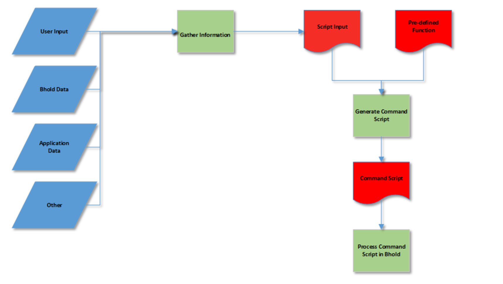

---
# required metadata
# Moved from https://msdn.microsoft.com/en-us/library/jj853041(v=vs.100).aspx

title: BHOLD developer reference for Microsoft Identity Manager 2016 | Microsoft Docs
description: BHOLD developer reference
keywords:
author: billmath
ms.author: billmath
manager: daveba
ms.date: 01/27/2023
ms.topic: reference
ms.prod: microsoft-identity-manager

ms.assetid:

---

# BHOLD developer reference for Microsoft Identity Manager 2016

The BHOLD-core module can process script commands. It can be done by directly using the bscript.dll in a .NET project. Also Interacting with the web service b1scriptservice.asmx interface. 

Before a script has executed, all the information inside the script should be collected to compose this script. This information can be gathered from the following sources:

   * User input
   * BHOLD data
   * Applications
   * Other

The BHOLD data can be retrieved by using the GetInfo function of the script object. There is a complete list of commands that can present all data stored in the BHOLD database. However, the data presented is subject to the view permissions of the user logged in. The result is in the form of an XML document that can be parsed.

Another source for information can be one of the applications that are controlled by BHOLD. The application snap-in has a special function, the FunctionDispatch, which can be used to present application-specific information. This is presented as an XML document as well.

Finally, if there is no other way, the script can contain commands directly to other applications or systems. NoThenstallation of extra software on the BHOLD server can undermine the security of the whole system.

All this information is put into one XML document and assigned to the BHOLD script object. The object combines this document with a pre-defined function. The pre-defined function is an XSL document that translates the script input document into a BHOLD command document.



The commands are executed the same order as in the document. If one function fails, all commands executed are rolled back.

## Script object
This section describes how to use the script object.

### Retrieve BHOLD information
The **GetInfo** function is used to retrieve information from the available data in the BHOLD authorization system. The function requires a function name and eventually one or more parameters. If this function succeeds, a BHOLD object or collection is returned in the form of an XML document.

If the function does not succeed, the GetInfo function returns an empty string or an error. The error description and number can be used to get more information about the failure.

The GetInfo function ‘FunctionDispatch’ can be used to retrieve information from an application controlled by the BHOLD system. This function requires three parameters: The ID of the application, the dispatch function as it is defined in the ASI, and an XML document with supporting information for the ASI. If the function succeeds, the result is available in XML format in the result object.

The snippet below is a simple C# example of GetInfo:

```C#
ScriptProcessor myScriptProcessor = new ScriptProcessor();
myScriptProcessor.Initializae("CORP\\b1user");
myScriptProcessor.GetInfo("OrgUnit", "1");
```

Likewise, the **BScript** object can also be accessed via the web service `b1scriptservice`. This is done by adding a web reference to you project using http://\<server\>:5151/BHOLD/Core/b1scriptservice.asmx where \<server\> is the server with the BHOLD binaries installed. For more information, see [Adding a web service reference to a Visual Studio project](https://msdn.microsoft.com/library/d9w023sx(v=vs.71).aspx).

The following example shows how to use the **GetInfo** function from a web service. This code retrieves the Organizational Unit that has an OrgID of 1 and then displays the name of that Organizational Unit on the screen.

```C#
using System;
using System.Collections.Generic;
using System.Linq;
using System.Text;
using System.Xml;

namespace bhold_console
{
    class Program
    {
        static void Main(string[] args)
        {
             var bholdService = new BHOLDCORE.B1ScriptService();
             bholdService.Url = "http://app1.corp.contoso.com:5151/BHOLD/Core/b1scriptservice.asmx";
             string orgname= "";

             if (args.Length == 3)
             {
                 //Use explicit credentials from command line
                 bholdService.UseDefaultCredentials = false;
                 bholdService.Credentials = new System.Net.NetworkCredential(args[0], args[1], args[2]);
                 bholdService.PreAuthenticate = true;
             }
             else
             {
                 bholdService.UseDefaultCredentials = true;
                 bholdService.PreAuthenticate = true;
             }

             //Load BHOLD information into an xml document and loop through document to find the bholdDescription value
             var myOrgUnit = new System.Xml.XmlDocument();
             myOrgUnit.LoadXml(bholdService.GetInfo("OrgUnit","1","","");

            XmlNodeList myList = myOrgUnit.SelectNodes(("//item");

            foreach (XmlNode myNode in myList)
            {
                for (int i = 0; i < myNode.ChildNodes.Count; i++)
                {
                    if (myNode.ChildNodes[i].InnerText.ToString() == "bholdDescription")
                    {
                        orgname = myNode.ChildNodes[i + 1].InnerText.ToString();
                    }
                }
            }

            System.Console.WriteLine("The Organizational Unit Name is: " + orgname);

        }
    }
}
```

The following VBScript example uses the web service via SOAP and using GetInfo. For additional examples for SOAP 1.1, SOAP 1.2, and HTTP POST, see the BHOLD Managed Reference section or you can navigate to the web service directly from a browser and view them there.

```VB
Dim SOAPRequest
Dim SOAPParameters
Dim SOAPResponse
Dim xmlhttp

Set xmlhttp = CreateObject("Microsoft.XMLHTTP")

xmlhttp.open "POST", "http://app1.corp.contoso.com:5151/BHOLD/Core/b1scriptservice.asmx", False, "CORP\Administrator", "abc123*2k"

xmlhttp.setRequestHeader "Content-type", "text/xml; charset=utf-8"
xmlhttp.setRequestHeader "SOAPAction", "http://B1/B1ScriptService/GetInfo"

SOAPRequest = "<?xml version='1.0' encoding='utf-8'?> <soap:Envelope" & vbCRLF
SOAPRequest = SOAPRequest & " xmlns:xsi=""http://" & vbCRLF
SOAPRequest = SOAPRequest & " www.w3.org/2001/XMLSchema-instance""" & vbCRLF
SOAPRequest = SOAPRequest & " xmlns:xsd=""http://www.w3.org/2001/XMLSchema""" & vbCRLF
SOAPRequest = SOAPRequest & " xmlns:soap=""http://schemas.xmlsoap.org/soap/envelope/"">" & vbCRLF
SOAPRequest = SOAPRequest & " <soap:Body>" & vbCRLF
SOAPRequest = SOAPRequest & " <GetInfo xmlns=""http://B1/B1ScriptService"">" & vbCRLF
SOAPRequest = SOAPRequest & " <functionName>OrgUnit</functionName>" & vbCRLF
SOAPRequest = SOAPRequest & " <parameter1>1</parameter1>" & vbCRLF
SOAPRequest = SOAPRequest & " <parameter2></parameter2>" & vbCRLF
SOAPRequest = SOAPRequest & " <parameter3></parameter3>" & vbCRLF
SOAPRequest = SOAPRequest & " </GetInfo>" & vbCRLF
SOAPRequest = SOAPRequest & " </soap:Body>" & vbCRLF
SOAPRequest = SOAPRequest & " </soap:Envelope>"
MsgBox SOAPRequest

xmlhttp.send SOAPRequest 

SOAPResponse = xmlhttp.responseText

MsgBox SOAPResponse
```

## Execute scripts

The **ExecuteScript** function of the **BScript** object can be used to execute scripts. This function requires two parameters. The first parameter is the XML document that contains the custom information to be used by the script. The second parameter is the name of the predefined script to be used. InIn the BHOLD predefined scripts directory, here should be an XSL document with the same name as the function, but with the .xsl extension.

If the function does not succeed, the ExecuteScript function returns the value False. The error description and number can be used to know what went wrong. The following is an example of using the ExecuteXML web method. This method invokes ExecuteScript.

```
using System;
using System.Collections.Generic;
using System.Linq;
using System.Text;

namespace Sample
{
    class Program
    {
        static void Main(string[] args)
        {
            var bholdService = new BHOLDCORE.B1ScriptService();
            bholdService.Url = "http://app1.corp.contoso.com:5151/BHOLD/Core/b1scriptservice.asmx";

            if (args.Length == 3)
            {
                //Use explicit credentials from command line
                bholdService.UseDefaultCredentials = false;
                bholdService.Credentials = new System.Net.NetworkCredential(args[0], args[1], args[2]);
                bholdService.PreAuthenticate = true;
            }
            else
            {
                bholdService.UseDefaultCredentials = true;
                bholdService.PreAuthenticate = true;
            }
            System.Console.WriteLine( "Add user #3 to role #44, result: {0}", bholdService.ExecuteXml(roleAddUser("44", "3")) );
            System.Console.WriteLine("Add user D1 to role 'MR-OU2 No Users', result: {0}", bholdService.ExecuteXml(roleAddUser("MR-OU2 No Users", "D1")));

        }

        private static System.Xml.XmlNode roleAddUser(string roleId, string userId)
        {
            var script = new System.Xml.XmlDocument();
            script.LoadXml(string.Format("<functions>"
                                        +"  <function name='roleadduser' roleid='{0}' userid='{1}' />"
                                        +"</functions>",
                                        roleId,
                                        userId)
                           );
            return script.DocumentElement;
```

## BholdScriptResult

This GetInfo function is available after the **executescript** function is executed. The function returns an XML formatted string that contains the complete execution report. The Script node contains the XML structure of the script executed.

For each function that fails during the execution of the script a Node Function is added with the nodes Name. ExecuteXML and Error is added to end of the document all generated IDs are added.

Notice that only the functions, which contain an error is added. An error number of ‘0’ means that the function is not executed. 

```
<Bhold>
  <Script>
    <functions>
      <function name="OrgUnitadd" description="OrgUnit1" parentid="root" orgtypeid="root" return="@ID@"/>     
      <function name="roleaddOrgUnit" OrgUnitid="OrgUnit1" roleid="Role1_OrgUnit1" return="@ID@"/>      
    </functions>
  </Script>
  <Function>
    <Name>OrgUnitadd</Name>
    <ExecutedXML>
      <function name="OrgUnitadd" description="OrgUnit1" parentid="root" orgtypeid="root" return="@ID@"/>
    </ExecutedXML>
    <Error Number="5" Description="Violation of UNIQUE KEY constraint 'IX_OrgUnits'. Cannot insert duplicate key in object 'dbo.OrgUnits'.
The statement has been terminated."/>
  </Function>
  <Function>
    <Name>roleaddOrgUnit</Name>
    <ExecutedXML>
      <function name="roleaddOrgUnit" OrgUnitid="OrgUnit1" roleid="Role1_OrgUnit1" return="@ID@"/>
    </ExecutedXML>
    <Error Number="0" Description=""/>
  </Function>
  <IDS>
    <ID name="@ID@">35</ID>
  </IDS>
</Bhold>
```

## ID parameters
ID parameters get special treatment. Non-numeric values are used as search value for locating the corresponding entities in the BHOLD data store. When the search value is not unique the first entity that complies with the search value is returned.

To distinguish numeric search values from IDs, it is possible to use a prefix. When the first six characters of the search value equal ‘no_id:’ then these characters are stripped before the value is used for searching. SQL wildcard characters '%' may be used.

The following fields are used with the search value:

| ID type   | Search field |
|---|---|
| OrgUnitID | Description  |
| roleID    | Description  |
| taskID    | Description  |
| userID    | DefaultAlias |

## Script access and permissions
Server-side code in the Active Server Pages are used to execute the scripts. Therefore, access to the script means access to these pages. The BHOLD system maintains information about the entry points of the custom pages. This information includes start page and function description (multiple languages should be supported).

A user is authorized to be able to enter the custom pages and execute a script. Each entry point is presented as a task. Each user that gained this task via a role or a unit is able to execute the corresponding function.

A new function in the menu presents all the custom functions that can be executed by the user. Because a script can perform actions in the BHOLD system under an identity different from the user logged on. It is possible to give permission to perform one specific action without having supervision over any object. For instance, this could be useful for an employee that is only allowed to enter new customers to the company. These scripts can also be used to create self-register pages.

## Command script
The command script contains a list of functions that are executed by the BHOLD system. The list is written in an XML document that conforms to the following definitions:


|   Command script   |              `<functions>functions</functions>`               |
|--------------------|---------------------------------------------------------------|
|     functions      |                      function {function}                      |
|      function      | <function name="functionName" functionParameters [return] (/> \| > parameterList </ function>) |
|    functionName    | A valid function name as described in the following sections. |
| functionParameters |                     { functionParameter }                     |
| functionParameter  |               parameterName = "parameterValue"                |
|   parameterName    |                    A valid parameter name.                    |
|   parameterValue   |                      @variable@ \| value                      |
|       value        |                   A valid parameter value.                    |
|   parameterList    |          \<parameters\> {parameterItem}  \</parameters\>          |
|   parameterItem    | \<parameter name="parameterName"\> parameterValue \</parameter\>  |
|       return       |                      return="@variable@"                      |
|      variable      |                    A custom variable name.                    |

XML has the following translations of special characters:

| XML | Character |
|---|---|
| ```&amp;```  | & |
| ```&lt;```   | < |
| ```&gt;```   | > |
| ```&quot;``` | " |
| ```&apos;``` | ' |

These XML characters can be used in identifiers, but they're not recommended.

The following code shows an example of a valid command document with three functions:

```
<functions>

   <functionname="OrgUnitAdd" parentID="34" description="Acme Inc." orgtypeID="5" return="@UnitID@" />

   <function name="UserAdd" description="John Doe" alias="jdoe" languageID="1" OrgUnitID="@UnitID@" />

   <function name="TaskAddFile" taskID="93" path="/customers/purchase">
      <parameters>
         <parameter name="history"> True</parameter>
      </parameters>
   </function>

</functions>
```

The function **OrgUnitAdd** stores the ID of the created unit in a variable called UnitID. This variable is used as input for the UserAdd function. The return value of this function is not used. The following sections describe all the functions available, the required parameters, and their return values.

## Execute functions
This section describes how to use the execute functions.

### ABAAttributeRuleAdd
Create a new attribute rule on a specific attribute type. Attribute rules can only be linked to one attribute type.

The specified attribute rule can be linked to all possible attribute types. 

The RuleType cannot be changed with the "ABAattributeruletypeupdate" command. Requires that the description of the attribute by unique.


|    Arguments    |                                                                                                                                                                                                                  Type                                                                                                                                                                                                                  |
|-----------------|----------------------------------------------------------------------------------------------------------------------------------------------------------------------------------------------------------------------------------------------------------------------------------------------------------------------------------------------------------------------------------------------------------------------------------------|
|   Description   |                                                                                                                                                                                                                  Text                                                                                                                                                                                                                  |
|    RuleType     | Specify the kind of attribute rule. Depending on the kind of the attribute rule type other arguments must be included. The following rule type values are valid:<ul><li>0: Regular expression (add argument "value").</li><li>1: Value (add arguments "operator" and "value").</li><li>2: List of values.</li><li>3: Range (add arguments "rangemin" and "rangemax").</li><li>4: Age (add arguments "operator" and "value").</li></ul> |
|  InvertResult   | ```["0"|"1"|"N"|"Y"]``` |
| AttributeTypeID |                                                                                                                                                                                                                  Text                                                                                                                                                                                                                  |

| Optional arguments | Type |
|---|---|
| Operator | Text <br>**Note**: This argument is mandatory if **RuleType** is 1 or 4. The possible values are '=', '<', or '>'. XML tags need to use "&gt;" for '>' and "&lt;" for '<'. |
| RangeMin | Number <br>**Note**: This argument is mandatory if **RuleType** is 3. |
| RangeMax | Number <br>**Note**: This argument is mandatory if **RuleType** is 3. |
| Value    | Text <br>**Note**: This argument is mandatory if **RuleType** is 0, 1, or 4. The argument must be a numeric or alphanumeric value. |
| Return type AttributeRuleID | Text   |


### applicationadd
Creates a new application, returns the ID of the new application.

| Arguments | Type |
|---|---|
| description |      |
| machine     |      |
| module      |      |
| parameter   |      |
| protocol    |      |
| username    |      |
| password    |      |
| svroleID (optional)                | If this argument is not present, a supervisor role of the current user is used. |
| Applicationaliasformula (optional) | The alias formula is used to create an alias for a user when it is assigned to a permission of the application. The alias is created if the user has not already an alias for this application. If no value is given the default alias of the user is used as alias for the application. The formula is formatted as ` [<<objecttype>>.<<nameofobjecttypeattribute>>(startindexoffset,length offset)]`. The offset is optional. Only User and Application attributes could be used. Free text could be used. The reserved characters are left square bracket ([) and right square bracket (]). For example: `[Application.bholdDescription]\[User.bholdDefAlias(1,5)]`. |
| Return Type | ID of the new application. |

### AttributeSetValue
Sets the value of an attribute type connected to object type. Requires that the descriptions of the object type and the attribute type are unique.

| Arguments | Type |
|---|---|
| ObjectTypeID     | Text |
| ObjectID         | Text |
| AttributeTypeID  | Text |
| Value            | Text |
| Return type      | Type |

### AttributeTypeAdd
Inserts a new attribute type / property type.


|        Arguments        |                                               Type                                                |
|-------------------------|---------------------------------------------------------------------------------------------------|
|       DataTypeID        |                                               Text                                                |
| Description (=Identity) | Text <br>**Note**: Reserved words cannot be used, including 'a', 'frm', 'id', 'usr', and 'bhold'. |
|        MaxLength        |                                       Number in [1,..,255]                                        |
| ListOfValues (boolean)  |                                          ```["0"|"1"|"N"|"Y"]```                               |
|      DefaultValue       |                                               Text                                                |
|       Return type       |                                               Type                                                |
|     AttributeTypeID     |                                               Text                                                |

### AttributeTypeSetAdd
Inserts a new attribute type set. Requires that the description of an attribute type set is unique.

| Arguments | Type |
|---|---|
| Description (=Identity) |Text |
| Return type | Type |
| AttributeTypeSetID | Text |

### AttributeTypeSetAddAttributeType
Inserts a new attribute type in an existing attribute type set. Requires that the descriptions of the attribute type set and attribute type are unique.


|     Arguments      |                              Type                              |
|--------------------|----------------------------------------------------------------|
| AttributeTypeSetID |                              Text                              |
|  AttributeTypeID   |                              Text                              |
|       Order        |                             Number                             |
|     LocationID     | Text <br>**Note**: The location is either "group" or "single." |
|     Mandatory      |                    ```["0"|"1"|"N"|"Y"]```                  |
|    Return type     |                              Type                              |

### ObjectTypeAddAttributeTypeSet
Adds an attribute type set to an object type. Requires that the description of the object type and the attribute type set are unique. The object types are: System, OrgUnit, User, Task.

| Arguments | Type |
|---|---|
| ObjectTypeID | Text | 
| AttributeTypeSetID | Text | 
| Order | Number | 
| Visible | <ul><li>0: The attribute type set is visible.</li><li>2: The attribute type set is visible when the **more info** button is selected.</li><li>1: The attribute type set is invisible.</li></ul> | 
| Return type | Type | 

### OrgUnitadd
Creates a new organizational unit, returns the ID of the new organizational unit.

| Arguments | Type |
|---|---|
| description | | 
| orgtypeID | | 
| parentID | | 
| OrgUnitinheritedroles (optional) | | 
| Return type | Type | 
| ID of the new unit | The parameter OrgUnitinheritedroles <br>has either the value yes or no. | 

### OrgUnitaddsupervisor
Make a user a supervisor of an organizational unit.

| Arguments | Type |
|---|---|
| svroleID | The argument userID can also be used. In this case, the default supervisor role is selected. A default supervisor role has a name like **__svrole** followed by a number. The argument userID can be used for backwards compatibility. | 
| OrgUnitID | | 

### OrgUnitadduser
Make a user a member of an organizational unit.

| Arguments | Type |
|---|---|
| userID | | 
| OrgUnitID | | 

### OrgUnitdelete
Removes an organizational unit.

| Arguments | Type |
|---|---|
| OrgUnitID | | 

### OrgUnitdeleteuser
Removes a user as a member of an organizational unit.

| Arguments | Type |
|---|---|
| userID | | 
| OrgUnitID | | 

### roleadd
Creates a new role.

| Arguments | Type |
|---|---|
| Description | | 
| svrole | | 
| svroleID (optional) | If this argument is not present, then a supervisor role of the current user is used. | 
| ContextAdaptable (optional) | ```["0","1","N","Y"]``` | 
| MaxPermissions (optional) | Integer | 
| MaxRoles (optional) | Integer | 
| MaxUsers (optional) | Integer | 
| Return type | Type | 
| ID of the new role | | 

### roleaddOrgUnit
Assigns a role to an organizational unit.


|    Arguments    |                                      Type                                      |
|-----------------|--------------------------------------------------------------------------------|
|    OrgUnitID    |                                     roleID                                     |
| inheritThisRole | ‘true’ or ‘false’, indicates whether the role is proposed to underlying units. |

### roleaddrole
Assigns a role as a subrole of another role.

| Arguments | Type |
|---|---|
| roleID | | 
| subRoleID | | 

### roleaddsupervisor
Make a user a supervisor of a role.

| Arguments | Type |
|---|---|
| svroleID | The argument userID can also be used. In this case, the default supervisor role is selected. A default supervisor role has a name like **__svrole** followed by a number. The argument userID can be used for backwards compatibility. | 
| roleID | | 

### roleadduser
Assigns a role to a user. The role cannot be a context adaptable role when no contextID is given.

| Arguments | Type |
|---|---|
| userID | | 
| roleID | | 
| durationType (optional) | Can contain the values 'free', 'hours', and 'days'. | 
| durationLength (optional) | Required when durationType is 'hours' or 'days'. should contain the integer value for the number of hours or days that the role is assigned to a user. | 
| start (optional) | Date and time when the role is assigned. When this attribute is omitted, the role is assigned immediately. Date format is ‘YYYY-MM-DDThh:nn:ss", where only year, month and day are required. for example "2004-12-11" and "2004-11-28T08:00" are valid values. | 
| end (optional) | Date and time when the role is revoked. When durationType and durationLength are given, this value is ignored. Date format is ‘YYYY-MM-DDThh:nn:ss", where only year, month and day are required. for example "2004-12-11" and "2004-11-28T08:00" are valid values. | 
| linkreason | Required when start, end, or duration is given, otherwise ignored. | 
| contextId (optional) | ID of the organizational unit, only required for context adaptable roles. | 

### roledelete
Deletes a role.

| Arguments | Type |
|---|---|
| roleID | | 

### roledeleteuser
Removes role assignment to a user. Inherited roles by the user are revoked by this command.

| Arguments | Type |
|---|---|
| userID | | 
| roleID | | 
| contextID (optional) |  | 

### roleproposeOrgUnit
Proposes a role to assign it to the members and the sub-OrgUnits of an OrgUnit.

| Arguments | Type |
|---|---|
| OrgUnitID | | 
| roleID | | 
| durationType (optional) | Can contain values 'free', 'hours', and 'days'. | 
| durationLength | Required when durationType is 'hours' or 'days', should contain the integer value for the number of hours or days that the role is assigned to a user. | 
| durationFixed | ‘true’ or ‘false’, indicates whether the assignment of this role to a user should be equal to durationLength. | 
| inheritThisRole | ‘true’ or ‘false’, indicates whether the role is proposed to underlying units. | 

### taskadd
Creates a new task, returns the ID of the new task.

| Arguments | Type |
|---|---|
| applicationID | | 
| description | Text with a maximum of 254 characters. | 
| taskname | Text with a maximum of 254 characters. | 
| tokenGroupID | | 
| svroleID (optional) | If this argument is not present, then a supervisor role of the current user is used. | 
| contextAdaptable (optional) | ```["0","1","N","Y"]``` | 
| underconstruction (optional) | ```["0","1","N","Y"]``` | 
| auditaction (optional) | <ul><li>0: Unknown (default)</li><li>1: ReportOnly</li><li>2: AlertAppAll</li><li>3: AlertAppObsolete</li><li>4: AlertAppMissing</li><li>5: EnforceAppAll</li><li>6: EnforceAppObsolete</li><li>7: EnforceAppMissing</li><li>8: AlertEnforceAppAll</li><li>9: AlertEnforceAppObsolete</li><li>10: AlertEnforceAppMissing</li><li>11: ImportAll</li></ul> | 
| auditalertmail (optional) | The e-mail address to were alerts about this permission are sent by the auditor. If this argument is not present, then the alert e-mail address of the auditor is used. | 
| MaxRoles (optional) | Integer | 
| MaxUsers (optional) | Integer | 
| Return type | ID of the new task. | 

### taskadditask
Indicate that two tasks are incompatible.

| Arguments | Type |
|---|---|
| taskID | | 
| taskID2 | | 

### taskaddrole
Assigns a task to a role.

| Arguments | Type |
|---|---|
| roleID | | 
| taskID | | 

### taskaddsupervisor
Make a user a supervisor of a task.

| Arguments | Type |
|---|---|
| svroleID | The argument userID can also be used. In this case, the default supervisor role is selected. A default supervisor role has a name like **__svrole** followed by a number. The argument userID can be used for backwards compatibility. | 
| taskID | | 

### useradd
Creates a new user, returns the ID of the new user.

| Arguments | Type |
|---|---|
| description | | 
| alias | | 
| languageID | <ul><li>1: English</li><li>2: Dutch</li></ul> | 
| OrgUnitID | | 
enddate (optional) |Date format is ‘YYYY-MM-DDThh:nn:ss", where only year, month and day are required. for example "2004-12-11" and "2004-11-28T08:00" are valid values. | 
| disabled (optional) | <ul><li>0: Enabled</li><li>1: Disabled</li></ul> | 
| MaxPermissions (optional) | Integer | 
| MaxRoles (optional) | Integer | 
| Return type | ID of the new user. | 

### UserAddRole
Adds a user role.
<!--- missing content -->

| Arguments | Type |
|---|---|
|  | | 

### UserDeleteRole 
Deletes a user role.
<!--- missing content -->

| Arguments | Type |
|---|---|
|  | | 

### Userupdate
Updates a user.

| Arguments | Type |
|---|---|
| UserID | | 
| description (optional)|  | 
| language | <ul><li>1: English</li><li>2: Dutch</li></ul> | 
| userDisabled (optional) |<ul><li>0: Enabled</li><li>1: Disabled</li></ul> | 
| UserEndDate (optional) | Date format is ‘YYYY-MM-DDThh:nn:ss", where only year, month and day are required. for example "2004-12-11" and "2004-11-28T08:00" are valid values. | 
| firstName (optional) | | 
| middleName (optional) | | 
| lastName (optional) | | 
| maxPermissions (optional) | Integer |
| maxRoles (optional) | Integer | 


## GetInfo Functions
The set of functions described in this section, can be used to retrieve information that is stored in the BHOLD system. Each function can be called using the GetInfo function from the BScript object. Some objects require parameters. The data returned is subject to the view permissions and the supervised objects of the user logged in.

### GetInfo arguments

| Name | Description |
|---|---|
| applications | Returns a list of applications. | 
| attributetypes | Returns a list of attribute types. | 
| orgtypes | Returns a list of organizational unit types. | 
| OrgUnits | Returns a list of organizational units without the attributes of the organizational units. | 
| OrgUnitproposedroles | Returns a list of proposed roles linked to the organizational unit. | 
| OrgUnitroles | Returns a list of directly linked roles of the given organizational unit | 
| Objecttypeattributetypes | | 
| permissions | | 
| permissionusers | | 
| roles | Returns a list of roles. | 
| roletasks | Returns a list of tasks of the given role. | 
| tasks | Returns all tasks known by BHOLD. | 
| users | Returns a list of users. | 
| usersroles | Returns the list of linked supervisor roles of the given user. | 
| userpermissions | Returns the list of permissions of the given user. | 

### OrgUnit Info

| Name | Parameters | Return type |
|---|---|---|
| OrgUnit | OrgUnitID | OrgUnit | 
| OrgUnitasiattributes | OrgUnitID | Collection | 
| OrgUnits| filter (optional), proptypeid (optional)<br> Searches for units that contain the string described in **filter** in the proptype described in **proptypeid**. If this ID is omitted, the filter applies to the unit description. If no filter is supplied all visible units are returned. | Collection | 
| OrgUnitOrgUnits | OrgUnitID | Collection | 
| OrgUnitparents | OrgUnitID | Collection | 
| OrgUnitpropertyvalues | OrgUnitID | Collection | 
| OrgUnitproptypes |  | Collection | 
| OrgUnitusers | OrgUnitID | Collection | 
| OrgUnitproposedroles | OrgUnitID | Collection | 
| OrgUnitroles | OrgUnitID | Collection | 
| OrgUnitinheritedroles | OrgUnitID | Collection | 
| OrgUnitsupervisors | OrgUnitID | Collection | 
| OrgUnitinheritedsupervisors| OrgUnitID | Collection | 
| OrgUnitsupervisorroles | OrgUnitID | Collection | 

### Role information

| Name | Parameters | Return type |
|---|---|---|
| role | roleID | Object | 
| roles | filter (optional) | Collection | 
| roleasiattributes | roleID | Collection | 
| roleOrgUnits | roleID | Collection | 
| roleparentroles | roleID | Collection | 
| rolesubroles | roleID | Collection | 
| rolesupervisors | roleID| Collection | 
| rolesupervisorroles | roleID | Collection | 
| roletasks | roleID | Collection | 
| roleusers | roleID | Collection | 
| rolesupervisorroles | roleID | Collection | 
| proposedroleOrgUnits | roleID | Collection | 
| proposedroleusers | roleID | Collection | 

### Permission - Task information

| Name | Parameters | Return type |
|---|---|---|
| permission | TaskID | Permission | 
| permissions | filter (optional) | Collection | 
| permissionasiattributes | TaskID | Collection | 
| permissionattachments | TaskID | Collection | 
| permissionattributetypes | - | Collection | 
| permissionparams | TaskID | Collection | 
| permissionroles | TaskID | Collection | 
| permissionsupervisors | TaskID | Collection | 
| permissionsupervisorroles | TaskID | Collection | 
| permissionusers | TaskID | Collection | 
| task | TaskID | Task | 
| tasks| filter (optional) | Collection | 
| taskattachments | TaskID | Collection | 
| taskparams | TaskID | Collection | 
| taskroles | TaskID | Collection | 
| tasksupervisors | TaskID | Collection | 
| tasksupervisorroles | TaskID | Collection | 
| taskusers | TaskID | Collection | 

### User information

| Name | Parameters | Return type |
|---|---|---|
| user | UserID | User | 
| users | filter (optional), attributetypeid (optional) <br>Searches for users that contain in the attributetype specified by attributetypeid the string specified by filter. If this ID is omitted, the filter applies to the user default alias. If no filter is supplied all visible users are returned. For example:<ul><li>`GetInfo("users")` returns all users.</li><li>`GetInfo("users", "%dmin%")` returns all users with the string "dmin" in the default alias.<br></li><li>Suppose users have an extra attribute called `"City".GetInfo("users", "%msterda%", "City")`. This call returns all users having the string "msterda" in the City attribute.</li></ul> | UserCollection | 
| usersapplications | UserID | Collection | 
| Userpermissions | UserID | Collection | 
| userroles | UserID | Collection | 
| usersroles | UserID | Collection | 
| userstasks | UserID | Collection | 
| usersunits | UserID | Collection | 
| usertasks | UserID | Collection | 
| userunits | UserID | Collection | 

### Return types
In this section, the return types of the GetInfo function are described.

| Name | Return type |
|---|---|
| Collection |```=<ITEMS>{<ITEM description="..." id="..." />}</ITEMS>``` | 
| Object |```=<ITEM type="…" description="..." />``` | 
| OrgUnit |```= <ITEM id="…" description="..." orgtype="..." parent="..."> <LIST> {<ITEM> <KEY>… </KEY> <VALUE> … </VALUE> </ITEM>} </LIST> </ITEM>``` | 
| Permission |```= <ITEM id="…" description="…" name="…" tokengroup="…" application="…" > <LIST> {<ITEM> <KEY>… </KEY> <VALUE> … </VALUE> </ITEM>} </LIST> </ITEM>``` | 
| Roles |```= <ITEMS> {<ITEM id="…" description="…" />} </ITEMS>``` | 
| Role |```= <ITEM id="…" description="… " > <LIST> {<ITEM> <KEY>… </KEY> <VALUE> … </VALUE> </ITEM>} </LIST> </ITEM>``` | 
| Task | See Permission | 
| Users | ```= <ITEMS> {<ITEM description="…" id="…" alias="…" />} </ITEMS>``` | 
| User |```= <ITEM id="…" description="…" alias="…" firstname="…" lastname="…" uuid="…" language="…"> <LIST> {<ITEM> <KEY>… </KEY> <VALUE> … </VALUE> </ITEM>} </LIST> </ITEM>``` | 

## Script Sample

A company has a BHOLD server and wants an automated script that creates new customers. The information about the company and its purchase manager enters in a customized web page. Every customer is presented in the model as a unit under the unit customers. The purchase manager is as well a member as a supervisor of this unit. A role is created that gives the owners the right to purchase in name of the new customer.

However, this customer does not exist in the application. There is a special function implemented in the ASI FunctionDispatch that creates a new customer account in the purchase application. Each customer has a customer type.

The possible types can be presented by the FunctionDispatch function as well. The AA chooses the correct type for the new customer.

Create a role and task to present the purchase privileges. The real purchase privilege is presented by the ASI as a file `/customers/customer id/purchase`. This file should be linked to the new task.

The Active Server Page that gathers the information looks like this:

```VB
<%@ Language=VBScript %>
<% Option Explicit %>
<html>
<body>
<form action="MySubmit.asp" method=post>
<input type="hidden" name="OrgUnitID" 
     value="<% = Request("ID") %>">
Company <input type="text" name="Description"> <br>
Type <select name="OrgType">
<%Dim oOrgType
For Each oOrgType on bscript.getinfo("Orgtypes") %>
<option value="<% = oOrgType.OrgTypeID %>">
<% = oOrgType.Description %>
</option> <%
Next %>
</select>  <br>
Manager <input type="text" name=" manager"> <br>
Alias <input type=" text" name=" alias"> <br>
e-mail <input type=" text" name=" email"> <br>
<input type="submit">
</form>
</body>
</html>
```

All the customized pages would have to do is request for the right information and create an XML document with the requested information. In this example, the MySubmit page transforms the data in the XML document, assign it to the **b1script.Parameters** object and finally calls the `b1script.ExecuteScript("MyScript")` function.

The following input script shows this example:

```
<customer>
<description>ACME inc.</description>
<orgtype>5<orgtype>
<name>John Doe</name>
<alias>jdoe</alias>
<email>jdoe@acme.com</email>
</customer>
```

This input script does not contain any commands for BHOLD. This is because this script is not executed directly by BHOLD; instead of it, this is the input for a pre-defined function. This pre-defined function translates this object to an XML document with BHOLD commands. This mechanism withholds the user from sending scripts to the BHOLD system that contain functions that the user isn't allowed to execute, such as setUser and function dispatches to an ASI.

```
<?xml version="1.0" encoding="utf-8" ?> 
- <functions xmlns="http://tempuri.org/BscriptFunctions.xsd">

  <function name="roleadduser" roleid="" userid="" /> 
  <function name="roledeleteuser" roleid="" userid="" /> 
  </functions>
```

## Next steps
- [BHOLD concepts guide](../bhold/bhold-concepts-guide.md)
- [BHOLD version history](version-bhold-history.md)
