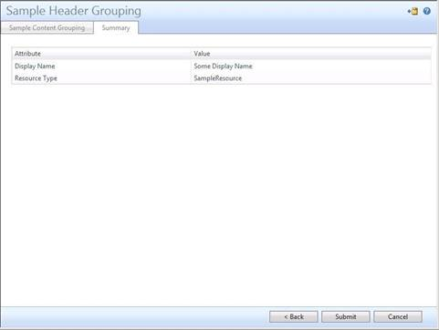

---
# required metadata

title: Resource control display configuration XML reference | Microsoft Docs
description: Using RCDC to control how MIM resources appear in the UI.
keywords:
author: billmath
ms.author: billmath
manager: daveba
ms.date: 09/26/2017
ms.topic: reference
ms.prod: microsoft-identity-manager

ms.assetid:
---

# Resource control display configuration XML reference

Resource control display configuration (RCDC) resources are user-defined resources that you can use to control how other resources in the Microsoft Identity Manager 2016 SP1 (MIM) data store appear in the user interface (UI) to the end user. Each RCDC resource contains an XML configuration file that you can change to add, modify, or remove UI text and UI controls. While MIM 2016 SP1 provides several default RCDC resources, you can also create custom RCDC resources for custom resources. For more information about using the RCDC UI in the FIM Portal, see [Introduction to Configuring and Customizing the FIM Portal](/previous-versions/mim/ee534913(v=ws.10)) in the FIM documentation.


## Known issues

The default value in many RCDC controls is not supported.

In this release, setting default values in controls in a resource control is not supported except for the option button control. You can work around this problem for a drop-down box by specifying a default value that is not associated with any value to force the user to change the selection. To work around this problem with other controls, you need to use an authorization workflow to supply a default value during submission of the request.

## Basic structure

The XML data for an RCDC resource consists of a single **ObjectControlConfiguration** XML element.

>[!NOTE]
>For the full XSD schema, see <a href="#appendix-a">Appendix A: Default XSD schema</a>.

The following is the XSD schema for the **ObjectControlConfiguration** element:

```XML
<xsd:element name="ObjectControlConfiguration"\>
  <xsd:complexType\>
    <xsd:sequence\>
      <xsd:element ref="my:ObjectDataSource" minOccurs="0" maxOccurs="32"/>
      <xsd:element ref="my:XmlDataSource" minOccurs="0" maxOccurs="32"/>
      <xsd:element ref="my:Panel"/>
      <xsd:element ref="my:Events" minOccurs="0" maxOccurs="1"/>
    </xsd:sequence>
    <xsd:attribute ref="my:TypeName"/>
    <xsd:anyAttribute processContents="lax" namespace="http://www.w3.org/XML/1998/namespace"/>
  </xsd:complexType>
</xsd:element>
```

The **ObjectControlConfiguration** element contains the following elements:

- **ObjectDataSource**: This element specifies the TypeName of a data source class that the Resource Control (RC) uses. For a description and the schema definition, see the following Data sources section in this document. An **ObjectControlConfiguration** element can contain up to 32 nodes of the **ObjectDataSource** element.

- **XmlDataSource**: This is a simple data source that is most commonly used to specify the design of a summary page. For a description and the schema definition, see the following Data sources section in this document. An **ObjectControlConfiguration**: element can contain up to 32 nodes of the **XmlDataSource** element.

- **Panel**: Administrator can customize the layout of the RCDC page by modifying elements inside the Panel elements. For more information, see the Panel section later in this document. An **ObjectControlConfiguration** element must have only one Panel element.

- **Events**: Administrators cannot provide customized code behind, this feature is limited. This is the Event that a panel or a control can emit, based on a state change. For more information, see the Events section later in this document. An **ObjectControlConfiguration** element can contain optionally one **Event** element. In general, the use of custom **Events** is not supported unless specifically developed in later enhancements.

## Data sources

Microsoft Identity Manager uses data sources as a way to bind data to UI components. This helps facilitate separation of the data from the presentation layer. There are two kinds of data sources in the RCDC resource configuration data: **ObjectDataSource** and **XmlDataSource**.

-   **ObjectDataSources** specify a Microsoft .NET class that provides the data to the RC. There is a fixed set of available types of ObjectDataSources provided that the administrator can choose to consume when authoring RCDCs.

-   **XMLDataSources** provide a simple way to structure XML-based data, and they can be used by administrators to provide customized data. The XML data must be specified directly in the RCDC, unless you use the built-in, predefined XML structure. The built-in XML structure is used for generating summary pages in the RC.

In the RCDC, you can bind these data sources to attributes of the UI controls that are specified in the RCDC to generate the UI.

### ObjectDataSource elements

Microsoft Identity manager provides the common data source types in the following table that are available for all resource types (except where noted).

| TypeName | Description | Two-way binding | Binding syntax |
|---|---|---|---|
| PrimaryResourceObjectDataSource | This represents the FIM 2010 resource that is being created, edited, or viewed. The path in the binding string is the attribute name. The resource type is specified by the TargetObjectType attribute of the RCDC rather than in the RCDC.ConfigurationData attribute. | Yes | `[AttributeName]` value of the object attribute given by its name. |
| PrimaryResourceDeltaDataSource  | This data source builds the delta XML that compares the original state and the current state of the FIM 2010 resource. The generated delta XML is consumed by the RC summary control to render the UI for request that the user is submitting. | No | `DeltaXml` This is used with the summary control to display the delta. |
| PrimaryResourceRightsDataSource | This data source provides the inline rights for each attribute of the FIM 2010 resource. This enables the RC to determine in advance of submission which permissions that user has on that attribute and then render the UI for that attribute appropriately. | No | `[AttributeName]` |
| SchemaDataSource                | This data source can be used to access schema-related information, such as display name, description, whether or not the attribute is required, as well as resource type information. | No | `[AttributeName].Required` Boolean value indicating whether the attribute must have a value to be valid. <br/> `[AttributeName].DisplayNameString` Value indicating the binding’s Display Name. <br/> `[AttributeName].DescriptionString` Value indicating the binding’s Description. <br/>`[AttributeName].StringRegexString` value that indicates String Regex of a binding. <br/> `[AttributeName].DisplayName` <br/> `[AttributeName].Description` <br/> `[AttributeName].IntegerValueMinimum` <br/>`[AttributeName].IntegerValueMaximum` <br/>`[AttributeName].LocalizedAllowedValues` |
| DomainDataSource                | This data source provides an enumeration of domains, based on the domain configuration resources. This data source can be used only in RCDCs that are for group resources and user resources. | Yes | Domain |

The following is an example RCDC snippet that binds three data sources to the
UocTextBox control to edit the Description attribute of a group:

```XML
<my:ObjectDataSource my:TypeName="PrimaryResourceObjectDataSource" my:Name="object" my:Parameters=""/>
<my:ObjectDataSource my:TypeName="SchemaDataSource" my:Name="schema"/>
<my:ObjectDataSource my:TypeName="PrimaryResourceRightsDataSource" my:Name="rights"/>

     <my:Control my:Name="Description" my:TypeName="UocTextBox" my:Caption="{Binding Source=schema, Path=Description.DisplayName}" my:RightsLevel="{Binding Source=rights, Path=Description}">
          <my:Properties>
               <my:Property my:Name="Required" my:Value="{Binding Source=schema, Path=DisplayName.Required}"/>
               <my:Property my:Name="Rows" my:Value="3"/>
               <my:Property my:Name="Columns" my:Value="60"/>
               <my:Property my:Name="MaxLength" my:Value="450"/>
               <my:Property my:Name="Text" my:Value="{Binding Source=object, Path=Description, Mode=TwoWay}"/>
          </my:Properties>
     </my:Control>
```

### XMLDataSource element

By using an **XMLDataSource** element, you can specify custom data that the RCDC can consume for a given resource. In this case, the XML data must be specified in the RCDC. As an alternative, this data source can be used to reference a built-in XML data structure to render the UI for summary pages. You control what type of **XMLDataSource** to use when you define it in the RCDC.


| TypeName | Description | Two-way binding | Binding syntax |
|---|---|---|---|
| **XMLDataSource**            | The data source represents XML data. The data can be either in XSL or embedded XSL formats:<ul><li>XSL format in Microsoft.IdentityManagement.WebUI.Controls.dll:<br/>```<my:XmlDataSource my:Name="summaryTransformXsl" my:Parameters="Microsoft.IdentityManagement. WebUI.Controls.Resources.DefaultSummary.xsl"> </my:XmlDataSource>```</li><li>Embedded XSL format:<br/>```<my:XmlDataSource my:Name="RequestStatusTransformXsl"><xsl:stylesheet version="1.0" xmlns:xsl=http://www.w3.org/1999/XSL/Transform xmlns:msxsl="urn:schemas-microsoft-com:xslt"></xsl:stylesheet></my:XmlDataSource>```</li></ul>  | No | `Xpath[;namespaces]`where `Xpath` is a valid XML xpath to select the required note, most often “/” (root). `namespaces` is an optional list of prefix=URI strings. The string is delimited by semicolons as required for the Xpath to work against the namespaced XML. |
| **ReferenceDeltaDataSource** | The data source represents deltas of multivalued reference attributes. It is used only on RCDC for Group and Set. <br/> Although the data source is not limited to Groups or Sets, it requires code changes in the RCDC host to submit such deltas. Currently, Group and Set are the only hosts that recognize this datasource.  | Yes | `[AttributeName].Add` where `[AttributeName]` represents a reference attribute and the data returned is the delta additions.<ul><li>Example: `[ReferenceAttribute].Add`</li><li>Example: `<my:Property my:Name="Value" my:Value="{Binding Source=delta, Path=ExplicitMember.Add, Mode=TwoWay}"/>`</li></ul>`[AttributeName].Remove` where `[AttributeName]` represents a reference attribute and the data returned is the delta removals. <br/> DeltaXml <!-- Is bold formatting needed for DeltaXml? --> |
|**RequestDetailsDataSource**| The data source represents the RequestParameter attribute of Request objects. The parameter sets the maximum number of attribute values to be displayed per multivalued attribute. It is used only in RCDC for Request. `<my:ObjectDataSource my:TypeName="RequestDetailsDataSource" my:Name="requestDetails" my:Parameters="1000" />`| No | DeltaXml |
|**RequestStatusDataSource**| The data source represents the **RequestStatusDetails** attribute of Request objects. It is used only in RCDC for Request. | No | DeltaXml |

To define a custom XML data source, use the following XML:

 ```XML
<my:XmlDataSource my:Name="MyCustomData" >
     %Insert custom, properly formatted XML data here%
</my:XmlDataSource>
```

To use the built-in summary control XSL, define the data source as follows:

```XML
<my:XmlDataSource my:Name="summaryTransformXsl" my:Parameters="Microsoft.IdentityManagement.WebUI.Controls.Resources.DefaultSummary.xsl" />
```

If you are creating an RCDC for a custom resource type, you can use this method to automatically render a summary page for that custom resource.

The following is an example of how to create a summary tab in the RCDC, using the **PrimaryResourceDeltaDataSource** element with the **XMLDataSource** element by using the built-in XSL:

```XML
<my:ObjectDataSource my:TypeName="PrimaryResourceDeltaDataSource" my:Name="delta" />
<my:XmlDataSource my:Name="summaryTransformXsl" my:Parameters="Microsoft.IdentityManagement.WebUI.Controls.Resources.DefaultSummary.xsl" />

<my:Grouping my:Name="summaryGroup" my:Caption="Summary” my:IsSummary="true">
     <my:Control my:Name="summaryControl" my:TypeName="UocHtmlSummary" my:ExpandArea="true">
          <my:Properties>
               <my:Property my:Name="ModificationsXml" my:Value="{Binding Source=delta, Path=DeltaXml}" />
              <my:Property my:Name="TransformXsl" my:Value="{Binding Source=summaryTransformXsl, Path=/}" />
          </my:Properties>
     </my:Control>
</my:Grouping>
```

As an alternative, the user can replace the XmlDataSource element specified previously with the following format to define a customized layout of a summary page. As a reference, the default FIM 2010 Summary XSL is included in Appendix B: Default Summary XSL, later in this document.

```XML
<my:XmlDataSource my:Name="summaryTransformXsl">
     Insert valid XSL code here
</my:XmlDataSource>
```
### Schema for data sources
The following XSD schema generates the two types of data sources:

```XML
<xsd:element name="ObjectDataSource">
     <xsd:complexType>
          <xsd:sequence/>
          <xsd:attribute ref="my:TypeName"/>
          <xsd:attribute ref="my:Name"/>
          <xsd:attribute ref="my:Parameters"/>
     </xsd:complexType>
</xsd:element>
<xsd:element name="XmlDataSource">
     <xsd:complexType  mixed="true">
          <xsd:sequence>
              <xsd:any minOccurs="0" maxOccurs="unbounded" processContents="lax"/>
          </xsd:sequence>
          <xsd:attribute ref="my:Name"/>
          <xsd:attribute ref="my:Parameters"/>
    </xsd:complexType>
</xsd:element>
```

## Event element
An **Event** element defines the changing state of a Control. The extensibility of this feature is limited because you cannot write a customized function (Handler) to define what the behavior is after an event is triggered. The same Event element can be used in the Panel element. For more information, see the Panel section later in this document.

The following is the XSD schema for the Event element:

```XML
<xsd:element name="Events">
     <xsd:complexType>
          <xsd:sequence>
               <xsd:element ref="my:Event" minOccurs="1" maxOccurs="16"/>
          </xsd:sequence>
     </xsd:complexType>
</xsd:element>
<xsd:element name="Event">
     xsd:complexType>
          <xsd:simpleContent>
               <xsd:extension base="xsd:string">
                    xsd:attribute ref="my:Name"/>
                    <xsd:attribute ref="my:Handler"/>
               </xsd:extension>
          </xsd:simpleContent>
     </xsd:complexType>
     </xsd:element>
```

An **Event** is an empty element, and it has the following attributes:

- **Name**: This is the unique name of an event. The only supported event in the **ObjectControlConfiguration** is the Load event. This event is triggered when the page is first loaded.

- **Handler**: This is the unique name of a handler. When the event is triggered, usually a program method is called to handle the change of the state of the control. The following cases are not supported:

   - Removing an existing handler from an existing control.
   - Creating a new handler.
   - Attaching a handler to an existing or new control.

The following is an example of an **Events** element:

```XML
<my:Events>
    <my:Event my:Name="Load" my:Handler="OnLoad"/>
</my:Events>
```

## Panel element
The **Panel** element is the core element in an RCDC layout. The following is the XSD schema for the Panel element:

```XML
<xsd:element name="Panel">
     <xsd:complexType>
          <xsd:sequence>
               <xsd:element ref="my:Grouping" minOccurs="1" maxOccurs="16"/>
          </xsd:sequence>
          <xsd:attribute ref="my:Name"/>
          <xsd:attribute ref="my:DisplayAsWizard"/>
          <xsd:attribute ref="my:Caption"/>
          <xsd:attribute ref="my:AutoValidate"/>
     </xsd:complexType>
</xsd:element>
```

The **Panel** element contains a recurring element, **Grouping**. For more information, see the Grouping section in this document.

The Panel element has the following attributes:

- **Name**: The name of the Panel. This is a required, string-type attribute.

- **DisplayAsWizard**: This attribute is currently deprecated. The corresponding VerbContext attribute on the RCDC governs if the resource layout is in Wizard mode or Tab mode. If it is set to 0 (Create mode), it is also in Wizard mode. Otherwise, it is in Tab mode. For more information, see Introduction to Configuring and Customizing the FIM Portal in the documentation.

- **Caption**: This attribute is currently deprecated. The user can specify captions for a page by including a Group that contains only header information. For more information, see the Grouping section in this document.

- **AutoValidate**: This is an optional Boolean attribute. When it is set to true validation is triggered against each control on the current tab. By default, if the attribute is missing, it is set to true. It can be used in combination with the RegularExpression property. For more information, see “RegularExpression” in a later section of this document.

## Grouping element
The **Grouping** element defines the overall layout of a Panel. It acts as a container that groups together individual controls into different sections and tabs. The following is the XSD schema for the Grouping element:

```XML
<xsd:element name="Grouping">
     <xsd:complexType>
          <xsd:sequence>
               <xsd:element ref="my:Help" minOccurs="0"  maxOccurs="1"/>
               <xsd:element ref="my:Control" minOccurs="1" maxOccurs="256"/>
               <xsd:element ref="my:Events" minOccurs="0" maxOccurs="1"/>
          </xsd:sequence>
          <xsd:attribute ref="my:Name"/>
          <xsd:attribute ref="my:Caption"/>
          <xsd:attribute ref="my:Description"/>
          <xsd:attribute ref="my:Enabled"/>
          <xsd:attribute ref="my:Visible"/>
          <xsd:attribute ref="my:IsHeader"/>
          <xsd:attribute ref="my:IsSummary"/>
     </xsd:complexType>
</xsd:element>
```

There are three types of **Grouping** element:

- **Header Grouping**: A Header Grouping is optional. There can only be one Header Grouping in a **Panel**. A Header Grouping appears on top of a panel as caption. Only one UocCaptionControl can be used in this grouping. For an example of a Header Grouping, see the Sample section.

- **Content Grouping**: At least one Content Grouping is required. There can be multiple Content Groupings in a Panel. A Content Grouping appears as the main content of an RCDC page. Each Content Grouping appears as a tab in the same Panel and can hold from 1 to 256 controls. See the Examples section for an example of a **Content Grouping**.

- **Summary Grouping**: A Summary Grouping is optional. There can only be one Summary Grouping in a Panel. A Summary Grouping appears as the last tab of a Panel. Only one **UocHtmlSummary** control can be used in a Summary Grouping to display the changes that the user has made before submitting a request. See the Examples section for an example of a Summary Grouping.

Each Grouping type contains the following elements:

- **Help**: This element provides Help text in a tab. You can also use it to add a link to a Help file for the tab.

- **Controls**: For information about this element, see the Control section in this document. Each grouping must have 1 to 256 controls inclusively, depending on the type of the grouping.

- **Events**: For information about this element, see the Events section in this document. Each grouping can, as an option, have one Event. The Events that are supported in a Grouping element are as follows:

    - **BeforeLeave**: This Event is triggered when the user is ready to leave a tab in a content grouping.
    - **AfterEnter**: This Event is triggered when the user is ready to enter a tab in a content grouping.

A Grouping can contain the following seven attributes:

- **Name**: This is the required name of the Grouping. The **Name** must be unique within the **Panel**.

- **Caption**: The **Caption** appears as the header caption in a Header Grouping. It appears as the tab caption of a Content or Summary grouping.

- **Description**: An optional string attribute, **Description** is functional only when it is used in a Content Grouping. Use this element to give the end user some detail about the information within the same tab.

    >[!NOTE]
    >If this attribute is used in a Summary Grouping, the XML is considered to be
    invalid. If this attribute is used in a Header Grouping, the XML is considered to be valid but ignored.
    >

- **Enabled**: An optional Boolean attribute, Enabled is set to true when it is missing. If Enabled is set to false, the end user sees a Disabled tab. This attribute is functional only in a Content grouping.

    >[!NOTE]
    >If this attribute is used in a Summary Grouping, the XML is considered to be invalid. If this attribute is used in a Header Grouping, the XML is considered to be valid but ignored.
    >

- **Visible**: You can hide an RCDC page tab or its heading by setting this attribute to false. By default, this optional, Boolean-type attribute is set to true. This attribute is functional only on a Content Grouping.

    >[!NOTE]
    >When there is only one Content Grouping in a Panel, this feature does not work. When there is more than one Content Grouping in a Panel, it behaves as previously described.

- **IsHeader**: This attribute is an optional, Boolean attribute that defines whether the Grouping is a Header Grouping. If this attribute is not specified, it is set to false.

- **IsSummary**: This is an optional, Boolean attribute that defines whether the Grouping is a Summary grouping. If this attribute is not specified, it is set to false.

### Examples for types of Grouping elements
This section contains examples for the Groupings element.

#### Example: Header Grouping
The following figure shows a sample Header Grouping:


The following XML generates a sample Header Grouping. In the XML, the Header Grouping is the area with the caption text "Sample Header Grouping."

```XML
<!--Sample for a Header Grouping-->
<my:Grouping my:Name="HeaderGroupingSample" my:IsHeader="true">
     <my:Control my:Name="SampleHeaderCaption" my:TypeName="UocCaptionControl" my:ExpandArea="true" my:Caption="Sample Header Grouping">
          <my:Properties>
               <my:Property my:Name="MaxHeight" my:Value="32"/>
               <my:Property my:Name="MaxWidth" my:Value="32"/>
          </my:Properties>
      </my:Control>
</my:Grouping>
<!--End of Header Grouping Sample-->
```

#### Example: Content Grouping
The following figure shows a sample Content Grouping:


The following XML generates a sample Content Grouping. In the XML, the Content Grouping is the area with the caption text "Sample Content Grouping."

```XML
<!--Sample for a Content Grouping-->
<my:Grouping my:Name="ContentGroupingSample" my:Caption="Sample Content Grouping" my:Description="Some description for content grouping">
     <my:Control my:Name="DisplayName" my:TypeName="UocTextBox" my:Caption="Display name" my:Description="This is the display name of the set.">
          <my:Properties>
               <my:Property my:Name="Required" my:Value="True"/>
               <my:Property my:Name="MaxLength" my:Value="128"/>
               <my:Property my:Name="Text" my:Value="{Binding Source=object, Path=DisplayName, Mode=TwoWay}"/>
          </my:Properties>
     </my:Control>
</my:Grouping>
<!--End of Content Grouping Sample-->
```

#### Example: Summary Grouping

The following figure shows a sample Summary Grouping:



The following XML generates a sample Summary Grouping. In the XML, the Summary Grouping is the area with the caption text "Sample Summary Grouping."

```XML
<!--Sample for a Summary Grouping-->
<my:Grouping my:Name="Summary" my:Caption="Sample Summary Grouping" my:IsSummary="true">
     <my:Control my:Name="SummaryControl" my:TypeName="UocHtmlSummary" my:ExpandArea="true">
          <my:Properties>
               <my:Property my:Name="ModificationsXml" my:Value="{Binding Source=delta, Path=DeltaXml}"/>
               <my:Property my:Name="TransformXsl" my:Value="{Binding Source=summaryTransformXsl, Path=/}"/>
          </my:Properties>
     </my:Control>
</my:Grouping>
<!--End of Summary Grouping Sample-->
```

### Help element
The **Help** element can be included in a Grouping or a Control element as an optional element. If it is used in a Grouping, it must be the first element used. It provides textual Help to the end users to help them provide accurate information. The following XSD schema is for the Help element:

```XML
<xsd:element name="Help">
     <xsd:complexType>
          <xsd:sequence/>
          <xsd:attribute ref="my:HelpText"/>
          <xsd:attribute ref="my:Link"/>
     </xsd:complexType>
</xsd:element>
```

The following XML sample code generates a Help element:

```XML
<my:Help my:HelpText="Some Help Text for Group Basic Info" my:Link="03e258a0-609b-44f4-8417-4defdb6cb5e9.htm#bkmk_grouping_GroupingBasicInfo" />
```

### Control element
A Grouping element contains one or more **Control** elements. Controls are the main elements in an RCDC. You can customize the Grouping element by defining the different Control elements that it contains. The following XSD schema is for the Control element:

```XML
<xsd:element name="Control">
     <xsd:complexType>
          <xsd:sequence>
               <xsd:element ref="my:Help" minOccurs="0"  maxOccurs="1"/>
               <xsd:element ref="my:CustomProperties" minOccurs="0"  maxOccurs="1"/>
               <xsd:element ref="my:Options" minOccurs="0"  maxOccurs="1"/>
               <xsd:element ref="my:Buttons" minOccurs="0"  maxOccurs="1"/>
               <xsd:element ref="my:Properties" minOccurs="0"  maxOccurs="1"/>
               <xsd:element ref="my:Events" minOccurs="0" maxOccurs="1"/>
          </xsd:sequence>
          <xsd:attribute ref="my:Name"/>
          <xsd:attribute ref="my:TypeName"/>
          <xsd:attribute ref="my:Caption"/>
          <xsd:attribute ref="my:Enabled"/>
          <xsd:attribute ref="my:Visible"/>
          <xsd:attribute ref="my:Description"/>
          <xsd:attribute ref="my:ExpandArea"/>
          <xsd:attribute ref="my:Hint"/>
          <xsd:attribute ref="my:AutoPostback"/>
          <xsd:attribute ref="my:RightsLevel"/>
     </xsd:complexType>
</xsd:element>
```

A Control element contains the following elements:

- **Help**: This element is ignored. It functions only in Grouping.

- **CustomProperties**: This element is not supported.

- **Options**: This element is used only in combination with the **UocDropDownList** or **UocRadioButtonList** Controls. It is not functional with any other Controls. See the Options section in this document for the structure of this element. See the Individual controls section of this document to see how Options are used by a control.

- **Buttons**: This element is used only in combination with the **UocListView** Control. It is not functional for any other controls. For more information, see the UocListView section in this document.

- **Properties**: This element is used in all Controls to specify additional behaviors of a Control. For information about this element, see the Properties section in this document.

- **Events**: For the structure of this element, see the Events section earlier in this document. See the Individual controls section of this document to see which events are used in a control.

A Control element can contain the following 10 attributes:

- **Name**: This is the Name of the control. The name of a Control must be unique within each panel. This is a required, string-type attribute.

- **TypeName**: This attribute specifies what type of Control it is. This is a required, string-type attribute. See the Individual Controls section in this document for each control name.

- **Caption**: You can use this attribute to include a caption for the control. The caption is usually the display name of the data that the control is displaying or inputting. You can explicitly specify a value for the caption or bind it with schema attribute display name information. The caption appears on the leftmost side of a normal-sized control. If a control is spanning the full screen, the caption appears over the control. This is an optional, string-type attribute. For information about how to bind a data source with an attribute or a property value, see the Properties section.

    The following example shows how a caption can be used explicitly:

    ```XML
      <my:Control my:Name="ExplicitAlias" my:TypeName="UocTextBox" my:Caption="Explicit Alias">…<my:Control/>
    ```

    The following example show how a caption can be used with a data source. If you have used the template for a data source shown earlier in this document, your data source is schema. We recommend that you bind the attribute’s DisplayName with a Caption attribute.

    ```XML
    <my:Control my:Name="DynamicAlias" my:TypeName="UocTextBox" my:Caption="{Binding Source=schema, Path=Alias.DisplayName, Mode=OneWay}">…<my:Control/>
    ```

- **Enabled**: This is an optional, Boolean-type attribute. By setting this attribute value to false, the user can disable a Control. The default value is set to true.

- **Visible**: This is an optional, Boolean-type attribute. You can use this attribute to hide the whole control. The default value is set to true.

- **Description**: Use this optional, string-type attribute to include a description to help the end user understand what they should put in the control or what the control does. You can explicitly specify a value for the description or bind it with the schema attribute description information.

    The Description appears on the leftmost side of a normal-sized control underneath the caption. If a control is spanning the full screen, the description appears on the top of the control underneath the caption. For information about how to bind a data source with an attribute or a property value, see the Properties section in this document.

    The following example shows how a Description can be used explicitly:

    ```XML
    <my:Control my:Name="ExplicitAlias" my:TypeName="UocTextBox" my:Caption="Explicit Alias" my:Description="This is explicit description.">…<my:Control/>
    ```

    This example shows how a Description can be used with a data source. If you have used the template for a data source shown earlier in this document, your data source is **schema**. We recommend that you bind the attribute’s **Description** with a Description attribute.

    ```XML
    <my:Control my:Name="DynamicAlias" my:TypeName="UocTextBox" my:Caption="{Binding Source=schema, Path=Alias.DisplayName, Mode=OneWay}" my:Description="{Binding Source=schema, Path=Alias.Description, Mode=OneWay}">…<my:Control/>
    ```

- **ExpandArea**: This attribute indicates whether the control spans the full screen. This is an optional, Boolean-type attribute. The default value is set to false.

    >[!NOTE]
    >The Caption and Description attributes are disabled when this attribute is set to true. Use the UocLabel control to provide a caption for an expanded control.
    >

- **Hint**: This is an optional, string-type attribute. The text in the Hint attribute helps the end user decide what is a valid input for the control. The Hint appears underneath the control.

- **AutoPostback**: This is an optional, Boolean-type attribute. The default value is false. If set to false, refreshing the page may not refresh the control. For information about AutoPostback, look for the Microsoft ASP.NET UI control property of the same name.

- **RightsLevel**: This is an optional, string-type attribute. You can bind this attribute only with inline rights with a data source. The control is dynamically turned on or disabled, based on the user’s rights. For information about how to bind data sources with an attribute or a property value, see the Properties section in this document.

    This example shows how a **RightsLevel** attribute can be used with a data source. If you have used the template for a data source shown earlier in this document, your data source is **rights**. Use the attribute name as the Path.
    <!--- no example provided -->

### Property element
You can use a **Property** element to further customize the behavior of each control. A Property is an empty element. The following XSD schema is for the Property element:

```XML
<xsd:element name="Properties">
     <xsd:complexType>
          <xsd:sequence>
               <xsd:element ref="my:Property" minOccurs="1" maxOccurs="32"/>
          </xsd:sequence>
     </xsd:complexType>
</xsd:element>
<xsd:element name="Property">
     <xsd:complexType>
          <xsd:simpleContent>
               <xsd:extension base="xsd:string">
                    <xsd:attribute ref="my:Name"/>
                    <xsd:attribute ref="my:Value"/>
               </xsd:extension>
          </xsd:simpleContent>
     </xsd:complexType>
</xsd:element>
```

Every Property has the following two required attributes:

- **Name**: This string-type attribute is the unique name of the Property. Different controls have different properties. There are some common properties that can be used by all controls. For more information about what names are available for a given control, see the Common properties and Individual controls sections of this document.

- **Value**: This is the value of the Property. The data type of the value dependents on which property it is assigned to. See the following section for the allowed value format for specific properties.


#### Bind Property with data source content
Some properties can be bound with information from a data source. Use the following string format to make this binding. See the description for the individual properties in the Individual controls section of this document to learn how to bind properties with a data source.

```
<my:Property my:Name="Required" my:Value="[Formatted String]"/>

   Formatted String :=  “{Binding “ + [SourceExpression] + “,” + [PathExpression] + “,” + [ModeExpression]? + “}

   SourceExpression:= “Source=” + [ObjectDataSourceName]

   PathExpression:= “Path=” + [AttributeName]|[AttributePropertyName]

   ModeExpression:= “Mode=” + [ModeChoice]

   ModeChoice:= “OneWay”|”TwoWay”

   ObjectDataSourceName:= The value of any string assign to node /ObjectControlConfiguration/ObjectDataSource/Name.

   AttributeName:= valid schema attribute name from the data source.

   AttributePropertyName:= valid property name of a schema attribute from the data source.
```

The following XML shows how to bind a data source to a **Property** element:

```XML
<my:Property my:Name="Text" my:Value="{Binding Source=object, Path=DisplayName, Mode=TwoWay}"/>
<my:Property my:Name="Required" my:Value="{Binding Source=schema, Path=DisplayName.Required}"/>
```


<h2 id="common-properties">Common properties</h2>

All RCDC controls that are specified in this document can have the common properties that are described in this section. You can use these Properties along with other Properties that are specific to different controls.

- **Required**: This property indicates that the field is either a required field or an optional field. A required field must be filled with a value. An empty value is not supported for string input. An optional field can be left empty. If this field is a required field with no value filled in, an error message appears on top of the input control. You can explicitly specify whether a field is required or optional. You can also bind the field with the schema information of a given binding between an attribute and a resource type. By default, if this property is missing, it means that the control is an optional input control.

    The following example uses an explicit value for this property:

    ```XML
    <my:Property my:Name="Required" my:Value="True"/>
    ```

    This is an example that uses a dynamic data source for this property. If you have used the template for a data source shown in the previous section of this document, your data source is schema. Use `<attribute name>.Required` as the Path.

    ```XML
    <my:Property my:Name="Required" my:Value="{Binding Source=schema, Path=DisplayName.Required}"/>
    ```

- **ReadOnly**: By setting this property to true, the end user experiences the control in a read-only mode. This is an optional, Boolean-type attribute. The default value is set to false. However, sometimes the behavior of this property is overwritten by the type of rights a person has on the data bind with the control. For example, if a user does not have rights to update a field and the field is bound with inline rights, the user sees the data in a read-only mode even this property is set to false.

- **RegularExpression**: This property specifies restrictions that are imposed on the value in the control. The formats of this property value are the formats that are supported in the .NET StringRegex standard. For more information, see [.NET Framework Regular Expressions](https://go.microsoft.com/fwlink/?LinkId=165361). If the control is used to input a value, the value is checked against the restriction that is specified in this property when the user attempts to leave the current page. The error message appears on top of the control that has invalid input. The user can explicitly specify a string regular expression. The user can also bind it with schema information of a given attribute. By default, if this property is missing, it means that the control does not check for any restrictions on input strings.

    The following example uses an explicit value for this property:

    ```XML
    <my:Property my:Name="RegularExpression" my:Value="[A-Z]*"/>
    ```

    This is an example that uses a dynamic data source for this property. If you have used the template for a data source shown previously in this document, your data source is schema. Use the `<attribute name>.StringRegex` as the Path.

    ```XML
    <my:Property my:Name="RegularExpression" my:Value="{Binding Source=schema, Path=Alias.StringRegex, Mode=OneWay}"/>
    ```

- **Visible**: This is an optional, Boolean-type attribute. You can use this attribute to hide the whole control. The default value is set to true.


<h3 id="options-element">Options element</h3>

The Options element includes one or more **Option** subnodes. The **Options** element is used only with the **UocRadioButtonList** and **UocDropDownList** controls. For details about how to use these controls, see the Individual controls section of this document.

The following XSD schema is for the Options element:

```XML
<xsd:element name="Options">
     <xsd:complexType>
          <xsd:sequence>
               <xsd:element ref="my:Option" minOccurs="0" maxOccurs="unbounded"/>
          </xsd:sequence>
     </xsd:complexType>
</xsd:element>
<xsd:element name="Option">
     <xsd:complexType>
          <xsd:simpleContent>
               <xsd:extension base="xsd:string">
                    <xsd:attribute ref="my:Value"/>
                    <xsd:attribute ref="my:Caption"/>
                    <xsd:attribute ref="my:Hint"/>
               </xsd:extension>
          </xsd:simpleContent>
     </xsd:complexType>
</xsd:element>
```

The **Options** element has the following attributes:

- **Value**: This is a required attribute of string type. The value attribute must be unique within the same control. Only A through Z, case-insensitive characters can be used.

- **Caption**: This required attribute is the display name of each Option.

- **Hint**: This is an optional attribute. Use this attribute to provide more information and hints to the end user.


## Environment variables

The following environment variables can be used in any RCDC configuration:

| Variable | Description |
|---|---|
| `<LoginID>`       | Displays the ID of the user who is currently logged in.           |
| `<LoginDomain>`   | Displays the domain of the user who is currently logged in.       |
| `<Today>  `       | Displays the current date and time                                |
| `<FromToday_nnn>` | Displays the current date, plus `nnn` and the time, where `nnn` is an integer.  |
| `<ObjectID> `     | The RCDC primary resource ID.                                     |
| `<Attribute_xxx>` | Returns a specified attribute, xxx, of the RCDC primary resource. |


## Debug XML configuration files

When you are developing or modifying XML configuration files for an RCDC, you can help reduce errors by validating the XML against XSD files by using an editor such as Microsoft Visual Studio. For more information, see [An Introduction to the XML Tools in Visual Studio 2005](https://go.microsoft.com/fwlink/?LinkID=74512).


## Customize Help files

If you create new resources and attributes, you may want to update the existing Help files in the FIM Portal with content for your customized resources. Help files in the FIM Portal are in .htm format, and they can be edited manually. For more information about creating custom attributes, see Introduction to Custom Resource and Attribute Management in the FIM 2010 documentation.

>[!IMPORTANT]
>Information about the basics of formatting or editing HTML is not provided in this article. Users are expected to know how to edit HTML files.

### Location of Help files
All the Help files for the Microsoft Identity Manager 2016 SP1 Portal are located in the folder `<ProgramFiles>\Common Files\Microsoft Shared\Web Server Extensions\12\Template\Layouts\MSILM2\Help\1033\html` on the MIM service server.

### Locate a specific Help file
All the Help files for the FIM Portal are named with a globally unique identifier (GUID). To locate the correct file for your custom resource:

1. In the FIM Portal, open the Help file on the Portal page that you want to customize.

2. Right-click the Help file and select **Properties**.

3. Highlight and copy the `<GUID\>.htm` file in the **URL Address** field.

4. Browse to the folder where the Help files are stored and search for the file.


## Add content for attribute in existing Grouping element
To add descriptive content for a new attribute within an existing Grouping element (tab):

1. Identify and locate the appropriate Help file.

2. Using an HTML editor, open the file.

3. Locate where you want to add the content. Typically, this is in an additional paragraph, for example:

    `<p xmlns="">A new paragraph with customized information.</p>`

    It may also be an item inserted into an existing list, for example:

    ```
    <li class="unordered"><b>First Name</b> – The first name of the User.<br>
    <li class="unordered"><b>Last Name</b> - The last name of the User.<br>
    <li class="unordered"><b>Added a new line</b><br>
    ```

## Add content for existing Grouping element
The majority of FIM Portal pages have multiple Grouping elements (or tabs), and the accompanying Help files have bookmarked sections that relate to each Grouping element. The bookmarks in the HTML are specified in the sections. For example, this is the HTML for the Work Info tab from the Help file for the Create User page in the FIM Portal:

```
<a name="bkmk_grouping_WorkInfo" xmlns=""></a><h3 class="subHeading" xmlns="">Work Info</h3><p class="subHeading" xmlns=""></p><div class="subSection" xmlns="">
```

It is referenced by the Grouping element **WorkInfo** in the Configuration Data XML file for the **Configuration for User Creation** RCDC. The `\<GUID\>.htm` file name and the bookmark are specified in the `my:Link` parameter:

```
<my:Grouping my:Name="WorkInfo" my:Caption="%SYMBOL_WorkInfoTabCaption_END%" my:Enabled="true" my:Visible="true"> <my:Help my:HelpText="%SYMBOL_WorkInfoTabHelpText_END%" my:Link="5e18a08b-4b20-48b8-90c6-c20f6cbeeb44.htm#bkmk_grouping_WorkInfo"/>
```

### Simple control samples
This section provides samples for creating different simple text-box controls.

The following figure shows some simple text-box controls in different modes:


The following code segment creates the first text-box control, which uses explicit text for all attributes and properties:

```
<!-- Sample for a simple control to use explicit information. (with hints)-->
<my:Control my:Name="ExplicitControl" my:TypeName="UocTextBox" my:Caption="Explicit Control" my:Description="This is explicit description." my:Hint="This is a Hint (enter any text).">
     <my:Properties>
          <my:Property my:Name="Required" my:Value="True"/>
          <my:Property my:Name="RegularExpression" my:Value="[A-Z]*"/>
          <my:Property my:Name="Text" my:Value="Enter Information Here"/>
     </my:Properties>
</my:Control>
<!-- End of Sample for a simple control to use explicit information.-->
```

The following code segment creates the second text-box control, which uses dynamic binding technique to link the control with a different data source:

```
<!-- Sample for a simple control to use stored data information.-->
<my:Control my:Name="DynamicControl" my:TypeName="UocTextBox" my:Caption="{Binding Source=schema, Path=DisplayName.DisplayName, Mode=OneWay}" my:Description="{Binding Source=schema, Path=DisplayName.Description, Mode=OneWay}" my:RightsLevel="{Binding Source=rights, Path=DisplayName, Mode=OneWay}">
     <my:Properties>
          <my:Property my:Name="Required" my:Value="{Binding Source=schema, Path=DisplayName.Required, Mode=OneWay}"/>
          <my:Property my:Name="RegularExpression" my:Value="{Binding Source=schema, Path=DisplayName.StringRegex, Mode=OneWay}"/>
          <my:Property my:Name="Text" my:Value="{Binding Source=object, Path=DisplayName, Mode=TwoWay}"/>
     </my:Properties>
</my:Control>
<!-- End of Sample for a simple control to use stored data information.-->
```

The following code segment creates the third expanded label and text-box control:

```
<!-- Sample for a simple expanded control with caption control.-->
<my:Control my:Name="SampleExpandLabel" my:TypeName="UocLabel" my:ExpandArea="true">
     <my:Properties>
          <my:Property my:Name="Text" my:Value="This is an expanded control."/>
     </my:Properties>
</my:Control>
<my:Control my:Name="ExpandedControl" my:TypeName="UocTextBox"
          my:ExpandArea="true">
     <my:Properties>
          <my:Property my:Name="Required" my:Value="false"/>
          <my:Property my:Name="Columns" my:Value="40"/>
          <my:Property my:Name="Text" my:Value="Expanded control (enter text)"/>
     </my:Properties>
</my:Control>
<!-- End of Sample for a simple expanded control.-->
```

The following code segment creates the fourth disabled text-box control. Although this control does not display a visible difference between the disabled state and the enabled state, the user can no longer enter data in the text box.

```
<!-- Sample for a simple disabled control.-->
<my:Control my:Name="DisabledControl" my:TypeName="UocTextBox" my:Caption="Disabled Control" my:Description="This is disabled simple control." my:Enabled="false">
     <my:Properties>
          <my:Property my:Name="Required" my:Value="false"/>
          <my:Property my:Name="MaxLength" my:Value="128"/>
          <my:Property my:Name="Text" my:Value="Disabled control"/>
     </my:Properties>
</my:Control>
<!-- End of Sample for a simple disabled control.-->
```


## Individual controls

This section documents the individual controls that are provided with Microsoft Identity Manager 2016 SP1.

### UocButton

**Name**: UocButton

**Description**: This is a simple button control that you can use to trigger certain actions. However, because you cannot specify your own handler the use of this control is limited.

**Properties**:

- All common properties: For information about these properties, see <a href="#common-properties">Common properties</a>.

- **Text**: This property specifies the text that appears on the button. This is an optional, string-type attribute. The text takes an explicit string value.

**Events**:

- **OnButtonClicked**: The event is emitted when the button is clicked.

**Example**:


The following XML segment produces a simple UocButton control button:

```
<!--Sample enabled simple button control-->
<my:Control my:Name="ButtonControl" my:TypeName="UocButton" my:Caption="SampleButton" my:Description="This is a simple button."
my:Hint="Click the button">
     <my:Properties>
          <my:Property my:Name="Required" my:Value="True"/>
          <my:Property my:Name="Text" my:Value="Click Me"/>
     </my:Properties>
</my:Control>
<!--End of sample enabled simple button control -->
```


### UocCaptionControl

**Name**: UocCaptionControl

**Description**: This control is used to display the caption of an RCDC page. This control is designed to only be used as a single control in a Header Grouping. Using it in any other context may cause rendering issues or portal errors.

**Mode**: Read only (OneWay)

**Properties**:

- All common properties: For information about these properties, see <a href="#common-properties">Common properties</a>.

- **MaxHeight:** This property specifies the maximum height of the icon in the caption section. This property is optional. This property takes an integer value in pixels. The default value is 32 pixels.

**Events**:

- There are no events for this control.

**Example**:


The following code segment generates a **Header Caption**:

```
<!--Sample header caption control-->
<my:Control my:Name="SampleHeaderCaption" my:TypeName="UocCaptionControl" my:ExpandArea="true" my:Caption="Header Caption" my:Description="Description Starts here.">
     <my:Properties>
          <my:Property my:Name="MaxHeight" my:Value="32"/>
          <my:Property my:Name="MaxWidth" my:Value="32"/>
     </my:Properties>
</my:Control>
<!--End of sample header caption control-->
```

The following code segment generates an **Explicit Content Caption**:

```
<my:Control my:Name="SampleContentCaption" my:TypeName="UocCaptionControl" my:ExpandArea="true" my:Caption="Sample Explicit Content Caption" my:Description="Explicit content caption with smaller icon">
     <my:Properties>
          <my:Property my:Name="MaxHeight" my:Value="20"/>
          <my:Property my:Name="MaxWidth" my:Value="20"/>
     </my:Properties>
</my:Control>
<!--End of sample caption-->
```

The following code segment generates a **Display Name** dynamic caption:

```
<!--Sample content dynamic caption-->
<my:Control my:Name="Caption3" my:TypeName="UocCaptionControl" my:Caption="{Binding Source=schema, Path=DisplayName.DisplayName, Mode=OneWay}" my:Description="{Binding Source=schema, Path=DisplayName.Description, Mode=OneWay}"/>
<!--End of sample caption -->
```


### UocCheckBox

**Name**: UocCheckBox

**Description**: This is a simple check-box control. We recommend that the user binds this control with Boolean-type data. This control can be used as a read-only control or an updatable control, based on the data that it binds to.

>[!NOTE]
>In this release, when using the check box control in the edit mode to display a Boolean attribute, if the attribute does not have a value previously assigned to it, the Resource Control adds a value of **false** to the attribute when **OK** is clicked in edit mode. The work-around is to always create a Boolean attribute that assumes that non-existence is the same as **false**, or use other controls such as a radio button for Boolean attributes.

**Properties**:

- All common properties: For information about these properties, see <a href="#common-properties">Common properties</a>.

- **DefaultValue**: This is an optional, Boolean-type property. The default value is set to false. This field specifies the default behavior of a check box. This can be specified explicitly.

- **Checked**: This is an optional, Boolean-type property. The default value is set to false. This value overwrites the DefaultValue property when it is present along with DefaultValue. This field specifies the behavior of a check box. Like DefaultValue, this can be specified explicitly or bound with data from the server.

- **Text**: This is an optional, string-type attribute. The text is shown on the right of the check box. You can use this property to specify text that provides more information to the end user.

**Events**:

- **CheckedChanged**: When the check box changes its state, this event is emitted.

**Example**:

In the following example, a custom binding is created between the custom resource type and the attribute **IsConfigurationType**. The XML is used in the RCDC of a custom resource type.


The following code segment produces a **dynamic check box**, as shown as Dynamic Check Box in the previous figure. This type of binding is more versatile and useful than an explicit check box. The attribute must belong to the current resource type.

```
<!--Sample dynamic check box-->
<my:Control my:Name="SampleDynamicCheckBox" my:TypeName="UocCheckBox" my:Caption="Dynamic Check Box" my:Description="This is a dynamic check box. It saves to data source." my:RightsLevel="{Binding Source=rights, Path=IsConfigurationType}">
     <my:Properties>
          <my:Property my:Name="Text" my:Value="{Binding Source=schema, Path=IsConfigurationType.DisplayName, Mode=OneWay}"/>
          <my:Property my:Name="Checked" my:Value="{Binding Source=object, Path=IsConfigurationType, Mode=TwoWay}"/>
     </my:Properties>
</my:Control>
<!--End of sample dynamic check box -->
```


### UocCommonMultiValueControl

**Name**: UocCommonMultiValueControl

**Description**: This is a multiline text-box control that supports special string formatting. Each value among the multivalued entries is separated from each other by a semicolon (;) or a line break in the text box. We recommend binding this control with data of multivalued, short string, and integer types. This control supports both read-only mode and updatable mode.

**Properties**:

- All common properties: For information about these properties, see <a href="#common-properties">Common properties</a>.

- **DataType**: This is a required, string-type attribute. You can specify this as a **String, Integer**, or **DateTime** type explicitly. You can also bind attribute with the schema attribute’s **DataType** property. A Multivalued Reference type should be handled by **UOCListView** or **UOCIdentityPicker**. Multivalued Boolean is not a supported data type.

- **Rows**: This is an optional, integer-type attribute. You can define the height of the box in number of characters. The default value is set to 1.

- **Columns**: This is an optional, integer-type attribute. You can define how many wide the box is in number of characters. The default value is set to 20.

- **Value**: This is an optional, string-type attribute. You can bind this attribute only with data source.

**Events**:

- **ValueListChanged**: This event is triggered when the current value in the control changes.

**Example:**

In the following example, a multivalued string attribute named **AMultiValueString** is created and bound to the custom resource type. This example works only after this binding is created.


The following code segment generates a **UocCommonMultiValueControl** control:

```
<!--Sample multivalue control-->
<my:Control my:Name="SampleDynamicMultiValueControl" my:TypeName="UocCommonMultiValueControl" my:Caption="{Binding Source=schema, Path=AMultiValueString.DisplayName, Mode=OneWay}" my:Description="{Binding Source=schema, Path=AMultiValueString.Description, Mode=OneWay}" my:RightsLevel="{Binding Source=rights, Path=AMultiValueString}">
     <my:Properties>
          <my:Property my:Name="Rows" my:Value="6"/>
          <my:Property my:Name="Columns" my:Value="60"/>
          <my:Property my:Name="DataType" my:Value="String"/>
          <!--not supported for above property my:Value={Binding Source=schema, Path=AMultiValueString.DataType, Mode=OneWay}"/>-->
          <my:Property my:Name="Value" my:Value="{Binding Source=object, Path=AMultiValueString, Mode=TwoWay}"/>
     </my:Properties>
</my:Control>
<!--End of sample multivalue control -->
```


### UocDateTimeControl

**Name**: UocDateTimeControl

**Description**: This is similar to a text-box control, but **Description** accepts only a certain format. In read-only mode, it appears like a label. For the format of the input string that is supported, see the **DateTimeFormat** property in this section.

**Properties**:

- All common properties: For information about these properties, see <a href="#common-properties">Common properties</a>.

- **DateTimeFormat**: This is an optional, string-type attribute. The supported formats are **DateTime** and **DateOnly**. The default value is set to the **DateTime** format.

  - **DateTime**: The attribute is formatted as mm/dd/yyyy hh:mm:ss AM.
  - **DateOnly**: The attribute is formatted as mm/dd/yyyy.

    >[!NOTE]
    >Both **DateTime** and **DateOnly** formats are supported, regardless of the user that is specifying the difference.
    >

- **Value**: This is an optional, string-type attribute. You bind this attribute with a resource data source. The value of this attribute has to conform to the correct datetime format.

**Events**:

- **DateTimeChanged**: When the datetime value changes, the event occurs.

**Example**:


The following code segment produces the first **DateTime** control.

```
<!--Sample explicit DateTime control-->
<my:Control my:Name="SampleExplicitDateTimeControl" my:TypeName="UocDateTimeControl" my:Caption="Explicit Date Time Control" my:Description="The data shown here is explicit and in date time format.">
     <my:Properties>
          <my:Property my:Name="DateTimeFormat" my:Value="DateTime"/>
          <my:Property my:Name="Value" my:Value="11/11/2008 00:00:00"/>
     </my:Properties>
</my:Control>
<!--End of sample explicit DateTime control -->
```

The following code segment produces the second **DateTime** control. If you have used the sample code in the Data sources section, the **ExpirationTime** attribute is bound to all resource types. Therefore, you can use it with following code:

```
<!--Sample dynamic DateTime control-->
<my:Control my:Name="SampleDynamicDateTimeControl" my:TypeName="UocDateTimeControl" my:Caption="{Binding Source=schema, Path=ExpirationTime.DisplayName, Mode=OneWay}" my:Description="{Binding Source=schema, Path=ExpirationTime.Description, Mode=OneWay}" my:RightsLevel="{Binding Source=rights, Path=ExpirationTime}">
     <my:Properties>
          <my:Property my:Name="DateTimeFormat" my:Value="DateOnly"/>
          <my:Property my:Name="Value" my:Value="{Binding Source=object, Path=ExpirationTime, Mode=TwoWay}"/>
     </my:Properties>
</my:Control>
<!--End of dynamic explicit DateTime control -->
```


### UocDropDownList

**Name**: UocDropDownList

**Description**: This is a simple drop-down box control. This control is used to select options from a defined set of choices. Data types of string, integer, datetime, and Boolean are good candidates for this control.

**Properties**:

- All common properties: For information about these properties, see <a href="#common-properties">Common properties</a>.

- **ValuePath**: The property to get the Value attribute from ItemSource. When ItemSource is specified as Custom, the value path is set to Value. It binds with the Value field from the Option element, as described in this section.

- **CaptionPath**: The property to get the Value attribute from ItemSource. When ItemSource is specified as Custom, the value path is set to Caption. It binds with the Caption field from the Option element, as described in this section.

- **HintPath**: The property to get the Value attribute from ItemSource. When ItemSource is specified as Custom, the value path is set to Hint. It binds with the Hint field from the Option element, as described in this section.

- **ItemSource**: A collection of ListControlItems that defines the choices in the list. The user can explicitly set this to Custom and use the Option element, as described in this section, to specify the string value.

- **SelectedValue**: The value that is currently selected. This is a required, string-type property. This property is bound with string data from the data source.

**Events**:

- **SelectedIndexChanged**: The event occurs when the selection in the drop-down box changes.

**Options**:

For the structure of an **Options** element, see <a href="#options-element">Options element</a>.

- **Value**: The Value of a single Options element can be set to any string that is the valid input of the data source that the control binds to.

- **Caption**: Caption can be any string value.

- **Hint**: Hint can be any string value.

**Example**:


>[!NOTE]
>To make the sample work, you must bind an existing, string-type attribute **Scope** with the custom resource type that the RCDC applies to.


The following code segment generates a drop-down list:

```
<!--Sample for drop-down list control-->
<my:Control my:Name="Scope" my:TypeName="UocDropDownList" my:Caption="{Binding Source=schema, Path=Scope.DisplayName}" my:RightsLevel="{Binding Source=rights, Path=Scope}">
     <my:Options>
          <my:Option my:Value="DomainLocal" my:Caption="Domain Local" my:Hint="to secure a local resource (i.e. a file share on your computer)" />
          <my:Option my:Value="Global" my:Caption="Global" my:Hint="to secure resources across your team or division" />
          <my:Option my:Value="Universal" my:Caption="Universal" my:Hint="to use this group across your organization" />
     </my:Options>
     <my:Properties>
          <my:Property my:Name="Required" my:Value="{Binding Source=schema, Path=Scope.Required" />
          <my:Property my:Name="ValuePath" my:Value="Value" />
          <my:Property my:Name="CaptionPath" my:Value="Caption" />
          <my:Property my:Name="HintPath" my:Value="Hint" />
          <my:Property my:Name="ItemSource" my:Value="Custom" />
          <my:Property my:Name="SelectedValue" my:Value="{Binding Source=object, Path=Scope, Mode=TwoWay}" />
     </my:Properties>
</my:Control>
<!--End of Sample for drop-down list control-->
```


### UocFileDownload

**Name**: UocFileDownload

**Description**: This control contains a hyperlink. When the hyperlink is clicked, a Windows Save File page appears. The user can save the file to their local drive. The Open option is also supported if Internet Explorer can render the file format. The recommended data types to use this control with are formatted string (XML) and binary types.

>[!NOTE]
>In this release of Microsoft Identity Manager 2016 SP1, the user must close the Internet Explorer window in which they opened the file and then refresh the page. After refreshing the Internet Explorer window, the user can then start the download to save or open the same file again in the original window.

**Properties**:

- All common properties: For information about these properties, see <a href="#common-properties">Common properties</a>.

- **Text**: This is an optional, string-type attribute that defines the hyperlink text. The user can specify an explicit string for this property.

- **Value**: This is a required attribute. It specifies the attribute binding on the server whose content is to be downloaded.

- **PromptedFileName**: This is an optional, string-type attribute. This is the file name that is suggested to the user when they save the downloaded file.

- **ContentType**: This is a required, string-type attribute. This is the file type that the data is saved in. Text or binary are the two supported string options. If it is text, the return value is considered as a long string. Otherwise, for binary, the return value is considered as byte[]. If text is selected, the user can, as an option, add a suffix to specify the type of format the text is in. For example, text/xml is valid.

>[!NOTE]
>When the value that is bound to this control is empty, the control is missing the hyperlink to be used to trigger download action. This is because there is nothing to download.

**Events**:

- There are no events for this control.

**Example**:


>[!NOTE]
>Before uploading this sample file, the user must create a binding between a custom resource type and the existing ConfigurationData attribute.

The following code segment generates a file download control:

```
<!--Sample dynamic download control-->
<my:Control my:Name="SampleDynamicFileDownloadControl" my:TypeName="UocFileDownload" my:Caption="{Binding Source=schema, Path=ConfigurationData.DisplayName, Mode=OneWay}" my:Description="{Binding Source=schema, Path=ConfigurationData.Description, Mode=OneWay}" my:RightsLevel="{Binding Source=rights, Path=ConfigurationData}">
     <my:Properties>
          <my:Property my:Name="Text" my:Value="Download Dummy xml"/>
          <my:Property my:Name="PromptedFileName" my:Value="DummyXML.xml"/>
          <my:Property my:Name="ContentType" my:Value="text/xml"/>
          <my:Property my:Name="Value" my:Value="{Binding Source=object, Path=ConfigurationData}"/>
     </my:Properties>
</my:Control>
<!--End of dynamic download control -->
```


### UocFileUpload

**Name**: UocFileUpload

**Description**: This control contains a text box that displays the location of the local file to be uploaded, a browse file button, and an upload button. When the end user clicks a Browse button, a Windows Open File window appears. The end user can select one file on their local drive to upload. When the file is selected, the file’s location is shown in the text box. When the Upload button is clicked, the file is uploaded to the client-side local data source. The file content is not yet submitted to the server. The recommended data types to use this control with are as follows: formatted string (XML) or binary types.

>[!NOTE]
>There is no indication of the upload progress or status. When the file is uploaded to the local data source, the text box is cleared.

**Properties**:

- All common properties: For information about these properties, see <a href="#common-properties">Common properties</a>.

- **Value**: This is a required attribute. It specifies the schema attribute binding on the server to which the data is uploaded.

- **ContentType**: This is an optional, string-type attribute. This is the data type that the file is saved to on the server. This can be set to Text or Binary. When the property is missing, the default value is Binary.

- **MaxFileSize**: This is an optional, string-type attribute. MaxFileSize defines how large the uploaded file size can be. By default, if the property is missing, the maximum size is 1 megabyte (MB).

- **PromptedForNoValue**: This is an optional, string-type attribute. It defines the text that appears to the user when a file is not being uploaded.

**Events**:

- **FileUploaded**: This event is emitted when the file is successfully uploaded.

**Example**:


>[!NOTE]
>To make the following sample code work, you must create a new binary-type attribute named ABinaryAttribute and then create a new binding between a custom resource type and this attribute.

The following code segment generates an upload control:
```
<!--Sample dynamic upload control-->
<my:Control my:Name="SampleDynamicFileUploadControl" my:TypeName="UocFileUpload" my:Caption="{Binding Source=schema, Path=ABinaryAttribute.DisplayName, Mode=OneWay}" my:Description="{Binding Source=schema, Path=ABinaryAttribute.Description, Mode=OneWay}” my:RightsLevel="{Binding Source=rights, Path=ABinaryAttribute}">
     <my:Properties>
          <my:Property my:Name="Required" my:Value="{Binding Source=schema, Path=ABinaryAttribute.Required}"/>
          <my:Property my:Name="ContentType" my:Value="Binary"/>
          <my:Property my:Name="Value" my:Value="{Binding Source=object, Path=ABinaryAttribute, Mode=TwoWay}"/>
     </my:Properties>
</my:Control>
<!--End of dynamic upload control -->
```


### UocFilterBuilder

**Name**: UocFilterBuilder

**Description**: This is a complex control that allows the user to render a MIM 2016 XPath expression. Some XPath expressions are not supported. For information about how to use the filter builder, see the Help for the filter builder.

**Properties**:

- All common properties: For information about these properties, see <a href="#common-properties">Common properties</a>.

- **PermittedObjectTypes**: This defines a list of resource types to be shown in the select statement of a filter builder. For information about how to use the filter builder, see the filter builder Help. The string is in the format of ResourceTypeA, ResourceTypeB, where each resource type is separated by a comma ','.

- **Value**: This is the value with which the filter builder is rendered. Only a binding with string-type data that contains an XPath expression is supported. The Filter attribute is a recommended attribute for binding this control.

- **PreviewButtonVisible**: This is an optional, Boolean-type property. When this property is set to false, the user does not see a Preview button. The default value is set to true. This button can be used in combination with a list-view control to preview the results of an XPath expression.

- **ExcludeGroupMembership**: This is a Boolean property. When this property is set to true, you cannot create a filter that uses \<Reference Attribute\> (for example, ResourceID) is member of \<Group object\>. In other words, when this property is set to true, you cannot create a filter that uses the group membership directory.

- **PreviewButtonCaption**: This is an optional string. When PreviewButtonVisible is set to true, you can use this property to give the button a customized text. The text appears on the Preview button.

**Events**:

- **OnFilterChanged**: This event is triggered when the filter builder content changes.

**Example**:


The following sample code includes a UOCLabel control, a simple filter builder with PermittedObjectTypes, and a Preview list view. Point the list view ListFilter property and the filter builder Value property to the same data source attribute to link the two.

>[!NOTE]
>Before you use this sample code, create a new binding between an existing Filter attribute and a custom resource type.

```
<!--Sample filter builder with preview list-->
<my:Control my:Name="ComplexFilterBuilderLabel" my:TypeName="UocLabel" my:ExpandArea="true">
     <my:Properties>
          <my:Property my:Name="Text" my:Value="This is a Filter Builder with preview."/>
     </my:Properties>
</my:Control>
<my:Control my:Name="ComplexFilterBuilder" my:TypeName="UocFilterBuilder" my:RightsLevel="{Binding Source=rights, Path=Filter}" my:ExpandArea="true">
     <my:Properties>
          <my:Property my:Name="PermittedObjectTypes" my:Value="Person,Group" />
          <my:Property my:Name="Value" my:Value="{Binding Source=object, Path=Filter, Mode=TwoWay}" />
          <my:Property my:Name="Required" my:Value="{Binding Source=schema, Path=Filter.Required, Mode=OneWay}" />
     </my:Properties>
</my:Control>
<my:Control my:Name="FilterBuilderwithpreview" my:TypeName="UocListView" my:ExpandArea="true">
     <my:Properties>
          <my:Property my:Name="ColumnsToDisplay" my:Value="DisplayName,ObjectType,AccountName" />
          <my:Property my:Name="EmptyResultText" my:Value="There is no members according to the filter definition." />
       <my:Property my:Name="PageSize" my:Value="10" />
       <my:Property my:Name="ShowTitleBar" my:Value="false" />
       <my:Property my:Name="ShowActionBar" my:Value="false" />
       <my:Property my:Name="ShowPreview" my:Value="false" />
       <my:Property my:Name="ShowSearchControl" my:Value="false" />
       <my:Property my:Name="EnableSelection" my:Value="false" />
       <my:Property my:Name="SingleSelection" my:Value="false" />
       <my:Property my:Name="ItemClickBehavior" my:Value=" ModelessDialog "/>
       <my:Property my:Name="ListFilter" my:Value="{Binding Source=object, Path=Filter}" />
     </my:Properties>
</my:Control>
<!--end of sample filter builder with preview-->
```


### UocHtmlSummary

**Name**: UocHtmlSummary

**Description**: You can use this control to define a summary page in an RCDC page. This summary page appears after the end user submits a request. This control can only be used in a Summary Grouping, and it must be the only control. We strongly recommended that you use the sample code that is provided.

>[!NOTE]
>This control has not been tested extensively.

**Properties**:

- All common properties: For information about these properties, see <a href="#common-properties">Common properties</a>.

- **ModificationsXml**: This property must be formatted as {Binding Source=delta, Path=DeltaXml}, where delta is defined in the configuration header ObjectDataSource.

- **TransformXsl**: This property is formatted as {Binding Source=summaryTransformXsl, Path=/}, where summaryTransformXsl is defined in the configuration header XmlDataSource.

**Events**:

- There are no events for this control.

**Example**:

For a sample of this control, see the example for a Summary Grouping in the Grouping element section of this document.


### UocHyperLink

**Name**: UocHyperLink

**Description**: This is a simple hyperlink control. You can use this control to display information as a hyperlink.

**Properties**:

- All common properties: For information about these properties, see <a href="#common-properties">Common properties</a>.

- **ObjectReference**: This is an optional, reference-type property. If a valid resource is referenced by the GUID that is defined in this property, the hyperlink provides the end user a way to access the resource. This is mutually exclusive with the NavigateUrl property.

- **Text**: This is an optional, string-type property. You use this property to define the text that appears as the hyperlink.

- **NavigateUrl**: This is an optional, string-type property. You use this property to define the full-path URL that the hyperlink links to. This is mutually exclusive with ObjectReference property.

**Events**:

- There are no events for this control.

**Example**:


>[!NOTE]
>You need a valid GUID of a resource to link this to. In this case, the second hyperlink is generated with a valid GUID. The first one can be any Web site.

The following code segment generates a redirecting hyperlink:

```
<!--Sample for a hyperlink that redirects page.-->
<my:Control my:Name="RedirectHyperlink" my:TypeName="UocHyperLink" my:Caption="Redirect Hyperlink" my:Description="This is a hyperlink that takes you to other pages.">
     <my:Properties>
          <my:Property my:Name="NavigateUrl" my:Value="http://www.microsoft.com"/>
          <my:Property my:Name="Text" my:Value="Microsoft Home Page"/>
     </my:Properties>
</my:Control>
<!--End of Sample for a hyperlink that redirect page-->
```

The following code segment generates a hyperlink that references a resource. The explicit reference can be replaced by the expression {Binding Source=object, Path=Creator} to bind this with a data source. This can be valid only when the resource’s manager exists and it is of reference-type value.

```
<!--Sample for a hyperlink that reference object-->
<my:Control my:Name="ReferenceHyperlink" my:TypeName="UocHyperLink" my:Caption="Reference Hyperlink" my:Description="This is a hyperlink gives you an object view of the reference object">
     <my:Properties>
          <my:Property my:Name="ObjectReference" my:Value="e4e048b1-9e43-415e-806c-cf44c429c34c"/>
          <my:Property my:Name="Text" my:Value="View a group in FIM 2010."/>
     </my:Properties>
</my:Control>
<!--End of Sample for a hyperlink that reference object-->
```


### UocIdentityPicker

**Name**: UocIdentityPicker

**Description**: This control consists of an optional Resolve box and a Browse window. The optional Resolve box consists of an optional text box to enter the identity, a Resolve button to resolve the identity, and a Browse button to prompt a pop-up Browse window. The Browse window makes it possible for the user to select identities through a list-view control. The selected identity from the Browse window is reflected in the Resolve box.

**Properties**:

- All common properties: For information about these properties, see <a href="#common-properties">Common properties</a>.

- **UsageKeywords**: This is an optional string property. You can define a list of search scopes to be used in the Resource Picker by providing a list of the usage keywords that are supported by the SearchScopeConfiguration structure, where each keyword is separated by an apostrophe (').

- **Filter**: This is an optional string property. The user provides an XPath expression to scope the resource picker to display only the items that fit within a defined scope. This property is mutually exclusive with the UsageKeywords property. When the search scope is applied, this property has no effect.

- **ResultObjectType**: This is an optional string property. The resource type is used to render resources in the pop-up dialog-box list. This is used with the Filter to help the Identity Picker identify what resource type is returned by the Filter, and render the data accordingly. This property is mutually exclusive with the UsageKeywords property. When the search scope is applied, this has no effect. The string that is accepted for this property is any single, valid, resource-type name, for example, Person. When the filter is expected to return multiple resource types, Resource is used.

- **PreviewTitle**: This is the preview title used on a list view. For information about this property, see the UocListView section.

- **ListViewTitle**: This is an optional string property. You can use this property to define the text shown on top of the list view as a title.

- **Value**: This is an optional string property. It is recommended that you bind this with a schema attribute to connect the value with a data source.

- **Mode**: This is an optional string property. You use this property to define whether one value can be selected by the Identity Picker or multiple identities can be selected. SingleResult and MultipleResult are the allowed values. By default, it is set to SingleResult.

- **ObjectTypes**: This is an optional, string-type property. You can define a list of resource types that the end user can resolve entries against in the Identity Picker Resolve box. The list consists of a list of resource-type names separated by a comma ','.

- **AttributesToSearch**: This is an optional, string-type property. You can define a list of attributes to be used to resolve the item in the Identity Picker, where the list is a list of schema attributes, separated by a comma ','. For example, if AttributesToSearch is set to `DisplayName, Alias`, the user can search the items with `DisplayName = \<search value\>` or `Alias=\<search value\>`. Attribute names that are entered here should be valid attributes on target resource types of the data source that's specified in the Value property. The target resource types can be found in the ObjectTypes field. All of the attributes must be valid on any given resource types that are cited in the ObjectTypes field.

- **ColumnsToDisplay**: This is an optional, string-type property. The user provides a list of schema attribute names, separated by a comma ','. The attributes that are defined here make up the column of the list view in the Identity Picker.

- **Rows**: This is an optional, integer property. It works only when the Mode is set to MultipleResult. Use this property to set the height of the Resolve text box to a given size in character units.

- **MainSearchScreenText**: This is an optional, string-type property. This is the customized text that appears while the search is running in the Browse window.

**Events**:

- **SelectedObjectChanged**: This event is emitted when the user changes the selected resources.

**Example**:


>[!NOTE]
>For this sample to work, you must create a new binding between the Manager attribute and any custom resource type that this XML applies to.

The following code segment generates an Identity Picker in SingleResult mode by using the Filter and ResultObjectType properties as part of the RCDC:

```
<!--Sample for a single-selection identity picker using Filter and Result Object Type-->
<my:Control my:Name="SingleSelectionIdentityPicker" my:TypeName="UocIdentityPicker" my:Caption="A Single Selection Identity Picker" my:Description="The user is allowed to select only one entry here." my:RightsLevel="{Binding Source=rights, Path=Manager}">
     <my:Properties>
          <my:Property my:Name="Required" my:Value="{Binding Source=schema, Path=Manager.Required}"/>
          <my:Property my:Name="Mode" my:Value="SingleResult" />
          <!--Columns displayed in list view in pop-up window-->
          <my:Property my:Name="ColumnsToDisplay" my:Value="DisplayName, ObjectType" />
          <!--Identities will be resolved against following attribute in the resolve textbox when resolve button is clicked.-->
          <my:Property my:Name="AttributesToSearch" my:Value="DisplayName, AccountName" />
          <!--single valued reference type attribute is used to bind the control-->
          <my:Property my:Name="Value" my:Value="{Binding Source=object, Path=Manager , Mode=TwoWay}" />
          <!--Scoping the list explicitly to All Persons name contains letter "e"-->
          <my:Property my:Name="Filter" my:Value="/Person[contains(JobTitle, 'Manager')]"/>
          <!--Result object type specify the type is Person-->
          <my:Property my:Name="ResultObjectType" my:Value="Person"/>
          <my:Property my:Name="ListViewTitle" my:Value="Select only one entry" />
          <my:Property my:Name="PreviewTitle" my:Value="Entry selected:" />
     </my:Properties>
</my:Control>
<!--End of sample for a single-selection identity picker.-->
```

The following figure shows an Identity Picker in MultipleResult mode:


>[!NOTE]
>To make this sample code work, you must bind the ExplicitMember attribute (a multivalued reference attribute) to the custom resource type. Create search scopes with the UsageKeyword property set to Person and Group.

The following code segment creates an Identity Picker in MultipleResult mode:

```
<!--Sample for a multiselection Identity Picker uses Search Scope-->
<my:Control my:Name="multiSelectionIdentityPicker" my:TypeName="UocIdentityPicker" my:Caption="A multi Selection Identity Picker" my:Description="The user is allowed to select more than one entry here" my:RightsLevel="{Binding Source=rights, Path=ExplicitMember}">
     <my:Properties>
          <my:Property my:Name="Required" my:Value="{Binding Source=schema, Path=ExplicitMember.Required}"/>
          <my:Property my:Name="Mode" my:Value="MultipleResult" />
          <my:Property my:Name="Rows" my:Value="10" />
          <!--There are existing search scopes that has key word "Person" and "Group" use both sets of search scopes here.-->
          <my:Property my:Name="UsageKeywords" my:Value="Person,Group"/>
          <!--Columns displayed in list view in pop-up window-->
          <my:Property my:Name="ColumnsToDisplay" my:Value="DisplayName, ObjectType" />
          <!--Identities will be resolved against following attribute in the resolve textbox when resolve button is clicked.-->
          <my:Property my:Name="AttributesToSearch" my:Value="DisplayName, AccountName" />
          <!--multi valued reference type attribute is used to bind the control-->
          <my:Property my:Name="Value" my:Value="{Binding Source=object, Path=ExplicitMember , Mode=TwoWay}" />
          <my:Property my:Name="ResultObjectType" my:Value="Resource"/>
          <my:Property my:Name="ListViewTitle" my:Value="Select multiple entries" />
          <my:Property my:Name="PreviewTitle" my:Value="Entries selected" />
     </my:Properties>
</my:Control>
<!--End of sample for a multiselection Identity Picker.-->
```


### UocLabel

**Name**: UocLabel

**Description**: This is a simple, read-only, text label control. We recommend that this control be used to display read-only data.

**Properties**:

- All common properties: For information about these properties, see <a href="#common-properties">Common properties</a>.

- **Text**: This is a string-type attribute. You define this property by providing an explicit string value or by binding it with a data source. A sample binding that assigns the value of this property is {Binding Source=object, Path=\<valid attribute name\>.

For a sample of the UocLabel control, see simple control in the Simple control samples section.


### UocListView

**Name**: UocListView

**Description**: This is an advanced list-view control. It consists of a simple list view, an optional simple search, an optional advanced search control, an optional selection preview box, and an action button bar. The optional simple search consists of a search scope and a simple search text box. The advanced search control is a filter builder. The list view shows a prerendered list of resources. It can also show search results coming from the search controls in this control. The Action Button bar defines what action can be taken based on the selection in the list view. The Selection Preview box shows what items are selected from the list view.

>[!IMPORTANT]
>UocListView does not work with single-valued reference attributes. It can be used only with multivalued reference attributes. For single-valued reference attributes, see UocIdentityPicker in this document.

**Properties**:

- All common properties: For information about these properties, see <a href="#common-properties">Common properties</a>.

- **SelectedValue**: This is an optional, string-type property that's bound to a multivalued reference attribute accepting a list of GUID-formatted strings.

- **PageSize**: This is an optional integer property. The user can specify how many entries fit in one page in a list view control. The default value is 10 entries. Any positive integer is valid.

- **UsageKeyword**: This is an optional, string-type property. The user can specify a list of keywords that define what search scope is used in the list-view search control. There are search scope resources in FIM 2010 server. The attribute on a SearchScopeConfiguration structure, called UsageKeyword, is used to group a set of search scopes. The list view consumes that list of keywords. Each keyword is separated by a comma (,). This is the usage keyword used on the corresponding search scope that you want to show in this list view. This is only in effect when ShowSearchControl property is set to true.

- **SearchControlAutoPostback**: This is an optional Boolean property. Set the value of this property to true to perform autopostback when a search is triggered. By default, SearchControlAutoPostback is set to false.

- **EmptyResultText**: This is an optional, string-type property. By default, it is set to No items, but it can be set to any string value. This text appears when a search result is empty.

- **ButtonHeight**: This is an optional, integer-type property. Set the value of this property to any positive integer value. This property defines the height of buttons in the action bar in pixels. The default value is 32 pixels.

- **ButtonWidth**: This is an optional, integer-type property. Set the value of this property to any positive integer value. This property defines the width of buttons in the action bar in pixels. The default value is 32 pixels.

- **CaptionImageMaxHeight**: This is an optional, integer-type property. Set the value of this property to any positive integer. This property defines an optional caption’s maximum icon height. The default value is 32 pixels.

- **CaptionImageMaxWidth**: This is an optional, integer-type property. Set the value of this property to any positive integer. This property defines an optional caption’s maximum icon width. The default value is 32 pixels.

- **CaptionImageUrl**: This is an optional, string-type property. This property defines a URL that links to an image that appears as the caption image.

- **PreviewTitle**: This is an optional, string-type property. You use this property to define the text that appears on top of the selection preview box.

- **EnableSelection**: This is an optional, Boolean-type property. You use this property to define whether a list view is in selection mode. If a list view is in selection mode, a column of check boxes appears on the leftmost column of the list view and a selection preview box appears on the bottom of the list view. The default value of this property is set to true.

- **SingleSelection**: This is an optional, Boolean-type property. If the selection mode is turned on for the list view, setting this value to true limits the end user to selecting only one item from the list. By default, the value of this property is set to false. This means that, by default, the end user can select multiple items from the list.

- **RedirectUrl**: This is an optional, string-type property. Use this property to specify a page to redirect to when a hyperlinked item is clicked in the list. This URL can contain placeholders that are replaced with the actual value during runtime. The placeholders are as follows:

    - {0} objectType
    - {1} objectID
    - {2} displayName

- **ShowTitleBar**: This is an optional, Boolean-type property. Use this property to specify whether the title bar should be visible. The default value of this property is false.

- **ShowActionBar**: This is an optional, Boolean-type property. Use this property to specify whether the action bar area should be visible. The default value of this property is true.

- **ShowPreview**: This is an optional, Boolean-type property. Use this property to specify whether the preview area should be visible. The default value of this property is true.

- **ShowSearchControl**: This is an optional, Boolean-type property. Use this property to specify whether the search control should be visible. The default value of this property is true.

- **ResultObjectType**: This is an optional, string-type property. Use this property to specify the expected object type of the search results. The default value of this property is Resource. If the search result contains multiple resource types, this value should be specified as Resource.

- **ColumnsToDisplay**: This is an optional property. Use this property to specify which attributes you want the list view to display as columns. The default value of this property is DisplayName, ResourceType. Each column is represented by the system name of an attribute. Each column is separated by a comma ','. You do not have to specify a value for this property when the list view is used in selection mode. In selection mode, the column setting comes from the SearchScopeColumn attribute of the search scope that is currently selected.

- **ListFilter**: This is an optional, string-type property. This is the xpath that is used to render the list view, and is only in effect when ShowSearchControl property is set to false. When this value is specified, the list view uses this property value for queries and the list view is not in selection mode. The filter can either be bound to a string attribute of the resource:

    `<my:Property my:Name="ListFilter" my:Value="{Binding Source=object, Path=Filter}"/>`

    or be a string that contains some predefined environment variable:

    `<my:Property my:Name="ListFilter" my:Value="/Approval[Request=''%ObjectID%'']"/>`

- **TargetAttribute**: This is an obsolete property. Its value should be the system name of a multivalued referenced attribute. We recommend that this property not be used any more. For example, in group management, instead of using:

    `<my:Property my:Name="TargetAttribute" my:Value="ExplicitMember"/>`

    Use:

    `<my:Property my:Name=”ListFilter” my:Value=”/Group[ObjectID=’%ObjectID%’]/ExplicitMember”/>`

- **ItemClickBehavior**: This is an optional, string-type property. Use this property to specify whether you want the click a list view item to trigger a server postback or to display a detail view of the item. Two option values are supported: ModelessDialog and Server. The default value is ModelessDialog.

- **SearchOnLoad**: This is an optional, Boolean-type property that specifies whether the list-view control should query on load. This property is applicable only when the list view is in selection mode. The default value for this property is true. You can turn it off if you expect the user to usually type text into search to get a meaningful result. In this case, the list view initially shows a message to tell the user how to perform a search. The text can be customized by the following properties:

- **MainSearchScreenText**: This optional, string-type property is applicable only when SearchOnload is set to true. This property can be used to customize text that appears in the middle of the list view when the list view does not search automatically. The default value for this property is to Find the resources by using the search, as previously described. You can specify a value to make the text more relevant to your scenario.

- **SubSearchScreenText**: This optional, string-type property is used to customize the text that appears after the **MainSearchScreenText** property. Usually, you do not have to specify a value for this property unless you want to add some additional instruction about how to use the list view.

**Events**:

- There are no events for this control.

**Example**:

For examples of how to use list view along with the UocFilterBuilder control as a preview list, see the UocFilterBuilder samples earlier in this document. The UocListView can also be used without the filter builder.


### UocNumericBox

**Name**: UocNumericBox

**Description**: This is a simple text box that takes only integer values. This control supports both read-only mode and updatable mode.

**Properties**:

- All common properties: For information about these properties, see <a href="#common-properties">Common properties</a>.

- **MaxValue**: This is an optional, integer-type property. Use this property to define a client-side validation for the control. The value that the end user enters cannot exceed this value. You can enter an explicit integer or bind this with integer data from a data source by using {Binding Source=schema, Path=IntegerMaximum}.

- **MinValue**: This is an optional, integer-type property. Use this property to define a client-side validation for the control. The value that the end user enters cannot be lower than this value. You can enter an explicit integer or bind this with integer data from a data source by using {Binding Source=schema, Path=IntegerMinimum}.

- **DefaultValue**: This is an optional, integer-type property. Use this property to define a default value for the control if the control is used to create new data. This value can only be explicitly set to a static integer.

- **Value**: This is an optional, integer-type property. When you bind this with an integer type data from a data source, the value of that attribute appears when the page is loaded, and then it is saved to the data source after submission.

**Events**:

- **TextChanged**: This event is emitted when the current value inside the control changes.

**Example**:


>[!NOTE]
>The following sample code generates the first numeric box. The numeric box is not connected with a data source or any schema information.

```
<!--Sample for an explicit Numeric Box-->
<my:Control my:Name="SampleExplicitNumericBox" my:TypeName="UocNumericBox" my:Caption="An Explicit NumericBox" my:Description="This is a dummy numeric box that is not linked with data source.">
     <my:Properties>
          <my:Property my:Name="MinValue" my:Value="1"/>
          <my:Property my:Name="MaxValue" my:Value="100"/>
          <my:Property my:Name="DefaultValue" my:Value="1"/>
     </my:Properties>
</my:Control>
<!--End of sample for an explicit Numeric Box.-->
```

The following sample code generates the second numeric box.

>[!NOTE]
>For this sample to work, you first must create a new, integer-type attribute called AnIntegerAttribute and bind it with the custom resource type.

```
<!--Sample for a dynamically rendered numeric box-->
<my:Control my:Name="SampleDynamicNumericBox" my:TypeName="UocNumericBox" my:Caption="{Binding Source=schema, Path=AnIntegerAttribute.DisplayName}" my:Description="{Binding Source=schema, Path=AnIntegerAttribute.Description}" my:RightsLevel="{Binding Source=rights, Path=AnIntegerAttribute}">
     <my:Properties>
          <my:Property my:Name="MaxValue" my:Value="{Binding Source=schema, Path=AnIntegerAttribute.IntegerMaximum}"/>
          <my:Property my:Name="MinValue" my:Value="{Binding Source=schema, Path=AnIntegerAttribute.IntegerMinimum}"/>
          <my:Property my:Name="DefaultValue" my:Value="1"/>
          <my:Property my:Name="Value" my:Value="{Binding Source=object, Path=AnIntegerAttribute, Mode=TwoWay}"/>
          <my:Property my:Name="Required" my:Value="{Binding Source=schema, Path=AnIntegerAttribute.Required}"/>
     </my:Properties>
</my:Control>
<!--End of sample for a dynamically numeric box.-->
```


### UocPictureBox

**Name**: UocPictureBox

**Description**: This control is used to render picture, binary-type data. We recommend that this control be used with binary-type data. The picture can be rendered either by a provided image URL, binary-type data, or the attribute source that contains picture-type data.

**Properties**:

- All common properties: For information about these properties, see <a href="#common-properties">Common properties</a>.

- **ImageUrl**: This is an optional, string-type property. Enter the URL of the target picture.

- **MaxHeight**: This is an optional, string type-property. It defines the maximum height of the image to be rendered in pixels.

- **MaxWidth**: This is an optional, string-type property. It defines the maximum width of the image to be rendered in pixels.

- **ImageData**: This is a binary-type property. Use this property to bind a data source with the displayed image. The bound data source has to be of binary. You can also use this field to explicitly set a picture by providing data in byte[] format.

- **ImageResource**: This is an optional, binary-type property.

- **AlternativeText**: This is an optional, string-type property. This property appears as alternative text when the picture cannot be displayed.

**Events**:

- There are no events for this control.

**Example**:

>[!NOTE]
>To use this sample, you must have an existing image data bind with the control.

The following code segment generates a picture box control that binds a data source with the control:

```
<!--Sample for a Picture Box control binding with a data source-->
<my:Control my:Name="SamplePictureBoxImageData" my:TypeName="UocPictureBox" my:RightsLevel="{Binding Source=rights, Path=Photo}">
     <my:Properties>
          <my:Property my:Name="MaxHeight" my:Value="100" />
          <my:Property my:Name="MaxWidth" my:Value="100" />
          <my:Property my:Name="ImageData" my:Value="{Binding Source=object, Path=Photo}" />
     </my:Properties>
</my:Control>
<!--End of Sample for a Picture Box control-->
```

The following code segment generates a picture box control that binds a URL image with the control:

```
<!--Sample for a Picture Box control bind with explicit URL-->
<my:Control my:Name="SamplePictureBoxImageUrl" my:TypeName="UocPictureBox">
     <my:Properties>
          <my:Property my:Name="MaxHeight" my:Value="100" />
          <my:Property my:Name="MaxWidth" my:Value="100" />
          <my:Property my:Name="ImageUrl" my:Value="http://www.microsoft.com/dummypicture.jpg" />
     </my:Properties>
</my:Control>
<!--End of Sample for a Picture Box control-->
```


### UocRadioButtonList

**Name**: UocRadioButtonList

**Description**: This is a simple, option-button list. The choices are mutually exclusive in this list. This control is recommended when users have five or less options to choose from. Otherwise, UOCListView is recommended.

**Properties**:

- All common properties: For information about these properties, see <a href="#common-properties">Common properties</a>.

- **ValuePath**: The value path is set to Value. It binds with the Value field from the Option element, as described in this section.

- **CaptionPath**: The value path is set to Caption. It binds with the Caption field from Option element, as described in this section.

- **HintPath**: The value path is set to Hint. It binds with the Hint field from the Option element, as described in this section.

- **SelectedValue**: The value that is currently selected. This is a required, string-type property. This property binds with string data from the data source.

**Events**:

- **SelectedIndexChanged**: The event occurs when the selected radio button changes.

- **CheckedChanged**: When the radio button changes its state, this event is emitted.

**Options**:

There can only be two **Options** elements as options for this control. For the structure of an **Options** element, see <a href="#options-element">Options element</a>.

- **Value**: The Value field in a single Option element has to be set to either True or False.

- **Caption**: This can be any string value.

- **Hint**: This can be any string value.

**Example**:


>[!NOTE]
>For this sample to work, you must create a new Boolean attribute, ABooleanAttribute, and bind it with your custom resource type.

The following code segment creates an option button list:

```
<!--Sample for option button list control-->
<my:Control my:Name="SampleRadioButtonList" my:TypeName="UocRadioButtonList" my:Caption="{Binding Source=schema, Path=ABooleanAttribute.DisplayName}" my:Description="{Binding Source=schema, Path=ABooleanAttribute.Description}" my:RightsLevel="{Binding Source=rights, Path=ABooleanAttribute}">
     <my:Options>
          <my:Option my:Value="False" my:Caption="Set Value To False" my:Hint="By selecting this option, you are setting the value of the attribute to false." />
          <my:Option my:Value="True" my:Caption="Set Value To True" my:Hint="By selecting this option, you are setting the value of the attribute to true." />
     </my:Options>
     <my:Properties>
          <my:Property my:Name="Required" my:Value="{Binding Source=schema, Path=ABooleanAttribute.Required}" />
          <my:Property my:Name="ValuePath" my:Value="Value" />
          <my:Property my:Name="CaptionPath" my:Value="Caption" />
          <my:Property my:Name="HintPath" my:Value="Hint" />
          <my:Property my:Name="SelectedValue" my:Value="{Binding Source=object, Path=ABooleanAttribute, Mode=TwoWay}" />
     </my:Properties>
</my:Control>
<!--End of Sample for option button list control-->
```


### UocSimpleRadioButton

**Name**: UocSimpleRadioButton

**Description**: This is a simple, option-button control. The use of this control is similar to a simple check box. There are two option buttons, showing side by side with the text labeling. Binding the control to Boolean-type data is recommended.

**Properties**:

- All common properties: For information about these properties, see <a href="#common-properties">Common properties</a>.

- **TrueText**: This is an optional, string-type property. This is the text that appears when the option button is selected.

- **FalseText**: This is an optional, string-type property. This is the text that appears when the option button is not selected.

- **SelectedItem**: This is an optional, Boolean-type property. This value indicates that the option button is selected. This can bind with Boolean-type data from a data source. The default value is set to false.

**Events**:

- **CheckedChanged**: When the option button changes state from selected to unselected, or the opposite, this signal is emitted.

**Example**:


>[!NOTE]
>To make the sample work, you must create a new Boolean attribute ABooleanAttribute and bind it to your custom resource type. The RCDC data is applied to the same custom resource type.

The following code segment generates an option button:

```
<!--Sample for simple option button control-->
<my:Control my:Name="SampleSimpleRadioButton" my:TypeName="UocSimpleRadioButton" my:Caption="{Binding Source=schema, Path=ABooleanAttribute.DisplayName}" my:Description="{Binding Source=schema, Path=ABooleanAttribute.Description}" my:RightsLevel="{Binding Source=rights, Path=ABooleanAttribute}">
     <my:Properties>
          <my:Property my:Name="Required" my:Value="{Binding Source=schema, Path=ABooleanAttribute.Required}" />
          <my:Property my:Name="FalseText" my:Value="False"/>
          <my:Property my:Name="TrueText" my:Value="True"/>
          <my:Property my:Name="SelectedItem" my:Value="{Binding Source=object, Path=ABooleanAttribute, Mode=TwoWay}" />
     </my:Properties>
</my:Control>
<!--End of Sample for simple option button control-->
```


### UocTextBox

**Name**: UocTextBox

**Description**: This is a simple text box that supports string-type input. We recommend that you use this control to bind with string-type data.

**Properties**:

- All common properties: For information about these properties, see <a href="#common-properties">Common properties</a>.

- **MaxLength**: This is an optional, integer-type attribute. This property specifies the maximum length for a string input. The default value for this property is 128 characters.

- **Text**: This is an optional, string-type property. This is the text that appears in the text box. You can define an explicit string that appears in the text box during the initial loading of the control or bind it to a schema attribute of a string type.

- **Rows**: This is an optional, integer-type property. This property defines the height of the text box in character units. The default value is one character.

- **Columns**: This is an optional, integer-type property. This property defines the width of the text box in character units. The default value is 20 characters.

- **Wrap**: This is an optional, Boolean-type property. By setting the value of this property to true, the user enables the Word Wrap feature in the text box. The default value of this property is set to true.

- **UniquenessValidationXPath**: This is an optional, string-type property. It takes a valid FIM XPath filter expression and ensures that the value input by the user is unique within the resources that are in scope of the filter. For example, to ensure that the user requested display name is unique within all mail enabled security groups in the FIM Service DB, you would use the XPath `/Group[DisplayName=’%VALUE%’ and Type=’MailEnabledSecurity’`. The validation action is performed when the user leaves the page. This property is supported only in the RCDC for creation of a resource.

- **UniquenessErrorMessage**: This is an optional, string-type property. This string is used to display an error message if the UniquenessValidationXPath validation fails, and can be explicit text or a String Resource Variable. If this property is not specified, the default error message for a failed validation is “%VALUE% already exists. Please try a different one.”

**Events**:

- **TextChanged**: This event is emitted when the text inside the text box is changed.

**Example**:

See the Simple control samples section for a complete sample of this control.


<br/>
<h2 id="appendix-a">Appendix A: Default XSD schema</h2>

This section shows the complete XSD schema for all default RCDCs that are provided with Microsoft Identity Manager 2016 SP1.

```XML
<?xml version="1.0" encoding="UTF-8" standalone="no"?>
<xsd:schema targetNamespace="http://schemas.microsoft.com/2006/11/ResourceManagement" xmlns:xsi="http://www.w3.org/2001/XMLSchema-instance" xmlns:my="http://schemas.microsoft.com/2006/11/ResourceManagement" xmlns:xd="http://schemas.microsoft.com/office/infopath/2003" xmlns:xsd="http://www.w3.org/2001/XMLSchema">
    <xsd:attribute name="TypeName" type="my:requiredString"/>
    <xsd:attribute name="Name" type="my:requiredAlphanumericString"/>
    <xsd:attribute name="Parameters" type="xsd:string"/>
    <xsd:attribute name="DisplayAsWizard" type="xsd:boolean"/>
    <xsd:attribute name="Caption" type="xsd:string"/>
    <xsd:attribute name="AutoValidate" type="xsd:boolean"/>
    <xsd:attribute name="Enabled" type="xsd:string"/>
    <xsd:attribute name="Visible" type="xsd:string"/>
    <xsd:attribute name="IsSummary" type="xsd:boolean"/>
    <xsd:attribute name="IsHeader" type="xsd:boolean"/>
    <xsd:attribute name="HelpText" type="xsd:string"/>
    <xsd:attribute name="Link" type="xsd:string"/>
    <xsd:attribute name="Description" type="xsd:string"/>
    <xsd:attribute name="ExpandArea" type="xsd:boolean"/>
    <xsd:attribute name="Hint" type="xsd:string"/>
    <xsd:attribute name="AutoPostback" type="xsd:string"/>
    <xsd:attribute name="RightsLevel" type="my:requiredString"/>
    <xsd:attribute name="Value" type="xsd:string"/>
    <xsd:attribute name="Handler" type="my:requiredString"/>
    <xsd:attribute name="ImageUrl" type="xsd:string"/>
    <xsd:attribute name="RedirectUrl" type="xsd:string"/>
    <xsd:attribute name="ClickBehavior" type="xsd:string"/>
    <xsd:attribute name="EnableMode" type="xsd:string"/>
    <xsd:attribute name="ValueType" type="xsd:string"/>
    <xsd:attribute name="Condition" type="xsd:string"/>
    <xsd:element name="ObjectControlConfiguration">
        <xsd:complexType>
            <xsd:sequence>
                <xsd:element ref="my:ObjectDataSource" minOccurs="0" maxOccurs="32"/>
                <xsd:element ref="my:XmlDataSource" minOccurs="0" maxOccurs="32"/>
                <xsd:element ref="my:Panel"/>
                <xsd:element ref="my:Events" minOccurs="0" maxOccurs="1"/>
            </xsd:sequence>
            <xsd:attribute ref="my:TypeName"/>
            <xsd:anyAttribute processContents="lax" namespace="http://www.w3.org/XML/1998/namespace"/>
        </xsd:complexType>
    </xsd:element>
    <xsd:element name="ObjectDataSource">
        <xsd:complexType>
            <xsd:sequence/>
            <xsd:attribute ref="my:TypeName"/>
            <xsd:attribute ref="my:Name"/>
            <xsd:attribute ref="my:Parameters"/>
        </xsd:complexType>
    </xsd:element>
    <xsd:element name="XmlDataSource">
        <xsd:complexType  mixed="true">
      <xsd:sequence>
        <xsd:any minOccurs="0" maxOccurs="unbounded" processContents="lax"/>
      </xsd:sequence>
      <xsd:attribute ref="my:Name"/>
      <xsd:attribute ref="my:Parameters"/>
        </xsd:complexType>
    </xsd:element>
    <xsd:element name="Panel">
        <xsd:complexType>
            <xsd:sequence>
                <xsd:element ref="my:Grouping" minOccurs="1" maxOccurs="16"/>
            </xsd:sequence>
            <xsd:attribute ref="my:Name"/>
            <xsd:attribute ref="my:DisplayAsWizard"/>
            <xsd:attribute ref="my:Caption"/>
            <xsd:attribute ref="my:AutoValidate"/>
        </xsd:complexType>
    </xsd:element>
    <xsd:element name="Grouping">
        <xsd:complexType>
            <xsd:sequence>
                <xsd:element ref="my:Help" minOccurs="0"  maxOccurs="1"/>
                <xsd:element ref="my:Control" minOccurs="1" maxOccurs="256"/>
                <xsd:element ref="my:Events" minOccurs="0" maxOccurs="1"/>
            </xsd:sequence>
            <xsd:attribute ref="my:Name"/>
            <xsd:attribute ref="my:Caption"/>
            <xsd:attribute ref="my:Description"/>
            <xsd:attribute ref="my:Enabled"/>
            <xsd:attribute ref="my:Visible"/>
            <xsd:attribute ref="my:IsHeader"/>
            <xsd:attribute ref="my:IsSummary"/>
        </xsd:complexType>
    </xsd:element>
    <xsd:element name="Help">
        <xsd:complexType>
            <xsd:sequence/>
            <xsd:attribute ref="my:HelpText"/>
            <xsd:attribute ref="my:Link"/>
        </xsd:complexType>
    </xsd:element>
    <xsd:element name="Control">
        <xsd:complexType>
            <xsd:sequence>
                <xsd:element ref="my:Help" minOccurs="0"  maxOccurs="1"/>
                <xsd:element ref="my:CustomProperties" minOccurs="0"  maxOccurs="1"/>
                <xsd:element ref="my:Options" minOccurs="0"  maxOccurs="1"/>
                <xsd:element ref="my:Buttons" minOccurs="0"  maxOccurs="1"/>
                <xsd:element ref="my:Properties" minOccurs="0"  maxOccurs="1"/>
                <xsd:element ref="my:Events" minOccurs="0" maxOccurs="1"/>
            </xsd:sequence>
            <xsd:attribute ref="my:Name"/>
            <xsd:attribute ref="my:TypeName"/>
            <xsd:attribute ref="my:Caption"/>
            <xsd:attribute ref="my:Enabled"/>
            <xsd:attribute ref="my:Visible"/>
            <xsd:attribute ref="my:Description"/>
            <xsd:attribute ref="my:ExpandArea"/>
            <xsd:attribute ref="my:Hint"/>
            <xsd:attribute ref="my:AutoPostback"/>
            <xsd:attribute ref="my:RightsLevel"/>
        </xsd:complexType>
    </xsd:element>
    <xsd:element name="CustomProperties">
        <xsd:complexType mixed="true">
            <xsd:sequence>
                <xsd:any minOccurs="0" maxOccurs="unbounded" namespace="##targetNamespace" processContents="lax"/>
            </xsd:sequence>
        </xsd:complexType>
    </xsd:element>
    <xsd:element name="Options">
        <xsd:complexType>
            <xsd:sequence>
                <xsd:element ref="my:Option" minOccurs="0" maxOccurs="unbounded"/>
            </xsd:sequence>
            <xsd:attribute ref="my:ValueType"/>
        </xsd:complexType>
    </xsd:element>
    <xsd:element name="Option">
        <xsd:complexType>
            <xsd:simpleContent>
                <xsd:extension base="xsd:string">
                    <xsd:attribute ref="my:Value"/>
                    <xsd:attribute ref="my:Caption"/>
                    <xsd:attribute ref="my:Hint"/>
                </xsd:extension>
            </xsd:simpleContent>
        </xsd:complexType>
    </xsd:element>
    <xsd:element name="Buttons">
        <xsd:complexType>
            <xsd:sequence>
                <xsd:element ref="my:Button" minOccurs="1" maxOccurs="8"/>
            </xsd:sequence>
        </xsd:complexType>
    </xsd:element>
    <xsd:element name="Button">
        <xsd:complexType>
            <xsd:simpleContent>
                <xsd:extension base="xsd:string">
                    <xsd:attribute ref="my:Name"/>
                    <xsd:attribute ref="my:Caption"/>
                    <xsd:attribute ref="my:Hint"/>
                    <xsd:attribute ref="my:ImageUrl"/>
                    <xsd:attribute ref="my:ClickBehavior"/>
                    <xsd:attribute ref="my:RedirectUrl"/>
                    <xsd:attribute ref="my:Enabled"/>
                    <xsd:attribute ref="my:Visible"/>
                    <xsd:attribute ref="my:EnableMode"/>
                </xsd:extension>
            </xsd:simpleContent>
        </xsd:complexType>
    </xsd:element>
    <xsd:element name="Properties">
        <xsd:complexType>
            <xsd:sequence>
                <xsd:element ref="my:Property" minOccurs="1" maxOccurs="32"/>
            </xsd:sequence>
        </xsd:complexType>
    </xsd:element>
    <xsd:element name="Property">
        <xsd:complexType>
            <xsd:simpleContent>
                <xsd:extension base="xsd:string">
                    <xsd:attribute ref="my:Name"/>
                    <xsd:attribute ref="my:Value"/>
                    <xsd:attribute ref="my:Condition"/>                 
                </xsd:extension>
            </xsd:simpleContent>
        </xsd:complexType>
    </xsd:element>
    <xsd:element name="Events">
        <xsd:complexType>
            <xsd:sequence>
                <xsd:element ref="my:Event" minOccurs="1" maxOccurs="16"/>
            </xsd:sequence>
        </xsd:complexType>
    </xsd:element>
    <xsd:element name="Event">
        <xsd:complexType>
            <xsd:simpleContent>
                <xsd:extension base="xsd:string">
                    <xsd:attribute ref="my:Name"/>
                    <xsd:attribute ref="my:Handler"/>
          <xsd:attribute ref="my:Parameters"/>
        </xsd:extension>
            </xsd:simpleContent>
        </xsd:complexType>
    </xsd:element>
    <xsd:simpleType name="requiredString">
        <xsd:restriction base="xsd:string">
            <xsd:minLength value="1"/>
        </xsd:restriction>
    </xsd:simpleType>
  <xsd:simpleType name="requiredAlphanumericString">
    <xsd:restriction base="xsd:string">
      <xsd:pattern value="[A-Za-z0-9_]{1,128}"/>
    </xsd:restriction>
  </xsd:simpleType>
    <xsd:simpleType name="requiredAnyURI">
        <xsd:restriction base="xsd:anyURI">
            <xsd:minLength value="1"/>
        </xsd:restriction>
    </xsd:simpleType>
    <xsd:simpleType name="requiredBase64Binary">
        <xsd:restriction base="xsd:base64Binary">
            <xsd:minLength value="1"/>
        </xsd:restriction>
    </xsd:simpleType>
</xsd:schema>
```

<br/>
<h2 id="appendix-b">Appendix B: Default Summary XSL</h2>

This section shows the complete Summary XSL that is provided with Microsoft Identity Manager 2016 SP1.

```XML
<xsl:stylesheet version="1.0" xmlns:xsl="http://www.w3.org/1999/XSL/Transform" xmlns:msxsl="urn:schemas-microsoft-com:xslt">
  <xsl:template name="output-attribute-value">
    <xsl:param name="attribute"/>
    <xsl:param name="type"/>
    <xsl:choose>
      <xsl:when test="$type='Binary'">
        <xsl:value-of select="$attribute" disable-output-escaping="yes"/>
      </xsl:when>
      <xsl:when test="$type='Text'">
        <xsl:text xml:space="preserve" disable-output-escaping="yes">(text data)</xsl:text>
      </xsl:when>
      <xsl:otherwise>
        <xsl:value-of select="translate($attribute,' ','&#160;')" disable-output-escaping="yes"/>
      </xsl:otherwise>
    </xsl:choose>
  </xsl:template>

  <xsl:template name="output-modified-value">
    <xsl:param name="name"/>
    <xsl:param name="attribute1"/>
    <xsl:param name="text1"/>
    <xsl:param name="attribute2"/>
    <xsl:param name="text2"/>
    <xsl:param name="type"/>
    <tr class="listViewRow" style="height:22px;">
      <xsl:if test="position() mod 2 != 0">
        <td class="commonSummaryListViewCellBR ms-vb">
          <xsl:value-of select="$name" disable-output-escaping="yes"/>
        </td>
        <xsl:choose>
          <xsl:when test="$attribute1 and $attribute1!=''">
            <td class="commonSummaryListViewCellBR ms-vb">
              <xsl:call-template name="output-attribute-value">
                <xsl:with-param name="attribute" select="$attribute1"/>
                <xsl:with-param name="type" select="$type"/>
              </xsl:call-template>
            </td>
          </xsl:when>
          <xsl:otherwise>
            <td class="commonSummaryListViewCellBR ms-vb">
              <xsl:copy-of select="$text1"/>
            </td>
          </xsl:otherwise>
        </xsl:choose>
        <xsl:choose>
          <xsl:when test="$attribute2 and $attribute2!=''">
            <td class="commonSummaryListViewCellBR ms-vb">
              <xsl:call-template name="output-attribute-value">
                <xsl:with-param name="attribute" select="$attribute2"/>
                <xsl:with-param name="type" select="$type"/>
              </xsl:call-template>
            </td>
          </xsl:when>
          <xsl:otherwise>
            <td class="commonSummaryListViewCellBR ms-vb">
              <xsl:copy-of select="$text2"/>
            </td>
          </xsl:otherwise>
        </xsl:choose>
      </xsl:if>
      <xsl:if test="position() mod 2 != 1">
        <td class="ms-alternating commonSummaryListViewCellBR ms-vb">
          <xsl:value-of select="$name" disable-output-escaping="yes"/>
        </td>
        <xsl:choose>
          <xsl:when test="$attribute1 and $attribute1!=''">
            <td class="ms-alternating commonSummaryListViewCellBR ms-vb">
              <xsl:call-template name="output-attribute-value">
                <xsl:with-param name="attribute" select="$attribute1"/>
                <xsl:with-param name="type" select="$type"/>
              </xsl:call-template>
            </td>
          </xsl:when>
          <xsl:otherwise>
            <td class="ms-alternating commonSummaryListViewCellBR ms-vb">
              <xsl:copy-of select="$text1"/>
            </td>
          </xsl:otherwise>
        </xsl:choose>
        <xsl:choose>
          <xsl:when test="$attribute2 and $attribute2!=''">
            <td class="ms-alternating commonSummaryListViewCellBR ms-vb">
              <xsl:call-template name="output-attribute-value">
                <xsl:with-param name="attribute" select="$attribute2"/>
                <xsl:with-param name="type" select="$type"/>
              </xsl:call-template>
            </td>
          </xsl:when>
          <xsl:otherwise>
            <td class="ms-alternating commonSummaryListViewCellBR ms-vb">
              <xsl:copy-of select="$text2"/>
            </td>
          </xsl:otherwise>
        </xsl:choose>
      </xsl:if>
    </tr>
  </xsl:template>

  <xsl:template name="output-localized-attribute-value">
    <xsl:param name="locale"/>
    <xsl:param name="attribute"/>
    <xsl:param name="type"/>
    <tr class="listViewRow" style="height:22px;">
      <xsl:if test="position() mod 2 != 0">
        <td class="commonSummaryListViewCellBR ms-vb">
          <xsl:value-of select="$locale" disable-output-escaping="yes"/>
        </td>
        <td class="commonSummaryListViewCellBR ms-vb">
          <xsl:call-template name="output-attribute-value">
            <xsl:with-param name="attribute" select="$attribute"/>
            <xsl:with-param name="type" select="$type"/>
          </xsl:call-template>
        </td>
      </xsl:if>
      <xsl:if test="position() mod 2 != 1">
        <td class="ms-alternating commonSummaryListViewCellBR ms-vb">
          <xsl:value-of select="$locale" disable-output-escaping="yes"/>
        </td>
        <td class="ms-alternating commonSummaryListViewCellBR ms-vb">
          <xsl:call-template name="output-attribute-value">
            <xsl:with-param name="attribute" select="$attribute"/>
            <xsl:with-param name="type" select="$type"/>
          </xsl:call-template>
        </td>
      </xsl:if>
    </tr>
  </xsl:template>

  <xsl:template match="/">
    <xsl:choose>
      <xsl:when test="ModifiedAttributes[@ActionType='Create']">
        <!-- expected XML
        <ModifiedAttributes ActionType="Create">
          <Attribute Name="[attribute's system name]" DisplayName="[attribute's display name]" DataType="[all kinds of ILM data type]" InitializedValue="[the value]"/>
          other <Attribute> elements
        </ModifiedAttributes>
        -->
        <table cellspacing="0" cellpadding="3" class="commonSummaryListViewGridBorder">
          <tr align="left" class="listViewHeader" style="height:22px;">
            <th class="commonSummaryListViewHeaderCellBR">Attribute</th>
            <th class="commonSummaryListViewHeaderCellBR">Value</th>
          </tr>
          <xsl:for-each select="ModifiedAttributes/Attribute">
            <xsl:sort select="@DisplayName" order="ascending"/>
            <tr class="listViewRow" style="height:22px;">
              <xsl:if test="position() mod 2 != 0">
                <td class="commonSummaryListViewCellBR ms-vb">
                  <xsl:value-of select="@DisplayName" disable-output-escaping="yes"/>
                </td>
                <xsl:if test="count(LocalizedValue)!=0">
                  <td class="commonSummaryListViewCellBR ms-vb">
                    <table cellspacing="0" style="width:100%">
                      <tr class="listViewHeader">
                        <th align="left" class="commonSummaryListViewHeaderCellBR">Language</th>
                        <th align="left" class="commonSummaryListViewHeaderCellBR">Status</th>
                      </tr>
                      <xsl:if test="@InitializedValue and @InitializedValue != ''">
                        <xsl:call-template name="output-localized-attribute-value">
                          <xsl:with-param name="locale" select="@Locale"/>
                          <xsl:with-param name="attribute" select="@InitializedValue"/>
                          <xsl:with-param name="type" select="@DataType"/>
                        </xsl:call-template>
                      </xsl:if>
                      <xsl:for-each select="LocalizedValue">
                        <xsl:call-template name="output-localized-attribute-value">
                          <xsl:with-param name="locale" select="@Locale"/>
                          <xsl:with-param name="attribute" select="@InitializedValue"/>
                          <xsl:with-param name="type" select="../@DataType"/>
                        </xsl:call-template>
                      </xsl:for-each>
                    </table>
                  </td>
                </xsl:if>
                <xsl:if test="count(LocalizedValue)=0">
                  <td class="commonSummaryListViewCellBR ms-vb">
                    <xsl:call-template name="output-attribute-value">
                      <xsl:with-param name="attribute" select="@InitializedValue"/>
                      <xsl:with-param name="type" select="@DataType"/>
                    </xsl:call-template>
                  </td>
                </xsl:if>
              </xsl:if>
              <xsl:if test="position() mod 2 != 1">
                <td class="ms-alternating commonSummaryListViewCellBR ms-vb">
                  <xsl:value-of select="@DisplayName" disable-output-escaping="yes"/>
                </td>
                <xsl:if test="count(LocalizedValue)!=0">
                  <td class="ms-alternating commonSummaryListViewCellBR ms-vb">
                    <table cellspacing="0" style="width:100%">
                      <tr class="listViewHeader">
                        <th align="left" class="commonSummaryListViewHeaderCellBR">Language</th>
                        <th align="left" class="commonSummaryListViewHeaderCellBR">Status</th>
                      </tr>
                      <xsl:if test="@InitializedValue and @InitializedValue != ''">
                        <xsl:call-template name="output-localized-attribute-value">
                          <xsl:with-param name="locale" select="@Locale"/>
                          <xsl:with-param name="attribute" select="@InitializedValue"/>
                          <xsl:with-param name="type" select="@DataType"/>
                        </xsl:call-template>
                      </xsl:if>
                      <xsl:for-each select="LocalizedValue">
                        <xsl:call-template name="output-localized-attribute-value">
                          <xsl:with-param name="locale" select="@Locale"/>
                          <xsl:with-param name="attribute" select="@InitializedValue"/>
                          <xsl:with-param name="type" select="../@DataType"/>
                        </xsl:call-template>
                      </xsl:for-each>
                    </table>
                  </td>
                </xsl:if>
                <xsl:if test="count(LocalizedValue)=0">
                  <td class="ms-alternating commonSummaryListViewCellBR ms-vb">
                    <xsl:call-template name="output-attribute-value">
                      <xsl:with-param name="attribute" select="@InitializedValue"/>
                      <xsl:with-param name="type" select="@DataType"/>
                    </xsl:call-template>
                  </td>
                </xsl:if>
              </xsl:if>
            </tr>
          </xsl:for-each>
        </table>
      </xsl:when>
      <xsl:when test="ModifiedAttributes[@ActionType='Modify']">
        <!-- expected XML
        <ModifiedAttributes ActionType="Modify">
          <SingleAttribute Name="[attribute's system name]" DisplayName="[attribute's display name]" DataType="[all kinds of ILM data type]" InitializedValue="[the old value]" SetValue="[the new value]"/>
          other <SingleAttribute> elements
          <MultipleAttribute Name="[attribute's system name]" DisplayName="[attribute's display name]" DataType="[all kinds of ILM data type]" InsertedItem="[inserted items separated by ';']" RemovedItem="[removed items separated by ';']"/>
          other <MultipleAttribute> elements
        </ModifiedAttributes>
        -->
        <table class="commonSummaryListViewGridBorder" cellspacing="0" cellpadding="3">
          <xsl:if test="ModifiedAttributes[count(SingleAttribute)!=0]">
            <tr align="left" class="listViewHeader">
              <th class="commonSummaryListViewHeaderCellBR">Single-Value Attributes</th>
              <th class="commonSummaryListViewHeaderCellBR">Old Value</th>
              <th class="commonSummaryListViewHeaderCellBR">New Value</th>
            </tr>
            <xsl:for-each select="ModifiedAttributes/SingleAttribute">
              <xsl:sort select="@DisplayName" order="ascending"/>
              <xsl:if test="count(LocalizedValue)!=0">
                <tr class="listViewRow">
                  <xsl:if test="position() mod 2 != 0">
                    <td class="commonSummaryListViewCellBR ms-vb">
                      <xsl:value-of select="@DisplayName" disable-output-escaping="yes"/>
                    </td>
                    <td colSpan="2">
                      <table cellspacing="0" cellpadding="0" style="width:100%">
                        <tr align="left" class="listViewHeader">
                          <th class="commonSummaryListViewHeaderCellBR">Language</th>
                          <th class="commonSummaryListViewHeaderCellBR">Old Value</th>
                          <th class="commonSummaryListViewHeaderCellBR">New Value</th>
                        </tr>
                        <xsl:if test="(@InitializedValue and @InitializedValue !='') or (@SetValue and @SetValue != '')">
                          <xsl:call-template name="output-modified-value">
                            <xsl:with-param name="name" select="@Locale"/>
                            <xsl:with-param name="attribute1" select="@InitializedValue"/>
                            <xsl:with-param name="text1">(no initial value)</xsl:with-param>
                            <xsl:with-param name="attribute2" select="@SetValue"/>
                            <xsl:with-param name="text2">(value removed)</xsl:with-param>
                            <xsl:with-param name="type" select="@DataType"/>
                          </xsl:call-template>
                        </xsl:if>
                        <xsl:for-each select="LocalizedValue">
                          <xsl:call-template name="output-modified-value">
                            <xsl:with-param name="name" select="@Locale"/>
                            <xsl:with-param name="attribute1" select="@InitializedValue"/>
                            <xsl:with-param name="text1">(no initial value)</xsl:with-param>
                            <xsl:with-param name="attribute2" select="@SetValue"/>
                            <xsl:with-param name="text2">(value removed)</xsl:with-param>
                            <xsl:with-param name="type" select="../@DataType"/>
                          </xsl:call-template>
                        </xsl:for-each>
                      </table>
                    </td>
                  </xsl:if>
                  <xsl:if test="position() mod 2 != 1">
                    <td class="ms-alternating commonSummaryListViewCellBR ms-vb">
                      <xsl:value-of select="@DisplayName" disable-output-escaping="yes"/>
                    </td>
                    <td colSpan="2">
                      <table cellspacing="0" style="width:100%">
                        <tr align="left" class="listViewHeader">
                          <th class="commonSummaryListViewHeaderCellBR">Language</th>
                          <th class="commonSummaryListViewHeaderCellBR">Old Value</th>
                          <th class="commonSummaryListViewHeaderCellBR">New Value</th>
                        </tr>
                        <xsl:if test="(@InitializedValue and @InitializedValue !='') or (@SetValue and @SetValue != '')">
                          <xsl:call-template name="output-modified-value">
                            <xsl:with-param name="name" select="@Locale"/>
                            <xsl:with-param name="attribute1" select="@InitializedValue"/>
                            <xsl:with-param name="text1">(no initial value)</xsl:with-param>
                            <xsl:with-param name="attribute2" select="@SetValue"/>
                            <xsl:with-param name="text2">(value removed)</xsl:with-param>
                            <xsl:with-param name="type" select="@DataType"/>
                          </xsl:call-template>
                        </xsl:if>
                        <xsl:for-each select="LocalizedValue">
                          <xsl:call-template name="output-modified-value">
                            <xsl:with-param name="name" select="@Locale"/>
                            <xsl:with-param name="attribute1" select="@InitializedValue"/>
                            <xsl:with-param name="text1">(no initial value)</xsl:with-param>
                            <xsl:with-param name="attribute2" select="@SetValue"/>
                            <xsl:with-param name="text2">(value removed)</xsl:with-param>
                            <xsl:with-param name="type" select="../@DataType"/>
                          </xsl:call-template>
                        </xsl:for-each>
                      </table>
                    </td>
                  </xsl:if>
                </tr>
              </xsl:if>
              <xsl:if test="count(LocalizedValue)=0">
                <xsl:call-template name="output-modified-value">
                  <xsl:with-param name="name" select="@DisplayName"/>
                  <xsl:with-param name="attribute1" select="@InitializedValue"/>
                  <xsl:with-param name="text1">(no initial value)</xsl:with-param>
                  <xsl:with-param name="attribute2" select="@SetValue"/>
                  <xsl:with-param name="text2">(value removed)</xsl:with-param>
                  <xsl:with-param name="type" select="@DataType"/>
                </xsl:call-template>
              </xsl:if>
            </xsl:for-each>
          </xsl:if>
          <xsl:if test="ModifiedAttributes[count(MultipleAttribute)!=0]">
            <tr align="left" class="listViewHeader">
              <th class="commonSummaryListViewHeaderCellBR">Multiple-Value Attributes</th>
              <th class="commonSummaryListViewHeaderCellBR">Removed Items</th>
              <th class="commonSummaryListViewHeaderCellBR">Inserted Items</th>
            </tr>
            <xsl:for-each select="ModifiedAttributes/MultipleAttribute">
              <xsl:sort select="@DisplayName" order="ascending"/>
              <xsl:if test="count(LocalizedValue)!=0">
                <tr class="uocSummaryTitleTR">
                  <xsl:if test="position() mod 2 != 0">
                    <td class="commonSummaryListViewCellBR ms-vb">
                      <xsl:value-of select="@DisplayName" disable-output-escaping="yes"/>
                    </td>
                    <td>
                      <table cellspacing="0" style="width:100%">
                        <tr align="left" class="listViewHeader">
                          <th class="commonSummaryListViewHeaderCellBR">Language</th>
                          <th class="commonSummaryListViewHeaderCellBR">Removed Items</th>
                          <th class="commonSummaryListViewHeaderCellBR">Inserted Items</th>
                        </tr>
                        <xsl:if test="(@RemovedItem and @RemovedItem!='') or (@InsertedItem and @InsertedItem!='')">
                          <xsl:call-template name="output-modified-value">
                            <xsl:with-param name="name" select="@Locale"/>
                            <xsl:with-param name="attribute1" select="@RemovedItem"/>
                            <xsl:with-param name="text1">(no removed item)</xsl:with-param>
                            <xsl:with-param name="attribute2" select="@InsertedItem"/>
                            <xsl:with-param name="text2">(no inserted item)</xsl:with-param>
                            <xsl:with-param name="type" select="@DataType"/>
                          </xsl:call-template>
                        </xsl:if>
                        <xsl:for-each select="LocalizedValue">
                          <xsl:call-template name="output-modified-value">
                            <xsl:with-param name="name" select="@Locale"/>
                            <xsl:with-param name="attribute1" select="@RemovedItem"/>
                            <xsl:with-param name="text1">(no removed item)</xsl:with-param>
                            <xsl:with-param name="attribute2" select="@InsertedItem"/>
                            <xsl:with-param name="text2">(no inserted item)</xsl:with-param>
                            <xsl:with-param name="type" select="@DataType"/>
                          </xsl:call-template>
                        </xsl:for-each>
                      </table>
                    </td>
                  </xsl:if>
                  <xsl:if test="position() mod 2 != 1">
                    <td class="ms-alternating commonSummaryListViewCellBR ms-vb">
                      <xsl:value-of select="@DisplayName" disable-output-escaping="yes"/>
                    </td>
                    <td>
                      <table cellspacing="0" style="width:100%">
                        <tr align="left" class="listViewHeader">
                          <th class="commonSummaryListViewHeaderCellBR">Language</th>
                          <th class="commonSummaryListViewHeaderCellBR">Removed Items</th>
                          <th class="commonSummaryListViewHeaderCellBR">Inserted Items</th>
                        </tr>
                        <xsl:if test="(@RemovedItem and @RemovedItem!='') or (@InsertedItem and @InsertedItem!='')">
                          <xsl:call-template name="output-modified-value">
                            <xsl:with-param name="name" select="@Locale"/>
                            <xsl:with-param name="attribute1" select="@RemovedItem"/>
                            <xsl:with-param name="text1">(no removed item)</xsl:with-param>
                            <xsl:with-param name="attribute2" select="@InsertedItem"/>
                            <xsl:with-param name="text2">(no inserted item)</xsl:with-param>
                            <xsl:with-param name="type" select="@DataType"/>
                          </xsl:call-template>
                        </xsl:if>
                        <xsl:for-each select="LocalizedValue">
                          <xsl:call-template name="output-modified-value">
                            <xsl:with-param name="name" select="@Locale"/>
                            <xsl:with-param name="attribute1" select="@RemovedItem"/>
                            <xsl:with-param name="text1">(no removed item)</xsl:with-param>
                            <xsl:with-param name="attribute2" select="@InsertedItem"/>
                            <xsl:with-param name="text2">(no inserted item)</xsl:with-param>
                            <xsl:with-param name="type" select="@DataType"/>
                          </xsl:call-template>
                        </xsl:for-each>
                      </table>
                    </td>
                  </xsl:if>
                </tr>
              </xsl:if>
              <xsl:if test="count(LocalizedValue)=0">
                <xsl:call-template name="output-modified-value">
                  <xsl:with-param name="name" select="@DisplayName"/>
                  <xsl:with-param name="attribute1" select="@RemovedItem"/>
                  <xsl:with-param name="text1">(no removed item)</xsl:with-param>
                  <xsl:with-param name="attribute2" select="@InsertedItem"/>
                  <xsl:with-param name="text2">(no inserted item)</xsl:with-param>
                  <xsl:with-param name="type" select="@DataType"/>
                </xsl:call-template>
              </xsl:if>
            </xsl:for-each>
          </xsl:if>
        </table>
      </xsl:when>
    </xsl:choose>
  </xsl:template>
</xsl:stylesheet>
```
