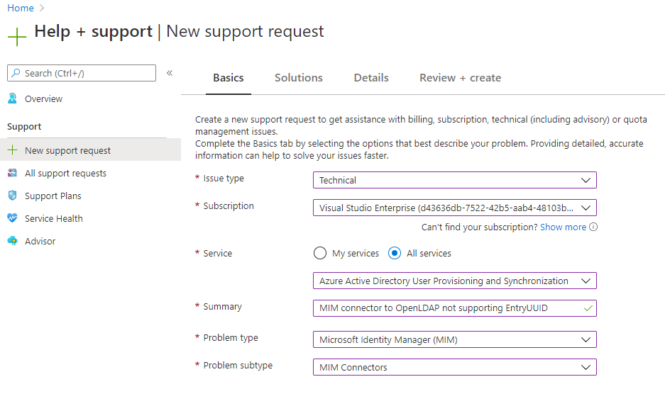

---
# required metadata

title: Support update for Microsoft Entra ID P1 or P2 customers using Microsoft Identity Manager
description: This article describes how Microsoft Entra ID P1 or P2 customers can get support after January 21, 2021.
keywords:
author: henrymbuguakiarie
ms.author: henrymbuguakiarie

ms.date: 6/9/2020
ms.topic: article
ms.service: microsoft-identity-manager
ms.assetid: 

# optional metadata

#ROBOTS:
#audience:
#ms.devlang:
reviewer: markwahl-msft
ms.reviewer: mwahl
ms.suite: ems
#ms.tgt_pltfrm:
#ms.custom:

---

# Support update for Microsoft Entra ID P1 or P2 customers using Microsoft Identity Manager

Applies to: Microsoft Entra ID P1 or P2, Microsoft Identity Manager (MIM)

For Microsoft Entra ID P1 or P2 customers, standard support is available from June 2020 onward, continuing after January 2021, for specific components of [Microsoft Identity Manager 2016 Service Pack 2](/microsoft-identity-manager/microsoft-identity-manager-2016), or later service packs, that enable Microsoft Entra integration. This is in addition to the existing support for Microsoft Identity Manager already provided through the [fixed lifecycle policy](/lifecycle/policies/fixed) and plans for [support for businesses](https://support.microsoft.com/help/4341255).

The MIM components for which standard support is available include:

- MIM Synchronization Service and Password Change Notification Service (PCNS)
- MIM Service and Portal, Add-ins and extensions, Data Warehouse Support Scripts and Language packs
- MIM Connectors

These MIM components populate Active Directory, and by extension, Microsoft Entra ID through Microsoft Entra Connect, with the users and groups provisioned from an on-premises HR system or other system of record sources. This ensures customers using Microsoft Entra ID P1 or P2 with on-premises systems can continue to be supported during the migration of their identity management scenarios from on-premises systems to Microsoft Entra ID.

## Opening a support request in the Azure portal

As an additional support option for Microsoft Identity Manager, Microsoft Entra ID P1 or P2 customers are able to request support for the above mentioned components of Microsoft Identity Manager 2016 Service Pack 2, or a later hotfix or update, through the Azure portal.

A customer can create an Azure support request, using the instructions at [How to create an Azure support request](/azure/azure-portal/supportability/how-to-create-azure-support-request):

1. select *Issue type: Technical*
1. switch to show *All Services*
1. in the services list under Microsoft Entra ID selects *User Provisioning and Synchronization*
1. select *Problem type: Microsoft Identity Manager (MIM)*
1. select *Problem subtype*: *Connectors*, *Service and Portal* or *Synchronization engine*

The MIM components are listed as problem types within *Microsoft Entra user provisioning and synchronization* in the Azure portal.

For requests opened through the Azure portal, standard support is available for Microsoft Entra ID P1 or P2 customers for following components of Microsoft Identity Manager 2016 Service Pack 2, or a [later hotfix or update](reference/version-history.md): Synchronization Service, Password Change Notification Service (PCNS), Connectors, Service and Portal, Add-ins and extensions, Data Warehouse Support Scripts, and language packs.

## Other support options

MIM 2016 SP2, build 4.6.34.0, was released in October 2019. Customers are highly encouraged to stay on a fully supported service pack to ensure they are on the latest and most secure version of their product. For more information, see the [service pack lifecycle policy](/lifecycle/policies/fixed#service-packs).

For customers still using an older build of MIM, or customers who do not have Azure support or subscription to a suite that includes Microsoft Entra ID P1 or P2, or for issues with other components of MIM not listed above, support continues to be available. The support policy is described at [Fixed lifecycle policy](/lifecycle/policies/fixed) with the specific dates at [support lifecycle for Microsoft Identity Manager 2016](/lifecycle/products/microsoft-identity-manager-2016).

In addition to Azure support, there are several other support options organizations can use to obtain support. For example, if you have Microsoft Professional Support, you can [create a new support request](https://support.microsoft.com/supportforbusiness/productselection). To select the relevant MIM component:
1. select product family *Security*
1. select product *Identity Manager 2016*
